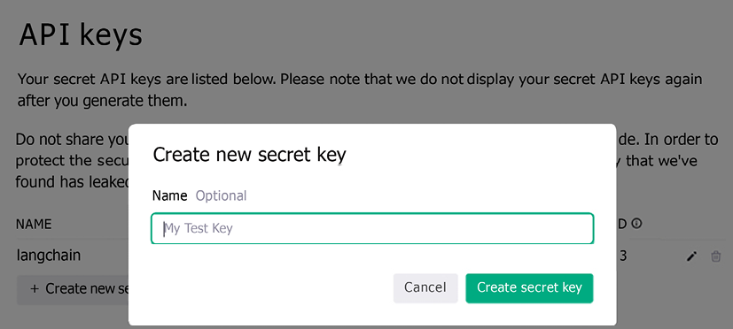

# Appendix

This appendix serves as a practical reference guide to the major LLM providers that integrate with LangChain. As you develop applications with the techniques covered throughout this book, you'll need to connect to various model providers, each with its own authentication mechanisms, capabilities, and integration patterns.

We'll first cover the detailed setup instructions for the major LLM providers, including OpenAI, Hugging Face, Google, and others. For each provider, we walk through the process of creating accounts, generating API keys, and configuring your development environment to use these services with LangChain. We then conclude with a practical implementation example that demonstrates how to process content exceeding an LLM's context window—specifically, summarizing long videos using map-reduce techniques with LangChain. This pattern can be adapted for various scenarios where you need to process large volumes of text, audio transcripts, or other content that won't fit into a single LLM context.

## OpenAI

OpenAI remains one of the most popular LLM providers, offering models with various levels of power suitable for different tasks, including GPT-4 and GPT-o1. LangChain provides seamless integration with OpenAI's APIs, supporting both their traditional completion models and chat models. Each of these models has its own price, typically per token.

To work with OpenAI models, we need to obtain an OpenAI API key first. To create an API key, follow these steps:

1. You need to create a login at [https://platform.openai.com/](https://platform.openai.com/).
2. Set up your billing information.
3. You can see the API keys under **Personal** | **View API Keys**.
4. Click on **Create new secret key** and give it a name.

Here's how this should look on the OpenAI platform:



Figure A.1: OpenAI API platform – Create new secret key

After clicking **Create secret key**, you should see the message API key generated. You need to copy the key to your clipboard and save it, as you will need it. You can set the key as an environment variable (**OPENAI_API_KEY**) or pass it as a parameter every time you construct a class for OpenAI calls.

You can specify different models when you initialize your model, be it a chat model or an LLM. You can see a list of models at [https://platform.openai.com/docs/models](https://platform.openai.com/docs/models).

OpenAI provides a comprehensive suite of capabilities that integrate seamlessly with LangChain, including:

- Core language models via the OpenAI API
- Embedding class for text embedding models

We'll cover the basics of model integration in this chapter, while deeper explorations of specialized features like embeddings, assistants, and moderation will follow in Chapters 4 and 5.

## Hugging Face

Hugging Face is a very prominent player in the NLP space and has considerable traction in open-source and hosting solutions. The company is a French American company that develops tools for building ML applications. Its employees develop and maintain the Transformers Python library, which is used for NLP tasks, includes implementations of state-of-the-art and popular models like Mistral 7B, BERT, and GPT-2, and is compatible with PyTorch, TensorFlow, and JAX.

In addition to their products, Hugging Face has been involved in initiatives such as the BigScience Research Workshop, where they released an open LLM called BLOOM with 176 billion parameters. Hugging Face has also established partnerships with companies like Graphcore and Amazon Web Services to optimize their offerings and make them available to a broader customer base.

LangChain supports leveraging the Hugging Face Hub, which provides access to a massive number of models, datasets in various languages and formats, and demo apps. This includes integrations with Hugging Face Endpoints, enabling text generation inference powered by the Text Generation Inference service. Users can connect to different Endpoint types, including the free Serverless Endpoints API and dedicated Inference Endpoints for enterprise workloads that come with support for AutoScaling.

For local use, LangChain provides integration with Hugging Face models and pipelines. The `ChatHuggingFace` class allows using Hugging Face models for chat applications, while the `HuggingFacePipeline` class enables running Hugging Face models locally through pipelines. Additionally, LangChain supports embedding models from Hugging Face, including `HuggingFaceEmbeddings`, `HuggingFaceInstructEmbeddings`, and `HuggingFaceBgeEmbeddings`.

The `HuggingFaceHubEmbeddings` class allows leveraging the Hugging Face **Text Embeddings Inference** (**TEI**) toolkit for high-performance extraction. LangChain also provides a `HuggingFaceDatasetLoader` to load datasets from the Hugging Face Hub.

To use Hugging Face as a provider for your models, you can create an account and API keys at [https://huggingface.co/settings/profile](https://huggingface.co/settings/profile). Additionally, you can make the token available in your environment as `HUGGINGFACEHUB_API_TOKEN`.

## Google

Google offers two primary platforms to access its LLMs, including the latest Gemini models:

### 1. Google AI platform

The Google AI platform provides a straightforward setup for developers and users, and access to the latest Gemini models. To use the Gemini models via Google AI:

- **Google Account**: A standard Google account is sufficient for authentication.
- **API Key**: Generate an API key to authenticate your requests.
  - Visit this page to create your API key: [https://ai.google.dev/gemini-api/docs/api-key](https://ai.google.dev/gemini-api/docs/api-key)
  - After obtaining the API key, set the `GOOGLE_API_KEY` environment variable in your development environment (see the instructions for OpenAI) to authenticate your requests.

### 2. Google Cloud Vertex AI

For enterprise-level features and integration, Google's Gemini models are available through Google Cloud's Vertex AI platform. To use models via Vertex AI:

1. Create a Google Cloud account, which requires accepting the terms of service and setting up billing.
2. Install the gcloud CLI to interact with Google Cloud services. Follow the installation instructions at [https://cloud.google.com/sdk/docs/install](https://cloud.google.com/sdk/docs/install).
3. Run the following command to authenticate and obtain a key token:
   ```
   gcloud auth application-default login
   ```
4. Ensure that the Vertex AI API is enabled for your Google Cloud project.
5. You can set your Google Cloud project ID – for example, using the `gcloud` command:
   ```
   gcloud config set project my-project
   ```

Other methods are passing a constructor argument when initializing the LLM, using aiplatform.init(), or setting a GCP environment variable.

You can read more about these options in the Vertex documentation.

If you haven't enabled the relevant service, you should get a helpful error message pointing you to the right website, where you click **Enable**. You have to either enable Vertex or the Generative Language API according to preference and availability.

LangChain offers integrations with Google services such as language model inference, embeddings, data ingestion from different sources, document transformation, and translation.

> There are two main integration packages:
>
> - `langchain-google-vertexai`
> - `langchain-google-genai`
>
> We'll be using `langchain-google-genai`, the package recommended by LangChain for individual developers. The setup is simple, only requiring a Google account and API key. It is recommended to move to `langchain-google-vertexai` for larger projects. This integration offers enterprise features such as customer encryption keys, virtual private cloud integration, and more, requiring a Google Cloud account with billing.
>
> If you've followed the instructions on GitHub, as indicated in the previous section, you should already have the `langchain-google-genai` package installed.

## Other providers

- **Replicate**: You can authenticate with your GitHub credentials at [https://replicate.com/](https://replicate.com/). If you then click on your user icon at the top left, you'll find the API tokens – just copy the API key and make it available in your environment as `REPLICATE_API_TOKEN`. To run bigger jobs, you need to set up your credit card (under billing).
- **Azure**: By authenticating either through GitHub or Microsoft credentials, we can create an account on Azure at [https://azure.microsoft.com/](https://azure.microsoft.com/). We can then create new API keys under **Cognitive Services** | **Azure OpenAI**.
- **Anthropic**: You need to set the `ANTHROPIC_API_KEY` environment variable. Please make sure you've set up billing and added funds on the Anthropic console at [https://console.anthropic.com/](https://console.anthropic.com/).

## Summarizing long videos

ln [Chapter 3](Chapter_3.xhtml#_idTextAnchor049), we demonstrated how to summarize long videos (that don't fit into the context window) with a map-reduce approach. We used LangGraph to design such a workflow. Of course, you can use the same approach to any similar case – for example, to summarize long text or to extract information from long audios. Let's now do the same using LangChain only, since it will be a useful exercise that will help us to better understand some internals of the framework.

First, a `PromptTemplate` doesn't support media types (as of February 2025), so we need to convert an input to a list of messages manually. To use a parameterized chain, as a workaround, we will create a Python function that takes arguments (always provided by name) and creates a list of messages to be processed. Every message instructs an LLM to summarize a certain piece of the video (by splitting it into offset intervals), and these messages can be processed in parallel. The output will be a list of strings, each summarizing a subpart of the original video.

When you use an extra asterisk (\*) in Python function declarations, it means that arguments after the asterisk should be provided by name only. For example, let's create a simple function with many arguments that we can call in different ways in Python by passing only a few (or none) of the parameters by name:

```python
def test(a: int, b: int = 2, c: int = 3):
    print(f"a={a}, b={b}, c={c}")
    pass
test(1, 2, 3)
test(1, 2, c=3)
test(1, b=2, c=3)
test(1, c=3)
```

But if you change its signature, the first invocation will throw an error:

```python
def test(a: int, b: int = 2, *, c: int = 3):
    print(f"a={a}, b={b}, c={c}")
    pass
# this doesn't work any more: test(1, 2, 3)
```

You might see this a lot if you look at LangChain's source code. That's why we decided to explain it in a little bit more detail.

Now, back to our code. We still need to run two separate steps if we want to pass `video_uri` as an input argument. Of course, we can wrap these steps as a Python function, but as an alternative, we merge everything into a single chain:

```python
from langchain_core.runnables import RunnableLambda
create_inputs_chain = RunnableLambda(lambda x: _create_input_
messages(**x))
map_step_chain = create_inputs_chain | RunnableLambda(lambda x: map_chain.
batch(x, config={"max_concurrency": 3}))
summaries = map_step_chain.invoke({"video_uri": video_uri})
```

Now let's merge all summaries provided into a single prompt and ask an LLM to prepare a final summary:

```python
def _merge_summaries(summaries: list[str], interval_secs: int = 600, **kwargs) -> str:
    sub_summaries = []
    for i, summary in enumerate(summaries):
        sub_summary = (
            f"Summary from sec {i*interval_secs} to sec {(i+1)*interval_secs}:"
            f"\n{summary}\n"
        )
        sub_summaries.append(sub_summary)
    return "".join(sub_summaries)
reduce_prompt = PromptTemplate.from_template(
    "You are given a list of summaries that"
    "of a video splitted into sequential pieces.\n"
    "SUMMARIES:\n{summaries}"
    "Based on that, prepare a summary of a whole video."
)
reduce_chain = RunnableLambda(lambda x: _merge_summaries(**x)) | reduce_prompt | llm | StrOutputParser()
final_summary = reduce_chain.invoke({"summaries": summaries})
```

To combine everything together, we need a chain that first executes all the MAP steps and then the REDUCE phase:

```python
from langchain_core.runnables import RunnablePassthrough
final_chain = (
    RunnablePassthrough.assign(summaries=map_step_chain).assign(final_ summary=reduce_chain)
    | RunnableLambda(lambda x: x["final_summary"])
)
result = final_chain.invoke({
    "video_uri": video_uri,
    "interval_secs": 300,
    "chunks": 9
})
```

Let's reiterate what we did. We generated multiple summaries of different parts of the video, and then we passed these summaries to an LLM as texts and tasked it to generate a final summary. We prepared summaries of each piece independently and then combined them, which allowed us to overcome the limitation of a context window size for video and decreased latency a lot due to parallelization. Another alternative is the so-called **refine** approach. We begin with an empty summary and perform summarization step by step – each time, providing an LLM with a new piece of the video and a previously generated summary as input. We encourage readers to build this themselves since it will be a relatively simple change to the code.
