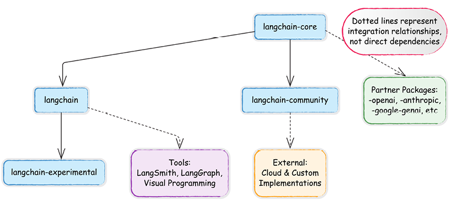
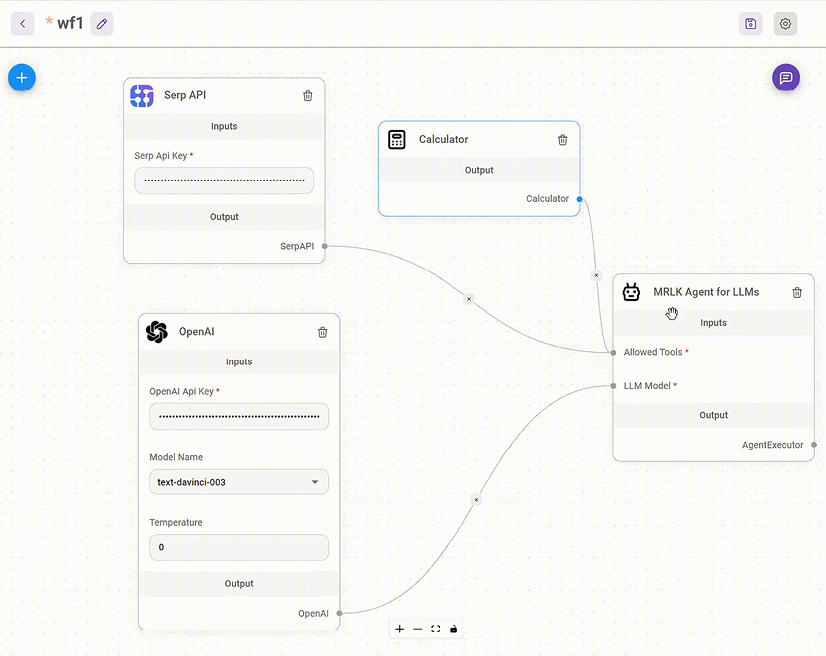

# Kebangkitan AI Generatif: Dari Model Bahasa ke Agen

Jarak antara agen eksperimental dan siap produksi sangat lebar. Menurut laporan State of Agents dari LangChain, kualitas kinerja adalah perhatian nomor satu bagi 51% perusahaan yang menggunakan agen, namun hanya 39,8% yang telah menerapkan sistem evaluasi yang tepat. Buku kami menjembatani kesenjangan ini pada dua front: pertama, dengan menunjukkan bagaimana LangChain dan LangSmith menyediakan solusi pengujian dan observabilitas yang kuat; kedua, dengan menunjukkan bagaimana manajemen status LangGraph memungkinkan sistem multi-agen yang kompleks dan andal. Anda akan menemukan pola kode yang telah diuji produksi yang memanfaatkan kekuatan setiap alat untuk implementasi skala perusahaan dan memperluas RAG dasar menjadi sistem pengetahuan yang kokoh.

LangChain mempercepat waktu-ke-pasar dengan blok bangunan yang siap pakai, API vendor yang terpadu, dan tutorial mendetail. Selain itu, fungsionalitas debugging dan pelacakan LangChain dan LangChain mempermudah analisis perilaku agen yang kompleks. Akhirnya, LangGraph telah unggul dalam menjalankan filosofinya di balik AI agenik – ini memungkinkan pengembang memberikan **model bahasa besar** (**LLM**) aliran kontrol parsial atas alur kerja (dan mengelola tingkat seberapa banyak kontrol yang harus dimiliki LLM), sambil tetap membuat alur kerja agenik andal dan berkinerja baik.

Dalam bab ini, kita akan mengeksplorasi bagaimana LLM telah berevolusi menjadi fondasi untuk sistem AI agenik dan bagaimana kerangka kerja seperti LangChain dan LangGraph mengubah model-model ini menjadi aplikasi siap produksi. Kami juga akan memeriksa lanskap LLM modern, memahami keterbatasan LLM mentah, dan memperkenalkan konsep inti aplikasi agenik yang membentuk dasar pengembangan langsung yang akan kami tangani di seluruh buku ini.

Singkatnya, topik berikut akan dibahas dalam buku ini:

- Lanskap LLM modern
- Dari model ke aplikasi agenik
- Memperkenalkan LangChain

## Lanskap LLM modern

**Kecerdasan buatan** (**AI**) telah lama menjadi subjek ketertarikan dan penelitian, tetapi kemajuan baru-baru ini dalam AI generatif telah mendorongnya ke adopsi arus utama. Tidak seperti sistem AI tradisional yang mengklasifikasikan data atau membuat prediksi, AI generatif dapat membuat konten baru—teks, gambar, kode, dan lainnya—dengan memanfaatkan sejumlah besar data pelatihan.

Revolusi AI generatif dipicu oleh pengenalan arsitektur transformer pada tahun 2017, yang memungkinkan model memproses teks dengan pemahaman konteks dan hubungan yang belum pernah terjadi sebelumnya. Saat para peneliti meningkatkan skala model ini dari jutaan ke miliaran parameter, mereka menemukan sesuatu yang luar biasa: model yang lebih besar tidak hanya berkinerja lebih baik secara bertahap—mereka menunjukkan kemampuan baru yang muncul seperti pembelajaran few-shot, penalaran kompleks, dan generasi kreatif yang tidak diprogram secara eksplisit. Akhirnya, rilis ChatGPT pada tahun 2022 menandai titik balik, menunjukkan kemampuan ini kepada publik dan memicu adopsi luas.

Lanskap bergeser lagi dengan revolusi sumber terbuka yang dipimpin oleh model seperti Llama dan Mistral, mendemokratisasi akses ke AI yang kuat di luar perusahaan teknologi besar. Namun, kemampuan canggih ini datang dengan keterbatasan signifikan—model tidak dapat menggunakan alat dengan andal, bernalar melalui masalah kompleks, atau mempertahankan konteks antar interaksi. Kesenjangan antara kekuatan model mentah dan utilitas praktis menciptakan kebutuhan akan kerangka kerja khusus seperti LangChain yang mengubah model-model ini dari generator teks yang mengesankan menjadi agen fungsional siap produksi yang mampu memecahkan masalah dunia nyata.

> **Istilah kunci**
>
> **Alat**: Utilitas atau fungsi eksternal yang dapat digunakan model AI untuk berinteraksi dengan dunia. Alat memungkinkan agen melakukan tindakan seperti menjelajah web, menghitung nilai, atau mengakses basis data untuk mengatasi keterbatasan bawaan LLM.
>
> **Memori**: Sistem yang memungkinkan aplikasi AI menyimpan dan mengambil informasi antar interaksi. Memori memungkinkan kesadaran kontekstual dalam percakapan dan alur kerja kompleks dengan melacak input, output, dan informasi penting sebelumnya.
>
> **Pembelajaran penguatan dari umpan balik manusia** (**RLHF**): Teknik pelatihan di mana model AI belajar dari umpan balik manusia langsung, mengoptimalkan kinerja mereka untuk selaras dengan preferensi manusia. RLHF membantu membuat model yang lebih membantu, aman, dan selaras dengan nilai-nilai manusia.
>
> **Agen**: Sistem AI yang dapat merasakan lingkungannya, membuat keputusan, dan mengambil tindakan untuk mencapai tujuan. Di LangChain, agen menggunakan LLM untuk menafsirkan tugas, memilih alat yang tepat, dan menjalankan proses multi-langkah dengan intervensi manusia minimal.

| Tahun   | Pengembangan                        | Fitur Kunci                                           |
| ------- | ----------------------------------- | ----------------------------------------------------- |
| 1990-an | Model Penyelarasan IBM              | Terjemahan mesin statistik                            |
| 2000-an | Dataset skala web                   | Model statistik skala besar                           |
| 2009    | Model statistik mendominasi         | Pencernaan teks skala besar                           |
| 2012    | Pembelajaran mendalam mulai populer | Jaringan saraf mengungguli model statistik            |
| 2016    | Neural Machine Translation (NMT)    | LSTM dalam yang menggantikan metode statistik         |
| 2017    | Arsitektur transformer              | Perhatian diri merevolusi NLP                         |
| 2018    | BERT dan GPT-1                      | Pemahaman dan generasi bahasa berbasis transformer    |
| 2019    | GPT-2                               | Generasi teks skala besar, kesadaran publik meningkat |
| 2020    | GPT-3                               | Akses berbasis API, kinerja terdepan                  |
| 2022    | ChatGPT                             | Adopsi arus utama LLM                                 |
| 2023    | Model Multimodal Besar (LMM)        | Model AI memproses teks, gambar, dan audio            |
| 2024    | OpenAI o1                           | Kemampuan penalaran yang lebih kuat                   |
| 2025    | DeepSeek R1                         | Model AI skala besar berbobot terbuka                 |

Tabel 1.1: Garis waktu perkembangan utama dalam model bahasa

Bidang LLM berkembang dengan cepat, dengan banyak model bersaing dalam hal kinerja, kemampuan, dan aksesibilitas. Setiap penyedia membawa keunggulan berbeda, dari AI tujuan umum canggih OpenAI hingga model efisiensi tinggi berbobot terbuka Mistral. Memahami perbedaan antara model-model ini membantu praktisi membuat keputusan yang tepat saat mengintegrasikan LLM ke dalam aplikasi mereka.

### Perbandingan model

Poin-poin berikut menguraikan faktor kunci yang perlu dipertimbangkan saat membandingkan LLM berbeda, berfokus pada aksesibilitas, ukuran, kemampuan, dan spesialisasi mereka:

- **Model sumber terbuka vs. tertutup**: Model sumber terbuka seperti Mistral dan LLaMA memberikan transparansi dan kemampuan untuk dijalankan secara lokal, sementara model tertutup seperti GPT-4 dan Claude dapat diakses melalui API. LLM sumber terbuka dapat diunduh dan dimodifikasi, memungkinkan pengembang dan peneliti menyelidiki dan membangun arsitektur mereka, meskipun ketentuan penggunaan tertentu mungkin berlaku.
- **Ukuran dan kemampuan**: Model yang lebih besar umumnya menawarkan kinerja lebih baik tetapi membutuhkan lebih banyak sumber daya komputasi. Ini membuat model yang lebih kecil bagus untuk digunakan pada perangkat dengan daya komputasi atau memori terbatas, dan bisa jauh lebih murah untuk digunakan. **Model bahasa kecil** (**SLM**) memiliki jumlah parameter yang relatif kecil, biasanya menggunakan jutaan hingga beberapa miliar parameter, berbeda dengan LLM, yang dapat memiliki ratusan miliar atau bahkan triliunan parameter.
- **Model khusus**: Beberapa LLM dioptimalkan untuk tugas tertentu, seperti generasi kode (misalnya, Codex) atau penalaran matematika (misalnya, Minerva).

Peningkatan skala model bahasa telah menjadi pendorong utama di balik peningkatan kinerja yang mengesankan. Namun, baru-baru ini telah terjadi pergeseran dalam arsitektur dan metode pelatihan yang mengarah pada efisiensi parameter yang lebih baik dalam hal kinerja.

> **Hukum penskalaan model**
>
> Hukum penskalaan yang berasal secara empiris memprediksi kinerja LLM berdasarkan anggaran pelatihan, ukuran dataset, dan jumlah parameter yang diberikan. Jika benar, ini berarti sistem yang sangat kuat akan terkonsentrasi di tangan Big Tech, namun, kami telah melihat pergeseran signifikan dalam beberapa bulan terakhir.
>
> **Hukum penskalaan KM**, yang diusulkan oleh Kaplan et al., berasal dari analisis empiris dan penyesuaian kinerja model dengan variasi ukuran data, ukuran model, dan komputasi pelatihan, menyajikan hubungan hukum pangkat, menunjukkan ketergantungan kuat antara kinerja model dan faktor-faktor seperti ukuran model, ukuran dataset, dan komputasi pelatihan.
>
> **Hukum penskalaan Chinchilla**, yang diusulkan oleh tim Google DeepMind, melibatkan eksperimen dengan rentang ukuran model dan ukuran data yang lebih luas. Ini menyarankan alokasi optimal anggaran komputasi ke ukuran model dan ukuran data, yang dapat ditentukan dengan mengoptimalkan fungsi kerugian tertentu di bawah kendala.
>
> Namun, kemajuan di masa depan mungkin lebih bergantung pada arsitektur model, pembersihan data, dan inovasi algoritmik model daripada sekadar ukuran. Misalnya, model seperti phi, pertama kali disajikan dalam _Textbooks Are All You Need_ (2023, Gunasekar et al.), dengan sekitar 1 miliar parameter, menunjukkan bahwa model dapat – meskipun skala lebih kecil – mencapai akurasi tinggi pada tolok ukur evaluasi. Penulis menyarankan bahwa meningkatkan kualitas data dapat secara dramatis mengubah bentuk hukum penskalaan.
>
> Lebih lanjut, ada sekumpulan karya tentang arsitektur model yang disederhanakan, yang memiliki parameter jauh lebih sedikit dan hanya sedikit menurunkan akurasi (misalnya, _One Wide Feedforward is All You Need_, Pessoa Pires et al., 2023). Selain itu, teknik seperti fine-tuning, kuantisasi, distilasi, dan teknik prompting dapat memungkinkan model yang lebih kecil memanfaatkan kemampuan fondasi besar tanpa meniru biayanya. Untuk mengimbangi keterbatasan model, alat seperti mesin pencari dan kalkulator telah dimasukkan ke dalam agen, dan strategi penalaran multi-langkah, plugin, dan ekstensi mungkin semakin digunakan untuk memperluas kemampuan.
>
> Masa depan dapat melihat koeksistensi model umum yang masif dengan model yang lebih kecil dan lebih mudah diakses yang memberikan pelatihan, pemeliharaan, dan inferensi yang lebih cepat dan murah.

Mari kita bahas ikhtisar perbandingan berbagai LLM, menyoroti karakteristik kunci dan faktor pembeda. Kita akan menyelami aspek seperti model sumber terbuka vs. tertutup, ukuran dan kemampuan model, dan model khusus. Dengan memahami perbedaan ini, Anda dapat memilih LLM yang paling sesuai untuk kebutuhan dan aplikasi spesifik Anda.

### Lanskap penyedia LLM

Anda dapat mengakses LLM dari penyedia utama seperti OpenAI, Google, dan Anthropic, bersama dengan banyak lainnya yang terus bertambah, melalui situs web atau API mereka. Seiring permintaan untuk LLM tumbuh, banyak penyedia telah masuk ke ruang ini, masing-masing menawarkan model dengan kemampuan dan trade-off unik. Pengembang perlu memahami berbagai opsi akses yang tersedia untuk mengintegrasikan model kuat ini ke dalam aplikasi mereka. Pilihan penyedia akan sangat berdampak pada pengalaman pengembangan, karakteristik kinerja, dan biaya operasional.

Tabel di bawah ini memberikan ikhtisar perbandingan penyedia LLM terkemuka dan contoh model yang mereka tawarkan:

| Penyedia        | Model terkenal                                | Fitur dan keunggulan kunci                                                                                                                    |
| --------------- | --------------------------------------------- | --------------------------------------------------------------------------------------------------------------------------------------------- |
| **OpenAI**      | GPT-4o, GPT-4.5; o1; o3-mini                  | Kinerja umum kuat, model proprietary, penalaran canggih; penalaran multimodal di seluruh teks, audio, penglihatan, dan video secara real time |
| **Anthropic**   | Claude 3.7 Sonnet; Claude 3.5 Haiku           | Beralih antara respons real-time dan fase "berpikir" yang diperpanjang; mengungguli o1 OpenAI dalam tolok ukur pengkodean                     |
| **Google**      | Gemini 2.5, 2.0 (flash dan pro), Gemini 1.5   | Latensi dan biaya rendah, jendela konteks besar (hingga 2M token), input dan output multimodal, kemampuan penalaran                           |
| **Cohere**      | Command R, Command R Plus                     | Generasi yang diperkuat pengambilan, solusi AI perusahaan                                                                                     |
| **Mistral AI**  | Mistral Large; Mistral 7B                     | Bobot terbuka, inferensi efisien, dukungan multibahasa                                                                                        |
| **AWS**         | Titan                                         | Model AI skala perusahaan, dioptimalkan untuk cloud AWS                                                                                       |
| **DeepSeek**    | R1                                            | Matematika-pertama: memecahkan masalah tingkat Olimpiade; hemat biaya, dioptimalkan untuk tugas multibahasa dan pemrograman                   |
| **Together AI** | Infrastruktur untuk menjalankan model terbuka | Harga kompetitif; pasar model yang berkembang                                                                                                 |

Tabel 1.2: Ikhtisar perbandingan penyedia LLM utama dan model andalan mereka untuk implementasi LangChain

Organisasi lain mengembangkan LLM tetapi belum tentu menyediakannya melalui **antarmuka pemrograman aplikasi** (**API**) kepada pengembang. Misalnya, Meta AI mengembangkan seri model Llama yang sangat berpengaruh, yang memiliki penalaran kuat, kemampuan pembuatan kode, dan dirilis di bawah lisensi sumber terbuka.

Ada kebun binatang penuh model sumber terbuka yang dapat Anda akses melalui Hugging Face atau melalui penyedia lain. Anda bahkan dapat mengunduh model sumber terbuka ini, menyempurnakannya, atau melatihnya sepenuhnya. Kami akan mencobanya secara praktis mulai [Bab 2](Chapter_2.xhtml#_idTextAnchor025).

Setelah Anda memilih model yang sesuai, langkah penting berikutnya adalah memahami bagaimana mengontrol perilakunya agar sesuai dengan kebutuhan aplikasi spesifik Anda. Meskipun mengakses model memberi Anda kemampuan komputasi, pilihan parameter generasi yang mengubah kekuatan model mentah menjadi keluaran yang disesuaikan untuk kasus penggunaan berbeda dalam aplikasi Anda.

Sekarang setelah kita membahas lanskap penyedia LLM, mari kita bahas aspek kritis lain dari implementasi LLM: pertimbangan lisensi. Ketentuan lisensi model yang berbeda sangat memengaruhi bagaimana Anda dapat menggunakannya dalam praktik.

### Lisensi

LLM tersedia di bawah model lisensi berbeda yang berdampak pada bagaimana mereka dapat digunakan dalam praktik. Model sumber terbuka seperti Mixtral dan BERT dapat digunakan, dimodifikasi, dan diintegrasikan ke dalam aplikasi secara bebas. Model-model ini memungkinkan pengembang menjalankannya secara lokal, menyelidiki perilakunya, dan membangunnya untuk tujuan penelitian dan komersial.

Sebaliknya, model proprietary seperti GPT-4 dan Claude hanya dapat diakses melalui API, dengan cara kerja internalnya dirahasiakan. Meskipun ini memastikan kinerja konsisten dan pembaruan reguler, itu berarti bergantung pada layanan eksternal dan biasanya menimbulkan biaya penggunaan.

Beberapa model seperti Llama 2 mengambil jalan tengah, menawarkan lisensi permisif untuk penggunaan penelitian dan komersial sambil mempertahankan kondisi penggunaan tertentu. Untuk informasi rinci tentang lisensi model spesifik dan implikasinya, lihat dokumentasi setiap model atau konsultasikan kerangka kerja keterbukaan model: https://isitopen.ai/.

> **Kerangka kerja keterbukaan model** (**MOF**) mengevaluasi model bahasa berdasarkan kriteria seperti akses ke detail arsitektur model, metodologi pelatihan dan hyperparameter, informasi pengambilan dan pemrosesan data, dokumentasi sekitar keputusan pengembangan, kemampuan untuk mengevaluasi cara kerja model, bias, dan keterbatasan, modularitas kode, kartu model yang diterbitkan, ketersediaan model yang dapat dilayani, opsi untuk dijalankan secara lokal, ketersediaan kode sumber, dan hak redistribusi.

Secara umum, lisensi sumber terbuka mendorong adopsi luas, kolaborasi, dan inovasi di sekitar model, menguntungkan pengembangan penelitian dan komersial. Lisensi proprietary biasanya memberikan kontrol eksklusif kepada perusahaan tetapi dapat membatasi kemajuan penelitian akademis. Lisensi non-komersial sering membatasi penggunaan komersial sambil memungkinkan penelitian.

Dengan membuat pengetahuan dan pekerjaan pengetahuan lebih mudah diakses dan disesuaikan, model AI generatif berpotensi meratakan lapangan permainan dan menciptakan peluang baru bagi orang dari semua lapisan masyarakat.

Evolusi AI telah membawa kita ke momen penting di mana sistem AI tidak hanya dapat memproses informasi tetapi juga mengambil tindakan otonom. Bagian berikutnya mengeksplorasi transformasi dari model bahasa dasar ke aplikasi yang lebih kompleks, dan akhirnya, aplikasi agenik penuh.

> Informasi yang diberikan tentang lisensi model AI hanya untuk tujuan pendidikan dan tidak merupakan saran hukum. Ketentuan lisensi sangat bervariasi dan berkembang dengan cepat. Organisasi harus berkonsultasi dengan penasihat hukum yang memenuhi syarat mengenai keputusan lisensi spesifik untuk implementasi AI mereka.

## Dari model ke aplikasi agenik

Seperti yang dibahas sejauh ini, LLM telah menunjukkan kelancaran luar biasa dalam pemrosesan bahasa alami. Namun, sehebat apa pun mereka, mereka tetap pada dasarnya _reaktif_ daripada _proaktif_. Mereka tidak memiliki kemampuan untuk mengambil tindakan independen, berinteraksi secara bermakna dengan sistem eksternal, atau mencapai tujuan kompleks secara otonom.

Untuk membuka fase berikutnya dari kemampuan AI, kita perlu melampaui generasi teks pasif dan menuju **AI agenik**—sistem yang dapat merencanakan, bernalar, dan mengambil tindakan untuk menyelesaikan tugas dengan intervensi manusia minimal. Sebelum mengeksplorasi potensi AI agenik, penting untuk terlebih dahulu memahami keterbatasan inti LLM yang memerlukan evolusi ini.

### Keterbatasan LLM tradisional

Meskipun memiliki kemampuan bahasa yang canggih, LLM memiliki kendala bawaan yang membatasi efektivitasnya dalam aplikasi dunia nyata:

1. **Kurangnya pemahaman sejati**: LLM menghasilkan teks seperti manusia dengan memprediksi kata berikutnya yang paling mungkin berdasarkan pola statistik dalam data pelatihan. Namun, mereka tidak memahami makna seperti manusia. Ini mengarah pada halusinasi—menyatakan informasi palsu dengan percaya diri sebagai fakta—dan menghasilkan keluaran yang masuk akal tetapi salah, menyesatkan, atau tidak masuk akal. Seperti yang dijelaskan Bender et al. (2021), LLM berfungsi sebagai "parrot stokastik"—mengulangi pola tanpa pemahaman genuin.
2. **Kesulitan dengan penalaran dan pemecahan masalah kompleks**: Meskipun LLM unggul dalam mengambil dan memformat ulang pengetahuan, mereka kesulitan dengan penalaran multi-langkah, teka-teki logis, dan pemecahan masalah matematika. Mereka sering gagal memecah masalah menjadi sub-tugas atau mensintesis informasi di berbagai konteks. Tanpa teknik prompting eksplisit seperti penalaran chain-of-thought, kemampuan mereka untuk menyimpulkan atau menginferensi tetap tidak dapat diandalkan.
3. **Pengetahuan kedaluwarsa dan akses eksternal terbatas**: LLM dilatih pada dataset statis dan tidak memiliki akses real-time ke peristiwa terkini, basis data dinamis, atau sumber informasi langsung. Ini membuat mereka tidak cocok untuk tugas yang memerlukan pengetahuan terkini, seperti analisis keuangan, ringitan berita terbaru, atau penelitian ilmiah yang memerlukan temuan terbaru.
4. **Tidak ada penggunaan alat bawaan atau kemampuan mengambil tindakan**: LLM beroperasi secara terisolasi—mereka tidak dapat berinteraksi dengan API, mengambil data langsung, mengeksekusi kode, atau memodifikasi sistem eksternal. Kurangnya integrasi alat ini membuat mereka kurang efektif dalam skenario yang memerlukan tindakan dunia nyata, seperti melakukan pencarian web, mengotomatisasi alur kerja, atau mengontrol sistem perangkat lunak.
5. **Bias, masalah etika, dan masalah keandalan**: Karena LLM belajar dari dataset besar yang mungkin mengandung bias, mereka dapat secara tidak sengaja memperkuat bias ideologis, sosial, atau budaya. Pentingnya, bahkan dengan model sumber terbuka, mengakses dan mengaudit data pelatihan lengkap untuk mengidentifikasi dan mengurangi bias ini tetap menantang bagi sebagian besar praktisi. Selain itu, mereka dapat menghasilkan informasi yang menyesatkan atau berbahaya tanpa memahami implikasi etika dari keluaran mereka.
6. **Biaya komputasi dan tantangan efisiensi**: Menyebarkan dan menjalankan LLM dalam skala memerlukan sumber daya komputasi **signifikan**, membuat mereka mahal dan intensif energi. Model yang lebih besar juga dapat memperkenalkan latensi, memperlambat waktu respons dalam aplikasi real-time.

Untuk mengatasi keterbatasan ini, sistem AI harus berevolusi dari generator teks pasif menjadi agen aktif yang dapat merencanakan, bernalar, dan berinteraksi dengan lingkungan mereka. Di sinilah AI agenik masuk—mengintegrasikan LLM dengan penggunaan alat, mekanisme pengambilan keputusan, dan kemampuan eksekusi otonom untuk meningkatkan fungsionalitas mereka.

Meskipun kerangka kerja seperti LangChain memberikan solusi komprehensif untuk keterbatasan LLM, memahami teknik rekayasa prompt dasar tetap berharga. Pendekatan seperti pembelajaran few-shot, chain-of-thought, dan prompting terstruktur dapat secara signifikan meningkatkan kinerja model untuk tugas tertentu. [Bab 3](Chapter_3.xhtml#_idTextAnchor049) akan membahas teknik ini secara detail, menunjukkan bagaimana LangChain membantu menstandarkan dan mengoptimalkan pola prompting sambil meminimalkan kebutuhan rekayasa prompt kustom di setiap aplikasi.

Bagian berikutnya mengeksplorasi bagaimana AI agenik memperluas kemampuan LLM tradisional dan membuka kemungkinan baru untuk otomatisasi, pemecahan masalah, dan pengambilan keputusan cerdas.

### Memahami aplikasi LLM

Aplikasi LLM mewakili jembatan antara kemampuan model mentah dan nilai bisnis praktis. Meskipun LLM memiliki kemampuan pemrosesan bahasa yang mengesankan, mereka memerlukan integrasi yang bijaksana untuk memberikan solusi dunia nyata. Aplikasi ini secara luas terbagi menjadi dua kategori: aplikasi terintegrasi kompleks dan agen otonom.

**Aplikasi terintegrasi kompleks** meningkatkan alur kerja manusia dengan mengintegrasikan LLM ke dalam proses yang ada, termasuk:

- Sistem dukungan keputusan yang memberikan analisis dan rekomendasi
- Saluran generasi konten dengan tinjauan manusia
- Alat interaktif yang meningkatkan kemampuan manusia
- Otomatisasi alur kerja dengan pengawasan manusia

**Agen otonom** beroperasi dengan intervensi manusia minimal, lebih lanjut meningkatkan alur kerja melalui integrasi LLM. Contohnya termasuk:

- Agen otomatisasi tugas yang mengeksekusi alur kerja yang ditentukan
- Sistem pengumpulan dan analisis informasi
- Sistem multi-agen untuk koordinasi tugas kompleks

LangChain menyediakan kerangka kerja untuk kedua aplikasi terintegrasi dan agen otonom, menawarkan komponen fleksibel yang mendukung berbagai pilihan arsitektur. Buku ini akan mengeksplorasi kedua pendekatan, menunjukkan cara membangun sistem yang andal dan siap produksi yang sesuai dengan persyaratan spesifik Anda.

Sistem otonom dari agen sangat berpotensi kuat, dan karena itu patut dieksplorasi sedikit lebih banyak.

### Memahami agen AI

Terkadang bercanda bahwa AI hanyalah kata mewah untuk ML, atau AI adalah ML dalam setelan, seperti diilustrasikan dalam gambar ini; namun, ada lebih dari itu, seperti yang akan kita lihat.

Gambar 1.1: ML dalam setelan. Dihasilkan oleh model di replicate.com, Diffusers Stable Diffusion v2.1

Agen AI mewakili jembatan antara kemampuan kognitif mentah dan tindakan praktis. Sementara LLM memiliki pengetahuan dan kemampuan pemrosesan yang luas, ia tetap pada dasarnya reaktif tanpa keagenan. Agen AI mengubah kemampuan pasif ini menjadi utilitas aktif melalui alur kerja terstruktur yang menguraikan persyaratan, menganalisis opsi, dan mengeksekusi tindakan.

AI agenik memungkinkan sistem otonom membuat keputusan dan bertindak secara independen, dengan intervensi manusia minimal. Tidak seperti sistem deterministik yang mengikuti aturan tetap, AI agenik bergantung pada pola dan kemungkinan untuk membuat pilihan yang tepat. Ia berfungsi melalui jaringan komponen perangkat lunak otonom yang disebut agen, yang belajar dari perilaku pengguna dan dataset besar untuk meningkatkan seiring waktu.

_Keagenan_ dalam AI mengacu pada kemampuan sistem untuk bertindak secara independen untuk mencapai tujuan. Keagenan sejati berarti sistem AI dapat merasakan lingkungannya, membuat keputusan, bertindak, dan beradaptasi seiring waktu dengan belajar dari interaksi dan umpan balik. Perbedaan antara AI mentah dan agen sejajar dengan perbedaan antara pengetahuan dan keahlian. Pertimbangkan peneliti brilian yang memahami teori kompleks tetapi kesulitan dengan aplikasi praktis. Sistem agen menambahkan elemen penting dari tindakan bertujuan, mengubah kemampuan abstrak menjadi hasil konkret.

Dalam konteks LLM, AI agenik melibatkan pengembangan sistem yang bertindak secara otonom, memahami konteks, beradaptasi dengan informasi baru, dan berkolaborasi dengan manusia untuk memecahkan tantangan kompleks. Agen AI ini memanfaatkan LLM untuk memproses informasi, menghasilkan respons, dan mengeksekusi tugas berdasarkan tujuan yang ditentukan.

Khususnya, agen AI memperluas kemampuan LLM dengan mengintegrasikan memori, penggunaan alat, dan kerangka kerja pengambilan keputusan. Agen-agen ini dapat:

- Mempertahankan dan mengingat informasi antar interaksi.
- Menggunakan alat eksternal, API, dan basis data.
- Merencanakan dan mengeksekusi alur kerja multi-langkah.

Nilai keagenan terletak pada mengurangi kebutuhan pengawasan manusia yang konstan. Alih-alih secara manual memprompt LLM untuk setiap permintaan, agen dapat secara proaktif mengeksekusi tugas, bereaksi terhadap data baru, dan mengintegrasikan dengan aplikasi dunia nyata.

Agen AI adalah sistem yang dirancang untuk bertindak atas nama pengguna, memanfaatkan LLM bersama alat eksternal, memori, dan kerangka kerja pengambilan keputusan. Harapan di balik agen AI adalah mereka dapat mengotomatisasi alur kerja kompleks, mengurangi upaya manusia sambil meningkatkan efisiensi dan akurasi. Dengan memungkinkan sistem bertindak secara otonom, agen berjanji untuk membuka tingkat otomatisasi baru dalam aplikasi yang digerakkan AI. Namun apakah harapan itu dibenarkan?

Meskipun berpotensi, agen AI menghadapi tantangan signifikan:

- **Keandalan**: Memastikan agen membuat keputusan yang benar dan sadar konteks tanpa pengawasan itu sulit.
- **Generalisasi**: Banyak agen bekerja baik dalam domain sempit tetapi kesulitan dengan tugas multi-domain terbuka.
- **Kurangnya kepercayaan**: Pengguna harus percaya bahwa agen akan bertindak secara bertanggung jawab, menghindari tindakan yang tidak diinginkan, dan menghormati batasan privasi.
- **Kompleksitas koordinasi**: Sistem multi-agen sering menderita dari inefisiensi dan miskomunikasi saat mengeksekusi tugas secara kolaboratif.

Sistem agen siap produksi harus mengatasi tidak hanya tantangan teoretis tetapi kendala implementasi praktis seperti:

- Batasan tarif dan kuota API
- Kesalahan luapan konteks token
- Manajemen halusinasi
- Optimasi biaya

LangChain dan LangSmith memberikan solusi kuat untuk tantangan ini, yang akan kita eksplorasi secara mendalam di [Bab 8](Chapter_8.xhtml#_idTextAnchor157) dan [Bab 9](Chapter_9.xhtml#_idTextAnchor186). Bab-bab ini akan membahas cara membangun sistem AI yang andal dan dapat diamati yang dapat beroperasi dalam skala perusahaan.

Oleh karena itu, saat mengembangkan sistem berbasis agen, beberapa faktor kunci memerlukan pertimbangan cermat:

- **Pembuatan nilai**: Agen harus memberikan utilitas jelas yang melebihi biaya mereka dalam hal penyiapan, pemeliharaan, dan pengawasan manusia yang diperlukan. Ini sering berarti memulai dengan tugas bernilai tinggi yang terdefinisi dengan baik di mana otomatisasi dapat secara nyata meningkatkan hasil.
- **Kepercayaan dan keamanan**: Saat agen mengambil lebih banyak tanggung jawab, membangun dan mempertahankan kepercayaan pengguna menjadi sangat penting. Ini mencakup keandalan teknis dan operasi transparan yang memungkinkan pengguna memahami dan memprediksi perilaku agen.
- **Standardisasi**: Saat ekosistem agen tumbuh, antarmuka dan protokol standar menjadi penting untuk interoperabilitas. Ini sejajar dengan pengembangan standar web yang memungkinkan pertumbuhan aplikasi internet.

Sementara sistem AI awal berfokus pada pencocokan pola dan templat yang telah ditentukan, agen AI modern menunjukkan kemampuan muncul seperti penalaran, pemecahan masalah, dan perencanaan jangka panjang. Agen AI saat ini mengintegrasikan LLM dengan lingkungan interaktif, memungkinkan mereka berfungsi secara otonom dalam domain kompleks.

Pengembangan AI berbasis agen adalah perkembangan alami dari model statistik ke pembelajaran mendalam dan sekarang ke sistem berbasis penalaran. Agen AI modern memanfaatkan kemampuan multimodal, pembelajaran penguatan, dan arsitektur yang diperkuat memori untuk beradaptasi dengan tugas yang beragam. Evolusi ini menandai pergeseran dari model prediktif ke sistem yang benar-benar otonom yang mampu melakukan pengambilan keputusan dinamis.

Ke depan, agen AI akan terus menyempurnakan kemampuan mereka untuk bernalar, merencanakan, dan bertindak dalam lingkungan terstruktur dan tidak terstruktur. Kebangkitan model berbobot terbuka, dikombinasikan dengan kemajuan dalam AI berbasis agen, kemungkinan akan mendorong gelombang inovasi berikutnya dalam AI, memperluas aplikasinya di seluruh sains, teknik, dan kehidupan sehari-hari.

Dengan kerangka kerja seperti LangChain, pengembang dapat membangun sistem terstruktur yang kompleks dan agenik yang mengatasi keterbatasan LLM mentah. Ini menawarkan solusi bawaan untuk manajemen memori, integrasi alat, dan penalaran multi-langkah yang selaras dengan model ekosistem yang disajikan di sini. Di bagian selanjutnya kita akan mengeksplorasi bagaimana LangChain memfasilitasi pengembangan agen AI siap produksi.

## Memperkenalkan LangChain

LangChain ada sebagai kerangka kerja sumber terbuka dan perusahaan yang didukung modal ventura. Kerangka kerja, diperkenalkan pada tahun 2022 oleh Harrison Chase, merampingkan pengembangan aplikasi yang didukung LLM dengan dukungan untuk beberapa bahasa pemrograman termasuk Python, JavaScript/TypeScript, Go, Rust, dan Ruby.

Perusahaan di balik kerangka kerja, LangChain, Inc., berbasis di San Francisco dan telah mengamankan pendanaan ventura signifikan melalui beberapa putaran, termasuk Seri A pada Februari 2024. Dengan 11-50 karyawan, perusahaan memelihara dan memperluas kerangka kerja sambil menawarkan solusi perusahaan untuk pengembangan aplikasi LLM.

Meskipun kerangka kerja inti tetap sumber terbuka, perusahaan menyediakan fitur perusahaan tambahan dan dukungan untuk pengguna komersial. Keduanya berbagi misi yang sama: mempercepat pengembangan aplikasi LLM dengan menyediakan alat dan infrastruktur yang kuat.

LLM modern tidak dapat disangkal kuat, tetapi utilitas praktis mereka dalam aplikasi produksi dibatasi oleh beberapa keterbatasan bawaan. Memahami tantangan ini penting untuk menghargai mengapa kerangka kerja seperti LangChain telah menjadi alat yang sangat diperlukan bagi pengembang AI.

### Tantangan dengan LLM mentah

Meskipun memiliki kemampuan yang mengesankan, LLM menghadapi kendala mendasar yang menciptakan rintangan signifikan bagi pengembang yang membangun aplikasi dunia nyata:

1. **Keterbatasan jendela konteks**: LLM memproses teks sebagai token (unit subkata), bukan kata lengkap. Misalnya, "LangChain" mungkin diproses sebagai dua token: "Lang" dan "Chain." Setiap LLM memiliki jendela konteks tetap—jumlah maksimum token yang dapat diproses sekaligus—biasanya berkisar dari 2.000 hingga 128.000 token. Ini menciptakan beberapa tantangan praktis:
   a. **Pemrosesan dokumen**: Dokumen panjang harus dipecah secara efektif agar sesuai dalam batas konteks
   b. **Riwayat percakapan**: Mempertahankan informasi di seluruh percakapan yang diperpanjang memerlukan manajemen memori yang cermat
   c. **Manajemen biaya**: Sebagian besar penyedia mengenakan biaya berdasarkan jumlah token, membuat penggunaan token yang efisien menjadi keharusan bisnis

Kendala ini secara langsung memengaruhi arsitektur aplikasi, membuat teknik seperti RAG (yang akan kita eksplorasi di [Bab 4](Chapter_4.xhtml#_idTextAnchor068)) penting untuk sistem produksi.

2. **Orkestrasi alat terbatas**: Meskipun banyak LLM modern menawarkan kemampuan pemanggilan alat bawaan, mereka tidak memiliki infrastruktur untuk menemukan alat yang sesuai, mengeksekusi alur kerja kompleks, dan mengelola interaksi alat di banyak giliran. Tanpa lapisan orkestrasi ini, pengembang harus membangun solusi kustom untuk setiap integrasi.
3. **Tantangan koordinasi tugas**: Mengelola alur kerja multi-langkah dengan LLM memerlukan mekanisme kontrol terstruktur. Tanpanya, proses kompleks yang melibatkan penalaran berurutan atau pengambilan keputusan menjadi sulit diimplementasikan dengan andal.

Alat dalam konteks ini mengacu pada kemampuan fungsional yang memperluas jangkauan LLM: browser web untuk menjelajah internet, kalkulator untuk matematika presisi, lingkungan pengkodean untuk mengeksekusi program, atau API untuk mengakses layanan dan basis data eksternal. Tanpa alat ini, LLM tetap terbatas beroperasi dalam pengetahuan pelatihan mereka, tidak dapat melakukan tindakan dunia nyata atau mengakses informasi terkini.

Keterbatasan mendasar ini menciptakan tiga tantangan utama bagi pengembang yang bekerja dengan API LLM mentah, seperti yang ditunjukkan dalam tabel berikut.

| Tantangan                  | Deskripsi                                           | Dampak                                                           |
| -------------------------- | --------------------------------------------------- | ---------------------------------------------------------------- |
| **Keandalan**              | Mendeteksi halusinasi dan memvalidasi keluaran      | Hasil tidak konsisten yang mungkin memerlukan verifikasi manusia |
| **Manajemen Sumber Daya**  | Menangani jendela konteks dan batasan tarif         | Kompleksitas implementasi dan potensi pembengkakan biaya         |
| **Kompleksitas Integrasi** | Membangun koneksi ke alat dan sumber data eksternal | Waktu pengembangan yang diperpanjang dan beban pemeliharaan      |

Tabel 1.3: Tiga tantangan utama pengembang

LangChain mengatasi tantangan ini dengan menyediakan kerangka kerja terstruktur dengan solusi yang diuji, menyederhanakan pengembangan aplikasi AI dan memungkinkan kasus penggunaan yang lebih canggih.

### Bagaimana LangChain memungkinkan pengembangan agen

LangChain menyediakan infrastruktur fondasional untuk membangun aplikasi AI yang canggih melalui arsitektur modular dan pola yang dapat disusun. Dengan evolusi ke versi 0.3, LangChain telah menyempurnakan pendekatannya untuk menciptakan sistem cerdas:

- **Alur kerja yang dapat disusun**: **Bahasa Ekspresi LangChain** (**LCEL**) memungkinkan pengembang memecah tugas kompleks menjadi komponen modular yang dapat dirakit dan dikonfigurasi ulang. Kemampuan menyusun ini memungkinkan penalaran sistematis melalui orkestrasi banyak langkah pemrosesan.
- **Ekosistem integrasi**: LangChain menawarkan antarmuka abstrak yang telah diuji untuk semua komponen AI generatif (LLM, embeddings, basis data vektor, pemuat dokumen, mesin pencari). Ini memungkinkan Anda membangun aplikasi yang dapat dengan mudah beralih antar penyedia tanpa menulis ulang logika inti.
- **Akses model terpadu**: Kerangka kerja menyediakan antarmuka yang konsisten ke model bahasa dan embedding yang beragam, memungkinkan peralihan mulus antar penyedia sambil mempertahankan logika aplikasi.

Sementara versi LangChain sebelumnya menangani manajemen memori secara langsung, versi 0.3 mengambil pendekatan yang lebih khusus untuk pengembangan aplikasi:

- **Manajemen memori dan status**: Untuk aplikasi yang memerlukan konteks persisten antar interaksi, LangGraph sekarang berfungsi sebagai solusi yang direkomendasikan. LangGraph mempertahankan riwayat percakapan dan status aplikasi dengan mekanisme persistensi yang dirancang khusus.
- **Arsitektur agen**: Meskipun LangChain berisi implementasi agen, LangGraph telah menjadi kerangka kerja pilihan untuk membangun agen yang canggih. Ini menyediakan:
  - Definisi alur kerja berbasis grafik untuk jalur keputusan kompleks
  - Manajemen status persisten di banyak interaksi
  - Dukungan streaming untuk umpan balik real-time selama pemrosesan
  - Kemampuan manusia-dalam-loop untuk validasi dan koreksi

Bersama, LangChain dan proyek pendampingnya seperti LangGraph dan LangSmith membentuk ekosistem komprehensif yang mengubah LLM dari generator teks sederhana menjadi sistem yang mampu melakukan tugas dunia nyata yang canggih, menggabungkan abstraksi kuat dengan pola implementasi praktis yang dioptimalkan untuk penggunaan produksi.

### Menjelajahi arsitektur LangChain

Filosofi LangChain berpusat pada kemampuan menyusun dan modularitas. Alih-alih memperlakukan LLM sebagai layanan mandiri, LangChain memandang mereka sebagai komponen yang dapat dikombinasikan dengan alat dan layanan lain untuk membuat sistem yang lebih mampu. Pendekatan ini dibangun atas beberapa prinsip:

- **Arsitektur modular**: Setiap komponen dirancang untuk dapat digunakan kembali dan dipertukarkan, memungkinkan pengembang mengintegrasikan LLM dengan mulus ke berbagai aplikasi. Modularitas ini melampaui LLM untuk mencakup banyak blok bangunan untuk mengembangkan aplikasi AI generatif kompleks.
- **Dukungan untuk alur kerja agenik**: LangChain menawarkan API terbaik di kelasnya yang memungkinkan Anda mengembangkan agen canggih dengan cepat. Agen-agen ini dapat membuat keputusan, menggunakan alat, dan memecahkan masalah dengan overhead pengembangan minimal.
- **Kesiapan produksi**: Kerangka kerja menyediakan kemampuan bawaan untuk pelacakan, evaluasi, dan penyebaran aplikasi AI generatif, termasuk blok bangunan kuat untuk mengelola memori dan persistensi antar interaksi.
- **Ekosistem vendor luas**: LangChain menawarkan antarmuka abstrak yang telah diuji untuk semua komponen AI generatif (LLM, embeddings, basis data vektor, pemuat dokumen, mesin pencari, dll.). Vendor mengembangkan integrasi mereka sendiri yang mematuhi antarmuka ini, memungkinkan Anda membangun aplikasi di atas penyedia pihak ketiga mana pun dan dengan mudah beralih di antara mereka.

Perlu dicatat bahwa telah terjadi perubahan besar sejak versi LangChain 0.1 ketika edisi pertama buku ini ditulis. Sementara versi awal mencoba menangani segalanya, LangChain versi 0.3 berfokus pada unggul dalam fungsi spesifik dengan proyek pendamping menangani kebutuhan khusus. LangChain mengelola integrasi model dan alur kerja, sementara LangGraph menangani agen berstatus dan LangChain menyediakan observabilitas.

Manajemen memori LangChain juga telah mengalami perubahan besar. Mekanisme memori dalam pustaka LangChain dasar telah dihentikan demi LangGraph untuk persistensi, dan meskipun agen hadir, LangGraph adalah pendekatan yang direkomendasikan untuk pembuatan mereka dalam versi 0.3. Namun, model dan alat tetap mendasar untuk fungsionalitas LangChain. Di [Bab 3](Chapter_3.xhtml#_idTextAnchor049), kita akan mengeksplorasi mekanisme memori LangChain dan LangGraph.

Untuk menerjemahkan prinsip desain model menjadi alat praktis, LangChain telah mengembangkan ekosistem lengkap pustaka, layanan, dan aplikasi. Ekosistem ini memberikan pengembang semua yang mereka butuhkan untuk membangun, menyebarkan, dan memelihara aplikasi AI yang canggih. Mari kita periksa komponen yang membentuk lingkungan yang berkembang ini dan bagaimana mereka mendapatkan adopsi di seluruh industri.

#### Ekosistem

LangChain telah mencapai metrik ekosistem yang mengesankan, menunjukkan adopsi pasar yang kuat dengan lebih dari 20 juta unduhan bulanan dan memberi daya pada lebih dari 100.000 aplikasi. Komunitas sumber terbukanya berkembang pesat, terbukti dari 100.000+ bintang GitHub dan kontribusi dari lebih dari 4.000 pengembang. Skala adopsi ini memposisikan LangChain sebagai kerangka kerja terdepan dalam ruang pengembangan aplikasi AI, khususnya untuk membangun aplikasi LLM yang berfokus penalaran. Arsitektur modular kerangka kerja (dengan komponen seperti LangGraph untuk alur kerja agen dan LangSmith untuk pemantauan) jelas disambut oleh pengembang yang membangun sistem AI produksi di berbagai industri.

**Pustaka inti**

- LangChain (Python): Komponen yang dapat digunakan kembali untuk membangun aplikasi LLM
- LangChain.js: Implementasi JavaScript/TypeScript dari kerangka kerja
- LangGraph (Python): Alat untuk membangun agen LLM sebagai grafik yang diorkestrasi
- LangGraph.js: Implementasi JavaScript untuk alur kerja agen

**Layanan platform**

- LangSmith: Platform untuk debugging, pengujian, evaluasi, dan pemantauan aplikasi LLM
- LangGraph: Infrastruktur untuk menyebarkan dan menskalakan agen LangGraph

**Aplikasi dan ekstensi**

- ChatLangChain: Asisten dokumentasi untuk menjawab pertanyaan tentang kerangka kerja
- Open Canvas: UX berbasis dokumen dan obrolan untuk menulis kode/markdown (TypeScript)
- OpenGPTs: Implementasi sumber terbuka dari API GPTs OpenAI
- Asisten email: Alat AI untuk manajemen email (Python)
- Agen media sosial: Agen untuk kurasi konten dan penjadwalan (TypeScript)

Ekosistem memberikan solusi lengkap untuk membangun aplikasi AI yang berfokus penalaran: dari blok bangunan inti ke platform penyebaran ke implementasi referensi. Arsitektur ini memungkinkan pengembang menggunakan komponen secara independen atau menumpuknya untuk solusi yang lebih lengkap dan lengkap.

Dari testimoni pelanggan dan kemitraan perusahaan, LangChain diadopsi oleh perusahaan seperti Rakuten, Elastic, Ally, dan Adyen. Organisasi melaporkan menggunakan LangChain dan LangChain untuk mengidentifikasi pendekatan optimal untuk implementasi LLM, meningkatkan produktivitas pengembang, dan mempercepat alur kerja pengembangan.

LangChain juga menawarkan tumpukan lengkap untuk pengembangan aplikasi AI:

- **Bangun**: dengan kerangka kerja yang dapat disusun
- **Jalankan**: sebarkan dengan Platform LangGraph
- **Kelola**: debug, uji, dan pantau dengan LangSmith

Berdasarkan pengalaman kami membangun dengan LangChain, berikut beberapa manfaat yang kami temukan sangat membantu:

- **Siklus pengembangan yang dipercepat**: LangChain secara dramatis mempercepat waktu-ke-pasar dengan blok bangunan siap pakai dan API terpadu, menghilangkan minggu-minggu kerja integrasi.
- **Observabilitas superior**: Kombinasi LangChain dan LangChain memberikan visibilitas tak tertandingi ke dalam perilaku agen kompleks, membuat trade-off antara biaya, latensi, dan kualitas lebih transparan.
- **Keseimbangan keagenan terkontrol**: Pendekatan LangGraph terhadap AI agenik sangat kuat—memungkinkan pengembang memberikan LLM aliran kontrol parsial atas alur kerja sambil mempertahankan keandalan dan kinerja.
- **Pola siap produksi**: Pengalaman implementasi kami membuktikan bahwa arsitektur LangChain memberikan solusi tingkat perusahaan yang secara efektif mengurangi halusinasi dan meningkatkan keandalan sistem.
- **Fleksibilitas tahan masa depan**: Desain yang agnostik terhadap vendor kerangka kerja menciptakan aplikasi yang dapat beradaptasi seiring lanskap LLM berkembang, mencegah terkunci teknologi.

Keunggulan ini berasal langsung dari keputusan arsitektural LangChain, yang memprioritaskan modularitas, observabilitas, dan fleksibilitas penyebaran untuk aplikasi dunia nyata.

#### Desain modular dan manajemen ketergantungan

LangChain berkembang dengan cepat, dengan sekitar 10-40 permintaan tarik digabungkan setiap hari. Pengembangan yang cepat ini, dikombinasikan dengan ekosistem integrasi ekstensif kerangka kerja, menghadirkan tantangan unik. Integrasi berbeda sering memerlukan paket Python pihak ketiga spesifik, yang dapat menyebabkan konflik ketergantungan.

Arsitektur paket LangChain berevolusi sebagai respons langsung terhadap tantangan penskalaan. Saat kerangka kerja berkembang dengan cepat untuk mendukung ratusan integrasi, struktur monolitik asli menjadi tidak berkelanjutan—memaksa pengguna menginstal ketergantungan yang tidak perlu, menciptakan hambatan pemeliharaan, dan menghambat aksesibilitas kontribusi. Dengan membagi menjadi paket khusus dengan pemuatan lambat ketergantungan, LangChain dengan elegan menyelesaikan masalah ini sambil melestarikan ekosistem yang kohesif. Arsitektur ini memungkinkan pengembang mengimpor hanya apa yang mereka butuhkan, mengurangi konflik versi, memungkinkan siklus rilis independen untuk fitur stabil versus eksperimental, dan secara dramatis menyederhanakan jalur kontribusi untuk pengembang komunitas yang bekerja pada integrasi spesifik.

Basis kode LangChain mengikuti struktur yang terorganisir dengan baik yang memisahkan kepentingan sambil mempertahankan ekosistem yang kohesif:

**Struktur inti**

- `docs/`: Sumber daya dokumentasi untuk pengembang
- `libs/`: Berisi semua paket pustaka dalam monorepo

**Organisasi pustaka**

- `langchain-core/`: Abstraksi dan antarmuka fondasional yang mendefinisikan kerangka kerja
- `langchain/`: Pustaka implementasi utama dengan komponen inti:
  - `vectorstores/`: Integrasi dengan basis data vektor (Pinecone, Chroma, dll.)
  - `chains/`: Implementasi rantai yang sudah dibangun untuk alur kerja umum
  - Direktori komponen lain untuk pengambil, embeddings, dll.
- `langchain-experimental/`: Fitur mutakhir masih dalam pengembangan
- **langchain-community**: Menampung integrasi pihak ketiga yang dikelola oleh komunitas LangChain. Ini termasuk sebagian besar integrasi untuk komponen seperti LLM, toko vektor, dan pengambil. Ketergantungan bersifat opsional untuk mempertahankan paket yang ringan.
- **Paket mitra**: Integrasi populer dipisahkan menjadi paket khusus (misalnya, **langchain-openai**, **langchain-anthropic**) untuk meningkatkan dukungan independen. Paket-paket ini berada di luar repositori LangChain tetapi dalam organisasi GitHub "langchain-ai" (lihat github.com/orgs/langchain-ai). Daftar lengkap tersedia di python.langchain.com/v0.3/docs/integrations/platforms/.
- **Paket mitra eksternal**: Beberapa mitra memelihara paket integrasi mereka secara independen. Misalnya, beberapa paket dari organisasi Google (github.com/orgs/googleapis/repositories?q=langchain), seperti paket `langchain-google-cloud-sql-mssql`, dikembangkan dan dikelola di luar ekosistem LangChain.

Gambar 1.2: Peta ekosistem integrasi

> Untuk detail lengkap tentang puluhan modul dan paket yang tersedia, lihat referensi API LangChain yang komprehensif: https://api.python.langchain.com/. Ada juga ratusan contoh kode yang menunjukkan kasus penggunaan dunia nyata: https://python.langchain.com/v0.1/docs/use_cases/.

#### LangGraph, LangSmith, dan alat pendamping

Fungsionalitas inti LangChain diperluas oleh proyek pendamping berikut:

- **LangGraph**: Kerangka kerja orkestrasi untuk membangun aplikasi multi-aktor berstatus dengan LLM. Meskipun terintegrasi mulus dengan LangChain, ia juga dapat digunakan secara independen. LangGraph memfasilitasi aplikasi kompleks dengan aliran data siklik dan mendukung streaming dan interaksi manusia-dalam-loop. Kita akan membicarakan LangGraph lebih detail di [Bab 3](Chapter_3.xhtml#_idTextAnchor049).
- **LangSmith**: Platform yang melengkapi LangChain dengan menyediakan kemampuan debugging, pengujian, dan pemantauan yang kuat. Pengembang dapat memeriksa, memantau, dan mengevaluasi aplikasi mereka, memastikan optimasi berkelanjutan dan penyebaran yang percaya diri.

Ekstensi ini, bersama dengan kerangka kerja inti, menyediakan ekosistem komprehensif untuk mengembangkan, mengelola, dan memvisualisasikan aplikasi LLM, masing-masing dengan kemampuan unik yang meningkatkan fungsionalitas dan pengalaman pengguna.

LangChain juga memiliki banyak integrasi alat, yang akan kita diskusikan secara detail di [Bab 5](Chapter_5.xhtml#_idTextAnchor111). Integrasi baru ditambahkan secara teratur, memperluas kemampuan kerangka kerja di berbagai domain.

#### Aplikasi pihak ketiga dan alat visual

Banyak aplikasi pihak ketiga telah dibangun di atas atau di sekitar LangChain. Misalnya, LangFlow dan Flowise memperkenalkan antarmuka visual untuk pengembangan LLM, dengan UI yang memungkinkan perakitan drag-and-drop komponen LangChain menjadi alur kerja yang dapat dieksekusi. Pendekatan visual ini memungkinkan prototipe cepat dan eksperimen, menurunkan hambatan masuk untuk pembuatan pipeline kompleks, seperti diilustrasikan dalam tangkapan layar Flowise berikut:

Gambar 1.3: UI Flowise dengan agen yang menggunakan LLM, kalkulator, dan alat pencarian (Sumber: https://github.com/FlowiseAI/Flowise)

Dalam UI di atas, Anda dapat melihat agen yang terhubung ke antarmuka pencarian (Serp API), LLM, dan kalkulator. LangChain dan alat serupa dapat disebarkan secara lokal menggunakan pustaka seperti Chainlit, atau di berbagai platform cloud, termasuk Google Cloud.

Singkatnya, LangChain menyederhanakan pengembangan aplikasi LLM melalui desain modular, integrasi ekstensif, dan ekosistem yang mendukung. Ini membuatnya menjadi alat yang sangat berharga bagi pengembang yang ingin membangun sistem AI canggih tanpa menemukan kembali komponen fundamental.

## Ringkasan

Bab ini memperkenalkan lanskap LLM modern dan memposisikan LangChain sebagai kerangka kerja yang kuat untuk membangun aplikasi AI siap produksi. Kami mengeksplorasi keterbatasan LLM mentah dan kemudian menunjukkan bagaimana kerangka kerja ini mengubah model menjadi sistem agenik yang andal yang mampu memecahkan masalah dunia nyata yang kompleks. Kami juga memeriksa arsitektur ekosistem LangChain, termasuk komponen modular, struktur paket, dan proyek pendamping yang mendukung siklus hidup pengembangan lengkap. Dengan memahami hubungan antara LLM dan kerangka kerja yang memperluasnya, Anda sekarang dilengkapi untuk membangun aplikasi yang melampaui generasi teks sederhana.

Di bab berikutnya, kami akan menyiapkan lingkungan pengembangan kami dan mengambil langkah pertama dengan LangChain, menerjemahkan pemahaman konseptual dari bab ini menjadi kode yang berfungsi. Anda akan belajar bagaimana terhubung ke berbagai penyedia LLM, membuat rantai pertama Anda, dan mulai menerapkan pola yang membentuk fondasi aplikasi AI tingkat perusahaan.

## Pertanyaan

1. Apa tiga keterbatasan utama LLM mentah yang berdampak pada aplikasi produksi, dan bagaimana LangChain mengatasi masing-masingnya?
2. Bandingkan dan bedakan LLM sumber terbuka dan tertutup dalam hal opsi penyebaran, pertimbangan biaya, dan kasus penggunaan. Kapan Anda mungkin memilih masing-masing jenis?
3. Apa perbedaan antara rantai LangChain dan agen LangGraph? Kapan Anda akan memilih satu daripada yang lain?
4. Jelaskan bagaimana arsitektur modular LangChain mendukung pengembangan aplikasi AI yang cepat. Berikan contoh bagaimana modularitas ini dapat menguntungkan kasus penggunaan perusahaan.
5. Apa komponen kunci dari ekosistem LangChain, dan bagaimana mereka bekerja bersama untuk mendukung siklus hidup pengembangan dari membangun ke penyebaran ke pemantauan?
6. Bagaimana AI agenik berbeda dari aplikasi LLM tradisional? Jelaskan skenario bisnis di mana agen akan memberikan keunggulan signifikan dibandingkan rantai sederhana.
7. Faktor apa yang harus Anda pertimbangkan saat memilih penyedia LLM untuk aplikasi produksi? Sebutkan setidaknya tiga pertimbangan selain hanya kinerja model.
8. Bagaimana LangChain membantu mengatasi tantangan umum seperti halusinasi, keterbatasan konteks, dan integrasi alat yang memengaruhi semua aplikasi LLM?
9. Jelaskan bagaimana struktur paket LangChain (`langchain-core`, `langchain`, `langchain-community`) memengaruhi manajemen ketergantungan dan opsi integrasi dalam aplikasi Anda.
10. Peran apa yang dimainkan LangSmith dalam siklus hidup pengembangan aplikasi LangChain produksi?
