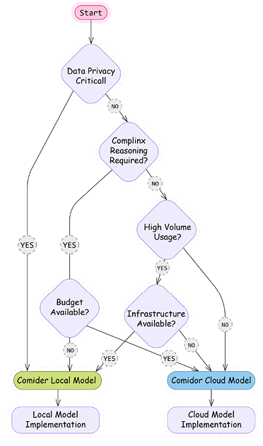
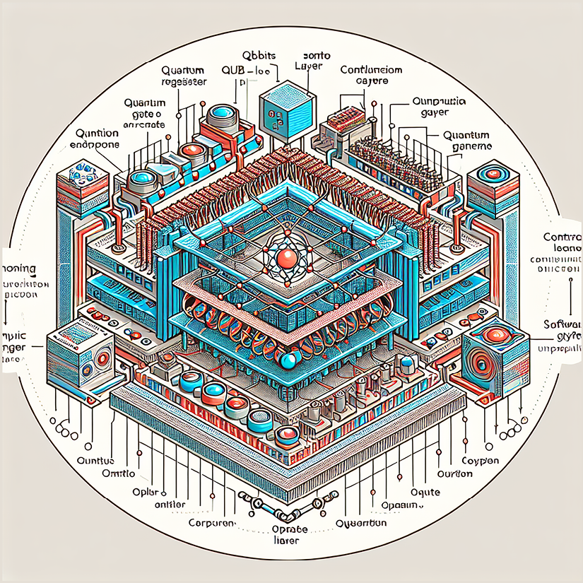

# First Steps with LangChain

In the previous chapter, we explored LLMs and introduced LangChain as a powerful framework for building LLM-powered applications. We discussed how LLMs have revolutionized natural language processing with their ability to understand context, generate human-like text, and perform complex reasoning. While these capabilities are impressive, we also examined their limitations—hallucinations, context constraints, and lack of up-to-date knowledge.

In this chapter, we'll move from theory to practice by building our first LangChain application. We'll start with the fundamentals: setting up a proper development environment, understanding LangChain's core components, and creating simple chains. From there, we'll explore more advanced capabilities, including running local models for privacy and cost efficiency and building multimodal applications that combine text with visual understanding. By the end of this chapter, you'll have a solid foundation in LangChain's building blocks and be ready to create increasingly sophisticated AI applications in subsequent chapters.

To sum up, this chapter will cover the following topics:

- Setting up dependencies
- Exploring LangChain's building blocks (model interfaces, prompts and templates, and LCEL)
- Running local models
- Multimodal AI applications

:::note
Given the rapid evolution of both LangChain and the broader AI field, we maintain up-to-date code examples and resources in our GitHub repository: [https://github.com/benman1/generative_ai_with_langchain](https://github.com/benman1/generative_ai_with_langchain).

For questions or troubleshooting help, please create an issue on GitHub or join our Discord community: [https://packt.link/lang](https://packt.link/lang).
:::

## Setting up dependencies for this book

This [^70]book provides multiple options for running the code examples, from zero-setup cloud notebooks to local development environments. Choose the approach that best fits your experience level and preferences. Even if you are familiar with dependency management, please read these instructions since all code in this book will depend on the correct installation of the environment as outlined here.

For the quickest start with no local setup required, we provide ready-to-use online notebooks for every chapter:

- **Google Colab**: Run [^71]examples with free GPU access
- **Kaggle Notebooks**: Experiment [^72]with integrated datasets
- **Gradient Notebooks**: Access [^73]higher-performance compute options

All code examples you find in this book are available as online notebooks on GitHub at [https://github.com/benman1/generative_ai_with_langchain](https://github.com/benman1/generative_ai_with_langchain).

These notebooks don't have all dependencies pre-configured but, usually, a few install commands get you going. These tools allow you to start experimenting immediately without worrying about setup. If you prefer working locally, we recommend using conda for environment management:

1. Install [^74]Miniconda if you don't have it already.
2. Download it from [https://docs.conda.io/en/latest/miniconda.html](https://docs.conda.io/en/latest/miniconda.html).
3. Create a new environment with Python 3.11:
   ```
   conda create -n langchain-book python=3.11
   ```
4. Activate the environment:
   ```
   conda activate langchain-book
   ```
5. Install Jupyter and core dependencies:
   ```
   conda install jupyter
   pip install langchain langchain-openai jupyter
   ```
6. Launch Jupyter Notebook:
   ```
   jupyter notebook
   ```

This approach provides a clean, isolated environment for working with LangChain. For experienced developers with established workflows, we also support:

- **pip with venv**: Instructions in the GitHub repository
- **Docker containers**: Dockerfiles provided in the GitHub repository
- **Poetry**: Configuration files available in the GitHub repository

Choose [^75]the method you're most comfortable with but remember that all examples assume a Python 3.10+ environment with the dependencies listed in requirements.txt.

For developers, Docker, which [^76]provides isolation via containers, is a good option. The downside is that it uses a lot of disk space and is more complex than the other options. For data scientists, I'd recommend Conda or Poetry.

Conda[^77] handles intricate dependencies efficiently, although it can be excruciatingly slow in large environments. Poetry[^78] resolves dependencies well and manages environments; however, it doesn't capture system dependencies.

All tools allow sharing and replicating dependencies from configuration files. You can find a set of instructions and the corresponding configuration files in the book's repository at [https://github.com/benman1/generative_ai_with_langchain](https://github.com/benman1/generative_ai_with_langchain).

Once you are finished, please make sure you have LangChain version 0.3.17 installed. You can check this with the command `pip show langchain`.

:::note
With the rapid pace of innovation in the LLM field, library updates are frequent. The code in this book is tested with LangChain 0.3.17, but newer versions may introduce changes. If you encounter any issues running the examples:

- Create an issue on our GitHub repository
- Join the discussion on Discord at [https://packt.link/lang
  ](https://packt.link/lang)
- Check the errata on the book's Packt page

This community support ensures you'll be able to successfully implement all projects regardless of library updates.
:::

## API key setup

LangChain's[^79] provider-agnostic approach supports a wide range of LLM providers, each with unique strengths and characteristics. Unless you use a local LLM, to use these services, you'll need to obtain the appropriate authentication credentials.

| Provider        | Environment Variable              | Setup URL                                                                | Free Tier?        |
| --------------- | --------------------------------- | ------------------------------------------------------------------------ | ----------------- |
| OpenAI          | `OPENAI_API_KEY`                  | [platform.openai.com](https://platform.openai.com)                       | No                |
| HuggingFace     | `HUGGINGFACEHUB_API_TOKEN`        | [huggingface.co/settings/tokens](https://huggingface.co/settings/tokens) | Yes               |
| Anthropic       | `ANTHROPIC_API_KEY`               | [console.anthropic.com](https://console.anthropic.com)                   | No                |
| Google AI       | `GOOGLE_API_KEY`                  | [ai.google.dev/gemini-api](https://ai.google.dev/gemini-api)             | Yes               |
| Google VertexAI | `Application Default Credentials` | [cloud.google.com/vertex-ai](https://cloud.google.com/vertex-ai)         | Yes (with limits) |
| Replicate       | `REPLICATE_API_TOKEN`             | [replicate.com](https://replicate.com)                                   | No                |

Table 2.1: API keys reference table (overview)

Most providers [^80]require an API key, while cloud providers like AWS and Google Cloud also support alternative authentication methods like **Application Default Credentials** (**ADC**). Many[^81] providers offer free tiers without requiring credit card details, making it easy to get started.

:::note
Refer to the _Appendix_ at the end of the book to learn how to get API keys for OpenAI, Hugging Face, Google, and other providers.
:::

To set an API key in an environment, in Python, we can execute the following lines:

```python
import os
os.environ["OPENAI_API_KEY"] = "<your token>"
```

Here, `OPENAI_API_KEY` is the [^82]environment key that is appropriate for OpenAI. Setting the keys in your environment has the advantage of not needing to include them as parameters in your code every time you use a model or service integration.

You can also expose these variables in your system environment from your terminal. In Linux and macOS, you can set a system environment variable from the terminal using the `export `command:

```
export OPENAI_API_KEY=<your token>
```

To permanently set the environment variable in Linux or macOS, you would need to add the preceding line to the `~/.bashrc` or `~/.bash_profile` files, and then reload the shell using the command `source ~/.bashrc` or `source ~/.bash_profile`.

For Windows users, you can set the environment variable by searching for "Environment Variables" in the system settings, editing either "User variables" or "System variables," and adding `export` `OPENAI_API_KEY=your_key_here`.

Our choice is to [^83]create a `config.py` file where all API keys are stored. We then import a function from this module that loads these keys into the environment variables. This approach centralizes credential management and makes it easier to update keys when needed:

```python
import os
OPENAI_API_KEY =  "... "
# I'm omitting all other keys
def set_environment():
    variable_dict = globals().items()
    for key, value in variable_dict:
        if "API" in key or "ID" in key:
             os.environ[key] = value
```

If you search for this file in the GitHub repository, you'll notice it's missing. This is intentional – I've excluded it from Git tracking using the `.gitignore` file. The `.gitignore` file tells Git which files to ignore when committing changes, which is essential for:

1. Preventing sensitive credentials from being publicly exposed
2. Avoiding accidental commits of personal API keys
3. Protecting yourself from unauthorized usage charges

To implement this yourself, simply add `config.py` to your `.gitignore` file:

```
# In .gitignore
config.py
.env
**/api_keys.txt
# Other sensitive files
```

You can set all your keys in the `config.py` file. This function, `set_environment()`, loads all the keys into the environment as mentioned. Anytime you want to run an application, you import the function and run it like so:

```python
from config import set_environment
set_environment()
```

For production environments, consider using dedicated secrets management services or environment variables injected at runtime. These approaches provide additional security while maintaining the separation between code and credentials.

While OpenAI's models[^84] remain influential, the LLM ecosystem has rapidly diversified, offering developers multiple options for their applications. To maintain clarity, we'll separate LLMs[^85] from the model gateways that provide access to them.

- **Key LLM families**
  - **Anthropic Claude**: Excels in[^86] reasoning, long-form content processing, and vision analysis with up to 200K token context windows
  - **Mistral models**: Powerful [^87]open-source models with strong multilingual capabilities and exceptional reasoning abilities
  - **Google Gemini**: Advanced[^88] multimodal models with industry-leading 1M token context window and real-time information access
  - **OpenAI GPT-o**: Leading[^89] omnimodal capabilities accepting text, audio, image, and video with enhanced reasoning
  - **DeepSeek models:** Specialized[^90] in coding and technical reasoning with state-of-the-art performance on programming tasks
  - **AI21 Labs Jurassic:** Strong in[^91] academic applications and long-form content generation
  - **Inflection Pi**: Optimized [^92]for conversational AI with exceptional emotional intelligence
  - **Perplexity models**: Focused[^93] on accurate, cited answers for research applications
  - **Cohere models**: Specialized [^94]for enterprise applications with strong multilingual capabilities
- **Cloud provider gateways**
  - **Amazon Bedrock**: Unified [^95]API access to models from Anthropic, AI21, Cohere, Mistral, and [^96]others with AWS integration
  - **Azure OpenAI Service**: Enterprise-grade[^97] access to OpenAI and other models with robust security and Microsoft ecosystem integration
  - **Google Vertex AI**: Access to [^98]Gemini and other models with seamless Google Cloud integration
- **Independent platforms**
  - **Together AI**: Hosts 200+ open-source [^99]models with both serverless and dedicated GPU options
  - **Replicate**: Specializes[^100] in deploying multimodal open-source models with pay-as-you-go pricing
  - **HuggingFace Inference Endpoints**: Production deployment of thousands of open-source models [^101]with fine-tuning capabilities

Throughout this book, we'll work with various models accessed through different providers, giving you the[^102] flexibility to choose the best option for your specific needs and infrastructure requirements.

We will use OpenAI for many applications but will also try LLMs from other organizations.

:::note
There are two main integration packages:

- `langchain-google-vertexai`
- `langchain-google-genai`

We'll be using `langchain-google-genai`, the package recommended by LangChain for individual developers. The setup is a lot simpler, only requiring a Google account and API key. It is recommended to move to `langchain-google-vertexai` for larger projects. This integration offers enterprise features such as customer encryption keys, virtual private cloud integration, and more, requiring a Google Cloud account with billing.

If you've followed the instructions on GitHub, as indicated in the previous section, you should already have the `langchain-google-genai` package installed.
:::

## Exploring LangChain's building blocks

To build [^103]practical applications, we need to know how to work with different model providers. Let's explore the various options available, from cloud services to local deployments. We'll start with fundamental concepts like LLMs and chat models, then dive into prompts, chains[^28], and memory systems.

## Model interfaces

LangChain provides a unified interface for working with various LLM providers. This abstraction makes it easy to switch between different models while maintaining a consistent code structure. The[^104] following examples demonstrate how to implement[^105] LangChain's core components in practical scenarios.

:::note
Please note that users should almost exclusively be using the newer chat models as most model providers have adopted a chat-like interface for interacting with language models. We still provide the LLM interface, because it's very easy to use as string-in, string-out.
:::

### LLM interaction patterns

The [^106]LLM interface represents traditional text completion models that take a string input and return a string output. More and more use cases in LangChain use only the ChatModel interface, mainly because it's better suited for building complex workflows and developing agents. The LangChain documentation is now deprecating the LLM interface and recommending the use of chat-based interfaces. While this chapter demonstrates both interfaces, we recommend using chat models as they represent the current standard to be up to date with LangChain.

Let's see the LLM interface in action:

```python
from langchain_openai import OpenAI
from langchain_google_genai import GoogleGenerativeAI
# Initialize OpenAI model
openai_llm = OpenAI()
# Initialize a Gemini model
gemini_pro = GoogleGenerativeAI(model="gemini-1.5-pro")
# Either one or both can be used with the same interface
response = openai_llm.invoke("Tell me a joke about light bulbs!")
print(response)
```

Please note that you must set your environment variables to the provider keys when you run this. For example, when running this I'd start the file by calling `set_environment() from config`:

```python
from config import set_environment
set_environment()
```

We get this output:

```
Why did the light bulb go to therapy?
Because it was feeling a little dim!
```

For the Gemini model, we can run:

```python
response = gemini_pro.invoke("Tell me a joke about light bulbs!")
```

For me, Gemini[^107] comes up with this joke:

```
Why did the light bulb get a speeding ticket?
Because it was caught going over the watt limit!
```

Notice how we use the same `invoke()` method regardless of the provider. This consistency makes it easy to experiment with different models or switch[^29] providers in production.

### Development testing

During development, you[^108] might want to test your application without making actual API calls. LangChain provides `FakeListLLM`[^30] for this purpose:

```python
from langchain_community.llms import FakeListLLM
# Create a fake LLM that always returns the same response
fake_llm = FakeListLLM(responses=["Hello"])
result = fake_llm.invoke("Any input will return Hello")
print(result)  # Output: Hello
```

### Working with chat models

Chat models [^109]are LLMs that are fine-tuned for multi-turn interaction between a model and a human. These days most LLMs are fine-tuned for multi-turned conversations. Instead of providing input to the model, such as:

```
human: turn1
ai: answer1
human: turn2
ai: answer2
```

where we expect it to generate an output by continuing the conversation, these days model providers typically expose an API that expects each turn as a separate well-formatted part of the payload. Model providers typically don't store the chat history server-side, they get the full history sent each time from the client and only format the final prompt server-side.

LangChain follows the same pattern with ChatModels, processing conversations through structured messages with roles and content. Each message contains:

- Role (who's speaking), which is defined by the message class (all messages inherit from BaseMessage)
- Content (what's being said)

Message [^110]types include:

- `SystemMessage`: Sets behavior and context for the model. Example:
  `SystemMessage(content="You're a helpful programming assistant")`
- `HumanMessage`: Represents user input like questions, commands, and data. Example:
  `HumanMessage(content="Write a Python function to calculate factorial")`
- `AIMessage`: Contains model responses

Let's see this in action:

```python
from langchain_anthropic import ChatAnthropic
from langchain_core.messages import SystemMessage, HumanMessage
chat = ChatAnthropic(model="claude-3-opus-20240229")
messages = [
    SystemMessage(content="You're a helpful programming assistant"),
    HumanMessage(content="Write a Python function to calculate factorial")
]
response = chat.invoke(messages)
print(response)
```

Claude comes up with a function, an explanation, and examples for calling the function.

Here's a Python function that calculates the factorial of a given number:

```python
def factorial(n):
    if n < 0:
        raise ValueError("Factorial is not defined for negative numbers.")
    elif n == 0:
        return 1
    else:
        result = 1
        for i in range(1, n + 1):
            result *= i
        return result
```

Let's break that down. The `factorial` function is designed to take an integer `n` as input and calculate its factorial. It starts by checking if `n` is negative, and if so, it raises a `ValueError` since factorials aren't defined for negative numbers. If `n` is zero, the function returns `1`, which makes sense because, by definition, the factorial of 0 is 1.
When dealing with positive numbers, the function kicks things off by setting a variable `result` to 1. From there, it enters a loop that runs from 1 to `n`, inclusive, thanks to the `range` function. During each step of the loop, it multiplies the result by the current number, gradually building up the factorial. Once[^111] the loop completes, the function returns the final calculated value. You can call this function by providing a non-negative integer as an argument. Here are a few examples:

```python
print(factorial(0))  # Output: 1
print(factorial(5))  # Output: 120
print(factorial(10))  # Output: 3628800
print(factorial(-5))  # Raises ValueError: Factorial is not defined for negative numbers.
```

Note that the factorial function grows very quickly, so calculating the factorial of large numbers may exceed the maximum representable value in Python. In such cases, you might need to use a different approach or a library that supports arbitrary-precision arithmetic.

Similarly, we could have asked an OpenAI[^31] model such as GPT-4 or GPT-4o:

```python
from langchain_openai.chat_models import ChatOpenAI
chat = ChatOpenAI(model_name='gpt-4o')
```

### Reasoning models

Anthropic's Claude 3.7 Sonnet[^112] introduces a powerful capability called _extended thinking_ that allows the model to show its reasoning process before delivering a final answer. This feature represents a significant advancement in how developers can leverage LLMs for complex reasoning tasks.

Here's how to configure extended thinking through the ChatAnthropic class:

```python
from langchain_anthropic import ChatAnthropic
from langchain_core.prompts import ChatPromptTemplate
# Create a template
template = ChatPromptTemplate.from_messages([
    ("system", "You are an experienced programmer and mathematical analyst."),
    ("user", "{problem}")
])
# Initialize Claude with extended thinking enabled
chat = ChatAnthropic(
    model_name="claude-3-7-sonnet-20240326",  # Use latest model version
    max_tokens=64_000,                        # Total response length limit
    thinking={"type": "enabled", "budget_tokens": 15000},  # Allocate tokens for thinking
)
# Create and run a chain
chain = template | chat
# Complex algorithmic problem
problem = """
Design an algorithm to find the kth largest element in an unsorted array
with the optimal time complexity. Analyze the time and space complexity
of your solution and explain why it's optimal.
"""
# Get response with thinking included
response = chat.invoke([HumanMessage(content=problem)])
print(response.content)
```

The[^113] response will include Claude's step-by-step reasoning about algorithm selection, complexity analysis, and optimization considerations before presenting its final solution. In the preceding example:

- Out of the 64,000-token maximum response length, up to 15,000 tokens can be used for Claude's thinking process.
- The remaining ~49,000 tokens are available for the final response.
- Claude doesn't always use the entire thinking budget—it uses what it needs for the specific task. If Claude runs out of thinking tokens, it will transition to its final answer.

While Claude offers explicit thinking configuration, you can achieve similar (though not identical) results with other providers through different techniques:

```python
from langchain_openai import ChatOpenAI
from langchain_core.prompts import ChatPromptTemplate
template = ChatPromptTemplate.from_messages([
    ("system", "You are a problem-solving assistant."),
    ("user", "{problem}")
])
# Initialize with reasoning_effort parameter
chat = ChatOpenAI(
    model="o3-mini",
    reasoning_effort="high"  # Options: "low", "medium", "high"
)
chain = template | chat
response = chain.invoke({"problem": "Calculate the optimal strategy for..."})
chat = ChatOpenAI(model="gpt-4o")
chain = template | chat
response = chain.invoke({"problem": "Calculate the optimal strategy for..."})
```

The `reasoning_effort` parameter streamlines your workflow by eliminating the need for complex[^114] reasoning prompts, allows you to adjust performance by reducing effort when speed matters more than detailed analysis, and helps manage token consumption by controlling how much processing power goes toward reasoning processes.

DeepSeek models also offer explicit thinking configuration [^32]through the LangChain integration.

### Controlling model behavior

Understanding [^115]how to control an LLM's behavior is crucial for tailoring its output to specific needs. Without careful parameter adjustments, the model might produce overly creative, inconsistent, or verbose responses that are unsuitable for practical applications. For instance, in customer service, you'd want consistent, factual answers, while in content generation, you might aim for more creative and promotional outputs.

LLMs offer several parameters that allow fine-grained control over generation behavior, though exact implementation may vary between providers. Let's explore the most important ones:

| Parameter                        | Description                                                     | Typical Range                                | Best For                                                                                 |
| -------------------------------- | --------------------------------------------------------------- | -------------------------------------------- | ---------------------------------------------------------------------------------------- |
| **Temperature**                  | Controls randomness in text generation                          | 0.0-1.0 (OpenAI, Anthropic) 0.0-2.0 (Gemini) | Lower (0.0-0.3): Factual tasks, Q&A Higher (0.7+): Creative writing, brainstorming       |
| **Top-k**                        | Limits token selection to k most probable tokens                | 1-100                                        | Lower values (1-10): More focused outputs Higher values: More diverse completions        |
| **Top-p (Nucleus Sampling)**     | Considers tokens until cumulative probability reaches threshold | 0.0-1.0                                      | Lower values (0.5): More focused outputs Higher values (0.9): More exploratory responses |
| **Max tokens**                   | Limits maximum response length                                  | Model-specific                               | Controlling costs and preventing verbose outputs                                         |
| **Presence/frequency penalties** | Discourages repetition by penalizing tokens that have appeared  | -2.0 to 2.0                                  | Longer content generation where repetition is undesirable                                |
| **Stop sequences**               | Tells model when to stop generating                             | Custom strings                               | Controlling exact ending points of generation                                            |

Table 2.2: Parameters offered by LLMs

These[^116] parameters work together to shape model output:

- **Temperature + Top-k/Top-p**: First, Top-k/Top-p filter the token distribution, and then temperature affects randomness within that filtered set
- **Penalties + Temperature**: Higher temperatures with low penalties can produce creative but potentially repetitive text

LangChain provides a consistent interface for setting these parameters across different LLM providers:

```python
from langchain_openai import OpenAI
# For factual, consistent responses
factual_llm = OpenAI(temperature=0.1, max_tokens=256)
# For creative brainstorming
creative_llm = OpenAI(temperature=0.8, top_p=0.95, max_tokens=512)
```

A few provider-specific considerations to keep in mind are:

- **OpenAI**: Known for consistent behavior with temperature in the 0.0-1.0 range
- **Anthropic**: May need lower temperature settings to achieve similar creativity levels to other providers
- **Gemini**: Supports temperature up to 2.0, allowing for more extreme creativity at higher settings
- **Open-source models**: Often require different parameter combinations than commercial APIs

### Choosing parameters for applications

For enterprise[^117] applications requiring consistency and accuracy, lower temperatures (0.0-0.3) combined with moderate top-p values (0.5-0.7) are typically preferred. For creative assistants or brainstorming tools, higher temperatures produce more diverse outputs, especially when paired with higher top-p values.

Remember that parameter tuning is often empirical – start with provider recommendations, then adjust based on your specific application needs and observed outputs.

## Prompts and templates

Prompt engineering[^118] is a crucial skill for LLM application development, particularly in production environments. LangChain provides a robust system for managing [^119]prompts with features that address common development challenges:

- **Template systems** for dynamic prompt generation
- **Prompt management and versioning **for tracking changes
- **Few-shot example management** for improved model performance
- **Output parsing and validation** for reliable results

LangChain's [^120]prompt templates transform static text into dynamic prompts with variable substitution – compare these two approaches to see the key differences:

1. Static use – problematic at scale:
   ```python
    def generate_prompt(question, context=None):
       if context:
           return f"Context information: {context}\n\nAnswer this question concisely: {question}"
       return f"Answer this question concisely: {question}"
      # example use:
      prompt_text = generate_prompt("What is the capital of France?")
   ```
2. PromptTemplate – production-ready:
   ```python
   from langchain_core.prompts import PromptTemplate
   # Define once, reuse everywhere
   question_template = PromptTemplate.from_template( "Answer this question concisely: {question}" )
   question_with_context_template = PromptTemplate.from_template( "Context information: {context}\n\nAnswer this question concisely: {question}" )
   # Generate prompts by filling in variables
   prompt_text = question_template.format(question="What is the capital of France?")
   ```

Templates[^121] matter – here's why:

- **Consistency**: They standardize prompts across your application.
- **Maintainability**: They allow you to change the prompt structure in one place instead of throughout your codebase.
- **Readability**: They clearly separate template logic from business logic.
- **Testability**: It is easier to unit test prompt generation separately from LLM calls.

In production applications, you'll often need to manage dozens or hundreds of prompts. Templates provide a scalable way to organize this complexity[^33].

### Chat prompt templates

For chat models, we [^122]can create more structured prompts that incorporate different roles:

```python
from langchain_core.prompts import ChatPromptTemplate
from langchain_openai import ChatOpenAI
template = ChatPromptTemplate.from_messages([
    ("system", "You are an English to French translator."),
    ("user", "Translate this to French: {text}")
])
chat = ChatOpenAI()
formatted_messages = template.format_messages(text="Hello, how are you?")
response = chat.invoke(formatted_messages)
print(response)
```

Let's start by looking at **LangChain Expression Language** (**LCEL**), which provides a clean, intuitive way to build LLM applications[^34].

## LangChain Expression Language (LCEL)

LCEL [^123]represents a significant [^124]evolution in how we build LLM-powered applications with LangChain. Introduced in August 2023, LCEL is a declarative approach to constructing complex LLM workflows. Rather than focusing on _how_ to execute each step, LCEL lets you define _what_ you want to accomplish, allowing LangChain to handle the execution details behind the scenes.

At its core, LCEL serves as a minimalist code layer that makes it remarkably easy to connect different LangChain[^125] components. If you're familiar with Unix pipes or data processing libraries like pandas, you'll recognize the intuitive syntax: components are connected using the pipe operator (|) to create processing pipelines.

As we briefly introduced in [Chapter 1](Chapter_1.xhtml#_idTextAnchor000), LangChain has always used the concept of a "chain" as its fundamental pattern for connecting components. Chains represent sequences of operations that [^126]transform inputs into outputs.

Originally, LangChain implemented this pattern through specific `Chain` classes like `LLMChain` and `ConversationChain`. While these legacy classes still exist, they've been deprecated in favor of the more flexible and powerful LCEL approach, which is built upon the Runnable interface.

The Runnable interface is the cornerstone of modern LangChain. A Runnable is any component that can process inputs and produce outputs in a standardized way. Every component built with LCEL adheres to this interface, which provides consistent methods including:

- `invoke()`: Processes a single input synchronously and returns an output
- `stream()`: Streams output as it's being generated
- `batch()`: Efficiently processes multiple inputs in parallel
- `ainvoke()`, `abatch()`, `astream()`: Asynchronous versions of the above methods

This standardization means any Runnable component—whether it's an LLM, a prompt template, a document retriever, or a custom function—can be connected to any other Runnable, creating a powerful composability system.

Every Runnable implements a consistent set of methods including:

- `invoke()`: Processes a single input synchronously and returns an output
- `stream()`: Streams output as it's being generated

This standardization is powerful because it means any Runnable component—whether it's an LLM, a prompt template, a document retriever, or a custom function—can be connected to any other Runnable. The consistency of this interface enables complex applications to be built from simpler building blocks.

:::note
LCEL offers several advantages that make it the preferred approach for building LangChain applications:

- **Rapid development**: The declarative syntax enables faster prototyping and iteration of complex chains.
- **Production-ready features**: LCEL provides built-in support for streaming, asynchronous execution, and parallel processing.
- **Improved readability**: The pipe syntax makes it easy to visualize data flow through your application.
- **Seamless ecosystem integration**: Applications built with LCEL automatically work with LangSmith for observability and LangServe for deployment.
- **Customizability**: Easily incorporate custom Python functions into your chains with RunnableLambda.
- **Runtime optimization**: LangChain can automatically optimize the execution of LCEL-defined chains.
  :::

LCEL truly shines when you need to build complex applications that combine multiple components in [^127]sophisticated workflows. In the next sections, we'll [^128]explore how to use LCEL to build real-world applications, starting with the basic building blocks and gradually incorporating more advanced patterns.

The pipe operator (|) serves as the cornerstone of LCEL, allowing you to chain components sequentially:

```python
# 1. Basic sequential chain: Just prompt to LLM
basic_chain = prompt | llm | StrOutputParser()
```

Here, `StrOutputParser()` is a simple output parser that extracts the string response from an LLM. It takes the structured output from an LLM and converts it to a plain string, making it easier to work with. This parser is especially useful when you need just the text content without metadata.

Under the hood, LCEL uses Python's operator overloading to transform this expression into a RunnableSequence where each component's output flows into the next component's input. The pipe (|) is syntactic sugar that overrides the `__or__` hidden method, in other words, `A | B` is equivalent to `B.__or__(A)`.

The pipe syntax is equivalent to creating a `RunnableSequence` programmatically:

```
chain = RunnableSequence(first= prompt, middle=[llm], last= output_parser)
LCEL also supports adding transformations and custom functions:
with_transformation = prompt | llm | (lambda x: x.upper()) | StrOutputParser()
```

For more complex workflows, you can incorporate branching logic:

```
decision_chain = prompt | llm | (lambda x: route_based_on_content(x)) | {
    "summarize": summarize_chain,
    "analyze": analyze_chain
}
```

Non-Runnable elements like functions and dictionaries are automatically converted to appropriate Runnable types:

```python
# Function to Runnable
length_func = lambda x: len(x)
chain = prompt | length_func | output_parser
# Is converted to:
chain = prompt | RunnableLambda(length_func) | output_parser
```

The flexible, composable[^129] nature of LCEL will allow us to [^130]tackle real-world LLM application challenges with elegant, maintainable code[^35].

### Simple workflows with LCEL

As we've seen, LCEL [^131]provides a declarative syntax for composing LLM application components using the pipe operator. This approach dramatically simplifies workflow construction compared to traditional imperative code. Let's build a simple joke generator to see LCEL in action:

```python
from langchain_core.prompts import PromptTemplate
from langchain_core.output_parsers import StrOutputParser
from langchain_openai import ChatOpenAI
# Create components
prompt = PromptTemplate.from_template("Tell me a joke about {topic}")
llm = ChatOpenAI()
output_parser = StrOutputParser()
# Chain them together using LCEL
chain = prompt | llm | output_parser
#  Execute the workflow with a single call
result = chain.invoke({"topic": "programming"})
print(result)
```

This produces a programming joke:

```
Why don't programmers like nature?
It has too many bugs!
```

Without LCEL, the same workflow is equivalent to separate function calls with manual data passing:

```python
formatted_prompt = prompt.invoke({"topic": "programming"})
llm_output = llm.invoke(formatted_prompt)
result = output_parser.invoke(llm_output)
```

As you can see, we [^132]have detached chain construction from[^36] its execution.

In production applications, this pattern becomes even more valuable when handling complex workflows with branching logic, error handling, or parallel processing – topics we'll explore in [Chapter 3](Chapter_3.xhtml#_idTextAnchor049).

### Complex chain example

While the [^133]simple joke generator demonstrated basic LCEL usage, real-world applications typically require more sophisticated data handling. Let's explore advanced patterns using a story generation and analysis example.

In this example, we'll build a multi-stage workflow that demonstrates how to:

1. Generate content with one LLM call
2. Feed that content into a second LLM call
3. Preserve and transform data throughout the chain

```python
from langchain_core.prompts import PromptTemplate
from langchain_google_genai import GoogleGenerativeAI
from langchain_core.output_parsers import StrOutputParser
# Initialize the model
llm = GoogleGenerativeAI(model="gemini-1.5-pro")
# First chain generates a story
story_prompt = PromptTemplate.from_template("Write a short story about {topic}")
story_chain = story_prompt | llm | StrOutputParser()
# Second chain analyzes the story
analysis_prompt = PromptTemplate.from_template(
    "Analyze the following story's mood:\n{story}"
)
analysis_chain = analysis_prompt | llm | StrOutputParser()
```

We can compose these two chains together. Our first simple approach pipes the story directly into the analysis chain:

```python
# Combine chains
story_with_analysis = story_chain | analysis_chain
# Run the combined chain
story_analysis = story_with_analysis.invoke({"topic": "a rainy day"})
print("\nAnalysis:", story_analysis)
```

I get a long analysis. Here's how it starts:

```
Analysis: The mood of the story is predominantly **calm, peaceful, and subtly romantic.** There's a sense of gentle melancholy brought on by the rain and the quiet emptiness of the bookshop, but this is balanced by a feeling of warmth and hope.
```

While this [^134]works, we've lost the original story in our result – we only get the analysis! In production applications, we typically want to preserve context throughout the chain:

```python
from langchain_core.runnables import RunnablePassthrough
# Using RunnablePassthrough.assign to preserve data
enhanced_chain = RunnablePassthrough.assign(
    story=story_chain  # Add 'story' key with generated content
).assign(
    analysis=analysis_chain  # Add 'analysis' key with analysis of the story
)
# Execute the chain
result = enhanced_chain.invoke({"topic": "a rainy day"})
print(result.keys())  # Output: dict_keys(['topic', 'story', 'analysis'])  # dict_keys(['topic', 'story', 'analysis'])
```

For more control over the output structure, we could also construct dictionaries manually:

```python
from operator import itemgetter
# Alternative approach using dictionary construction
manual_chain = (
    RunnablePassthrough() |  # Pass through input
    {
        "story": story_chain,  # Add story result
        "topic": itemgetter("topic")  # Preserve original topic
    } |
    RunnablePassthrough().assign(  # Add analysis based on story
        analysis=analysis_chain
    )
)
result = manual_chain.invoke({"topic": "a rainy day"})
print(result.keys())  # Output: dict_keys(['story', 'topic', 'analysis'])
```

We can simplify this with dictionary conversion using a LCEL shorthand:

```python
# Simplified dictionary construction
simple_dict_chain_corrected = story_chain | {
    "story": RunnablePassthrough(),  # Pass the story output as 'story'
    "analysis": analysis_chain
}
# analysis_chain will receive {'story': 'the actual story content'} as expected.
result_corrected = simple_dict_chain_corrected.invoke({"topic": "a rainy day"})
print(result_corrected.keys())
```

What makes[^135] these examples more complex than our simple joke generator?

- **M**ultiple LLM calls: Rather than a single prompt → LLM → parser flow, we're chaining multiple LLM interactions
- **Data transformation**: Using tools like `RunnablePassthrough` and `itemgetter` to manage and transform data
- **Dictionary preservation**: Maintaining context throughout the chain rather than just passing single values
- **Structured outputs**: Creating structured output dictionaries rather than simple strings

These patterns are essential for production applications where you need to:

- Track the provenance of generated content
- Combine results from multiple operations
- Structure data for downstream processing or display
- Implement more sophisticated error handling

:::note
While LCEL handles many complex workflows elegantly, for state management and advanced branching logic, you'll want to explore LangGraph, which we'll cover in [Chapter 3](Chapter_3.xhtml#_idTextAnchor049).
:::

While our previous examples used cloud-based models like OpenAI and Google's Gemini, LangChain's LCEL and other functionality work seamlessly with local models as well. This flexibility allows you to choose the right deployment approach for your specific needs.

## Running local models

When building LLM applications[^136] with LangChain, you need to decide where your models will run.

- Advantages of local models:
  - Complete data control and privacy
  - No API costs or usage limits
  - No internet dependency
  - Control over model parameters and fine-tuning
- Advantages of cloud models:
  - No hardware requirements or setup complexity
  - Access to the most powerful, state-of-the-art models
  - Elastic scaling without infrastructure management
  - Continuous model improvements without manual updates
- When to choose [^137]local models:
  - Applications with strict data privacy requirements
  - Development and testing environments
  - Edge or offline deployment scenarios
  - Cost-sensitive applications with predictable, high-volume usage

Let's start with one of the most developer-friendly options for [^37]running local models.

## Getting started with Ollama

Ollama [^138]provides[^139] a developer-friendly way to run powerful open-source models locally. It provides a simple interface for downloading and running various open-source models. The `langchain-ollama` dependency should already be installed if you've followed the instructions in this chapter; however, let's go through them briefly anyway:

1. Install the LangChain Ollama integration:
   ```
   pip install langchain-ollama
   ```
2. Then pull a model. From the command line, a terminal such as bash or the WindowsPowerShell, run:
   ```
   ollama pull deepseek-r1:1.5b
   ```
3. Start the Ollama server:
   ```
   ollama serve
   ```

Here's how to integrate Ollama with the LCEL patterns we've explored:

```python
from langchain_ollama import ChatOllama
from langchain_core.prompts import PromptTemplate
from langchain_core.output_parsers import StrOutputParser
# Initialize Ollama with your chosen model
local_llm = ChatOllama(
    model="deepseek-r1:1.5b",
    temperature=0,
)
# Create an LCEL chain using the local model
prompt = PromptTemplate.from_template("Explain {concept} in simple terms")
local_chain = prompt | local_llm | StrOutputParser()
# Use the chain with your local model
result = local_chain.invoke({"concept": "quantum computing"})
print(result)
```

This LCEL [^140]chain [^141]functions identically to our cloud-based examples, demonstrating LangChain's model-agnostic design.

Please note that since you are running a local model, you don't need to set up any keys. The answer is very long – although quite reasonable. You can run this yourself and see what answers you get.

Now that we've seen basic text generation, let's look at another integration. Hugging Face offers an approachable way to run models locally, with access to a vast ecosystem[^38] of pre-trained models.

## Working with Hugging Face models locally

With[^142] Hugging Face, you can either run a model locally (HuggingFacePipeline) or on [^143]the Hugging Face Hub (HuggingFaceEndpoint). Here, we are talking about local runs, so we'll focus on `HuggingFacePipeline`. Here we go:

```python
from langchain_core.messages import SystemMessage, HumanMessage
from langchain_huggingface import ChatHuggingFace, HuggingFacePipeline
# Create a pipeline with a small model:
llm = HuggingFacePipeline.from_model_id(
    model_id="TinyLlama/TinyLlama-1.1B-Chat-v1.0",
    task="text-generation",
    pipeline_kwargs=dict(
        max_new_tokens=512,
        do_sample=False,
        repetition_penalty=1.03,
    ),
)
chat_model = ChatHuggingFace(llm=llm)
# Use it like any other LangChain LLM
messages = [
    SystemMessage(content="You're a helpful assistant"),
    HumanMessage(
        content="Explain the concept of machine learning in simple terms"
    ),
]
ai_msg = chat_model.invoke(messages)
print(ai_msg.content)
```

This can take quite a while, especially the first time, since the model has to be downloaded first. We've omitted[^144] the model response for the sake of brevity.

LangChain [^145]supports running models locally through other integrations as well, for example:

- **llama.cpp:** This[^146] high-performance C++ implementation allows running LLaMA-based models efficiently on consumer hardware. While we won't cover the setup process in detail, LangChain provides straightforward integration with llama.cpp for both inference and fine-tuning.
- **GPT4All** GPT4All[^147] offers lightweight models that can run on consumer hardware. LangChain's integration makes it easy to use these models as drop-in replacements for cloud-based LLMs in many applications.

As you begin working with local models, you'll want to optimize their performance and handle common challenges. Here are some essential tips and patterns that will help you get the most out of your local deployments[^39] with LangChain.

## Tips for local models

When [^148]working with local models, keep these points in mind:

1. **Resource management**: Local models require careful configuration to balance performance and resource usage. The following example demonstrates how to configure an Ollama model for efficient operation:
   ```python
   #  Configure model with optimized memory and processing settings
   from langchain_ollama import ChatOllama
   llm = ChatOllama(
     model="mistral:q4_K_M", # 4-bit quantized model (smaller memory footprint)
     num_gpu=1, # Number of GPUs to utilize (adjust based on hardware)
    num_thread=4 # Number of CPU threads for parallel processing
   )
   ```

Let's look at what each parameter does:

- **model="mistral:q4_K_M"**: Specifies a 4-bit quantized version of the Mistral model. Quantization reduces the model size by representing weights with fewer bits, trading minimal precision for significant memory savings. For example:
  - Full precision model: ~8GB RAM required
  - 4-bit quantized model: ~2GB RAM required
- **num_gpu=1**: Allocates GPU resources. Options include:
  - 0: CPU-only mode (slower but works without a GPU)
  - 1: Uses a single GPU (appropriate for most desktop setups)
  - Higher values: For multi-GPU systems only
- **num_thread=4**: Controls CPU parallelization:
  - Lower values (2-4): Good for running alongside other applications
  - Higher values (8-16): Maximizes performance on dedicated servers
  - Optimal setting: Usually matches your CPU's physical core count

2. **Error handling**: Local [^149]models can encounter various errors, from out-of-memory conditions to unexpected terminations. A robust error-handling strategy is essential:

```python
def safe_model_call(llm, prompt, max_retries=2):
    """Safely call a local model with retry logic and graceful
    failure"""
    retries = 0
    while retries <= max_retries:
        try:
            return llm.invoke(prompt)
        except RuntimeError as e:
            # Common error with local models when running out of VRAM
            if "CUDA out of memory" in str(e):
                print(f"GPU memory error, waiting and retrying ({retries+1}/{max_retries+1})")
                time.sleep(2)  # Give system time to free resources
                retries += 1
            else:
                print(f"Runtime error: {e}")
                return "An error occurred while processing your request."
        except Exception as e:
            print(f"Unexpected error calling model: {e}")
            return "An error occurred while processing your request."
    # If we exhausted retries
    return "Model is currently experiencing high load. Please try again later."
# Use the safety wrapper in your LCEL chain
from langchain_core.prompts import PromptTemplate
from langchain_core.runnables import RunnableLambda
prompt = PromptTemplate.from_template("Explain {concept} in simple terms")
safe_llm = RunnableLambda(lambda x: safe_model_call(llm, x))
safe_chain = prompt | safe_llm
response = safe_chain.invoke({"concept": "quantum computing"})
```

Common local model[^150] errors you might run into are as follows:

- **Out of memory**: Occurs when the model requires more VRAM than available
- **Model loading failure**: When model files are corrupt or incompatible
- **Timeout issues**: When inference takes too long on resource-constrained systems
- **Context length errors**: When input exceeds the model's maximum token limit

By implementing these optimizations and error-handling strategies, you can create robust LangChain applications that leverage local models effectively while maintaining a good user experience even when issues arise.



Having explored how to build text-based applications with LangChain, we'll now extend our understanding to multimodal capabilities. As AI systems increasingly work with multiple forms of data, LangChain[^151] provides interfaces for both generating images from text and understanding visual content – capabilities that complement the text processing we've already covered and open new possibilities[^40] for more immersive applications[^41].

## Multimodal AI applications

AI systems [^152]have evolved beyond text-only processing to work with diverse data types. In the current landscape, we can distinguish between two key capabilities that are often confused but represent different technological approaches.

Multimodal understanding represents the ability of models to process multiple types of inputs simultaneously to perform reasoning and generate responses. These advanced systems can understand the relationships between different modalities, accepting inputs like text, images, PDFs, audio, video, and structured data. Their processing capabilities include cross-modal reasoning, context awareness, and sophisticated information extraction. Models like Gemini 2.5, GPT-4V, Sonnet 3.7, and Llama 4 exemplify this capability. For instance, a multimodal model can analyze a chart image along with a text question to provide insights about the data trend, combining visual and textual understanding in a single processing flow.

Content generation capabilities, by contrast, focus on creating specific types of media, often with extraordinary quality but more specialized functionality. Text-to-image models create visual content from descriptions, text-to-video systems generate video clips from prompts, text-to-audio tools produce music or speech, and image-to-image models transform existing visuals. Examples include Midjourney, DALL-E, and Stable Diffusion for images; Sora and Pika for video; and Suno and ElevenLabs for audio. Unlike true multimodal models, many generation systems are specialized for their specific output modality, even if they can accept multiple input types. They excel at creation rather than understanding.

As LLMs evolve beyond text, LangChain is expanding to support both multimodal understanding and content generation workflows. The framework provides developers with tools to incorporate these advanced capabilities into their applications without needing to implement complex integrations from scratch. Let's start with generating images from text descriptions. LangChain provides several approaches to incorporate image generation through external integrations and wrappers. We'll explore multiple implementation patterns, starting with the simplest and progressing to more sophisticated techniques that can be incorporated into your applications.

## Text-to-image

LangChain [^153]integrates with various image generation models [^154]and services, allowing you to:

- Generate images from text descriptions
- Edit existing images based on text prompts
- Control image generation parameters
- Handle image variations and styles

LangChain includes [^155]wrappers and models for popular image generation services. First, let's see how to generate images[^42] with OpenAI's DALL-E model series.

### Using DALL-E through OpenAI

LangChain's [^156]wrapper for DALL-E simplifies[^157] the process of generating images from text prompts. The implementation uses OpenAI's API under the hood but provides a standardized interface consistent with other LangChain components.

```python
from langchain_community.utilities.dalle_image_generator import DallEAPIWrapper
dalle = DallEAPIWrapper(
   model_name="dall-e-3",  # Options: "dall-e-2" (default) or "dall-e-3"
   size="1024x1024",       # Image dimensions
    quality="standard",     # "standard" or "hd" for DALL-E 3
    n=1                     # Number of images to generate (only for DALL-E 2)
)
# Generate an image
image_url = dalle.run("A detailed technical diagram of a quantum computer")
# Display the image in a notebook
from IPython.display import Image, display
display(Image(url=image_url))
# Or save it locally
import requests
response = requests.get(image_url)
with open("generated_library.png", "wb") as f:
    f.write(response.content)
```

Here's the image we got:



You might [^158]notice that text generation within [^159]these images is not one of the strong suites of these models. You can find a lot of models for image generation on Replicate, including the latest Stable Diffusion[^43] models, so this is what we'll use now.

### Using Stable Diffusion

Stable Diffusion [^160]3.5 Large is Stability AI's latest[^161] text-to-image model, released in March 2024. It's a **Multimodal Diffusion Transformer** (**MMDiT**) that [^162]generates high-resolution images with remarkable detail and quality.

This model uses three fixed, pre-trained text encoders and implements Query-Key Normalization for improved training stability. It's capable of producing diverse outputs from the same prompt and supports various artistic styles.

```python
from langchain_community.llms import Replicate
# Initialize the text-to-image model with Stable Diffusion 3.5 Large
text2image = Replicate(
    model="stability-ai/stable-diffusion-3.5-large",
    model_kwargs={
        "prompt_strength": 0.85,
        "cfg": 4.5,
        "steps": 40,
        "aspect_ratio": "1:1",
        "output_format": "webp",
        "output_quality": 90
    }
)
# Generate an image
image_url = text2image.invoke(
    "A detailed technical diagram of an AI agent"
)
```

The[^163] recommended parameters for the new [^164]model include:

- **prompt_strength**: Controls how closely the image follows the prompt (0.85)
- **cfg**: Controls how strictly the model follows the prompt (4.5)
- **steps**: More steps result in higher-quality images (40)
- **aspect_ratio**: Set to 1:1 for square images
- **output_format**: Using WebP for a better quality-to-size ratio
- **output_quality**: Set to 90 for high-quality output

Here's the image we got:


Now let's explore how to analyze and understand[^44] images using multimodal models.

## Image understanding

Image [^165]understanding refers to an AI system's ability [^166]to interpret and analyze visual information in ways similar to human visual perception. Unlike traditional computer vision (which focuses on specific tasks like object detection or facial recognition), modern multimodal models can perform general reasoning about images, understanding context, relationships, and even implicit meaning within visual content.

Gemini 2.5 Pro and GPT-4 Vision, among other models, can analyze images and provide detailed[^45] descriptions or answer questions about them.

### Using Gemini 1.5 Pro

LangChain [^167]handles multimodal input through the [^168]same `ChatModel` interface. It accepts `Messages` as an input, and a `Message` object has a `content` field. IA `content` can consist of multiple parts, and each part can represent a different modality (that allows you to mix different modalities in your prompt).

You can send[^169] multimodal input by value or by reference. To send it by value, you should encode bytes as [^170]a string and construct an `image_url` variable formatted as in the example below using the image we generated using Stable Diffusion:

```python
import base64
from langchain_google_genai.chat_models import ChatGoogleGenerativeAI
from langchain_core.messages.human import HumanMessage
with open("stable-diffusion.png", 'rb') as image_file:
    image_bytes = image_file.read()
    base64_bytes = base64.b64encode(image_bytes).decode("utf-8")
prompt = [
   {"type": "text", "text": "Describe the image: "},
   {"type": "image_url", "image_url": {"url": f"data:image/jpeg;base64,{base64_bytes}"}},
]
llm = ChatGoogleGenerativeAI(
    model="gemini-1.5-pro",
    temperature=0,
)
response = llm.invoke([HumanMessage(content=prompt)])
print(response.content)
```

```
The image presents a futuristic, stylized depiction of a humanoid robot's upper body against a backdrop of glowing blue digital displays. The robot's head is rounded and predominantly white, with sections of dark, possibly metallic, material around the face and ears.  The face itself features glowing orange eyes and a smooth, minimalist design, lacking a nose or mouth in the traditional human sense.  Small, bright dots, possibly LEDs or sensors, are scattered across the head and body, suggesting advanced technology and intricate construction.
The robot's neck and shoulders are visible, revealing a complex internal structure of dark, interconnected parts, possibly wires or cables, which contrast with the white exterior. The shoulders and upper chest are also white, with similar glowing dots and hints of the internal mechanisms showing through. The overall impression is of a sleek, sophisticated machine.
The background is a grid of various digital interfaces, displaying graphs, charts, and other abstract data visualizations. These elements are all in shades of blue, creating a cool, technological ambiance that complements the robot's appearance. The displays vary in size and complexity, adding to the sense of a sophisticated control panel or monitoring system. The combination of the robot and the background suggests a theme of advanced robotics, artificial intelligence, or data analysis.
```

As multimodal inputs [^171]typically have a large size, sending raw bytes as part of your request might not be the best idea. You can send it by reference by[^172] pointing to the blob storage, but the specific type of storage depends on the model's provider. For example, Gemini accepts multimedia input as a reference to Google Cloud Storage – a blob storage service provided by Google Cloud.

```python
prompt = [
   {"type": "text", "text": "Describe the video in a few sentences."},
   {"type": "media", "file_uri": video_uri, "mime_type": "video/mp4"},
]
response = llm.invoke([HumanMessage(content=prompt)])
print(response.content)
```

Exact details on how to construct a multimodal input might depend on the provider of the LLM (and a corresponding LangChain integration handles a dictionary corresponding to a part of a `content` field accordingly). For example, Gemini accepts an additional `"video_metadata"` key that can point to the start and/or end offset of a video piece to be analyzed:

```python
offset_hint = {
           "start_offset": {"seconds": 10},
           "end_offset": {"seconds": 20},
       }
prompt = [
   {"type": "text", "text": "Describe the video in a few sentences."},
   {"type": "media", "file_uri": video_uri, "mime_type": "video/mp4", "video_metadata": offset_hint},
]
response = llm.invoke([HumanMessage(content=prompt)])
print(response.content)
```

And, of course, such multimodal parts can also be templated. Let's demonstrate it with a simple template that expects an [^46]`image_bytes_str` argument that contains encoded bytes:

```python
prompt = ChatPromptTemplate.from_messages(
   [("user",
    [{"type": "image_url",
      "image_url": {"url": "data:image/jpeg;base64,{image_bytes_str}"},
      }])]
)
prompt.invoke({"image_bytes_str": "test-url"})
```

### Using GPT-4 Vision

After [^173]having explored image generation, let's examine how[^174] LangChain handles image understanding using multimodal models. GPT-4 Vision capabilities (available in models like GPT-4o and GPT-4o-mini) allow us to analyze images alongside text, enabling applications that can "see" and reason about visual content.

LangChain simplifies working with these models by providing a consistent interface for multimodal inputs. Let's implement a flexible image analyzer:

```python
from langchain_core.messages import HumanMessage
from langchain_openai import ChatOpenAI
def analyze_image(image_url: str, question: str) -> str:
    chat = ChatOpenAI(model="gpt-4o-mini", max_tokens=256)

    message = HumanMessage(
        content=[
            {
                "type": "text",
                "text": question
            },
            {
                "type": "image_url",
                "image_url": {
                    "url": image_url,
                    "detail": "auto"
                }
            }
        ]
    )

    response = chat.invoke([message])
    return response.content
# Example usage
image_url = "https://github.com/benman1/generative_ai_with_langchain/blob/f8f1680a8e5abf340dec4d02e38f7c3f84f02b41/chapter2/skyscrapers.png"
questions = [
    "What objects do you see in this image?",
    "What is the overall mood or atmosphere?",
    "Are there any people in the image?"
]
for question in questions:
    print(f"\nQ: {question}")
    print(f"A: {analyze_image(image_url, question)}")
```

The model [^175]provides a rich, detailed analysis of our generated cityscape:

```
Q: What objects do you see in this image?
A: The image features a futuristic cityscape with tall, sleek skyscrapers. The buildings appear to have a glowing or neon effect, suggesting a high-tech environment. There is a large, bright sun or light source in the sky, adding to the vibrant atmosphere. A road or pathway is visible in the foreground, leading toward the city, possibly with light streaks indicating motion or speed. Overall, the scene conveys a dynamic, otherworldly urban landscape.
Q: What is the overall mood or atmosphere?
A: The overall mood or atmosphere of the scene is futuristic and vibrant. The glowing outlines of the skyscrapers and the bright sunset create a sense of energy and possibility. The combination of deep colors and light adds a dramatic yet hopeful tone, suggesting a dynamic and evolving urban environment.
Q: Are there any people in the image?
A: There are no people in the image. It appears to be a futuristic cityscape with tall buildings and a sunset.
```

This capability [^176]opens numerous possibilities for LangChain applications. By combining image analysis with the text processing patterns we explored earlier in this chapter, you can build sophisticated applications that reason across modalities. In the next chapter, we'll build on these concepts[^47] to create more sophisticated multimodal applications.

## Summary

After setting up our development environment and configuring necessary API keys, we've explored the foundations of LangChain development, from basic chains to multimodal capabilities. We've seen how LCEL simplifies complex workflows and how LangChain integrates with both text and image processing. These building blocks prepare us for more advanced applications in the coming chapters.

In the next chapter, we'll expand on these concepts to create more sophisticated multimodal applications with enhanced control flow, structured outputs, and advanced prompt techniques. You'll learn how to combine multiple modalities in complex chains, incorporate more sophisticated error handling, and build applications[^48] that leverage the full potential of modern LLMs.

## Review questions

1. What are the three main limitations of raw LLMs that LangChain addresses?
   - Memory limitations
   - Tool integration
   - Context constraints
   - Processing speed
   - Cost optimization
2. Which of the following best describes the purpose of LCEL (LangChain Expression Language)?
   - A programming language for LLMs
   - A unified interface for composing LangChain components
   - A template system for prompts
   - A testing framework for LLMs
3. Name three types of memory systems available in LangChain
4. Compare and contrast LLMs and chat models in LangChain. How do their interfaces and use cases differ?
5. What role do Runnables play in LangChain? How do they contribute to building modular LLM applications?
6. When running models locally, which factors affect model performance? (Select all that apply)
   - Available RAM
   - CPU/GPU capabilities
   - Internet connection speed
   - Model quantization level
   - Operating system type
7. Compare the following model deployment options and identify scenarios where each would be most appropriate:
   - Cloud-based models (e.g., OpenAI)
   - Local models with llama.cpp
   - GPT4All integration
8. Design a basic chain using LCEL that would:
   - Take a user question about a product
   - Query a database for product information
   - Generate a response using an LLM
9. Provide a sketch outlining the components and how they connect.
10. Compare the following approaches for image analysis and mention the trade-offs between them:
    - Approach A
      ```python
      from langchain_openai import ChatOpenAI
      chat = ChatOpenAI(model="gpt-4-vision-preview")
      ```
    - Approach B
      ```python
      from langchain_community.llms import Ollama
      local_model = Ollama(model="llava")
      ```

## Subscribe to our weekly newsletter

Subscribe to AI_Distilled, the go-to newsletter for AI professionals, researchers, and innovators, at [https://packt.link/Q5UyU](https://packt.link/Q5UyU).


[^70]: Index marker for dependencies
[^71]: Index marker for Colab examples
[^72]: Index marker for Kaggle notebooks
[^73]: Index marker for Gradient notebooks
[^74]: Index marker for Miniconda
[^75]: Index marker for method choice
[^76]: Index marker for Docker
[^77]: Index marker for Conda
[^78]: Index marker for Poetry
[^79]: Index marker for LangChain
[^80]: Index marker for providers
[^81]: Index marker for providers
[^82]: Index marker for environment key
[^83]: Index marker for config file
[^84]: Index marker for OpenAI models
[^85]: Index marker for LLMs
[^86]: Index marker for Claude
[^87]: Index marker for Mistral models
[^88]: Index marker for Gemini
[^89]: Index marker for OpenAI GPT
[^90]: Index marker for DeepSeek models
[^91]: Index marker for AI21 Labs
[^92]: Index marker for Inflection Pi
[^93]: Index marker for Perplexity models
[^94]: Index marker for Cohere models
[^95]: Index marker for Bedrock
[^96]: Index marker for others
[^97]: Index marker for Azure OpenAI
[^98]: Index marker for Vertex AI
[^99]: Index marker for open-source models
[^100]: Index marker for Replicate
[^101]: Index marker for HuggingFace
[^102]: Index marker for flexibility
[^103]: Index marker for practical applications
[^104]: Index marker for LLM interface
[^105]: Index marker for implementation
[^106]: Index marker for LLM interface
[^107]: Index marker for Gemini
[^108]: Index marker for development
[^109]: Index marker for chat models
[^110]: Index marker for message types
[^111]: Index marker for loop completion
[^112]: Index marker for Claude 3.7 Sonnet
[^113]: Index marker for response
[^114]: Index marker for reasoning prompts
[^115]: Index marker for control
[^116]: Index marker for parameters
[^117]: Index marker for enterprise
[^118]: Index marker for prompt engineering
[^119]: Index marker for prompts
[^120]: Index marker for prompt templates
[^121]: Index marker for templates
[^122]: Index marker for chat models
[^123]: Index marker for LCEL
[^124]: Index marker for evolution
[^125]: Index marker for LangChain
[^126]: Index marker for transform
[^127]: Index marker for sophisticated workflows
[^128]: Index marker for exploration
[^129]: Index marker for composable
[^130]: Index marker for challenges
[^131]: Index marker for LCEL
[^132]: Index marker for construction
[^133]: Index marker for simple
[^134]: Index marker for works
[^135]: Index marker for examples
[^136]: Index marker for applications
[^137]: Index marker for local models
[^138]: Index marker for Ollama
[^139]: Index marker for provides
[^140]: Index marker for LCEL
[^141]: Index marker for functions
[^142]: Index marker for Hugging Face
[^143]: Index marker for Hugging Face Hub
[^144]: Index marker for omitted
[^145]: Index marker for LangChain
[^146]: Index marker for llama.cpp
[^147]: Index marker for GPT4All
[^148]: Index marker for working
[^149]: Index marker for local models
[^150]: Index marker for local model
[^151]: Index marker for LangChain
[^152]: Index marker for AI systems
[^153]: Index marker for LangChain
[^154]: Index marker for image generation models
[^155]: Index marker for wrappers
[^156]: Index marker for DALL-E
[^157]: Index marker for simplifies
[^158]: Index marker for notice
[^159]: Index marker for these images
[^160]: Index marker for Stable Diffusion
[^161]: Index marker for latest
[^162]: Index marker for generates
[^163]: Index marker for recommended
[^164]: Index marker for model
[^165]: Index marker for Image
[^166]: Index marker for ability
[^167]: Index marker for LangChain
[^168]: Index marker for same
[^169]: Index marker for send
[^170]: Index marker for string
[^171]: Index marker for multimodal inputs
[^172]: Index marker for pointing
[^173]: Index marker for having
[^174]: Index marker for LangChain
[^175]: Index marker for model
[^176]: Index marker for capability
