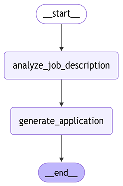
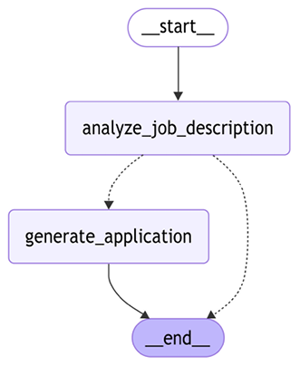
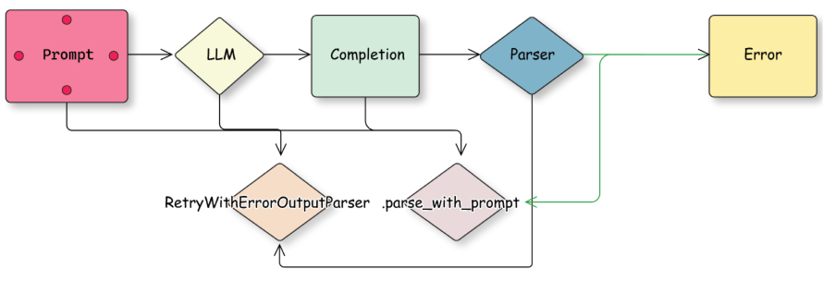
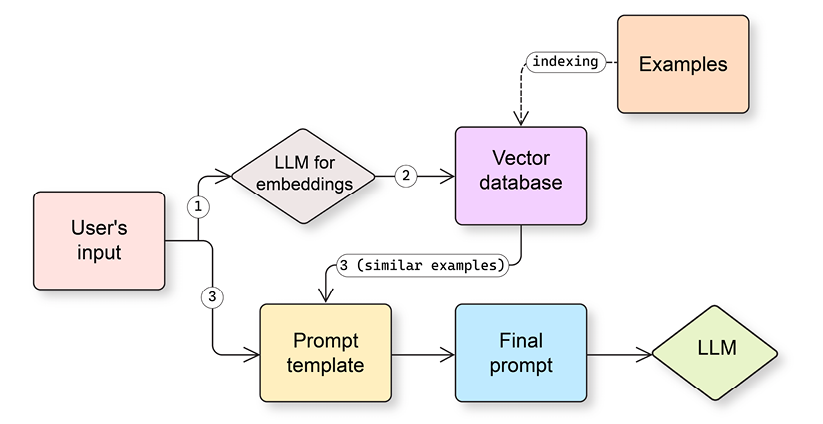

# Building Workflows with LangGraph

So far, we've learned about LLMs, LangChain as a framework, and how to use LLMs with LangChain in a vanilla mode (just asking to generate a text output based on a prompt). In this chapter, we'll start with a quick introduction to LangGraph as a framework and how to develop more complex workflows with LangChain and LangGraph by chaining together multiple steps. As an example, we'll discuss parsing LLM outputs and look into error handling patterns with LangChain and LangGraph. Then, we'll continue with more advanced ways to develop prompts and explore what building blocks LangChain offers for few-shot prompting and other techniques.

We're also going to cover working with multimodal inputs, utilizing the long context, and adjusting your workloads to overcome limitations related to the context window size. Finally, we'll look into the basic mechanisms of managing memory with LangChain. Understanding these fundamental and key techniques will help us read LangGraph code, understand tutorials and code samples, and develop our own complex workflows. We'll, of course, discuss what LangGraph workflows are and will continue building on that skill in _Chapters 5_ and _6_.

In a nutshell, we'll cover the following main topics in this chapter:

- LangGraph fundamentals
- Prompt engineering
- Working with short context windows
- Understanding memory mechanisms

> As always, you can find all the code samples on our public GitHub repository as Jupyter notebooks: [https://github.com/benman1/generative_ai_with_langchain/tree/second_edition/chapter3](https://github.com/benman1/generative_ai_with_langchain/tree/second_edition/chapter3).

## LangGraph fundamentals

LangGraph is a framework developed by LangChain (as a company) that helps control and orchestrate workflows. Why do we need another orchestration framework? Let's park this question until [Chapter 5](Chapter_5.xhtml#_idTextAnchor111), where we'll touch on agents and agentic workflows, but for now, let us mention the flexibility of LangGraph as an orchestration framework and its robustness in handling complex scenarios.

Unlike many other frameworks, LangGraph allows cycles (most other orchestration frameworks operate only with directly acyclic graphs), supports streaming out of the box, and has many pre-built loops and components dedicated to generative AI applications (for example, human moderation). LangGraph also has a very rich API that allows you to have very granular control of your execution flow if needed. This is not fully covered in our book, but just keep in mind that you can always use a more low-level API if you need to.

> A **Directed Acyclic Graph (DAG)** is a special type of graph in graph theory and computer science. Its edges (connections between nodes) have a direction, which means that the connection from node A to node B is different from the connection from node B to node A. It has no cycles. In other words, there is no path that starts at a node and returns to the same node by following the directed edges.
>
> DAGs are often used as a model of workflows in data engineering, where nodes are tasks and edges are dependencies between these tasks. For example, an edge from node A to node B means that we need output from node A to execute node B.

For now, let's start with the basics. If you're new to this framework, we would also highly recommend a free online course on LangGraph that is available at [https://academy.langchain.com/](https://academy.langchain.com/) to deepen your understanding.

### State management

State management is crucial in real-world AI applications. For example, in a customer service chatbot, the state might track information such as customer ID, conversation history, and outstanding issues. LangGraph's state management lets you maintain this context across a complex workflow of multiple AI components.

LangGraph allows you to develop and execute complex workflows called **graphs**. We will use the words _graph_ and _workflow_ interchangeably in this chapter. A graph consists of nodes and edges between them. Nodes are components of your workflow, and a workflow has a _state_. What is it? Firstly, a state makes your nodes aware of the current context by keeping track of the user input and previous computations. Secondly, a state allows you to persist your workflow execution at any point in time. Thirdly, a state makes your workflow truly interactive since a node can change the workflow's behavior by updating the state. For simplicity, think about a state as a Python dictionary. Nodes are Python functions that operate on this dictionary. They take a dictionary as input and return another dictionary that contains keys and values to be updated in the state of the workflow.

Let's understand that with a simple example. First, we need to define a state's schema:

```python
from typing_extensions import TypedDict
class JobApplicationState(TypedDict):
   job_description: str
   is_suitable: bool
   application: str
```

A `TypedDict` is a Python type constructor that allows to define dictionaries with a predefined set of keys and each key can have its own type (as opposed to a `Dict[str, str]` construction).

> LangGraph state's schema shouldn't necessarily be defined as a `TypedDict`; you can use data classes or Pydantic models too.

After we have defined a schema for a state, we can define our first simple workflow:

```python
from langgraph.graph import StateGraph, START, END, Graph
def analyze_job_description(state):
   print("...Analyzing a provided job description ...")
   return {"is_suitable": len(state["job_description"]) > 100}
def generate_application(state):
   print("...generating application...")
   return {"application": "some_fake_application"}

builder = StateGraph(JobApplicationState)
builder.add_node("analyze_job_description", analyze_job_description)
builder.add_node("generate_application", generate_application)
builder.add_edge(START, "analyze_job_description")
builder.add_edge("analyze_job_description", "generate_application")
builder.add_edge("generate_application", END)
graph = builder.compile()
```

Here, we defined two Python functions that are components of our workflow. Then, we defined our workflow by providing a state's schema, adding nodes and edges between them. `add_node` is a convenient way to add a component to your graph (by providing its name and a corresponding Python function), and you can reference this name later when you define edges with `add_edge`. `START` and `END` are reserved built-in nodes that define the beginning and end of the workflow accordingly.

Let's take a look at our workflow by using a built-in visualization mechanism:

```python
from IPython.display import Image, display
display(Image(graph.get_graph().draw_mermaid_png()))
```



Our function accesses the state by simply reading from the dictionary that LangGraph automatically provides as input. LangGraph isolates state updates. When a node receives the state, it gets an immutable copy, not a reference to the actual state object. The node must return a dictionary containing the specific keys and values it wants to update. LangGraph then handles merging these updates into the master state. This pattern prevents side effects and ensures that state changes are explicit and traceable.

The only way for a node to modify a state is to provide an output dictionary with key-value pairs to be updated, and LangGraph will handle it. A node should modify at least one key in the state. A `graph` instance itself is a `Runnable` (to be precise, it inherits from `Runnable`) and we can execute it. We should provide a dictionary with the initial state, and we'll get the final state as an output:

```python
res = graph.invoke({"job_description":"fake_jd"})
```

```
print(res)
>>...Analyzing a provided job description ...
...generating application...
{'job_description': 'fake_jd', 'is_suitable': True, 'application': 'some_fake_application'}
```

We used a very simple graph as an example. With your real workflows, you can define parallel steps (for example, you can easily connect one node with multiple nodes) and even cycles. LangGraph executes the workflow in so-called _supersteps_ that can call multiple nodes at the same time (and then merge state updates from these nodes). You can control the depth of recursion and amount of overall supersteps in the graph, which helps you avoid cycles running forever, especially because the LLMs output is non-deterministic.

> A **superstep** on LangGraph represents a discrete iteration over one or a few nodes, and it's inspired by Pregel, a system built by Google for processing large graphs at scale. It handles parallel execution of nodes and updates sent to the central graph's state.

In our example, we used direct edges from one node to another. It makes our graph no different from a sequential chain that we could have defined with LangChain. One of the key LangGraph features is the ability to create conditional edges that can direct the execution flow to one or another node depending on the current state. A conditional edge is a Python function that gets the current state as an input and returns a string with the node's name to be executed.

Let's look at an example:

```python
from typing import Literal
builder = StateGraph(JobApplicationState)
builder.add_node("analyze_job_description", analyze_job_description)
builder.add_node("generate_application", generate_application)
def is_suitable_condition(state: JobApplicationState) -> Literal["generate_application", END]:
   if state.get("is_suitable"):
       return "generate_application"
   return END
builder.add_edge(START, "analyze_job_description")
builder.add_conditional_edges("analyze_job_description", is_suitable_condition)
builder.add_edge("generate_application", END)
graph = builder.compile()
from IPython.display import Image, display
display(Image(graph.get_graph().draw_mermaid_png()))
```

We've defined an edge `is_suitable_condition` that takes a state and returns either an `END` or `generate_application` string by analyzing the current state. We used a `Literal` type hint since it's used by LangGraph to determine which destination nodes to connect the source node with when it's creating conditional edges. If you don't use a type hint, you can provide a list of destination nodes directly to the `add_conditional_edges` function; otherwise, LangGraph will connect the source node with all other nodes in the graph (since it doesn't analyze the code of an edge function itself when creating a graph). The following figure shows the output generated:



Conditional edges are visualized with dotted lines, and now we can see that, depending on the output of the `analyze_job_description` step, our graph can perform different actions.

### Reducers

So far, our nodes have changed the state by updating the value for a corresponding key. From another point of view, at each superstep, LangGraph can produce a new value for a given key. In other words, for every key in the state, there's a sequence of values, and from a functional programming perspective, a `reduce` function can be applied to this sequence. The default reducer on LangGraph always replaces the final value with the new value. Let's imagine we want to track custom actions (produced by nodes) and compare three options.

With the first option, a node should return a list as a value for the key `actions`. We provide short code samples just for illustration purposes, but you can find full ones on Github. If such a value already exists in the state, it will be replaced with the new one:

```python
class JobApplicationState(TypedDict):
   ...
   actions: list[str]
```

Another option is to use the default `add` method with the `Annotated` type hint. By using this type hint, we tell the LangGraph compiler that the type of our variable in the state is a list of strings, and it should use the `add` method to concatenate two lists (if the value already exists in the state and a node produces a new one):

```python
from typing import Annotated, Optional
from operator import add
class JobApplicationState(TypedDict):
   ...
   actions: Annotated[list[str], add]
```

The last option is to write your own custom reducer. In this example, we write a custom reducer that accepts not only a list from the node (as a new value) but also a single string that would be converted to a list:

```python
from typing import Annotated, Optional, Union
def my_reducer(left: list[str], right: Optional[Union[str, list[str]]]) -> list[str]:
  if right:
    return left + [right] if isinstance(right, str) else left + right
  return left
class JobApplicationState(TypedDict):
   ...
   actions: Annotated[list[str], my_reducer]
```

LangGraph has a few built-in reducers, and we'll also demonstrate how you can implement your own. One of the important ones is `add_messages`, which allows us to merge messages. Many of your nodes would be LLM agents, and LLMs typically work with messages. Therefore, according to the conversational programming paradigm we'll talk about in more detail in _Chapters 5_ and _6_, you typically need to keep track of these messages:

```python
from langchain_core.messages import AnyMessage
from langgraph.graph.message import add_messages
class JobApplicationState(TypedDict):
  ...
  messages: Annotated[list[AnyMessage], add_messages]
```

Since this is such an important reducer, there's a built-in state that you can inherit from:

```python
from langgraph.graph import MessagesState
class JobApplicationState(MessagesState):
  ...
```

Now, as we have discussed reducers, let's talk about another important concept for any developer – how to write reusable and modular workflows by passing configurations to them.

### Making graphs configurable

LangGraph provides a powerful API that allows you to make your graph configurable. It allows you to separate parameters from user input – for example, to experiment between different LLM providers or pass custom callbacks. A node can also access the configuration by accepting it as a second argument. The configuration will be passed as an instance of `RunnableConfig.`

`RunnableConfig` is a typed dictionary that gives you control over execution control settings. For example, you can control the maximum number of supersteps with the `recursion_limit `parameter. `RunnableConfig` also allows you to pass custom parameters as a separate dictionary under a `configurable` key.

Let's allow our node to use different LLMs during application generation:

```python
from langchain_core.runnables.config import RunnableConfig
def generate_application(state: JobApplicationState, config: RunnableConfig):
   model_provider = config["configurable"].get("model_provider", "Google")
    model_name = config["configurable"].get("model_name", "gemini-2.0-flash-lite")
    print(f"...generating application with {model_provider} and {model_name} ...")
    return {"application": "some_fake_application", "actions": ["action2", "action3"]}
```

Let's now compile and execute our graph with a custom configuration (if you don't provide any, LangGraph will use the default one):

```python
res = graph.invoke({"job_description":"fake_jd"}, config={"configurable": {"model_provider": "OpenAI", "model_name": "gpt-4o"}})
print(res)
```

```
>> ...Analyzing a provided job description ...
...generating application with OpenAI and OpenAI ...
{'job_description': 'fake_jd', 'is_suitable': True, 'application': 'some_fake_application', 'actions': ['action1', 'action2', 'action3']}
```

Now that we've established how to structure complex workflows with LangGraph, let's look at a common challenge these workflows face: ensuring LLM outputs follow the exact structure needed by downstream components. Robust output parsing and graceful error handling are essential for reliable AI pipelines.

### Controlled output generation

When you develop complex workflows, one of the common tasks you need to solve is to force an LLM to generate an output that follows a certain structure. This is called a controlled generation. This way, it can be consumed programmatically by the next steps further down the workflow. For example, we can ask the LLM to generate JSON or XML for an API call, extract certain attributes from a text, or generate a CSV table. There are multiple ways to achieve this, and we'll start exploring them in this chapter and continue in [Chapter 5](Chapter_5.xhtml#_idTextAnchor111). Since an LLM might not always follow the exact output structure, the next step might fail, and you'll need to recover from the error. Hence, we'll also begin discussing error handling in this section.

#### Output parsing

Output parsing is essential when integrating LLMs into larger workflows, where subsequent steps require structured data rather than natural language responses. One way to do that is to add corresponding instructions to the prompt and parse the output.

Let's see a simple task. We'd like to classify whether a certain job description is suitable for a junior Java programmer as a step of our pipeline and, based on the LLM's decision, we'd like to either continue with an application or ignore this specific job description. We can start with a simple prompt:

```python
from langchain_google_vertexai import ChatVertexAI
llm = ChatVertexAI(model="gemini-2.0-flash-lite")
job_description: str = ...  # put your JD here
prompt_template = (
   "Given a job description, decide whether it suits a junior Java developer."
   "\nJOB DESCRIPTION:\n{job_description}\n"
)
result = llm.invoke(prompt_template.format(job_description=job_description))
print(result.content)
```

```
>> No, this job description is not suitable for a junior Java developer.\n\nThe key reasons are:\n\n* … (output reduced)
```

As you can see, the output of the LLM is free text, which might be difficult to parse or interpret in subsequent pipeline steps. What if we add a specific instruction to a prompt?

```python
prompt_template_enum = (
   "Given a job description, decide whether it suits a junior Java developer."
   "\nJOB DESCRIPTION:\n{job_description}\n\nAnswer only YES or NO."
)
result = llm.invoke(prompt_template_enum.format(job_description=job_description))
print(result.content)
```

```
>> NO
```

Now, how can we parse this output? Of course, our next step can be to just look at the text and have a condition based on a string comparison. But that won't work for more complex use cases – for example, if the next step expects the output to be a JSON object. To deal with that, LangChain offers plenty of OutputParsers that take the output generated by the LLM and try to parse it into a desired format (by checking a schema if needed) – a list, CSV, enum, pandas DatafFrame, Pydantic model, JSON, XML, and so on. Each parser implements a `BaseGenerationOutputParser` interface, which extends the `Runnable` interface with an additional `parse_result` method.

Let's build a parser that parses an output into an enum:

```python
from enum import Enum
from langchain.output_parsers import EnumOutputParser
from langchain_core.messages import HumanMessage
class IsSuitableJobEnum(Enum):
   YES = "YES"
   NO = "NO"
parser = EnumOutputParser(enum=IsSuitableJobEnum)
assert parser.invoke("NO") == IsSuitableJobEnum.NO
assert parser.invoke("YES\n") == IsSuitableJobEnum.YES
assert parser.invoke(" YES \n") == IsSuitableJobEnum.YES
assert parser.invoke(HumanMessage(content="YES")) == IsSuitableJobEnum.YES
```

The `EnumOutputParser` converts text output into a corresponding `Enum` instance. Note that the parser handles any generation-like output (not only strings), and it actually also strips the output.

> You can find a full list of parsers in the documentation at [https://python.langchain.com/docs/concepts/output_parsers/](https://python.langchain.com/docs/concepts/output_parsers/), and if you need your own parser, you can always build a new one!

As a final step, let's combine everything into a chain:

```python
chain = llm | parser
result = chain.invoke(prompt_template_enum.format(job_description=job_description))
print(result)
```

```
>> NO
```

Now let's make this chain part of our LangGraph workflow:

```python
class JobApplicationState(TypedDict):
   job_description: str
   is_suitable: IsSuitableJobEnum
   application: str
analyze_chain = llm | parser
def analyze_job_description(state):
   prompt = prompt_template_enum.format(job_description=state["job_description"])
   result = analyze_chain.invoke(prompt)
   return {"is_suitable": result}
def is_suitable_condition(state: JobApplicationState):
   return state["is_suitable"] == IsSuitableJobEnum.YES
builder = StateGraph(JobApplicationState)
builder.add_node("analyze_job_description", analyze_job_description)
builder.add_node("generate_application", generate_application)
builder.add_edge(START, "analyze_job_description")
builder.add_conditional_edges(
   "analyze_job_description", is_suitable_condition,
    {True: "generate_application", False: END})
builder.add_edge("generate_application", END)
```

We made two important changes. First, our newly built chain is now part of a Python function that represents the `analyze_job_description` node, and that's how we implement the logic within the node. Second, our conditional edge function doesn't return a string anymore, but we added a mapping of returned values to destination edges to the `add_conditional_edges` function, and that's an example of how you could implement a branching of your workflow.

Let's take some time to discuss how to handle potential errors if our parsing fails!

#### Error handling

Effective error management is essential in any LangChain workflow, including when handling tool failures (which we'll explore in [Chapter 5](Chapter_5.xhtml#_idTextAnchor111) when we get to tools). When developing LangChain applications, remember that failures can occur at any stage:

- API calls to foundation models may fail
- LLMs might generate unexpected outputs
- External services could become unavailable

One of the possible approaches would be to use a basic Python mechanism for catching exceptions, logging them for further analysis, and continuing your workflow either by wrapping an exception as a text or by returning a default value. If your LangChain chain calls some custom Python function, think about appropriate exception handling. The same goes for your LangGraph nodes.

Logging is essential, especially as you approach production deployment. Proper logging ensures that exceptions don't go unnoticed, allowing you to monitor their occurrence. Modern observability tools provide alerting mechanisms that group similar errors and notify you about frequently occurring issues.

Converting exceptions to text enables your workflow to continue execution while providing downstream LLMs with valuable context about what went wrong and potential recovery paths. Here is a simple example of how you can log the exception but continue executing your workflow by sticking to the default behavior:

```python
import logging
logger = logging.getLogger(__name__)
llms = {
   "fake": fake_llm,
   "Google": llm
}
def analyze_job_description(state, config: RunnableConfig):
   try:
     llm = config["configurable"].get("model_provider", "Google")
      llm = llms[model_provider]
      analyze_chain = llm | parser
      prompt = prompt_template_enum.format(job_description=job_description)
      result = analyze_chain.invoke(prompt)
      return {"is_suitable": result}
    except Exception as e:
      logger.error(f"Exception {e} occurred while executing analyze_job_description")
      return {"is_suitable": False}
```

To test our error handling, we need to simulate LLM failures. LangChain has a few `FakeChatModel` classes that help you to test your chain:

- `GenericFakeChatModel` returns messages based on a provided iterator
- `FakeChatModel` always returns a `"fake_response"` string
- `FakeListChatModel` takes a list of messages and returns them one by one on each invocation

Let's create a fake LLM that fails every second time:

```python
from langchain_core.language_models import GenericFakeChatModel
from langchain_core.messages import AIMessage
class MessagesIterator:
   def __init__(self):
       self._count = 0
   def __iter__(self):
       return self
   def __next__(self):
       self._count += 1
       if self._count % 2 == 1:
           raise ValueError("Something went wrong")
       return AIMessage(content="False")
fake_llm = GenericFakeChatModel(messages=MessagesIterator())
```

When we provide this to our graph (the full code sample is available in our GitHub repo), we can see that the workflow continues despite encountering an exception:

```python
res = graph.invoke({"job_description":"fake_jd"}, config={"configurable": {"model_provider": "fake"}})
print(res)
```

```
>> ERROR:__main__:Exception Expected a Runnable, callable or dict.Instead got an unsupported type: <class 'str'> occured while executing analyze_job_description
{'job_description': 'fake_jd', 'is_suitable': False}
```

When an error occurs, sometimes it helps to try again. LLMs have a non-deterministic nature, and the next attempt might be successful; also, if you're using third-party APIs, various failures might happen on the provider's side. Let's discuss how to implement proper retries with LangGraph.

##### Retries

There are three distinct retry approaches, each suited to different scenarios:

- Generic retry with Runnable
- Node-specific retry policies
- Semantic output repair

Let's look at these in turn, starting with generic retries that are available for every `Runnable.`

You can retry any `Runnable` or LangGraph node using a built-in mechanism:

```python
fake_llm_retry = fake_llm.with_retry(
   retry_if_exception_type=(ValueError,),
   wait_exponential_jitter=True,
   stop_after_attempt=2,
)
analyze_chain_fake_retries = fake_llm_retry | parser
```

With LangGraph, you can also describe specific retries for every node. For example, let's retry our `analyze_job_description` node two times in case of a `ValueError`:

```python
from langgraph.pregel import RetryPolicy
builder.add_node(
  "analyze_job_description", analyze_job_description,
  retry=RetryPolicy(retry_on=ValueError, max_attempts=2))
```

The components you're using, often known as building blocks, might have their own retry mechanism that tries to algorithmically fix the problem by giving an LLM additional input on what went wrong. For example, many chat models on LangChain have client-side retries on specific server-side errors.

ChatAnthropic has a `max_retries` parameter that you can define either per instance or per request. Another good example of a more advanced building block is trying to recover from a parsing error. Retrying a parsing step won't help since typically parsing errors are related to the incomplete LLM output. What if we retry the generation step and hope for the best, or actually give LLM a hint about what went wrong? That's exactly what a `RetryWithErrorOutputParser` is doing.



In order to use `RetryWithErrorOutputParser`, we need to first initialize it with an LLM (used to fix the output) and our parser. Then, if our parsing fails, we run it and provide our initial prompt (with all substituted parameters), generated response, and parsing error:

```python
from langchain.output_parsers import RetryWithErrorOutputParser
fix_parser = RetryWithErrorOutputParser.from_llm(
  llm=llm, # provide llm here
  parser=parser, # your original parser that failed
  prompt=retry_prompt, # an optional parameter, you can redefine the default prompt
)
fixed_output = fix_parser.parse_with_prompt(
  completion=original_response, prompt_value=original_prompt)
```

We can read the source code on GitHub to better understand what's going on, but in essence, that's an example of a pseudo-code without too many details. We illustrate how we can pass the parsing error and the original output that led to this error back to an LLM and ask it to fix the problem:

```python
prompt = """
Prompt: {prompt} Completion: {completion} Above, the Completion did not satisfy the constraints given in the Prompt. Details: {error} Please try again:
"""
retry_chain = prompt | llm | StrOutputParser()
# try to parse a completion with a provided parser
parser.parse(completion)
# if it fails, catch an error and try to recover max_retries attempts
completion = retry_chain.invoke(original_prompt, completion, error)
```

We introduced the `StrOutputParser` in [Chapter 2](Chapter_2.xhtml#_idTextAnchor025) to convert the output of the ChatModel from an AIMessage to a string so that we can easily pass it to the next step in the chain.

Another thing to keep in mind is that LangChain building blocks allow you to redefine parameters, including default prompts. You can always check them on Github; sometimes it's a good idea to customize default prompts for your workflows.

> You can read about other available output-fixing parsers here: [https://python.langchain.com/docs/how_to/output_parser_retry/](https://python.langchain.com/docs/how_to/output_parser_retry/).

##### Fallbacks

In software development, a **fallback** is an alternative program that allows you to recover if your base one fails. LangChain allows you to define fallbacks on a `Runnable` level. If execution fails, an alternative chain is triggered with the same input parameters. For example, if the LLM you're using is not available for a short period of time, your chain will automatically switch to a different one that uses an alternative provider (and probably different prompts).

Our fake model fails every second time, so let's add a fallback to it. It's just a lambda that prints a statement. As we can see, every second time, the fallback is executed:

```python
from langchain_core.runnables import RunnableLambda
chain_fallback = RunnableLambda(lambda _: print("running fallback"))
chain = fake_llm | RunnableLambda(lambda _: print("running main chain"))
chain_with_fb = chain.with_fallbacks([chain_fallback])
chain_with_fb.invoke("test")
chain_with_fb.invoke("test")
```

```
>> running fallback
running main chain
```

Generating complex outcomes that can follow a certain template and can be parsed reliably is called structured generation (or controlled generation). This can help to build more complex workflows, where an output of one LLM-driven step can be consumed by another programmatic step. We'll pick this up again in more detail in _Chapters 5_ and _6_.

Prompts that you send to an LLM are one of the most important building blocks of your workflows. Hence, let's discuss some basics of prompt engineering next and see how to organize your prompts with LangChain.

## Prompt engineering

Let's continue by looking into prompt engineering and exploring various LangChain syntaxes related to it. But first, let's discuss how prompt engineering is different from prompt design. These terms are sometimes used interchangeably, and it creates a certain level of confusion. As we discussed in [Chapter 1](Chapter_1.xhtml#_idTextAnchor000), one of the big discoveries about LLMs was that they have the capability of domain adaptation by _in-context learning_. It's often enough to describe the task we'd like it to perform in a natural language, and even though the LLM wasn't trained on this specific task, it performs extremely well. But as we can imagine, there are multiple ways of describing the same task, and LLMs are sensitive to this. Improving our prompt (or prompt template, to be specific) to increase performance on a specific task is called prompt engineering. However, developing more universal prompts that guide LLMs to generate generally better responses on a broad set of tasks is called prompt design.

There exists a large variety of different prompt engineering techniques. We won't discuss many of them in detail in this section, but we'll touch on just a few of them to illustrate key LangChain capabilities that would allow you to construct any prompts you want.

> You can find a good overview of prompt taxonomy in the paper _The Prompt Report: A Systematic Survey of Prompt Engineering Techniques_, published by Sander Schulhoff and colleagues: [https://arxiv.org/abs/2406.06608](https://arxiv.org/abs/2406.06608).

### Prompt templates

What we did in [Chapter 2](Chapter_2.xhtml#_idTextAnchor025) is called _zero-shot prompting_. We created a prompt template that contained a description of each task. When we run the workflow, we substitute certain values of this prompt template with runtime arguments. LangChain has some very useful abstractions to help with that.

In [Chapter 2](Chapter_2.xhtml#_idTextAnchor025), we introduced `PromptTemplate`, which is a `RunnableSerializable`. Remember that it substitutes a string template during invocation – for example, you can create a template based on f-string and add your chain, and LangChain would pass parameters from the input, substitute them in the template, and pass the string to the next step in the chain:

```python
from langchain_core.output_parsers import StrOutputParser
lc_prompt_template = PromptTemplate.from_template(prompt_template)
chain = lc_prompt_template | llm | StrOutputParser()
chain.invoke({"job_description": job_description})
```

For chat models, an input can not only be a string but also a list of `messages` – for example, a system message followed by a history of the conversation. Therefore, we can also create a template that prepares a list of messages, and a template itself can be created based on a list of messages or message templates, as in this example:

```python
from langchain_core.prompts import ChatPromptTemplate, HumanMessagePromptTemplate
from langchain_core.messages import SystemMessage, HumanMessage
msg_template = HumanMessagePromptTemplate.from_template(
  prompt_template)
msg_example = msg_template.format(job_description="fake_jd")
chat_prompt_template = ChatPromptTemplate.from_messages([
  SystemMessage(content="You are a helpful assistant."),
  msg_template])
chain = chat_prompt_template | llm | StrOutputParser()
chain.invoke({"job_description": job_description})
```

You can also do the same more conveniently without using chat prompt templates but by submitting a tuple (just because it's faster and more convenient sometimes) with a type of message and a templated string instead:

```python
chat_prompt_template = ChatPromptTemplate.from_messages(
   [("system", "You are a helpful assistant."),
    ("human", prompt_template)])
```

Another important concept is a _placeholder_. This substitutes a variable with a list of messages provided in real time. You can add a placeholder to your prompt by using a `placeholder` hint, or adding a `MessagesPlaceholder`:

```python
from langchain_core.prompts import ChatPromptTemplate, MessagesPlaceholder
chat_prompt_template = ChatPromptTemplate.from_messages(
   [("system", "You are a helpful assistant."),
    ("placeholder", "{history}"),
    # same as MessagesPlaceholder("history"),
    ("human", prompt_template)])
len(chat_prompt_template.invoke({"job_description": "fake", "history": [("human", "hi!"), ("ai", "hi!")]}).messages)
```

```
>> 4
```

Now our input consists of four messages – a system message, two history messages that we provided, and one human message from a templated prompt. The best example of using a placeholder is to input a history of a chat, but we'll see more advanced ones later in this book when we'll talk about how an LLM interacts with an external world or how different LLMs coordinate together in a multi-agent setup.

### Zero-shot vs. few-shot prompting

As we have discussed, the first thing that we want to experiment with is improving the task description itself. A description of a task without examples of solutions is called **zero-shot** prompting, and there are multiple tricks that you can try.

What typically works well is assigning the LLM a certain role (for example, "_You are a useful enterprise assistant working for XXX Fortune-500 company_") and giving some additional instruction (for example, whether the LLM should be creative, concise, or factual). Remember that LLMs have seen various data and they can do different tasks, from writing a fantasy book to answering complex reasoning questions. But your goal is to instruct them, and if you want them to stick to the facts, you'd better give very specific instructions as part of their role profile. For chat models, such role setting typically happens through a system message (but remember that, even for a chat model, everything is combined to a single input prompt formatted on the server side).

The Gemini prompting guide recommends that each prompt should have four parts: a persona, a task, a relevant context, and a desired format. Keep in mind that different model providers might have different recommendations on prompt writing or formatting, hence if you have complex prompts, always check the documentation of the model provider, evaluate the performance of your workflows before switching to a new model provider, and adjust prompts accordingly if needed. If you want to use multiple model providers in production, you might end up with multiple prompt templates and select them dynamically based on the model provider.

Another big improvement can be to provide an LLM with a few examples of this specific task as input-output pairs as part of the prompt. This is called few-shot prompting. Typically, few-shot prompting is difficult to use in scenarios that require a long input (such as RAG, which we'll talk about in the next chapter) but it's still very useful for tasks with relatively short prompts, such as classification, extraction, etc.

Of course, you can always hard-code examples in the prompt template itself, but this makes it difficult to manage them as your system grows. A better way might be to store examples in a separate file on disk or in a database and load them into your prompt.

#### Chaining prompts together

As your prompts become more advanced, they tend to grow in size and complexity. One common scenario is to partially format your prompts, and you can do this either by string or function substitution. The latter is relevant if some parts of your prompt depend on dynamically changing variables (for example, current date, user name, etc.). Below, you can find an example of a partial substitution in a prompt template:

```python
system_template = PromptTemplate.from_template("a: {a} b: {b}")
system_template_part = system_template.partial(
   a="a" # you also can provide a function here
)
print(system_template_part.invoke({"b": "b"}).text)
```

```
>> a: a b: b
```

Another way to make your prompts more manageable is to split them into pieces and chain them together:

```python
system_template_part1 = PromptTemplate.from_template("a: {a}")
system_template_part2 = PromptTemplate.from_template("b: {b}")
system_template = system_template_part1 + system_template_part2
print(system_template_part.invoke({"a": "a", "b": "b"}).text)
```

```
>> a: a b: b
```

You can also build more complex substitutions by using the class `langchain_core.prompts.PipelinePromptTemplate`. Additionally, you can pass templates into a `ChatPromptTemplate` and they will automatically be composed together:

```python
system_prompt_template = PromptTemplate.from_template("a: {a} b: {b}")
chat_prompt_template = ChatPromptTemplate.from_messages(
   [("system", system_prompt_template.template),
    ("human", "hi"),
    ("ai", "{c}")])
messages = chat_prompt_template.invoke({"a": "a", "b": "b", "c": "c"}).messages
print(len(messages))
print(messages[0].content)
```

```
>> 3
a: a b: b
```

#### Dynamic few-shot prompting

As the number of examples used in your few-shot prompts continues to grow, you might limit the number of examples to be passed into a specific prompt's template substitution. We select examples for every input – by searching for examples similar to the user's input (we'll talk more about semantic similarity and embeddings in [Chapter 4](Chapter_4.xhtml#_idTextAnchor068)), limiting them by length, taking the freshest ones, etc.



There are a few already built-in selectors under `langchain_core.example_selectors`. You can directly pass an instance of an example selector to the `FewShotPromptTemplate` instance during instantiation.

### Chain of Thought

The Google Research team introduced the **Chain-of-Thought** (**CoT**) technique early in 2022. They demonstrated that a relatively simple modification to a prompt that encouraged a model to generate intermediate step-by-step reasoning steps significantly increased the LLM's performance on complex symbolic reasoning, common sense, and math tasks. Such an increase in performance has been replicated multiple times since then.

> You can read the original paper introducing CoT, _Chain-of-Thought Prompting Elicits Reasoning in Large Language Models_, published by Jason Wei and colleagues: [https://arxiv.org/abs/2201.11903](https://arxiv.org/abs/2201.11903).

There are different modifications of CoT prompting, and because it has long outputs, typically, CoT prompts are zero-shot. You add instructions that encourage an LLM to think about the problem first instead of immediately generating tokens representing the answer. A very simple example of CoT is just to add to your prompt template something like "Let's think step by step."

There are various CoT prompts reported in different papers. You can also explore the CoT template available on LangSmith. For our learning purposes, let's use a CoT prompt with few-shot examples:

```python
from langchain import hub
math_cot_prompt = hub.pull("arietem/math_cot")
cot_chain = math_cot_prompt | llm | StrOutputParser()
print(cot_chain.invoke("Solve equation 2*x+5=15"))
```

```
>> Answer: Let's think step by step
Subtract 5 from both sides:
2x + 5 - 5 = 15 - 5
2x = 10
Divide both sides by 2:
2x / 2 = 10 / 2
x = 5
```

We used a prompt from LangSmith Hub – a collection of private and public artifacts that you can use with LangChain. You can explore the prompt itself here: [https://smith.langchain.com/hub.](https://smith.langchain.com/hub.).

In practice, you might want to wrap a CoT invocation with an extraction step to provide a concise answer to the user. For example, let us first run a `cot_chain` and then pass its output (please note that we pass a dictionary with an initial `question` and a `cot_output` to the next step) to an LLM that will use a prompt to create a final answer based on CoT reasoning:

```python
from operator import itemgetter
parse_prompt_template = (
   "Given the initial question and a full answer, "
   "extract the concise answer. Do not assume anything and "
   "only use a provided full answer.\n\nQUESTION:\n{question}\n"
   "FULL ANSWER:\n{full_answer}\n\nCONCISE ANSWER:\n"
)
parse_prompt = PromptTemplate.from_template(
   parse_prompt_template
)
final_chain = (
 { "full_answer": itemgetter("question") | cot_chain,
   "question": itemgetter("question"),
 }
 | parse_prompt
 | llm
 | StrOutputParser()
)
print(final_chain.invoke({"question": "Solve equation 2*x+5=15"}))
```

```
>> 5
```
