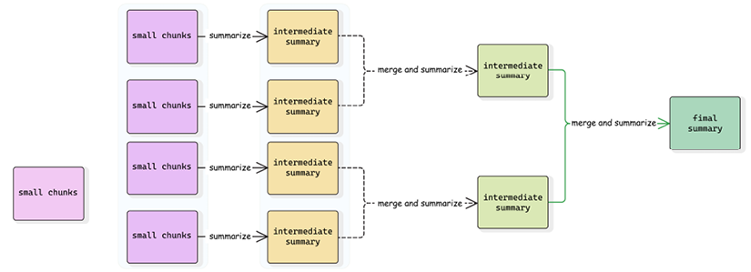

Meskipun prompt CoT (Chain of Thought) terlihat relatif sederhana, ia sangat kuat karena, seperti yang telah kami sebutkan, telah berulang kali ditunjukkan bahwa ia secara signifikan meningkatkan performa dalam banyak kasus. Kita akan melihat evolusi dan perluasannya ketika kita membahas agen di \_Bab 5\* dan _Bab 6_.

Saat ini, kita dapat mengamati bagaimana pola CoT semakin banyak diterapkan dengan model penalaran (reasoning models) seperti o3-mini atau gemini-flash-thinking. Pada tingkat tertentu, model-model ini melakukan hal yang persis sama (tetapi sering dengan cara yang lebih canggih) – mereka berpikir sebelum menjawab, dan ini dicapai tidak hanya dengan mengubah prompt tetapi juga dengan menyiapkan data pelatihan (kadang-kadang sintetis) yang mengikuti format CoT.

Perlu dicatat bahwa selain menggunakan model penalaran, kita dapat menggunakan modifikasi CoT dengan instruksi tambahan dengan meminta LLM untuk pertama kali menghasilkan token keluaran yang mewakili proses penalaran:

```python
template = ChatPromptTemplate.from_messages([
    ("system", """Kamu adalah asisten pemecah masalah yang menunjukkan proses penalarannya. Pertama, jelaskan langkah demi langkah proses berpikirmu, beri label bagian ini sebagai 'BERPIKIR:'. Setelah menyelesaikan analisis, berikan jawaban akhir yang dilabeli sebagai 'JAWABAN:'."""),
    ("user", "{problem}")
])
```

### Konsistensi-diri (Self-consistency)

Ide di balik konsistensi-diri sederhana: mari kita naikkan suhu (temperature) LLM, ambil sampel jawaban beberapa kali, lalu ambil jawaban yang paling sering muncul dari distribusi. Hal ini telah ditunjukkan dapat meningkatkan performa alur kerja berbasis LLM pada tugas-tugas tertentu, dan bekerja sangat baik pada tugas seperti klasifikasi atau ekstraksi entitas, di mana dimensi keluaran rendah.

Mari gunakan rantai dari contoh sebelumnya dan coba persamaan kuadrat. Bahkan dengan prompting CoT, percobaan pertama mungkin memberi kita jawaban yang salah, tetapi jika kita mengambil sampel dari distribusi, kita akan lebih mungkin mendapatkan jawaban yang benar:

```python
generations = []
for _ in range(20):
 generations.append(final_chain.invoke({"question": "Selesaikan persamaan 2*x**2-96*x+1152"}, temperature=2.0).strip())
from collections import Counter
print(Counter(generations).most_common(1)[0][0])
```

```
>> x = 24
```

Seperti yang bisa kamu lihat, pertama kita buat daftar berisi beberapa keluaran yang dihasilkan oleh LLM untuk masukan yang sama, lalu kita buat kelas `Counter` yang memungkinkan kita dengan mudah menemukan elemen paling umum dalam daftar ini, dan kita mengambilnya sebagai jawaban akhir.

> **Beralih antar penyedia model (model providers)**
>
> Penyedia yang berbeda mungkin memiliki panduan yang sedikit berbeda tentang cara menyusun prompt kerja terbaik. Selalu periksa dokumentasi di sisi penyedia – misalnya, Anthropic menekankan pentingnya tag XML untuk menyusun prompt kamu. Model penalaran memiliki panduan prompting yang berbeda (misalnya, biasanya, kamu seharusnya tidak menggunakan CoT atau few-shot prompting dengan model seperti itu).
>
> Terakhir, jika kamu mengubah penyedia model, kami sangat menyarankan untuk menjalankan evaluasi dan memperkirakan kualitas aplikasi ujung-ke-ujung (end-to-end) kamu.

Sekarang setelah kita belajar bagaimana mengatur prompt dengan efisien dan menggunakan pendekatan rekayasa prompt yang berbeda dengan LangChain, mari kita bicara tentang apa yang bisa kita lakukan jika prompt menjadi terlalu panjang dan tidak muat di jendela konteks (context window) model.

## Bekerja dengan jendela konteks pendek

Jendela konteks 1 atau 2 juta token sepertinya cukup untuk hampir semua tugas yang bisa kita bayangkan. Dengan model multimodal (multimodal models), kamu bisa langsung bertanya kepada model tentang satu, dua, atau banyak PDF, gambar, atau bahkan video. Untuk memproses banyak dokumen (untuk ringkasan atau tanya jawab), kamu bisa menggunakan pendekatan yang dikenal sebagai pendekatan **stuff**. Pendekatan ini sederhana: gunakan template prompt untuk menggabungkan semua masukan menjadi satu prompt. Kemudian, kirimkan prompt gabungan ini ke LLM. Ini berfungsi dengan baik ketika konten gabungan muat dalam jendela konteks model kamu. Di bab selanjutnya, kita akan membahas cara lebih lanjut menggunakan data eksternal untuk meningkatkan respons model.

> Ingatlah bahwa, biasanya, PDF diperlakukan sebagai gambar oleh LLM multimodal.

Dibandingkan dengan panjang jendela konteks 4096 token masukan yang kita gunakan hanya 2 tahun lalu, jendela konteks saat ini 1 atau 2 juta token adalah kemajuan luar biasa. Tetapi masih relevan untuk membahas teknik mengatasi keterbatasan ukuran jendela konteks karena beberapa alasan:

- Tidak semua model memiliki jendela konteks panjang, terutama yang open-source atau yang disajikan di tepi (edge).
- Basis pengetahuan kita dan kompleksitas tugas yang kita tangani dengan LLM juga berkembang karena kita mungkin menghadapi keterbatasan bahkan dengan jendela konteks saat ini.
- Masukan yang lebih pendek juga membantu mengurangi biaya dan latensi.
- Masukan seperti audio atau video semakin banyak digunakan, dan ada batasan tambahan pada panjang masukan (ukuran total file PDF, panjang video atau audio, dll.).

Oleh karena itu, mari kita lihat lebih dekat apa yang bisa kita lakukan untuk bekerja dengan konteks yang lebih besar daripada jendela konteks yang dapat ditangani LLM – ringkasan (summarization) adalah contoh yang baik dari tugas seperti itu. Menangani konteks panjang mirip dengan Map‑Reduce klasik (teknik yang aktif dikembangkan pada tahun 2000-an untuk menangani komputasi pada kumpulan data besar secara terdistribusi dan paralel). Secara umum, kita memiliki dua fase:

- **Map**: Kita membagi konteks yang masuk menjadi potongan-potongan kecil dan menerapkan tugas yang sama ke setiap potongan secara paralel. Kita dapat mengulangi fase ini beberapa kali jika diperlukan.
- **Reduce**: Kita menggabungkan keluaran dari tugas-tugas sebelumnya.



### Merangkum video panjang

Mari kita bangun alur kerja LangGraph yang mengimplementasikan pendekatan Map‑Reduce di atas. Pertama, mari kita definisikan keadaan (state) graf yang melacak video yang dimaksud, ringkasan antara yang kita hasilkan selama fase langkah, dan ringkasan akhir:

```python
from langgraph.constants import Send
import operator
class AgentState(TypedDict):
   video_uri: str
   chunks: int
   interval_secs: int
   summaries: Annotated[list, operator.add]
   final_summary: str
class _ChunkState(TypedDict):
   video_uri: str
   start_offset: int
   interval_secs: int
```

Skema keadaan kita sekarang melacak semua argumen masukan (sehingga dapat diakses oleh berbagai simpul) dan hasil antara sehingga kita dapat meneruskannya antar simpul. Namun, pola Map‑Reduce menimbulkan tantangan lain: kita perlu menjadwalkan banyak tugas serupa yang memproses bagian berbeda dari video asli secara paralel. LangGraph menyediakan simpul khusus `Send` yang memungkinkan penjadwalan dinamis eksekusi pada simpul dengan keadaan tertentu. Untuk pendekatan ini, kita memerlukan skema keadaan tambahan bernama `_ChunkState` untuk mewakili langkah map. Perlu disebutkan bahwa urutan dijamin – hasil dikumpulkan (dengan kata lain, diterapkan ke keadaan utama) dengan urutan yang persis sama seperti simpul dijadwalkan.

Mari kita definisikan dua simpul:

- `summarize_video_chunk` untuk fase Map
- `_generate_final_summary` untuk fase Reduce

Simpul pertama beroperasi pada keadaan yang berbeda dari keadaan utama, tetapi keluarannya ditambahkan ke keadaan utama. Kita jalankan simpul ini beberapa kali dan keluaran digabungkan menjadi daftar dalam graf utama. Untuk menjadwalkan tugas-tugas map ini, kita akan membuat tepi bersyarat (conditional edge) yang menghubungkan `START` dan `_summarize_video_chunk` dengan tepi berdasarkan fungsi `_map_summaries`:

```python
human_part = {"type": "text", "text": "Berikan ringkasan video."}
async def _summarize_video_chunk(state:  _ChunkState):
   start_offset = state["start_offset"]
   interval_secs = state["interval_secs"]
   video_part = {
       "type": "media", "file_uri": state["video_uri"], "mime_type": "video/mp4",
       "video_metadata": {
           "start_offset": {"seconds": start_offset*interval_secs},
           "end_offset": {"seconds": (start_offset+1)*interval_secs}}
   }
   response = await llm.ainvoke(
       [HumanMessage(content=[human_part, video_part])])
   return {"summaries": [response.content]}
async def _generate_final_summary(state: AgentState):
   summary = _merge_summaries(
       summaries=state["summaries"], interval_secs=state["interval_secs"])
   final_summary = await (reduce_prompt | llm | StrOutputParser()).ainvoke({"summaries": summary})
   return {"final_summary": final_summary}
def _map_summaries(state: AgentState):
   chunks = state["chunks"]
   payloads = [
       {
           "video_uri": state["video_uri"],
           "interval_secs": state["interval_secs"],
           "start_offset": i
       } for i in range(state["chunks"])
   ]
   return [Send("summarize_video_chunk", payload) for payload in payloads]
```

Sekarang, mari kita satukan semuanya dan jalankan graf kita. Kita dapat meneruskan semua argumen ke pipa dengan cara sederhana:

```python
graph = StateGraph(AgentState)
graph.add_node("summarize_video_chunk", _summarize_video_chunk)
graph.add_node("generate_final_summary", _generate_final_summary)
graph.add_conditional_edges(START, _map_summaries, ["summarize_video_chunk"])
graph.add_edge("summarize_video_chunk", "generate_final_summary")
graph.add_edge("generate_final_summary", END)
app = graph.compile()
result = await app.ainvoke(
   {"video_uri": video_uri, "chunks": 5, "interval_secs": 600},
   {"max_concurrency": 3}
)["final_summary"]
```

Sekarang, setelah kita siap membangun alur kerja pertama dengan LangGraph, ada satu topik penting terakhir yang perlu dibahas. Bagaimana jika riwayat percakapan kamu menjadi terlalu panjang dan tidak muat di jendela konteks atau mulai mengalihkan perhatian LLM dari masukan terakhir? Mari kita bahas berbagai mekanisme memori (memory mechanisms) yang ditawarkan LangChain.

## Memahami mekanisme memori

Rantai LangChain dan kode apa pun yang kamu bungkus dengannya adalah tanpa keadaan (stateless). Saat kamu menerapkan aplikasi LangChain ke produksi, mereka juga harus dijaga tanpa keadaan untuk memungkinkan penskalaan horizontal (horizontal scaling) (lebih lanjut tentang ini di [Bab 9](Chapter_9.xhtml#_idTextAnchor186)). Di bagian ini, kita akan membahas bagaimana mengatur memori untuk melacak interaksi antara aplikasi AI generatif kamu dan pengguna tertentu.

### Memangkas riwayat obrolan (trimming chat history)

Setiap aplikasi obrolan harus menyimpan riwayat dialog. Dalam aplikasi prototipe, kamu dapat menyimpannya dalam variabel, meskipun ini tidak akan berfungsi untuk aplikasi produksi, yang akan kita tangani di bagian selanjutnya.

Riwayat obrolan pada dasarnya adalah daftar pesan, tetapi ada situasi di mana memangkas riwayat ini menjadi perlu. Meskipun ini adalah pola desain yang sangat penting ketika LLM memiliki jendela konteks terbatas, saat ini, tidak begitu relevan karena sebagian besar model (bahkan model open‑source kecil) sekarang mendukung 8192 token atau bahkan lebih. Namun demikian, memahami teknik pemangkasan tetap berharga untuk kasus penggunaan tertentu.

Ada lima cara untuk memangkas riwayat obrolan:

- **Buang pesan berdasarkan panjang** (seperti token atau jumlah pesan): Kamu hanya menyimpan pesan terbaru sehingga total panjangnya lebih pendek dari ambang batas. Fungsi LangChain khusus `from langchain_core.messages import trim_messages` memungkinkan kamu memangkas urutan pesan. Kamu dapat menyediakan fungsi atau instance LLM sebagai argumen `token_counter` ke fungsi ini (dan integrasi LLM yang sesuai harus mendukung metode `get_token_ids`; jika tidak, tokenizer default mungkin digunakan dan hasilnya mungkin berbeda dari jumlah token untuk penyedia LLM spesifik ini). Fungsi ini juga memungkinkan kamu menyesuaikan cara memangkas pesan – misalnya, apakah akan menjaga pesan sistem dan apakah pesan manusia harus selalu datang pertama karena banyak penyedia model mengharuskan bahwa obrolan selalu dimulai dengan pesan manusia (atau dengan pesan sistem). Dalam hal itu, kamu harus memangkas urutan asli `human, ai, human, ai` menjadi `human, ai` dan bukan `ai, human, ai` meskipun ketiga pesan tersebut muat dalam ambang batas jendela konteks.

- **Ringkas percakapan sebelumnya**: Pada setiap giliran, kamu dapat meringkas percakapan sebelumnya menjadi satu pesan yang kamu tambahkan di depan masukan pengguna berikutnya. LangChain menawarkan beberapa blok bangunan untuk implementasi memori berjalan (running memory) tetapi, per Maret 2025, cara yang direkomendasikan adalah membangun simpul peringkasan sendiri dengan LangGraph. Kamu dapat menemukan panduan terperinci di bagian dokumentasi LangChain: [https://langchain-ai.github.io/langgraph/how-tos/memory/add-summary-conversation-history/](https://langchain-ai.github.io/langgraph/how-tos/memory/add-summary-conversation-history/)).

Saat menerapkan peringkasan atau pemangkasan, pikirkan apakah kamu harus menyimpan kedua riwayat di basis data untuk debugging lebih lanjut, analitik, dll. Kamu mungkin ingin menyimpan riwayat memori pendek dari ringkasan terbaru dan pesan setelah ringkasan itu untuk aplikasi itu sendiri, dan kamu mungkin ingin melacak seluruh riwayat (semua pesan mentah dan semua ringkasan) untuk analisis lebih lanjut. Jika ya, rancang aplikasi kamu dengan hati‑hati. Misalnya, kamu mungkin tidak perlu memuat semua riwayat mentah dan pesan ringkasan; cukup simpan pesan baru ke basis data sambil melacak riwayat mentah.

- **Gabungkan pemangkasan dan peringkasan**: Alih‑alih sekadar membuang pesan lama yang membuat jendela konteks terlalu panjang, kamu dapat meringkas pesan‑pesan tersebut dan menambahkan riwayat yang tersisa di depan.

- **Ringkas pesan panjang menjadi pendek**: Kamu juga dapat meringkas pesan panjang. Ini mungkin sangat relevan untuk kasus penggunaan RAG (Retrieval‑Augmented Generation), yang akan kita bahas di bab berikutnya, ketika masukan kamu ke model mungkin mencakup banyak konteks tambahan yang ditambahkan di atas masukan pengguna yang sebenarnya.

- **Implementasikan logika pemangkasan sendiri**: Cara yang direkomendasikan adalah mengimplementasikan tokenizer sendiri yang dapat diteruskan ke fungsi `trim_messages` karena kamu dapat menggunakan kembali banyak logika yang sudah diurus oleh fungsi ini.

Tentu, pertanyaannya tetap adalah bagaimana kamu dapat mempertahankan riwayat obrolan. Mari kita periksa selanjutnya.

### Menyimpan riwayat ke basis data

Seperti disebutkan di atas, aplikasi yang diterapkan ke produksi tidak dapat menyimpan riwayat obrolan di memori lokal. Jika kode kamu berjalan di lebih dari satu mesin, tidak ada jaminan bahwa permintaan dari pengguna yang sama akan mencapai server yang sama pada giliran berikutnya. Tentu, kamu dapat menyimpan riwayat di frontend dan mengirimnya bolak‑balik setiap kali, tetapi itu juga membuat sesi tidak dapat dibagikan, meningkatkan ukuran permintaan, dll.

Berbagai penyedia basis data mungkin menawarkan implementasi yang mewarisi dari `langchain_core.chat_history.BaseChatMessageHistory`, yang memungkinkan kamu menyimpan dan mengambil riwayat obrolan dengan `session_id`. Jika kamu menyimpan riwayat ke variabel lokal saat membuat prototipe, kami merekomendasikan menggunakan `InMemoryChatMessageHistory` alih‑alih daftar agar nantinya dapat beralih ke integrasi dengan basis data.

Mari kita lihat contoh. Kita buat model obrolan palsu (fake chat model) dengan callback yang mencetak jumlah pesan masukan setiap kali dipanggil. Kemudian kita inisialisasi kamus yang menyimpan riwayat, dan kita buat fungsi terpisah yang mengembalikan riwayat berdasarkan `session_id`:

```python
from langchain_core.chat_history import InMemoryChatMessageHistory
from langchain_core.runnables.history import RunnableWithMessageHistory
from langchain_core.language_models import FakeListChatModel
from langchain.callbacks.base import BaseCallbackHandler
class PrintOutputCallback(BaseCallbackHandler):
   def on_chat_model_start(self, serialized, messages, **kwargs):
       print(f"Jumlah pesan masukan: {len(messages)}")
sessions = {}
handler = PrintOutputCallback()
llm = FakeListChatModel(responses=["ai1", "ai2", "ai3"])
def get_session_history(session_id: str):
   if session_id not in sessions:
       sessions[session_id] = InMemoryChatMessageHistory()
   return sessions[session_id]
```

Sekarang kita buat pemangkas (trimmer) yang menggunakan fungsi `len` dan ambang batas `1` – yaitu, ia selalu menghapus seluruh riwayat dan hanya menyimpan pesan sistem:

```python
trimmer = trim_messages(
   max_tokens=1,
   strategy="last",
   token_counter=len,
   include_system=True,
   start_on="human",
)
raw_chain = trimmer | llm
chain = RunnableWithMessageHistory(raw_chain, get_session_history)
```

Sekarang mari kita jalankan dan pastikan bahwa riwayat kita menyimpan semua interaksi dengan pengguna tetapi riwayat yang dipangkas diteruskan ke LLM:

```python
config = {"callbacks": [PrintOutputCallback()], "configurable": {"session_id": "1"}}
_ = chain.invoke(
   [HumanMessage("Hai!")],
   config=config,
)
print(f"Panjang riwayat: {len(sessions['1'].messages)}")
_ = chain.invoke(
   [HumanMessage("Apa kabar?")],
   config=config,
)
print(f"Panjang riwayat: {len(sessions['1'].messages)}")
```

```
>> Jumlah pesan masukan: 1
Panjang riwayat: 2
Jumlah pesan masukan: 1
Panjang riwayat: 4
```

Kami menggunakan `RunnableWithMessageHistory` yang mengambil rantai dan membungkusnya (seperti dekorator) dengan panggilan ke riwayat sebelum menjalankan rantai (untuk mengambil riwayat dan meneruskannya ke rantai) dan setelah menyelesaikan rantai (untuk menambahkan pesan baru ke riwayat).

Penyedia basis data mungkin memiliki integrasi mereka sebagai bagian dari paket `langchain_commuity` atau di luarnya – misalnya, di pustaka seperti `langchain_postgres` untuk basis data PostgreSQL mandiri atau `langchain-google-cloud-sql-pg` untuk yang dikelola.

> Kamu dapat menemukan daftar lengkap integrasi untuk menyimpan riwayat obrolan di halaman dokumentasi: [python.langchain.com/api_reference/community/chat_message_histories.html](python.langchain.com/api_reference/community/chat_message_histories.html).

Saat merancang aplikasi nyata, kamu harus berhati‑hati dalam mengelola akses ke sesi seseorang. Misalnya, jika kamu menggunakan `session_id` berurutan, pengguna mungkin dengan mudah mengakses sesi yang bukan milik mereka. Secara praktis, mungkin cukup menggunakan `uuid` (pengidentifikasi panjang yang dihasilkan secara unik) alih‑alih `session_id` berurutan, atau, tergantung pada persyaratan keamanan kamu, tambahkan validasi izin lain selama runtime.

### Checkpoint LangGraph

Checkpoint adalah cuplikan (snapshot) keadaan graf saat ini. Ia menyimpan semua informasi untuk melanjutkan menjalankan alur kerja dari saat cuplikan diambil – termasuk keadaan lengkap, metadata, simpul yang direncanakan untuk dieksekusi, dan tugas yang gagal. Ini adalah mekanisme yang berbeda dari menyimpan riwayat obrolan karena kamu dapat menyimpan alur kerja di titik waktu tertentu dan nanti memulihkan dari checkpoint untuk melanjutkan. Ini penting karena beberapa alasan:

- Checkpoint memungkinkan debugging mendalam dan "perjalanan waktu (time travel)."
- Checkpoint memungkinkan kamu bereksperimen dengan jalur berbeda di alur kerja kompleks tanpa perlu menjalankannya ulang setiap kali.
- Checkpoint memfasilitasi alur kerja manusia‑dalam‑lingkaran (human‑in‑the‑loop) dengan memungkinkan implementasi intervensi manusia pada titik tertentu dan melanjutkan lebih lanjut.
- Checkpoint membantu mengimplementasikan sistem siap produksi karena menambahkan tingkat ketekunan (persistence) dan toleransi kesalahan (fault tolerance) yang diperlukan.

Mari kita buat contoh sederhana dengan satu simpul yang mencetak jumlah pesan dalam keadaan dan mengembalikan `AIMessage` palsu. Kita gunakan `MessageGraph` bawaan yang mewakili keadaan hanya dengan daftar pesan, dan kita inisiasi `MemorySaver` yang akan menyimpan checkpoint di memori lokal dan meneruskannya ke graf selama kompilasi:

```python
from langgraph.graph import MessageGraph
from langgraph.checkpoint.memory import MemorySaver
def test_node(state):
   # abaikan pesan terakhir karena itu adalah masukan
   print(f"Panjang riwayat = {len(state[:-1])}")
   return [AIMessage(content="Halo!")]
builder = MessageGraph()
builder.add_node("test_node", test_node)
builder.add_edge(START, "test_node")
builder.add_edge("test_node", END)
memory = MemorySaver()
graph = builder.compile(checkpointer=memory)
```

Sekarang, setiap kali kita memanggil graf, kita harus memberikan checkpoint tertentu atau thread‑id (pengidentifikasi unik setiap jalankan). Kita panggil graf kita dua kali dengan nilai `thread‑id` berbeda, pastikan masing‑mulai dengan riwayat kosong, lalu periksa bahwa thread pertama memiliki riwayat saat kita memanggilnya untuk kedua kalinya:

```python
_ = graph.invoke([HumanMessage(content="test")],
  config={"configurable": {"thread_id": "thread-a"}})
_ = graph.invoke([HumanMessage(content="test")]
  config={"configurable": {"thread_id": "thread-b"}})
_ = graph.invoke([HumanMessage(content="test")]
  config={"configurable": {"thread_id": "thread-a"}})
```

```
>> Panjang riwayat = 0
Panjang riwayat = 0
Panjang riwayat = 2
```

Kita dapat memeriksa checkpoint untuk thread tertentu:

```python
checkpoints = list(memory.list(config={"configurable": {"thread_id": "thread-a"}}))
for check_point in checkpoints:
 print(check_point.config["configurable"]["checkpoint_id"])
```

Mari kita juga pulihkan dari checkpoint awal untuk `thread‑a`. Kita akan lihat bahwa kita mulai dengan riwayat kosong:

```python
checkpoint_id = checkpoints[-1].config["configurable"]["checkpoint_id"]
_ = graph.invoke(
   [HumanMessage(content="test")],
   config={"configurable": {"thread_id": "thread-a", "checkpoint_id": checkpoint_id}})
```

```
>> Panjang riwayat = 0
```

Kita juga dapat mulai dari checkpoint menengah, seperti yang ditunjukkan di sini:

```python
checkpoint_id = checkpoints[-3].config["configurable"]["checkpoint_id"]
_ = graph.invoke(
   [HumanMessage(content="test")],
   config={"configurable": {"thread_id": "thread-a", "checkpoint_id": checkpoint_id}})
```

```
>> Panjang riwayat = 2
```

Satu kasus penggunaan jelas untuk checkpoint adalah mengimplementasikan alur kerja yang memerlukan masukan tambahan dari pengguna. Kita akan menghadapi masalah yang persis sama seperti di atas – saat menerapkan produksi kita ke beberapa instance, kita tidak dapat menjamin bahwa permintaan berikutnya dari pengguna mencapai server yang sama seperti sebelumnya. Graf kita memiliki keadaan (stateful) (selama eksekusi), tetapi aplikasi yang membungkusnya sebagai layanan web harus tetap tanpa keadaan (stateless). Oleh karena itu, kita tidak dapat menyimpan checkpoint di memori lokal, dan kita harus menulisnya ke basis data. LangGraph menawarkan dua integrasi: `SqliteSaver` dan `PostgresSaver`. Kamu selalu dapat menggunakannya sebagai titik awal dan membangun integrasi sendiri jika ingin menggunakan penyedia basis data lain karena yang perlu kamu implementasikan hanyalah menyimpan dan mengambil kamus yang mewakili checkpoint.

Sekarang, kamu telah mempelajari dasar‑dasarnya dan sepenuhnya siap untuk mengembangkan alur kerja sendiri. Kita akan terus melihat contoh dan teknik yang lebih kompleks di bab berikutnya.

## Ringkasan

Di bab ini, kita menyelami pembuatan alur kerja kompleks dengan LangChain dan LangGraph, melampaui generasi teks sederhana. Kami memperkenalkan LangGraph sebagai kerangka orkestrasi (orchestration framework) yang dirancang untuk menangani alur kerja agen (agentic workflows) dan juga membuat alur kerja dasar dengan simpul dan tepi, serta tepi bersyarat, yang memungkinkan alur kerja bercabang berdasarkan keadaan saat ini. Selanjutnya, kami beralih ke penguraian keluaran (output parsing) dan penanganan kesalahan (error handling), di mana kita melihat bagaimana menggunakan pengurai keluaran bawaan LangChain dan menekankan pentingnya penanganan kesalahan yang anggun (graceful error handling).

Kemudian kita melihat rekayasa prompt (prompt engineering) dan membahas bagaimana menggunakan zero‑shot dan dynamic few‑shot prompting dengan LangChain, bagaimana menyusun prompt canggih seperti prompting CoT, dan bagaimana menggunakan mekanisme substitusi. Terakhir, kita membahas bagaimana bekerja dengan konteks panjang dan pendek, mengeksplorasi teknik untuk mengelola konteks besar dengan membagi masukan menjadi potongan‑potongan kecil dan menggabungkan keluaran dengan cara Map‑Reduce, dan mengerjakan contoh pemrosesan video besar yang tidak muat dalam konteks.

Terakhir, kami membahas mekanisme memori di LangChain, menekankan kebutuhan tanpa keadaan (statelessness) dalam penerapan produksi, dan membahas metode untuk mengelola riwayat obrolan, termasuk pemangkasan berdasarkan panjang dan meringkas percakapan.

Kita akan menggunakan apa yang kita pelajari di sini untuk mengembangkan sistem RAG di [Bab 4](Chapter_4.xhtml#_idTextAnchor068) dan alur kerja agen yang lebih kompleks di _Bab 5_ dan _6_.

## Pertanyaan

1. Apa itu LangGraph, dan bagaimana alur kerja LangGraph berbeda dari rantai biasa (vanilla chains) LangChain?
2. Apa itu "keadaan (state)" dalam LangGraph, dan apa fungsi utamanya?
3. Jelaskan tujuan _add_node_ dan _add_edge_ dalam LangGraph.
4. Apa itu "supersteps" dalam LangGraph, dan bagaimana kaitannya dengan eksekusi paralel?
5. Bagaimana tepi bersyarat (conditional edges) meningkatkan alur kerja LangGraph dibandingkan dengan rantai sekuensial?
6. Apa tujuan petunjuk tipe Literal (Literal type hint) saat mendefinisikan tepi bersyarat?
7. Apa itu reducer dalam LangGraph, dan bagaimana mereka memungkinkan modifikasi keadaan?
8. Mengapa penanganan kesalahan (error handling) sangat penting dalam alur kerja LangChain, dan apa saja strategi untuk mencapainya?
9. Bagaimana mekanisme memori dapat digunakan untuk memangkas riwayat bot percakapan?
10. Apa kasus penggunaan checkpoint LangGraph?

## Berlangganan newsletter mingguan kami

Berlangganan AI_Distilled, newsletter andalan bagi profesional, peneliti, dan inovator AI, di [https://packt.link/Q5UyU](Chapter_3.xhtml).


