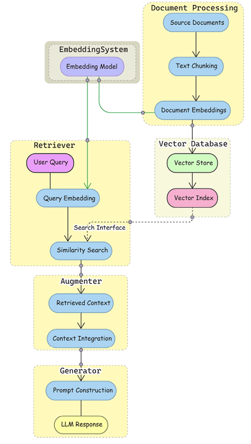
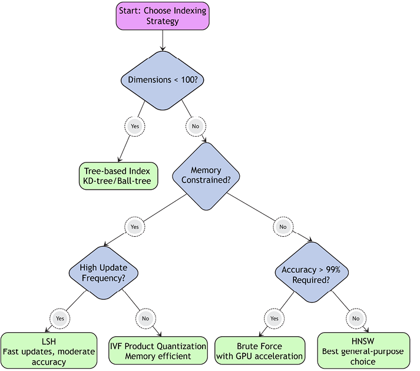
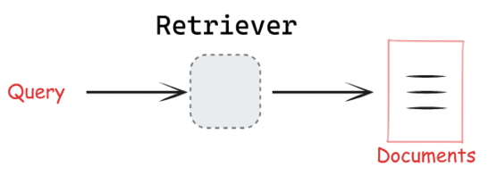
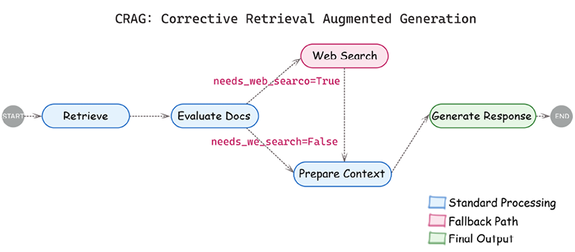
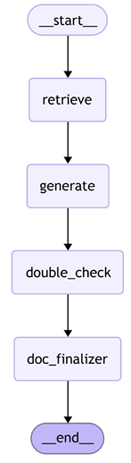

Sekarang saya akan menulis file terjemahan lengkap ke dalam bahasa Indonesia dengan gaya "baby language" (bahasa sederhana) dan menyimpannya sebagai `Chapter_4-id.md`.

<write_to_file>
<path>Chapter_4-id.md</path>
<content>

# Membangun Sistem RAG yang Cerdas

Sejauh ini dalam buku ini, kita sudah bicara tentang LLM dan token dan bekerja dengannya di LangChain. **Retrieval-Augmented Generation** (**RAG**) memperluas LLM dengan memasukkan pengetahuan eksternal secara dinamis selama pembuatan, mengatasi keterbatasan data pelatihan yang tetap, halusinasi, dan jendela konteks. Sistem RAG, dengan kata sederhana, mengambil kueri, mengubahnya langsung menjadi embedding vektor semantik, menjalankan pencarian yang mengambil dokumen relevan, dan meneruskannya ke model yang menghasilkan respons yang sesuai konteks untuk pengguna.

Bab ini menjelajahi sistem RAG dan komponen inti RAG, termasuk penyimpanan vektor, pemrosesan dokumen, strategi pengambilan, implementasi, dan teknik evaluasi. Setelah itu, kita akan mempraktikkan banyak hal yang telah kita pelajari sejauh ini dalam buku ini dengan membangun chatbot. Kita akan membangun pipeline RAG siap produksi yang merampingkan pembuatan dan validasi dokumentasi proyek perusahaan. Kasus penggunaan perusahaan ini menunjukkan cara menghasilkan dokumentasi awal, menilainya untuk kepatuhan dan konsistensi, dan menggabungkan umpan balik manusia—semua dalam alur kerja yang modular dan dapat diskalakan.

Bab ini memiliki bagian berikut:

- Dari indeks ke pengambilan cerdas
- Komponen sistem RAG
- Dari embedding ke pencarian
- Memecah pipeline RAG
- Mengembangkan chatbot dokumentasi perusahaan
- Pemecahan masalah sistem RAG

Mari kita mulai dengan memperkenalkan RAG, pentingnya, dan pertimbangan utama saat menggunakan kerangka kerja RAG.

## Dari indeks ke pengambilan cerdas

Pengambilan informasi telah menjadi kebutuhan manusia mendasar sejak awal pengetahuan tercatat. Selama 70 tahun terakhir, sistem pengambilan beroperasi di bawah paradigma inti yang sama:

1. Pertama, pengguna merumuskan kebutuhan informasi sebagai kueri.
2. Mereka kemudian mengirimkan kueri ini ke sistem pengambilan.
3. Akhirnya, sistem mengembalikan referensi ke dokumen yang mungkin memenuhi kebutuhan informasi:
   - Referensi dapat diurutkan berdasarkan relevansi menurun
   - Hasil dapat berisi kutipan relevan dari setiap dokumen (dikenal sebagai snippet)

Sementara paradigma ini tetap konstan, implementasi dan pengalaman pengguna telah mengalami transformasi luar biasa. Sistem pengambilan informasi awal mengandalkan pengindeksan manual dan pencocokan kata kunci dasar. Munculnya pengindeksan terkomputerisasi pada 1960-an memperkenalkan indeks terbalik—struktur data yang memetakan setiap kata ke daftar dokumen yang mengandungnya. Pendekatan leksikal ini menggerakkan generasi pertama mesin pencari seperti AltaVista (1996), di mana hasil terutama didasarkan pada pencocokan kata kunci eksak.

Namun, keterbatasan pendekatan ini dengan cepat menjadi jelas. Kata dapat memiliki banyak arti (polisemi), kata berbeda dapat mengungkapkan konsep yang sama (sinonimi), dan pengguna sering kesulitan mengartikulasikan kebutuhan informasi mereka dengan tepat.

Aktivitas pencarian informasi datang dengan biaya non-moneter: investasi waktu, beban kognitif, dan biaya interaktivitas—yang disebut peneliti sebagai "biaya Delphic." Kepuasan pengguna dengan mesin pencari berkorelasi tidak hanya dengan relevansi hasil, tetapi dengan seberapa mudah pengguna dapat mengekstrak informasi yang mereka butuhkan.

Sistem pengambilan tradisional bertujuan mengurangi biaya ini melalui berbagai pengoptimalan:

- Ekspansi sinonimi untuk mengurangi beban kognitif saat merumuskan kueri
- Peringkat hasil untuk mengurangi biaya waktu memindai hasil
- Snippeting hasil (menampilkan kutipan singkat relevan dari hasil pencarian) untuk mengurangi biaya mengevaluasi relevansi dokumen

Peningkatan ini mencerminkan pemahaman bahwa tujuan akhir pencarian bukan hanya menemukan dokumen tetapi memenuhi kebutuhan informasi.

Algoritma PageRank Google (akhir 1990-an) meningkatkan hasil dengan mempertimbangkan struktur tautan, tetapi bahkan mesin pencari modern menghadapi keterbatasan mendasar dalam memahami makna. Pengalaman pencarian berevolusi dari daftar sederhana dokumen yang cocok ke presentasi yang lebih kaya dengan snippet kontekstual (dimulai dengan istilah yang disorot Yahoo pada akhir 1990-an dan berkembang menjadi pratinjau dokumen dinamis Google yang mengekstrak kalimat paling relevan yang mengandung istilah pencarian), tetapi tantangan mendasar tetap: menjembatani kesenjangan semantik antara istilah kueri dan informasi relevan.

Keterbatasan mendasar sistem pengambilan tradisional terletak pada pendekatan leksikal mereka terhadap pengambilan dokumen. Dalam model Uniterm, istilah kueri dipetakan ke dokumen melalui indeks terbalik, di mana setiap kata dalam kosakata menunjuk ke "daftar posting" posisi dokumen. Pendekatan ini secara efisien mendukung kueri boolean kompleks tetapi secara fundamental melewatkan hubungan semantik antara istilah. Misalnya, "kura-kura" dan "penyu" diperlakukan sebagai kata yang sepenuhnya terpisah dalam indeks terbalik, meskipun terkait secara semantik. Sistem pengambilan awal mencoba menjembatani kesenjangan ini melalui tahap pra-pengambilan yang memperkaya kueri dengan sinonimi, tetapi keterbatasan mendasar tetap.

Terobosan datang dengan kemajuan model jaringan saraf yang dapat menangkap makna kata dan dokumen sebagai representasi vektor padat—dikenal sebagai embedding. Tidak seperti sistem kata kunci tradisional, embedding membuat _peta semantik_ di mana konsep terkait berkumpul bersama—"kura-kura", "penyu", dan "reptil" akan muncul sebagai tetangga di ruang ini, sementara "bank" (keuangan) akan berkumpul dengan "uang" tetapi jauh dari "sungai." Organisasi geometris makna ini memungkinkan pengambilan berdasarkan kesamaan konseptual daripada pencocokan kata eksak.

Transformasi ini mendapatkan momentum dengan model seperti Word2Vec (2013) dan kemudian model berbasis transformer seperti BERT (2018), yang memperkenalkan pemahaman kontekstual. Inovasi BERT adalah mengenali bahwa kata yang sama dapat memiliki arti berbeda tergantung konteksnya—"bank" sebagai institusi keuangan versus "tebing" sungai. Representasi terdistribusi ini secara fundamental mengubah apa yang mungkin dalam pengambilan informasi, memungkinkan pengembangan sistem yang dapat memahami maksud di balik kueri daripada hanya mencocokkan kata kunci.

Seiring model bahasa berbasis transformer tumbuh dalam skala, peneliti menemukan mereka tidak hanya mempelajari pola linguistik tetapi juga menghafal pengetahuan faktual dari data pelatihan mereka. Studi oleh peneliti Google menunjukkan bahwa model seperti T5 dapat menjawab pertanyaan faktual tanpa pengambilan eksternal, berfungsi sebagai basis pengetahuan implisit. Ini menyarankan pergeseran paradigma—dari mengambil dokumen yang berisi jawaban ke langsung menghasilkan jawaban dari pengetahuan yang diinternalisasi. Namun, sistem generatif "buku tertutup" ini menghadapi keterbatasan: risiko halusinasi, batas pengetahuan terbatas pada data pelatihan, ketidakmampuan untuk mengutip sumber, dan tantangan dengan penalaran kompleks. Solusinya muncul dalam **RAG**, yang menjembatani sistem pengambilan tradisional dengan model bahasa generatif, menggabungkan kekuatan masing-masing sekaligus mengatasi kelemahan individual mereka.

## Komponen sistem RAG

RAG memungkinkan model bahasa membumi keluaran mereka dalam pengetahuan eksternal, memberikan solusi elegan untuk keterbatasan yang mengganggu LLM murni: halusinasi, informasi usang, dan jendela konteks terbatas. Dengan mengambil hanya informasi relevan sesuai permintaan, sistem RAG secara efektif melewati kendala jendela konteks model bahasa, memungkinkan mereka memanfaatkan basis pengetahuan luas tanpa memeras segalanya ke dalam rentang perhatian tetap model.

Daripada hanya mengambil dokumen untuk tinjauan manusia (seperti yang dilakukan mesin pencari tradisional) atau menghasilkan jawaban hanya dari pengetahuan yang diinternalisasi (seperti yang dilakukan LLM murni), sistem RAG mengambil informasi untuk menginformasikan dan membumi respons yang dihasilkan AI. Pendekatan ini menggabungkan kemampuan verifikasi pengambilan dengan kelancaran dan pemahaman AI generatif.

Pada intinya, RAG terdiri dari komponen utama berikut yang bekerja bersama:

- **Basis pengetahuan**: Lapisan penyimpanan untuk informasi eksternal
- **Pengambil**: Lapisan akses pengetahuan yang menemukan informasi relevan
- **Pemperkaya**: Lapisan integrasi yang menyiapkan konten yang diambil
- **Pembangkit**: Lapisan respons yang menghasilkan keluaran akhir

Dari perspektif proses, RAG beroperasi melalui dua pipeline yang saling terhubung:

- Pipeline pengindeksan yang memproses, memotong, dan menyimpan dokumen dalam basis pengetahuan
- Pipeline kueri yang mengambil informasi relevan dan menghasilkan respons menggunakan informasi tersebut

Alur kerja dalam sistem RAG mengikuti urutan jelas: ketika kueri tiba, diproses untuk pengambilan; pengambil kemudian mencari basis pengetahuan untuk informasi relevan; konteks yang diambil ini digabungkan dengan kueri asli melalui pengayaan; akhirnya, model bahasa menghasilkan respons yang dibumi dalam kueri dan informasi yang diambil. Kita dapat melihat ini dalam diagram berikut:



Gambar 4.1: Arsitektur dan alur kerja RAG

Arsitektur ini menawarkan beberapa keuntungan untuk sistem produksi: modularitas memungkinkan komponen dikembangkan secara independen; skalabilitas memungkinkan sumber daya dialokasikan berdasarkan kebutuhan spesifik; pemeliharaan ditingkatkan melalui pemisahan keprihatinan yang jelas; dan fleksibilitas memungkinkan strategi implementasi berbeda untuk ditukar sesuai evolusi persyaratan.

Di bagian berikut, kita akan menjelajahi setiap komponen dalam _Gambar 4.1_ secara detail, dimulai dengan blok bangunan mendasar sistem RAG modern: `embedding` dan `penyimpanan vektor` yang menggerakkan komponen basis pengetahuan dan pengambil. Tapi sebelum kita menyelam, penting untuk mempertimbangkan keputusan antara menerapkan RAG atau menggunakan LLM murni. Pilihan ini akan berdampak fundamental pada arsitektur keseluruhan dan karakteristik operasional aplikasi Anda. Mari kita bahas pertukarannya!

### Kapan menerapkan RAG

Memperkenalkan RAG membawa kompleksitas arsitektural yang harus ditimbang dengan cermat terhadap persyaratan aplikasi Anda. RAG terbukti sangat berharga dalam domain khusus di mana informasi terkini atau dapat diverifikasi sangat penting. Aplikasi perawatan kesehatan harus memproses gambar medis dan data deret waktu, sementara sistem keuangan perlu menangani data pasar berdimensi tinggi bersama analisis historis. Aplikasi hukum mendapat manfaat dari kemampuan RAG untuk memproses struktur dokumen kompleks dan mempertahankan atribusi sumber. Persyaratan khusus domain ini sering membenarkan kompleksitas tambahan menerapkan RAG.

Namun, manfaat RAG datang dengan pertimbangan implementasi signifikan. Sistem memerlukan mekanisme pengindeksan dan pengambilan yang efisien untuk mempertahankan waktu respons wajar. Basis pengetahuan perlu pembaruan dan pemeliharaan rutin untuk tetap berharga. Infrastruktur harus dirancang untuk menangani kesalahan dan kasus tepi dengan anggun, terutama di mana komponen berbeda berinteraksi. Tim pengembangan harus siap mengelola persyaratan operasional berkelanjutan ini.

Di sisi lain, implementasi LLM murni mungkin lebih tepat ketika kompleksitas ini melebihi manfaat. Aplikasi yang fokus pada tugas kreatif, percakapan umum, atau skenario yang memerlukan waktu respons cepat sering berkinerja baik tanpa overhead sistem pengambilan. Saat bekerja dengan basis pengetahuan statis dan terbatas, teknik seperti fine-tuning atau rekayasa prompt mungkin memberikan solusi lebih sederhana.

Analisis ini, diambil dari penelitian dan implementasi praktis, menyarankan bahwa persyaratan spesifik untuk mata uang pengetahuan, akurasi, dan keahlian domain harus memandu pilihan antara RAG dan LLM murni, diimbangi dengan kapasitas organisasi untuk mengelola kompleksitas arsitektural tambahan.

> Di Chelsea AI Ventures, tim kami telah mengamati bahwa klien di industri yang diatur khususnya mendapat manfaat dari kemampuan verifikasi RAG, sementara aplikasi kreatif sering berkinerja cukup dengan LLM murni.

Tim pengembangan harus mempertimbangkan RAG ketika aplikasi mereka memerlukan:

- Akses ke informasi terkini yang tidak tersedia dalam data pelatihan LLM
- Integrasi pengetahuan khusus domain
- Respons yang dapat diverifikasi dengan atribusi sumber
- Pemrosesan format data khusus
- Presisi tinggi di industri yang diatur

Dengan itu, mari kita jelajahi detail implementasi, strategi pengoptimalan, dan pertimbangan penyebaran produksi untuk setiap komponen RAG.

## Dari embedding ke pencarian

Seperti disebutkan, sistem RAG terdiri dari pengambil yang menemukan informasi relevan, mekanisme pengayaan yang mengintegrasikan informasi ini, dan pembangkit yang menghasilkan keluaran akhir. Saat membangun aplikasi AI dengan LLM, kita sering fokus pada bagian yang menarik – prompt, rantai, dan keluaran model. Namun, fondasi sistem RAG yang kuat terletak pada bagaimana kita menyimpan dan mengambil embedding vektor kita. Bayangkan seperti membangun perpustakaan – sebelum kita dapat efisien menemukan buku (pencarian vektor), kita membutuhkan bangunan untuk menyimpannya (penyimpanan vektor) dan sistem organisasi untuk menemukannya (pengindeksan vektor). Di bagian ini, kita memperkenalkan komponen inti sistem RAG: embedding vektor, penyimpanan vektor, dan strategi pengindeksan untuk mengoptimalkan pengambilan.

Agar RAG bekerja, pertama-tama kita perlu menyelesaikan tantangan mendasar: bagaimana membantu komputer memahami makna teks sehingga mereka dapat menemukan informasi relevan? Di sinilah embedding berperan.

### Embedding

Embedding adalah representasi numerik teks yang menangkap makna semantik. Saat kita membuat embedding, kita mengubah kata atau potongan teks menjadi vektor (daftar angka) yang dapat diproses komputer. Vektor ini dapat berupa sparse (sebagian besar nol dengan beberapa nilai bukan nol) atau dense (sebagian besar nilai bukan nol), dengan sistem LLM modern biasanya menggunakan embedding dense.

Apa yang membuat embedding kuat adalah bahwa teks dengan makna serupa memiliki representasi numerik serupa, memungkinkan pencarian semantik melalui algoritma tetangga terdekat.

Dengan kata lain, model embedding mengubah teks menjadi vektor numerik. Model yang sama digunakan untuk dokumen dan kueri untuk memastikan konsistensi dalam ruang vektor. Berikut cara menggunakan embedding di LangChain:

```python
from langchain_openai import OpenAIEmbeddings
# Inisialisasi model embedding
embeddings_model = OpenAIEmbeddings()
# Buat embedding untuk kalimat contoh asli
text1 = "Kucing duduk di atas tikar"
text2 = "Seekor kucing beristirahat di karpet"
text3 = "Python adalah bahasa pemrograman"
# Dapatkan embedding menggunakan LangChain
embeddings = embeddings_model.embed_documents([text1, text2, text3])
# Kalimat serupa ini akan memiliki embedding serupa
embedding1 = embeddings[0] # Embedding untuk "Kucing duduk di atas tikar"
embedding2 = embeddings[1] # Embedding untuk "Seekor kucing beristirahat di karpet"
embedding3 = embeddings[2] # Embedding untuk "Python adalah bahasa pemrograman"
# Keluaran menunjukkan 3 dokumen dengan dimensi embedding mereka
print(f"Jumlah dokumen: {len(embeddings)}")
print(f"Dimensi per embedding: {len(embeddings[0])}")
# Biasanya 1536 dimensi dengan embedding OpenAI
```

Setelah kita memiliki embedding OpenAI ini (vektor 1536-dimensi yang kita hasilkan untuk kalimat contoh kita di atas), kita membutuhkan sistem yang dirancang khusus untuk menyimpannya. Tidak seperti nilai database biasa, vektor berdimensi tinggi ini memerlukan solusi penyimpanan khusus.

> Kelas `Embeddings` di LangChain menyediakan antarmuka standar untuk semua model embedding dari berbagai penyedia (OpenAI, Cohere, Hugging Face, dan lainnya). Ini mengekspos dua metode utama:
>
> - `embed_documents`: Mengambil beberapa teks dan mengembalikan embedding untuk masing-masing
> - `embed_query`: Mengambil satu teks (kueri pencarian Anda) dan mengembalikan embedding-nya
>
> Beberapa penyedia menggunakan metode embedding berbeda untuk dokumen versus kueri, itulah sebabnya ini adalah metode terpisah di API.

Ini membawa kita ke penyimpanan vektor – database khusus yang dioptimalkan untuk pencarian kesamaan di ruang berdimensi tinggi.

### Penyimpanan vektor

Penyimpanan vektor adalah database khusus yang dirancang untuk menyimpan, mengelola, dan mencari embedding vektor secara efisien. Seperti yang telah kita lihat, embedding mengubah teks (atau data lain) menjadi vektor numerik yang menangkap makna semantik.

Penyimpanan vektor menyelesaikan tantangan mendasar tentang bagaimana secara persisten dan efisien mencari melalui vektor berdimensi tinggi ini. Harap dicatat bahwa database vektor beroperasi sebagai sistem independen yang dapat:

- Diskala secara independen dari komponen RAG
- Dirawat dan dioptimalkan secara terpisah
- Berpotensi dibagikan di banyak aplikasi RAG
- Dihosting sebagai layanan khusus

Saat bekerja dengan embedding, beberapa tantangan muncul:

- **Skala**: Aplikasi sering perlu menyimpan jutaan embedding
- **Dimensionalitas**: Setiap embedding mungkin memiliki ratusan atau ribuan dimensi
- **Kinerja pencarian**: Menemukan vektor serupa dengan cepat menjadi intensif secara komputasi
- **Data terkait**: Kita perlu mempertahankan koneksi antara vektor dan dokumen sumber mereka

Pertimbangkan contoh dunia nyata tentang apa yang perlu kita simpan:

```python
# Contoh data yang perlu disimpan efisien di penyimpanan vektor
document_data = {
    "id": "doc_42",
    "text": "LangChain adalah kerangka kerja untuk mengembangkan aplikasi yang didukung model bahasa.",
    "embedding": [0.123, -0.456, 0.789, ...],  # 1536 dimensi untuk embedding OpenAI
    "metadata": {
        "source": "documentation.pdf",
        "page": 7,
        "created_at": "2023-06-15"
    }
}
```

Pada intinya, penyimpanan vektor menggabungkan dua komponen penting:

- **Penyimpanan vektor**: Database sebenarnya yang mempertahankan vektor dan metadata
- **Indeks vektor**: Struktur data khusus yang memungkinkan pencarian kesamaan efisien

Tantangan efisiensi datang dari _kutukan dimensionalitas_ – seiring dimensi vektor meningkat, menghitung kesamaan menjadi semakin mahal, memerlukan operasi O(dN) untuk d dimensi dan N vektor. Ini membuat pencarian kesamaan naif tidak praktis untuk aplikasi skala besar.

Penyimpanan vektor memungkinkan pencarian berbasis kesamaan melalui perhitungan jarak di ruang berdimensi tinggi. Sementara database tradisional unggul dalam pencocokan eksak, embedding vektor memungkinkan pencarian semantik dan pengambilan **tetangga terdekat perkiraan** (**ANN**).

Perbedaan utama dari database tradisional adalah bagaimana penyimpanan vektor menangani pencarian.

**Pencarian database tradisional**:

- Menggunakan pencocokan eksak (kesetaraan, rentang)
- Dioptimalkan untuk data terstruktur (misalnya, "temukan semua pelanggan dengan usia > 30")
- Biasanya menggunakan indeks berbasis B-tree atau hash

**Pencarian penyimpanan vektor:**

- Menggunakan metrik kesamaan (kesamaan kosinus, jarak Euclidean)
- Dioptimalkan untuk ruang vektor berdimensi tinggi
- Menggunakan algoritma Tetangga Terdekat Perkiraan (ANN)

#### Perbandingan penyimpanan vektor

Penyimpanan vektor mengelola embedding berdimensi tinggi untuk pengambilan. Tabel berikut membandingkan penyimpanan vektor populer di seluruh atribut kunci untuk membantu Anda memilih solusi paling sesuai untuk kebutuhan spesifik Anda:

| Database             | Opsi penyebaran     | Lisensi      | Fitur terkenal                                              |
| -------------------- | ------------------- | ------------ | ----------------------------------------------------------- |
| Pinecone             | Hanya cloud         | Komersial    | Penskalaan otomatis, keamanan perusahaan, pemantauan        |
| Milvus               | Cloud, Host mandiri | Apache 2.0   | Pengindeksan HNSW/IVF, dukungan multi-modal, operasi CRUD   |
| Weaviate             | Cloud, Host mandiri | BSD 3-Clause | Struktur seperti grafik, dukungan multi-modal               |
| Qdrant               | Cloud, Host mandiri | Apache 2.0   | Pengindeksan HNSW, pengoptimalan penyaringan, metadata JSON |
| ChromaDB             | Cloud, Host mandiri | Apache 2.0   | Ringan, pengaturan mudah                                    |
| AnalyticDB-V         | Hanya cloud         | Komersial    | Integrasi OLAP, dukungan SQL, fitur perusahaan              |
| pg_vector            | Cloud, Host mandiri | OSS          | Dukungan SQL, integrasi PostgreSQL                          |
| Vertex Vector Search | Hanya cloud         | Komersial    | Pengaturan mudah, latensi rendah, skalabilitas tinggi       |

Tabel 4.1: Perbandingan penyimpanan vektor berdasarkan opsi penyebaran, lisensi, dan fitur kunci

Setiap penyimpanan vektor menawarkan pertukaran berbeda dalam hal fleksibilitas penyebaran, lisensi, dan kemampuan khusus. Untuk sistem RAG produksi, pertimbangkan faktor seperti:

- Apakah Anda memerlukan penyebaran dikelola cloud atau host mandiri
- Kebutuhan fitur spesifik seperti integrasi SQL atau dukungan multi-modal
- Kompleksitas pengaturan dan pemeliharaan
- Persyaratan penskalaan untuk volume embedding yang diharapkan

Untuk banyak aplikasi yang memulai dengan RAG, opsi ringan seperti ChromaDB memberikan keseimbangan bagus antara kesederhanaan dan fungsionalitas, sementara penyebaran perusahaan mungkin mendapat manfaat dari fitur canggih Pinecone atau AnalyticDB-V. Penyimpanan vektor modern mendukung beberapa pola pencarian:

- **Pencarian eksak**: Mengembalikan tetangga terdekat tepat tetapi menjadi mahal secara komputasi dengan koleksi vektor besar
- **Pencarian perkiraan**: Menukar akurasi untuk kecepatan menggunakan teknik seperti LSH, HNSW, atau kuantisasi; diukur dengan recall (persentase tetangga terdekat sebenarnya yang diambil)
- **Pencarian hibrida**: Menggabungkan kesamaan vektor dengan pencarian berbasis teks (seperti pencocokan kata kunci atau BM25) dalam satu kueri
- **Pencarian vektor tersaring**: Menerapkan filter database tradisional (misalnya, kendala metadata) bersama pencarian kesamaan vektor

Penyimpanan vektor juga menangani berbagai jenis embedding:

- **Pencarian vektor padat**: Menggunakan embedding kontinu di mana sebagian besar dimensi memiliki nilai bukan nol, biasanya dari model neural (seperti BERT, embedding OpenAI)
- **Pencarian vektor sparse**: Menggunakan vektor berdimensi tinggi di mana sebagian besar nilai adalah nol, menyerupai representasi TF-IDF atau BM25 tradisional
- **Hibrida sparse-padat**: Menggabungkan kedua pendekatan untuk memanfaatkan kesamaan semantik (padat) dan presisi kata kunci (sparse)

Mereka juga sering memberikan pilihan beberapa ukuran kesamaan, misalnya:

- **Produk dalam**: Berguna untuk membandingkan arah semantik
- **Kesamaan kosinus**: Menormalkan untuk magnitudo vektor
- **Jarak Euclidean**: Mengukur jarak L2 di ruang vektor (catatan: dengan embedding ternormalisasi, ini menjadi setara fungsional dengan produk titik)
- **Jarak Hamming**: Untuk representasi vektor biner

Saat menerapkan penyimpanan vektor untuk aplikasi RAG, salah satu keputusan arsitektural pertama adalah apakah menggunakan penyimpanan lokal atau solusi berbasis cloud. Mari jelajahi pertukaran dan pertimbangan untuk setiap pendekatan.

- Pilih penyimpanan lokal ketika Anda memerlukan kontrol maksimum, memiliki persyaratan privasi ketat, atau beroperasi pada skala lebih kecil dengan beban kerja yang dapat diprediksi.
- Pilih penyimpanan cloud ketika Anda memerlukan penskalaan elastis, lebih memilih layanan terkelola, atau mengoperasikan aplikasi terdistribusi dengan beban kerja variabel.
- Pertimbangkan arsitektur penyimpanan hibrida ketika Anda ingin menyeimbangkan kinerja dan skalabilitas, menggabungkan caching lokal dengan persistensi berbasis cloud.

#### Pertimbangan perangkat keras untuk penyimpanan vektor

Terlepas dari pendekatan penyebaran Anda, memahami persyaratan perangkat keras sangat penting untuk kinerja optimal:

- **Persyaratan memori**: Database vektor intensif memori, dengan sistem produksi sering memerlukan RAM 16-64GB untuk jutaan embedding. Penyebaran lokal harus merencanakan ruang memori yang cukup untuk mengakomodasi pertumbuhan indeks.
- **CPU vs. GPU**: Sementara operasi vektor dasar bekerja di CPU, akselerasi GPU secara signifikan meningkatkan kinerja untuk pencarian kesamaan skala besar. Untuk aplikasi throughput tinggi, dukungan GPU dapat memberikan peningkatan kecepatan 10-50x.
- **Kecepatan penyimpanan**: Penyimpanan SSD sangat direkomendasikan daripada HDD untuk penyimpanan vektor produksi, karena pemuatan indeks dan kinerja pencarian sangat bergantung pada kecepatan I/O. Ini terutama penting untuk penyebaran lokal.
- **Bandwidth jaringan**: Untuk pengaturan berbasis cloud atau terdistribusi, latensi jaringan dan bandwidth menjadi faktor kritis yang dapat memengaruhi waktu respons kueri.

Untuk pengembangan dan pengujian, sebagian besar penyimpanan vektor dapat berjalan di laptop standar dengan RAM 8GB+, tetapi penyebaran produksi harus mempertimbangkan infrastruktur khusus atau layanan penyimpanan vektor berbasis cloud yang menangani pertimbangan sumber daya ini secara otomatis.

#### Antarmuka penyimpanan vektor di LangChain

Sekarang setelah kita menjelajahi peran penyimpanan vektor dan membandingkan beberapa opsi umum, mari lihat bagaimana LangChain menyederhanakan bekerja dengannya. LangChain menyediakan antarmuka standar untuk bekerja dengan penyimpanan vektor, memungkinkan Anda dengan mudah beralih antara implementasi berbeda:

```python
from langchain_openai import OpenAIEmbeddings
from langchain_chroma import Chroma
# Inisialisasi dengan model embedding
embeddings = OpenAIEmbeddings()
vector_store = Chroma(embedding_function=embeddings)
```

Kelas dasar `vectorstore` di LangChain menyediakan operasi penting ini:

1. Menambahkan dokumen:

   ```python
   docs = [Document(page_content="Konten 1"), Document(page_content="Konten 2")]
   ids = vector_store.add_documents(docs)
   ```

2. Pencarian kesamaan:

   ```python
   results = vector_store.similarity_search("Bagaimana LangChain bekerja?", k=3)
   ```

3. Penghapusan:

   ```python
   vector_store.delete(ids=["doc_1", "doc_2"])
   ```

4. Pencarian relevansi marginal maksimum:
   ```python
   # Temukan dokumen relevan TAPI beragam (kurangi redundansi)
   results = vector_store.max_marginal_relevance_search(
       "Bagaimana LangChain bekerja?",
       k=3,
       fetch_k=10,
       lambda_mult=0.5  # Mengontrol keragaman (0=keragaman maks, 1=relevansi maks)
   )
   ```

Penting juga untuk menyoroti secara singkat aplikasi penyimpanan vektor selain RAG:

- Deteksi anomali dalam dataset besar
- Sistem personalisasi dan rekomendasi
- Tugas NLP
- Deteksi penipuan
- Pemantauan keamanan jaringan

Namun, menyimpan vektor saja tidak cukup. Kita perlu menemukan vektor serupa dengan cepat saat memproses kueri. Tanpa pengindeksan yang tepat, mencari melalui vektor akan seperti mencoba menemukan buku di perpustakaan tanpa sistem organisasi – Anda harus memeriksa setiap buku.

### Strategi pengindeksan vektor

Pengindeksan vektor adalah komponen kritis yang membuat database vektor praktis untuk aplikasi dunia nyata. Pada intinya, pengindeksan menyelesaikan tantangan kinerja mendasar: bagaimana efisien menemukan vektor serupa tanpa membandingkan dengan setiap vektor di database (pendekatan brute force), yang mahal secara komputasi bahkan untuk volume data ukuran menengah.

Indeks vektor adalah struktur data khusus yang mengatur vektor dengan cara yang memungkinkan sistem dengan cepat mengidentifikasi bagian ruang vektor mana yang paling mungkin mengandung vektor serupa. Alih-alih memeriksa setiap vektor, sistem dapat fokus pada wilayah yang menjanjikan terlebih dahulu.

Beberapa pendekatan pengindeksan umum meliputi:

- **Struktur berbasis pohon** yang membagi ruang vektor secara hierarkis
- **Metode berbasis grafik** seperti **Hierarchical Navigable Small World** (**HNSW**) yang membuat jaringan terhubung dari vektor yang dapat dinavigasi
- **Teknik hashing** yang memetakan vektor serupa ke "ember" yang sama

Setiap pendekatan sebelumnya menawarkan pertukaran berbeda antara:

- Kecepatan pencarian
- Akurasi hasil
- Penggunaan memori
- Efisiensi pembaruan (seberapa cepat vektor baru dapat ditambahkan)

Saat menggunakan penyimpanan vektor di LangChain, strategi pengindeksan biasanya ditangani oleh implementasi dasar. Misalnya, saat Anda membuat indeks FAISS atau menggunakan Pinecone, sistem tersebut secara otomatis menerapkan strategi pengindeksan yang sesuai berdasarkan konfigurasi Anda.

Intinya adalah bahwa pengindeksan yang tepat mengubah pencarian vektor dari operasi O(n) (di mana n adalah jumlah vektor) menjadi sesuatu yang jauh lebih efisien (sering mendekati O(log n)), memungkinkan untuk mencari melalui jutaan vektor dalam milidetik daripada detik atau menit.

Berikut tabel untuk memberikan gambaran umum strategi berbeda:

| Strategi                                  | Algoritma inti                                                         | Kompleksitas                                                                            | Penggunaan memori                             | Terbaik untuk                                                          | Catatan                                                                               |
| ----------------------------------------- | ---------------------------------------------------------------------- | --------------------------------------------------------------------------------------- | --------------------------------------------- | ---------------------------------------------------------------------- | ------------------------------------------------------------------------------------- |
| Pencarian Eksak (Brute Force)             | Membandingkan vektor kueri dengan setiap vektor di database            | Pencarian: O(DN) Bangun: O(1)                                                           | Rendah – hanya menyimpan vektor mentah        | Dataset kecil Ketika recall 100% dibutuhkan Pengujian/baseline         | Paling mudah diimplementasikan Bagus untuk baseline pengujian                         |
| HNSW (Hierarchical Navigable Small World) | Membuat grafik berlapis dengan konektivitas menurun dari bawah ke atas | Pencarian: O(log N) Bangun: O(N log N)                                                  | Tinggi – menyimpan koneksi grafik plus vektor | Sistem produksi Ketika akurasi tinggi dibutuhkan Pencarian skala besar | Standar industri Membutuhkan penalaan cermat M (koneksi) dan ef (kedalaman pencarian) |
| LSH (Locality Sensitive Hashing)          | Menggunakan fungsi hash yang memetakan vektor serupa ke ember sama     | Pencarian: O(N) Bangun: O(N) | Sedang – menyimpan banyak tabel hash          | Data streaming Ketika pembaruan sering Pencarian perkiraan OK          | Bagus untuk data dinamis Dapat disetel akurasi vs kecepatan                           |
| IVF (Inverted File Index)                 | Mengelompokkan vektor dan mencari dalam kluster relevan                | Pencarian: O(DN/k) Bangun: O(kN)                                                        | Rendah – menyimpan penugasan kluster          | Memori terbatas Keseimbangan kecepatan/akurasi Implementasi sederhana  | k = jumlah kluster Sering dikombinasikan dengan metode lain                           |
| Product Quantization (PQ)                 | Mengompres vektor dengan membagi menjadi subruang dan mengkuantisasi   | Pencarian: bervariasi Bangun: O(N)                                                      | Sangat Rendah – vektor terkompresi            | Sistem dengan kendala memori Dataset besar                             | Sering dikombinasikan dengan IVF Membutuhkan codebook pelatihan Implementasi kompleks |
| Berbasis Pohon (KD-Tree, Ball Tree)       | Secara rekursif mempartisi ruang menjadi wilayah                       | Pencarian: O(D log N) kasus terbaik Bangun: O(N log N)                                  | Sedang – struktur pohon                       | Data berdimensi rendah Dataset statis                                  | Bekerja baik untuk D < 100 Pembaruan mahal                                            |

Tabel 4.2: Perbandingan penyimpanan vektor berdasarkan opsi penyebaran, lisensi, dan fitur kunci

Saat memilih strategi pengindeksan untuk sistem RAG Anda, pertimbangkan pertukaran praktis ini:

- **Untuk akurasi maksimum dengan dataset kecil** (<100K vektor): Pencarian Eksak memberikan recall sempurna tetapi menjadi mahal secara prohibitif seiring dataset Anda tumbuh.
- **Untuk sistem produksi dengan jutaan vektor**: HNSW menawarkan keseimbangan terbaik kecepatan pencarian dan akurasi, menjadikannya standar industri untuk aplikasi skala besar. Meskipun membutuhkan lebih banyak memori daripada pendekatan lain, kompleksitas pencarian logaritmiknya memberikan kinerja konsisten bahkan saat dataset Anda berskala.
- **Untuk lingkungan dengan kendala memori**: IVF+PQ (Indeks File Terbalik dengan Kuantisasi Produk) secara dramatis mengurangi persyaratan memori—seringkali 10-20x dibandingkan vektor mentah—dengan pertukaran akurasi sederhana. Kombinasi ini sangat berharga untuk penyebaran tepi atau saat mengembed miliaran dokumen.
- **Untuk koleksi yang sering diperbarui**: LSH menyediakan pembaruan efisien tanpa membangun kembali seluruh indeks, membuatnya cocok untuk aplikasi data streaming di mana dokumen terus ditambahkan atau dihapus.

Sebagian besar database vektor modern default ke HNSW dengan alasan bagus, tetapi memahami pertukaran ini memungkinkan Anda mengoptimalkan untuk kendala spesifik Anda ketika diperlukan. Untuk mengilustrasikan perbedaan praktis antara strategi pengindeksan, mari bandingkan kinerja dan akurasi pencarian eksak versus pengindeksan HNSW menggunakan FAISS:

```python
import numpy as np
import faiss
import time
# Buat data sampel - 10.000 vektor dengan 128 dimensi
dimension = 128
num_vectors = 10000
vectors = np.random.random((num_vectors, dimension)).astype('float32')
query = np.random.random((1, dimension)).astype('float32')
# Indeks pencarian eksak
exact_index = faiss.IndexFlatL2(dimension)
exact_index.add(vectors)
# Indeks HNSW (perkiraan tapi lebih cepat)
hnsw_index = faiss.IndexHNSWFlat(dimension, 32)  # 32 koneksi per node
hnsw_index.add(vectors)
# Bandingkan waktu pencarian
start_time = time.time()
exact_D, exact_I = exact_index.search(query, k=10)  # Cari 10 tetangga terdekat
exact_time = time.time() - start_time
start_time = time.time()
hnsw_D, hnsw_I = hnsw_index.search(query, k=10)
hnsw_time = time.time() - start_time
# Hitung tumpang tindih (berapa banyak hasil sama yang ditemukan)
overlap = len(set(exact_I[0]).intersection(set(hnsw_I[0])))
overlap_percentage = overlap * 100 / 10
print(f"Waktu pencarian eksak: {exact_time:.6f} detik")
print(f"Waktu pencarian HNSW: {hnsw_time:.6f} detik")
print(f"Peningkatan kecepatan: {exact_time/hnsw_time:.2f}x lebih cepat")
print(f"Tumpang tindih hasil: {overlap_percentage:.1f}%")
Menjalankan kode ini biasanya menghasilkan hasil seperti:
Waktu pencarian eksak: 0.003210 detik
Waktu pencarian HNSW: 0.000412 detik
Peningkatan kecepatan: 7.79x lebih cepat
Tumpang tindih hasil: 90.0%
```

Contoh ini menunjukkan pertukaran mendasar dalam pengindeksan vektor: pencarian eksak menjamin menemukan tetangga terdekat sebenarnya tetapi membutuhkan waktu lebih lama, sementara HNSW memberikan hasil perkiraan secara signifikan lebih cepat. Persentase tumpang tindih menunjukkan berapa banyak tetangga terdekat sama yang ditemukan oleh kedua metode.

Untuk dataset kecil seperti contoh ini (10.000 vektor), perbedaan waktu absolut minimal. Namun, seiring dataset Anda tumbuh menjadi jutaan atau miliaran vektor, pencarian eksak menjadi mahal secara prohibitif, sementara HNSW mempertahankan penskalaan logaritmik—membuat metode pengindeksan perkiraan penting untuk sistem RAG produksi.

Berikut diagram yang dapat membantu pengembang memilih strategi pengindeksan yang tepat berdasarkan persyaratan mereka:



Gambar 4.2: Memilih strategi pengindeksan

Gambar sebelumnya mengilustrasikan pohon keputusan untuk memilih strategi pengindeksan yang sesuai berdasarkan kendala penyebaran Anda. Diagram alir membantu Anda menavigasi titik keputusan kunci:

1. **Mulai dengan menilai ukuran dataset Anda**: Untuk koleksi kecil (di bawah 100K vektor), pencarian eksak tetap layak dan memberikan akurasi sempurna.
2. **Pertimbangkan kendala memori Anda**: Jika memori terbatas, ikuti cabang kiri menuju teknik kompresi seperti **Kuantisasi Produk** (**PQ**).
3. **Evaluasi frekuensi pembaruan**: Jika aplikasi Anda memerlukan pembaruan indeks sering, prioritaskan metode seperti LSH yang mendukung pembaruan efisien.
4. **Asses persyaratan kecepatan pencarian**: Untuk aplikasi yang menuntut latensi ultra-rendah, HNSW biasanya memberikan waktu pencarian tercepat setelah dibangun.
5. **Seimbangkan dengan kebutuhan akurasi**: Saat Anda bergerak ke bawah di diagram alir, pertimbangkan pertukaran akurasi-efisiensi berdasarkan toleransi aplikasi Anda untuk hasil perkiraan.

Untuk sebagian besar aplikasi RAG produksi, Anda kemungkinan akan berakhir dengan HNSW atau pendekatan gabungan seperti IVF+HNSW, yang mengelompokkan vektor terlebih dahulu (IVF) dan kemudian membangun struktur grafik efisien (HNSW) dalam setiap kluster. Kombinasi ini memberikan kinerja sangat baik di berbagai skenario.

Untuk meningkatkan pengambilan, dokumen harus diproses dan distrukturkan secara efektif. Bagian selanjutnya menjelajahi memuat berbagai jenis dokumen dan menangani konten multi-modal.

Pustaka vektor, seperti Facebook (Meta) Faiss atau Spotify Annoy, menyediakan fungsionalitas untuk bekerja dengan data vektor. Mereka biasanya menawarkan implementasi berbeda dari algoritma **ANN**, seperti pengelompokan atau metode berbasis pohon, dan memungkinkan pengguna melakukan pencarian kesamaan vektor untuk berbagai aplikasi. Mari kita bahas beberapa yang paling populer dengan cepat:

- **Faiss** adalah pustaka yang dikembangkan oleh Meta (sebelumnya Facebook) yang menyediakan pencarian kesamaan dan pengelompokan vektor padat yang efisien. Ini menawarkan berbagai algoritma pengindeksan, termasuk PQ, LSH, dan HNSW. Faiss banyak digunakan untuk tugas pencarian vektor skala besar dan mendukung akselerasi CPU dan GPU.
- **Annoy** adalah pustaka C++ untuk pencarian tetangga terdekat perkiraan di ruang berdimensi tinggi yang dipelihara dan dikembangkan oleh Spotify, mengimplementasikan algoritma Annoy berdasarkan hutan pohon proyeksi acak.
- **hnswlib** adalah pustaka C++ untuk pencarian tetangga-terdekat perkiraan menggunakan algoritma HNSW.
- **Non-Metric Space Library **(**nmslib**) mendukung berbagai algoritma pengindeksan seperti HNSW, SW-graph, dan SPTAG.
- **SPTAG **oleh Microsoft mengimplementasikan ANN terdistribusi. Ini dilengkapi dengan pohon k-d dan grafik lingkungan relatif (SPTAG-KDT), dan pohon k-means seimbang dan grafik lingkungan relatif (SPTAG-BKT).

> Ada banyak lagi pustaka pencarian vektor yang dapat Anda pilih. Anda dapat mendapatkan gambaran lengkap di [https://github.com/erikbern/ann-benchmarks](https://github.com/erikbern/ann-benchmarks).

Saat menerapkan solusi penyimpanan vektor, pertimbangkan:

- Pertukaran antara pencarian eksak dan perkiraan
- Kendala memori dan persyaratan penskalaan
- Kebutuhan kemampuan pencarian hibrida yang menggabungkan pencarian vektor dan tradisional
- Persyaratan dukungan data multi-modal
- Biaya integrasi dan kompleksitas pemeliharaan

Untuk banyak aplikasi, pendekatan hibrida yang menggabungkan pencarian vektor dengan kemampuan database tradisional memberikan solusi paling fleksibel.

## Memecah pipeline RAG

Bayangkan pipeline RAG seperti lini perakitan di perpustakaan, di mana bahan mentah (dokumen) diubah menjadi basis pengetahuan yang dapat dicari yang dapat menjawab pertanyaan. Mari kita telusuri bagaimana setiap komponen memainkan perannya.

1. **Pemrosesan dokumen – fondasi**

Pemrosesan dokumen seperti menyiapkan buku untuk perpustakaan. Ketika dokumen pertama kali masuk sistem, mereka perlu:

- Dimuat menggunakan pemuat dokumen yang sesuai dengan format mereka (PDF, HTML, teks, dll.)
- Diubah menjadi format standar yang dapat digunakan sistem
- Dibagi menjadi potongan lebih kecil yang bermakna yang lebih mudah diproses dan diambil

Misalnya, saat memproses buku teks, kita mungkin memecahnya menjadi potongan ukuran bab atau paragraf sambil mempertahankan konteks penting dalam metadata.

2. **Pengindeksan vektor – membuat katalog kartu**

Setelah dokumen diproses, kita memerlukan cara untuk membuatnya dapat dicari. Di sinilah pengindeksan vektor berperan. Begini cara kerjanya:

- Model embedding mengubah setiap potongan dokumen menjadi vektor (anggap sebagai menangkap makna dokumen dalam daftar angka)
- Vektor ini diorganisasikan dalam struktur data khusus (penyimpanan vektor) yang membuatnya mudah dicari
- Penyimpanan vektor juga mempertahankan koneksi antara vektor ini dan dokumen asli mereka

Ini mirip dengan bagaimana katalog kartu perpustakaan mengatur buku berdasarkan subjek, memudahkan menemukan materi terkait.

3. **Penyimpanan vektor – rak yang terorganisir**

Penyimpanan vektor seperti rak terorganisir di perpustakaan kita. Mereka:

- Menyimpan vektor dokumen dan konten dokumen asli
- Menyediakan cara efisien untuk mencari melalui vektor
- Menawarkan metode organisasi berbeda (seperti HNSW atau IVF) yang menyeimbangkan kecepatan dan akurasi

Misalnya, menggunakan FAISS (penyimpanan vektor populer), kita mungkin mengatur vektor kita dalam struktur hierarkis yang memungkinkan kita dengan cepat mempersempit dokumen mana yang akan diperiksa secara detail.

4. **Pengambilan – menemukan buku yang tepat**

Pengambilan adalah tempat semuanya bersatu. Ketika pertanyaan datang:

- Pertanyaan diubah menjadi vektor menggunakan model embedding yang sama
- Penyimpanan vektor menemukan dokumen yang vektornya paling mirip dengan vektor pertanyaan

Pengambil mungkin menerapkan logika tambahan, seperti:

- Menghapus informasi duplikat
- Menyeimbangkan relevansi dan keragaman
- Menggabungkan hasil dari metode pencarian berbeda

Implementasi RAG dasar terlihat seperti ini:

```python
# Untuk transformasi kueri
from langchain.prompts import PromptTemplate
from langchain_openai import ChatOpenAI
from langchain_core.output_parsers import StrOutputParser
# Untuk implementasi RAG dasar
from langchain_community.document_loaders import JSONLoader
from langchain_openai import OpenAIEmbeddings
from langchain_community.vectorstores import FAISS
# 1. Muat dokumen
loader = JSONLoader(
    file_path="knowledge_base.json",
    jq_schema=".[].content",  # Ini mengekstrak bidang konten dari setiap item array
    text_content=True
)
documents = loader.load()
# 2. Konversi ke vektor
embedder = OpenAIEmbeddings()
embeddings = embedder.embed_documents([doc.page_content for doc in documents])
# 3. Simpan di database vektor
vector_db = FAISS.from_documents(documents, embedder)
# 4. Ambil dokumen serupa
query = "Apa efek perubahan iklim?"
```

results = vector_db.similarity_search(query)Implementasi ini mencakup alur kerja RAG inti: pemuatan dokumen, embedding, penyimpanan, dan pengambilan.

Membangun sistem RAG dengan LangChain memerlukan pemahaman dua blok bangunan mendasar, yang harus kita bahas sedikit lebih detail: **pemuat dokumen** dan **pengambil**. Mari jelajahi bagaimana komponen ini bekerja bersama untuk membuat sistem pengambilan yang efektif.

### Pemrosesan dokumen

LangChain menyediakan sistem komprehensif untuk memuat dokumen dari berbagai sumber melalui pemuat dokumen. Pemuat dokumen adalah komponen di LangChain yang mengubah berbagai sumber data menjadi format dokumen standar yang dapat digunakan di seluruh ekosistem LangChain. Setiap dokumen berisi konten aktual dan metadata terkait.

Pemuat dokumen berfungsi sebagai fondasi untuk sistem RAG dengan:

- Mengonversi sumber data beragam menjadi format seragam
- Mengekstrak teks dan metadata dari file
- Menyiapkan dokumen untuk pemrosesan lebih lanjut (seperti pemotongan atau embedding)

LangChain mendukung pemuatan dokumen dari berbagai jenis dokumen dan sumber melalui pemuat khusus, misalnya:

- **PDF**: Menggunakan PyPDFLoader
- **HTML**: WebBaseLoader untuk mengekstrak teks halaman web
- **Teks polos**: TextLoader untuk input teks mentah
- **WebBaseLoader **untuk ekstraksi konten halaman web
- **ArxivLoader **untuk makalah ilmiah
- **WikipediaLoader **untuk entri ensiklopedia
- **YoutubeLoader **untuk transkrip video
- **ImageCaptionLoader **untuk konten gambar

Anda mungkin memperhatikan beberapa jenis konten non-teks dalam daftar sebelumnya. Sistem RAG canggih dapat menangani data non-teks; misalnya, embedding gambar atau transkrip audio.

Tabel berikut mengatur pemuat dokumen LangChain ke dalam tabel komprehensif:

| Kategori           | Deskripsi                              | Contoh Terkenal                                           | Kasus Penggunaan Umum              |
| ------------------ | -------------------------------------- | --------------------------------------------------------- | ---------------------------------- |
| Sistem File        | Muat dari file lokal                   | TextLoader, CSVLoader, PDFLoader                          | Memproses dokumen lokal, file data |
| Konten Web         | Ekstrak dari sumber online             | WebBaseLoader, RecursiveURLLoader, SitemapLoader          | Pengikisan web, agregasi konten    |
| Penyimpanan Cloud  | Akses file yang dihosting cloud        | S3DirectoryLoader, GCSFileLoader, DropboxLoader           | Integrasi data perusahaan          |
| Database           | Muat dari penyimpanan data terstruktur | MongoDBLoader, SnowflakeLoader, BigQueryLoader            | Kecerdasan bisnis, analisis data   |
| Media Sosial       | Impor konten platform sosial           | TwitterTweetLoader, RedditPostsLoader, DiscordChatLoader  | Analisis media sosial              |
| Alat Produktivitas | Akses dokumen ruang kerja              | NotionDirectoryLoader, SlackDirectoryLoader, TrelloLoader | Pembuatan basis pengetahuan        |
| Sumber Ilmiah      | Muat konten akademik                   | ArxivLoader, PubMedLoader                                 | Aplikasi penelitian                |

Tabel 4.3: Pemuat dokumen di LangChain

Akhirnya, pemuat dokumen modern menawarkan beberapa kemampuan canggih:

- Pemuatan konkuren untuk kinerja lebih baik
- Ekstraksi dan preservasi metadata
- Parsing khusus format (seperti ekstraksi tabel dari PDF)
- Penanganan kesalahan dan validasi
- Integrasi dengan pipeline transformasi

Mari kita bahas contoh memuat file JSON. Berikut pola tipikal untuk menggunakan pemuat dokumen:

```python
from langchain_community.document_loaders import JSONLoader
# Muat file json
loader = JSONLoader(
    file_path="knowledge_base.json",
    jq_schema=".[].content",  # Ini mengekstrak bidang konten dari setiap item array
    text_content=True
)
documents = loader.load()
print(documents)
```

Pemuat dokumen dilengkapi dengan antarmuka metode `.load()` standar yang mengembalikan dokumen dalam format dokumen LangChain. Inisialisasi spesifik sumber. Setelah pemuatan, dokumen sering memerlukan pemrosesan sebelum penyimpanan dan pengambilan, dan memilih strategi pemotongan yang tepat menentukan relevansi dan keragaman respons yang dihasilkan AI.

#### Strategi pemotongan

Pemotongan—bagaimana Anda membagi dokumen menjadi potongan lebih kecil—dapat secara dramatis memengaruhi kinerja sistem RAG Anda. Pemotongan yang buruk dapat memisahkan konsep terkait, kehilangan konteks kritis, dan akhirnya menyebabkan hasil pengambilan yang tidak relevan. Cara Anda memotong dokumen memengaruhi:

- **Akurasi pengambilan**: Potongan yang terbentuk baik mempertahankan koherensi semantik, membuatnya lebih mudah dicocokkan dengan kueri relevan
- **Preservasi konteks**: Pemotongan buruk dapat membagi informasi terkait, menyebabkan celah pengetahuan
- **Kualitas respons**: Ketika LLM menerima potongan yang terfragmentasi atau tidak relevan, ia menghasilkan respons yang kurang akurat

Mari jelajahi hierarki pendekatan pemotongan, dari sederhana hingga canggih, untuk membantu Anda menerapkan strategi paling efektif untuk kasus penggunaan spesifik Anda.

##### Pemotongan ukuran tetap

Pendekatan paling dasar membagi teks menjadi potongan dengan panjang tertentu tanpa mempertimbangkan struktur konten:

```python
from langchain_text_splitters import CharacterTextSplitter
text_splitter = CharacterTextSplitter(
    separator=" ",   # Pisahkan pada spasi untuk menghindari memecah kata
    chunk_size=200,
    chunk_overlap=20
)
chunks = text_splitter.split_documents(documents)
print(f"Dihasilkan {len(chunks)} potongan dari dokumen")
```

Pemotongan ukuran tetap bagus untuk prototipe cepat atau ketika struktur dokumen relatif seragam, namun, sering membagi teks pada posisi canggung, memecah kalimat, paragraf, atau unit logis.

##### Pemotongan karakter rekursif

Metode ini menghormati batas teks alami dengan secara rekursif menerapkan pemisah berbeda:

```python
from langchain_text_splitters import RecursiveCharacterTextSplitter
text_splitter = RecursiveCharacterTextSplitter(
    separators=["\n\n", "\n", ". ", " ", ""],
    chunk_size=150,
    chunk_overlap=20
)
document = """
document = """# Pengantar RAG
Retrieval-Augmented Generation (RAG) menggabungkan sistem pengambilan dengan model AI generatif.
Ini membantu mengatasi halusinasi dengan membumi respons dalam informasi yang diambil.
## Komponen Kunci
RAG terdiri dari beberapa komponen:
1. Pemrosesan dokumen
2. Embedding vektor
3. Pengambilan
4. Pengayaan
5. Pembangkitan
### Pemrosesan Dokumen
Langkah ini melibatkan memuat dan memotong dokumen dengan tepat.
"""
chunks = text_splitter.split_text(document)
print(chunks)
```

Berikut potongannya:

```python
['# Pengantar RAG\nRetrieval-Augmented Generation (RAG) menggabungkan sistem pengambilan dengan model AI generatif.', 'Ini membantu mengatasi halusinasi dengan membumi respons dalam informasi yang diambil.', '## Komponen Kunci\nRAG terdiri dari beberapa komponen:\n1. Pemrosesan dokumen\n2. Embedding vektor\n3. Pengambilan\n4. Pengayaan\n5. Pembangkitan', '### Pemrosesan Dokumen\nLangkah ini melibatkan memuat dan memotong dokumen dengan tepat.']
```

Cara kerjanya adalah splitter pertama kali mencoba membagi teks pada jeda paragraf (`\n\n`). Jika potongan yang dihasilkan masih terlalu besar, ia mencoba pemisah berikutnya (`\n`), dan seterusnya. Pendekatan ini mempertahankan batas teks alami sambil mempertahankan ukuran potongan yang wajar.

Pemotongan karakter rekursif adalah strategi default yang direkomendasikan untuk sebagian besar aplikasi. Ini bekerja baik untuk berbagai jenis dokumen dan memberikan keseimbangan bagus antara mempertahankan konteks dan mempertahankan ukuran potongan yang dapat dikelola.

##### Pemotongan khusus dokumen

Jenis dokumen berbeda memiliki struktur berbeda. Pemotongan khusus dokumen beradaptasi dengan struktur ini. Implementasi dapat melibatkan menggunakan splitter khusus berbeda berdasarkan jenis dokumen menggunakan pernyataan `if`. Misalnya, kita bisa menggunakan `MarkdownTextSplitter`, `PythonCodeTextSplitter`, atau `HTMLHeaderTextSplitter` tergantung pada jenis konten yang merupakan markdown, Python, atau HTML.

Ini dapat berguna saat bekerja dengan format dokumen khusus di mana struktur penting – repositori kode, dokumentasi teknis, artikel markdown, atau serupa. Keuntungannya adalah mempertahankan struktur dokumen logis, menjaga unit fungsional bersama (seperti fungsi kode, bagian markdown), dan meningkatkan relevansi pengambilan untuk kueri khusus domain.

##### Pemotongan semantik

Tidak seperti pendekatan sebelumnya yang mengandalkan pemisah tekstual, pemotongan semantik menganalisis makna konten untuk menentukan batas potongan.

```python
from langchain_experimental.text_splitter import SemanticChunker
from langchain_openai import OpenAIEmbeddings
embeddings = OpenAIEmbeddings()
text_splitter = SemanticChunker(
    embeddings=embeddings,
    add_start_index=True  # Sertakan metadata posisi
)
chunks = text_splitter.split_text(document)
```

Ini potongannya:

```python
['# Pengantar RAG\nRetrieval-Augmented Generation (RAG) menggabungkan sistem pengambilan dengan model AI generatif. Ini membantu mengatasi halusinasi dengan membumi respons dalam informasi yang diambil. ## Komponen Kunci\nRAG terdiri dari beberapa komponen:\n1. Pemrosesan dokumen\n2. Embedding vektor\n3. Pengambilan\n4.',
 'Pengayaan\n5. Pembangkitan\n\n### Pemrosesan Dokumen\nLangkah ini melibatkan memuat dan memotong dokumen dengan tepat. ']
```

Begini cara `SemanticChunker` bekerja:

1. Membagi teks menjadi kalimat
2. Membuat embedding untuk kelompok kalimat (ditentukan oleh `buffer_size`)
3. Mengukur kesamaan semantik antara kelompok yang berdekatan
4. Mengidentifikasi titik putus alami di mana topik atau konsep berubah
5. Membuat potongan yang mempertahankan koherensi semantik

Anda dapat menggunakan pemotongan semantik untuk dokumen teknis kompleks di mana kohesi semantik sangat penting untuk pengambilan akurat dan ketika Anda bersedia menghabiskan komputasi/tambahan untuk pembuatan embedding.

Manfaat termasuk pembuatan potongan berdasarkan makna aktual daripada fitur tekstual superfisial dan menjaga konsep terkait bersama bahkan ketika mereka menjangkau batas pemisah tradisional.

##### Pemotongan berbasis agen

Pendekatan eksperimental ini menggunakan LLM untuk secara cerdas membagi teks berdasarkan analisis semantik dan pemahaman konten dengan cara berikut:

1. Analisis struktur dan konten dokumen
2. Identifikasi titik putus alami berdasarkan pergeseran topik
3. Tentukan batas potongan optimal yang mempertahankan makna
4. Kembalikan daftar posisi awal untuk membuat potongan

Jenis pemotongan ini dapat berguna untuk dokumen yang sangat kompleks di mana metode pemisahan standar gagal mempertahankan hubungan kritis antara konsep. Pendekatan ini terutama berguna ketika:

- Dokumen mengandung aliran logis rumit yang perlu dipertahankan
- Konten memerlukan pemahaman khusus domain untuk dipotong dengan tepat
- Akurasi pengambilan maksimum membenarkan biaya tambahan pemrosesan berbasis LLM

Keterbatasannya adalah biaya komputasi dan latensi yang lebih tinggi, dan ukuran potongan kurang dapat diprediksi.

##### Pemotongan multi-modal

Dokumen modern sering mengandung campuran teks, tabel, gambar, dan kode. Pemotongan multi-modal menangani berbagai jenis konten ini dengan tepat.

Kita dapat membayangkan proses berikut untuk konten multi-modal:

1. Ekstrak teks, gambar, dan tabel secara terpisah
2. Proses teks dengan pemotong teks yang sesuai
3. Proses tabel untuk mempertahankan struktur
4. Untuk gambar: buat teks keterangan atau ekstrak teks via OCR atau LLM penglihatan
5. Buat metadata yang menghubungkan elemen terkait
6. Embed setiap elemen dengan tepat

Dalam praktik, Anda akan menggunakan pustaka khusus seperti unstructured untuk penguraian dokumen, model penglihatan untuk pemahaman gambar, dan alat ekstraksi tabel untuk data terstruktur.

##### Memilih strategi pemotongan yang tepat

Strategi pemotongan Anda harus dipandu oleh karakteristik dokumen, kebutuhan pengambilan, dan sumber daya komputasi seperti yang diilustrasikan tabel berikut:

| Faktor                    | Kondisi                                     | Strategi Direkomendasikan                      |
| ------------------------- | ------------------------------------------- | ---------------------------------------------- |
| **Karakteristik Dokumen** | Dokumen sangat terstruktur (markdown, kode) | Pemotongan khusus dokumen                      |
|                           | Konten teknis kompleks                      | Pemotongan semantik                            |
|                           | Media campuran                              | Pendekatan multi-modal                         |
| **Kebutuhan Pengambilan** | QA berbasis fakta                           | Potongan lebih kecil (100-300 token)           |
|                           | Penalaran kompleks                          | Potongan lebih besar (500-1000 token)          |
|                           | Jawaban berat konteks                       | Jendela geser dengan tumpang tindih signifikan |
| **Sumber Daya Komputasi** | Anggaran API terbatas                       | Pemotongan rekursif dasar                      |
|                           | Kritis kinerja                              | Potongan semantik pra-dihitung                 |

Tabel 4.4: Perbandingan strategi pemotongan

Kami merekomendasikan memulai dengan Level 2 (Pemotongan Karakter Rekursif) sebagai baseline Anda, lalu bereksperimen dengan strategi lebih canggih jika kualitas pengambilan perlu perbaikan.

Untuk sebagian besar aplikasi RAG, `RecursiveCharacterTextSplitter` dengan pengaturan ukuran potongan dan tumpang tindih yang sesuai memberikan keseimbangan sangat baik antara kesederhanaan, kinerja, dan kualitas pengambilan. Saat sistem Anda matang, Anda dapat mengevaluasi apakah strategi pemotongan yang lebih canggih memberikan peningkatan bermakna.

Namun, seringkali kritis untuk kinerja untuk bereksperimen dengan ukuran potongan berbeda yang spesifik untuk kasus penggunaan dan jenis dokumen Anda. Silakan lihat <a href="Chapter_8.xhtml#_idTextAnchor157">Bab 8</a> untuk strategi pengujian dan penanda arus.

Bagian selanjutnya mencakup pencarian semantik, metode hibrida, dan teknik peringkat canggih.

#### Pengambilan

Pengambilan mengintegrasikan penyimpanan vektor dengan komponen LangChain lainnya untuk kueri yang disederhanakan dan kompatibilitas. Sistem pengambilan membentuk jembatan penting antara kueri tidak terstruktur dan dokumen relevan.

Di LangChain, pengambil pada dasarnya adalah antarmuka yang menerima kueri bahasa alami dan mengembalikan dokumen relevan. Mari jelajahi bagaimana ini bekerja secara detail.

Pada intinya, pengambil di LangChain mengikuti pola sederhana namun kuat:

- **Input**: Mengambil kueri sebagai string
- **Pemrosesan**: Menerapkan logika pengambilan spesifik untuk implementasi
- **Output**: Mengembalikan daftar objek dokumen, masing-masing berisi:
  - `page_content`: Konten dokumen aktual
  - `metadata`: Informasi terkait seperti ID dokumen atau sumber

Diagram ini (dari dokumentasi LangChain) mengilustrasikan hubungan ini.



Gambar 4.3: Hubungan antara kueri, pengambil, dan dokumen

LangChain menawarkan ekosistem pengambil yang kaya, masing-masing dirancang untuk menyelesaikan tantangan pengambilan informasi tertentu.

##### Pengambil LangChain

Pengambil dapat dikategorikan secara luas menjadi beberapa kelompok kunci yang melayani kasus penggunaan dan kebutuhan implementasi berbeda:

- **Pengambil infrastruktur inti** termasuk opsi host mandiri seperti ElasticsearchRetriever dan solusi berbasis cloud dari penyedia utama seperti Amazon, Google, dan Microsoft.
- **Pengambil pengetahuan eksternal **menyadap basis pengetahuan eksternal dan mapan. ArxivRetriever, WikipediaRetriever, dan TavilySearchAPI menonjol di sini, menawarkan akses langsung ke makalah akademik, entri ensiklopedia, dan konten web masing-masing.
- **Pengambil algoritmik** termasuk beberapa metode pengambilan informasi klasik. Pengambil BM25 dan TF-IDF unggul dalam pencarian leksikal, sementara pengambil kNN menangani pencarian kesamaan semantik. Masing-masing algoritma ini membawa kekuatannya sendiri – BM25 untuk presisi kata kunci, TF-IDF untuk klasifikasi dokumen, dan kNN untuk pencocokan kesamaan.
- **Pengambil Khusus/Canggih** sering menangani persyaratan kinerja spesifik atau kendala sumber daya yang mungkin muncul di lingkungan produksi. LangChain menawarkan pengambil khusus dengan kemampuan unik. NeuralDB menyediakan pengambilan yang dioptimalkan CPU, sementara LLMLingua fokus pada kompresi dokumen.
- **Pengambil integrasi** terhubung dengan platform dan layanan populer. Pengambil ini, seperti untuk Google Drive atau Outline, memudahkan menggabungkan repositori dokumen yang ada ke aplikasi RAG Anda.

Berikut contoh dasar penggunaan pengambil:

```python
# Interaksi pengambil dasar
docs = retriever.invoke("Apa itu pembelajaran mesin?")
```

LangChain mendukung beberapa pendekatan canggih untuk pengambilan:

##### Pengambil penyimpanan vektor

Penyimpanan vektor berfungsi sebagai fondasi untuk pencarian semantik, mengonversi dokumen dan kueri menjadi embedding untuk pencocokan kesamaan. Penyimpanan vektor apa pun dapat menjadi pengambil melalui metode `as_retriever()`:

```python
from langchain_community.retrievers import KNNRetriever
from langchain_openai import OpenAIEmbeddings
retriever = KNNRetriever.from_documents(documents, OpenAIEmbeddings())
results = retriever.invoke("kueri")
```

Ini adalah pengambil yang paling relevan untuk sistem RAG.

1. **Pengambil API Pencarian**: Pengambil ini berinteraksi dengan layanan pencarian eksternal tanpa menyimpan dokumen secara lokal. Contoh:

   ```python
   from langchain_community.retrievers.pubmed import PubMedRetriever
   retriever = PubMedRetriever()
   results = retriever.invoke("Penelitian COVID")
   ```

2. **Pengambil Database**: Ini terhubung ke sumber data terstruktur, menerjemahkan kueri bahasa alami menjadi kueri database:

   - Database SQL menggunakan konversi teks-ke-SQL
   - Database grafik menggunakan terjemahan teks-ke-Cypher
   - Database dokumen dengan antarmuka kueri khusus

3. **Pengambil pencarian leksikal**: Ini mengimplementasikan algoritma pencocokan teks tradisional:
   - BM25 untuk peringkat probabilistik
   - TF-IDF untuk analisis frekuensi istilah
   - Integrasi Elasticsearch untuk pencarian teks yang dapat diskalakan

Sistem pengambilan modern sering menggabungkan banyak pendekatan untuk hasil lebih baik:

1. **Pencarian hibrida**: Menggabungkan pencarian semantik dan leksikal untuk memanfaatkan:

   - Kesamaan vektor untuk pemahaman semantik
   - Pencocokan kata kunci untuk terminologi tepat
   - Kombinasi tertimbang untuk hasil optimal

2. **Relevansi Marginal Maksimal (MMR)**: Mengoptimalkan untuk relevansi dan keragaman dengan:

   - Memilih dokumen yang mirip dengan kueri
   - Memastikan dokumen yang diambil berbeda satu sama lain
   - Menyeimbangkan eksplorasi dan eksploitasi

3. **Logika pengambilan khusus**: LangChain memungkinkan pembuatan pengambil khusus dengan mengimplementasikan kelas `BaseRetriever`.

## Teknik RAG canggih

Saat membangun sistem RAG produksi, pencarian kesamaan vektor sederhana sering tidak cukup. Aplikasi modern membutuhkan pendekatan yang lebih canggih untuk menemukan dan memvalidasi informasi relevan. Mari jelajahi cara meningkatkan sistem RAG dasar dengan teknik canggih yang secara dramatis meningkatkan kualitas hasil.

Pencarian vektor standar memiliki beberapa keterbatasan:

- Mungkin melewatkan dokumen yang relevan secara kontekstual yang menggunakan terminologi berbeda
- Tidak dapat membedakan antara sumber yang berwenang dan kurang andal
- Mungkin mengembalikan informasi berlebihan atau kontradiktif
- Tidak memiliki cara untuk memverifikasi apakah respons yang dihasilkan secara akurat mencerminkan materi sumber

Sistem pengambilan modern sering menggunakan banyak teknik pelengkap untuk meningkatkan kualitas hasil. Dua pendekatan yang sangat kuat adalah pengambilan hibrida dan peringkat ulang.

### Pengambilan hibrida: Menggabungkan pencarian semantik dan kata kunci

Pengambilan hibrida menggabungkan dua metode pengambilan secara paralel dan hasilnya digabungkan untuk memanfaatkan kekuatan kedua pendekatan:

- **Pengambilan padat**: Menggunakan embedding vektor untuk pemahaman semantik
- **Pengambilan sparse**: Menggunakan metode leksikal seperti BM25 untuk presisi kata kunci

Misalnya, pengambil hibrida mungkin menggunakan kesamaan vektor untuk menemukan dokumen terkait secara semantik sementara secara bersamaan menjalankan pencarian kata kunci untuk menangkap pencocokan terminologi tepat, kemudian menggabungkan hasil menggunakan algoritma fusi peringkat.

```python
from langchain.retrievers import EnsembleRetriever
from langchain_community.retrievers import BM25Retriever
from langchain.vectorstores import FAISS
# Siapkan pengambil semantik
vector_retriever = vector_store.as_retriever(search_kwargs={"k": 5})
# Siapkan pengambil leksikal
bm25_retriever = BM25Retriever.from_documents(documents)
bm25_retriever.k = 5
# Gabungkan pengambil
hybrid_retriever = EnsembleRetriever(
    retrievers=[vector_retriever, bm25_retriever],
    weights=[0.7, 0.3]  # Beri bobot lebih tinggi pada pencarian semantik daripada pencarian kata kunci
)
results = hybrid_retriever.get_relevant_documents("dampak perubahan iklim")
```

### Peringkat ulang

Peringkat ulang adalah langkah pasca-pemrosesan yang dapat mengikuti metode pengambilan apa pun, termasuk pengambilan hibrida:

1. Pertama, ambil set kandidat dokumen yang lebih besar
2. Terapkan model yang lebih canggih untuk memberi skor ulang dokumen
3. Urutkan ulang berdasarkan skor relevansi yang lebih tepat ini

Peringkat ulang mengikuti tiga paradigma utama:

- **Peringkat ulang pointwise**: Beri skor setiap dokumen secara independen (misalnya, pada skala 1-10) dan urutkan array dokumen yang dihasilkan sesuai
- **Peringkat ulang pairwise**: Bandingkan pasangan dokumen untuk menentukan preferensi, lalu buat pengurutan akhir dengan memberi peringkat dokumen berdasarkan catatan menang/kalah di semua perbandingan
- **Peringkat ulang listwise**: Model peringkat ulang memproses seluruh daftar dokumen (dan kueri asli) secara holistik untuk menentukan urutan optimal dengan mengoptimalkan NDCG atau MAP

LangChain menawarkan beberapa implementasi peringkat ulang:

- **Peringkat ulang Cohere**: Solusi berbasis API komersial dengan kualitas sangat baik:

  ```python
  # Contoh kompresor dokumen lengkap
  from langchain.retrievers.document_compressors import CohereRerank
  from langchain.retrievers import ContextualCompressionRetriever
  # Inisialisasi kompresor
  compressor = CohereRerank(top_n=3)
  # Buat pengambil kompresi kontekstual
  compression_retriever = ContextualCompressionRetriever(
      base_compressor=compressor,
      base_retriever=base_retriever
  )
  # Dokumen asli
  print("Dokumen asli:")
  original_docs = base_retriever.get_relevant_documents("Bagaimana transformer bekerja?")
  for i, doc in enumerate(original_docs):
      print(f"Dok {i}: {doc.page_content[:100]}...")
  # Dokumen terkompresi
  print("\nDokumen terkompresi:")
  compressed_docs = compression_retriever.get_relevant_documents("Bagaimana transformer bekerja?")
  for i, doc in enumerate(compressed_docs):
      print(f"Dok {i}: {doc.page_content[:100]}...")
  ```

- **RankLLM**: Pustaka yang mendukung LLM open-source yang disetel khusus untuk peringkat ulang:

  ```python
  from langchain_community.document_compressors.rankllm_rerank import RankLLMRerank
  compressor = RankLLMRerank(top_n=3, model="zephyr")
  ```

- **Peringkat ulang khusus berbasis LLM**: Menggunakan LLM apa pun untuk memberi skor relevansi dokumen:
  ```python
  # Contoh sederhana - LangChain menyediakan implementasi yang lebih sederhana
  relevance_score_chain = ChatPromptTemplate.from_template(
      "Beri nilai relevansi dokumen ke kueri pada skala 1-10: {document}"
  ) | llm | StrOutputParser()
  ```

Harap dicatat bahwa sementara Pengambilan hibrida berfokus pada bagaimana dokumen diambil, peringkat ulang berfokus pada bagaimana mereka dipesan setelah pengambilan. Pendekatan ini dapat, dan sering harus, digunakan bersama dalam pipeline. Saat mengevaluasi peringkat ulang, gunakan metrik yang sadar posisi seperti Recall@k, yang mengukur seberapa efektif peringkat ulang menampilkan semua dokumen relevan di posisi teratas.

Peringkat ulang cross-encoder biasanya meningkatkan metrik ini sebesar 10-20% dibandingkan pengambilan awal, terutama untuk posisi teratas.

### Transformasi kueri: Meningkatkan pengambilan melalui kueri yang lebih baik

Bahkan sistem pengambilan terbaik dapat kesulitan dengan kueri yang dirumuskan buruk. Teknik transformasi kueri mengatasi tantangan ini dengan meningkatkan atau merumuskan ulang kueri asli untuk meningkatkan hasil pengambilan.

Ekspansi kueri menghasilkan banyak variasi kueri asli untuk menangkap aspek atau frasa berbeda. Ini membantu menjembatani kesenjangan kosakata antara pengguna dan dokumen:

```python
from langchain.prompts import PromptTemplate
from langchain_openai import ChatOpenAI
expansion_template = """Diberikan pertanyaan pengguna: {question}
Hasilkan tiga versi alternatif yang mengungkapkan kebutuhan informasi yang sama tetapi dengan kata-kata berbeda:
1."""
expansion_prompt = PromptTemplate(
    input_variables=["question"],
    template=expansion_template
)
llm = ChatOpenAI(temperature=0.7)
expansion_chain = expansion_prompt | llm | StrOutputParser()
```

Mari kita lihat ini dalam praktik:

```python
# Hasilkan kueri yang diperluas
original_query = "Apa efek perubahan iklim?"
expanded_queries = expansion_chain.invoke(original_query)
print(expanded_queries)
```

Kita seharusnya mendapatkan sesuatu seperti ini:

```python
Dampak apa yang dimiliki perubahan iklim?
2. Bagaimana perubahan iklim memengaruhi lingkungan?
3. Apa konsekuensi dari perubahan iklim?
```

Pendekatan yang lebih canggih adalah **Embedding Dokumen Hipotesis** (**HyDE**).

#### Embedding Dokumen Hipotesis (HyDE)

HyDE menggunakan LLM untuk menghasilkan dokumen jawaban hipotesis berdasarkan kueri, lalu menggunakan embedding dokumen itu untuk pengambilan. Teknik ini sangat kuat untuk kueri kompleks di mana kesenjangan semantik antara bahasa kueri dan dokumen signifikan:

```python
from langchain.prompts import PromptTemplate
from langchain_openai import ChatOpenAI, OpenAIEmbeddings
# Buat prompt untuk menghasilkan dokumen hipotesis
hyde_template = """Berdasarkan pertanyaan: {question}
Tulis bagian yang dapat berisi jawaban untuk pertanyaan ini:"""
hyde_prompt = PromptTemplate(
    input_variables=["question"],
    template=hyde_template
)
llm = ChatOpenAI(temperature=0.2)
hyde_chain = hyde_prompt | llm | StrOutputParser()
# Hasilkan dokumen hipotesis
query = "Perubahan diet apa yang dapat mengurangi jejak karbon?"
hypothetical_doc = hyde_chain.invoke(query)
# Gunakan dokumen hipotesis untuk pengambilan
embeddings = OpenAIEmbeddings()
embedded_query = embeddings.embed_query(hypothetical_doc)
results = vector_db.similarity_search_by_vector(embedded_query, k=3)
```

Teknik transformasi kueri sangat berguna saat berhadapan dengan kueri ambigu, pertanyaan yang dirumuskan oleh non-ahli, atau situasi di mana ketidakcocokan terminologi antara kueri dan dokumen umum. Mereka memang menambah overhead komputasi tetapi dapat secara dramatis meningkatkan kualitas pengambilan, terutama untuk pertanyaan kompleks atau yang dirumuskan buruk.

### Pemrosesan konteks: memaksimalkan nilai informasi yang diambil

Setelah dokumen diambil, teknik pemrosesan konteks membantu menyaring dan mengorganisasikan informasi untuk memaksimalkan nilainya dalam fase pembangkitan.

#### Kompresi kontekstual

Kompresi kontekstual mengekstrak hanya bagian paling relevan dari dokumen yang diambil, menghapus konten tidak relevan yang mungkin mengalihkan perhatian pembangkit:

```python
from langchain.retrievers.document_compressors import LLMChainExtractor
from langchain.retrievers import ContextualCompressionRetriever
from langchain_openai import ChatOpenAI
llm = ChatOpenAI(temperature=0)
compressor = LLMChainExtractor.from_llm(llm)
# Buat pengambil dasar dari penyimpanan vektor
base_retriever = vector_db.as_retriever(search_kwargs={"k": 3})
compression_retriever = ContextualCompressionRetriever(
    base_compressor=compressor,
    base_retriever=base_retriever
)
compressed_docs = compression_retriever.invoke("Bagaimana transformer bekerja?")
```

Ini dokumen terkompresi kita:

```python
[Document(metadata={'source': 'Tinjauan Jaringan Saraf 2021', 'page': 42}, page_content="Arsitektur transformer diperkenalkan dalam makalah 'Attention is All You Need' oleh Vaswani et al. pada 2017."),
 Document(metadata={'source': 'Survei Model Bahasa Besar', 'page': 89}, page_content='Model GPT adalah transformer autoregresif yang memprediksi token berikutnya berdasarkan token sebelumnya.')]
```

#### Relevansi marginal maksimal

Pendekatan kuat lainnya adalah **Relevansi Marginal Maksimal** (**MMR**), yang menyeimbangkan relevansi dokumen dengan keragaman, memastikan bahwa set yang diambil mengandung perspektif bervariasi daripada informasi berlebihan:

```python
from langchain_community.vectorstores import FAISS
vector_store = FAISS.from_documents(documents, embeddings)
mmr_results = vector_store.max_marginal_relevance_search(
    query="Apa model transformer?",
    k=5,            # Jumlah dokumen untuk dikembalikan
    fetch_k=20,     # Jumlah dokumen untuk diambil awalnya
    lambda_mult=0.5  # Parameter keragaman (0 = keragaman maks, 1 = relevansi maks)
)
```

Teknik pemrosesan konteks sangat berharga saat berhadapan dengan dokumen panjang di mana hanya bagian yang relevan, atau ketika menyediakan cakupan komprehensif topik memerlukan sudut pandang beragam. Mereka membantu mengurangi noise di input pembangkit dan memastikan informasi paling berharga diprioritaskan.

Area akhir untuk peningkatan RAG berfokus pada peningkatan respons yang dihasilkan itu sendiri, memastikannya akurat, dapat dipercaya, dan berguna.

### Peningkatan respons: Meningkatkan keluaran pembangkit

Teknik peningkatan respons ini terutama penting dalam aplikasi di mana akurasi dan transparansi sangat penting, seperti sumber daya pendidikan, informasi perawatan kesehatan, atau saran hukum. Mereka membantu membangun kepercayaan pengguna dengan membuat konten yang dihasilkan AI lebih dapat diverifikasi dan andal.

Pertama-tama mari kita asumsikan kita memiliki beberapa dokumen sebagai basis pengetahuan kita:

```python
from langchain_core.documents import Document
# Contoh dokumen
documents = [
    Document(
        page_content="Arsitektur transformer diperkenalkan dalam makalah 'Attention is All You Need' oleh Vaswani et al. pada 2017.",
        metadata={"source": "Tinjauan Jaringan Saraf 2021", "page": 42}
    ),
    Document(
        page_content="BERT menggunakan pelatihan dua arah dari Transformer, pemodelan bahasa tersembunyi, dan tugas prediksi kalimat berikutnya.",
        metadata={"source": "Pengantar NLP", "page": 137}
    ),
    Document(
        page_content="Model GPT adalah transformer autoregresif yang memprediksi token berikutnya berdasarkan token sebelumnya.",
        metadata={"source": "Survei Model Bahasa Besar", "page": 89}
    )
]
```

#### Atribusi sumber

Atribusi sumber secara eksplisit menghubungkan informasi yang dihasilkan ke sumber yang diambil, membantu pengguna memverifikasi fakta dan memahami dari mana informasi berasal. Mari kita siapkan fondasi kita untuk atribusi sumber. Kita akan menginisialisasi penyimpanan vektor dengan dokumen kita dan membuat pengambil yang dikonfigurasi untuk mengambil 3 dokumen paling relevan untuk setiap kueri. Template prompt atribusi menginstruksikan model untuk menggunakan kutipan untuk setiap klaim dan menyertakan daftar referensi:

```python
from langchain_core.prompts import ChatPromptTemplate
from langchain_openai import ChatOpenAI
from langchain_core.output_parsers import StrOutputParser
from langchain_community.vectorstores import FAISS
from langchain_openai import OpenAIEmbeddings
# Buat penyimpanan vektor dan pengambil
embeddings = OpenAIEmbeddings()
vector_store = FAISS.from_documents(documents, embeddings)
retriever = vector_store.as_retriever(search_kwargs={"k": 3})
# Template prompt atribusi sumber
attribution_prompt = ChatPromptTemplate.from_template("""
Anda adalah asisten AI yang tepat yang memberikan informasi yang bersumber baik.
Jawab pertanyaan berikut HANYA berdasarkan sumber yang disediakan. Untuk setiap fakta atau klaim dalam jawaban Anda,
sertakan kutipan menggunakan [1], [2], dll. yang merujuk ke sumber. Sertakan daftar referensi bernomor di akhir.
Pertanyaan: {question}
Sumber:
{sources}
Jawaban Anda:
""")
```

Selanjutnya, kita memerlukan fungsi pembantu untuk memformat sumber dengan nomor kutipan dan menghasilkan respons dengan atribusi:

```python
# Buat string sumber yang diformat dari dokumen
def format_sources_with_citations(docs):
    formatted_sources = []
    for i, doc in enumerate(docs, 1):
        source_info = f"[{i}] {doc.metadata.get('source', 'Sumber tidak diketahui')}"
        if doc.metadata.get('page'):
            source_info += f", halaman {doc.metadata['page']}"
        formatted_sources.append(f"{source_info}\n{doc.page_content}")
    return "\n\n".join(formatted_sources)
# Bangun rantai RAG dengan atribusi sumber
def generate_attributed_response(question):
    # Ambil dokumen relevan
    retrieved_docs = retriever.invoke(question)

    # Format sumber dengan nomor kutipan
    sources_formatted = format_sources_with_citations(retrieved_docs)

    # Buat rantai atribusi menggunakan LCEL
    attribution_chain = (
        attribution_prompt
        | ChatOpenAI(temperature=0)
        | StrOutputParser()
    )

    # Hasilkan respons dengan kutipan
    response = attribution_chain.invoke({
        "question": question,
        "sources": sources_formatted
    })

    return response
```

Contoh ini mengimplementasikan atribusi sumber dengan:

1. Mengambil dokumen relevan untuk kueri
2. Memformat setiap dokumen dengan nomor kutipan
3. Menggunakan prompt yang secara eksplisit meminta kutipan untuk setiap fakta
4. Menghasilkan respons yang menyertakan kutipan inline ([1], [2], dll.)
5. Menambahkan bagian referensi yang menghubungkan setiap kutipan ke sumbernya

Keuntungan utama pendekatan ini adalah transparansi dan kemampuan verifikasi – pengguna dapat melacak setiap klaim kembali ke sumbernya, yang terutama penting untuk aplikasi akademik, medis, atau hukum.

Mari kita lihat apa yang kita dapatkan saat mengeksekusi ini dengan kueri:

```python
# Contoh penggunaan
question = "Bagaimana model transformer bekerja dan apa beberapa contohnya?"
attributed_answer = generate_attributed_response(question)
attributed_answer
Kita seharusnya mendapatkan respons seperti ini:
Model transformer bekerja dengan memanfaatkan mekanisme self-attention untuk menimbang pentingnya token input berbeda saat membuat prediksi. Arsitektur ini pertama kali diperkenalkan dalam makalah 'Attention is All You Need' oleh Vaswani et al. pada 2017 [1].
Salah satu contoh model transformer adalah BERT, yang menggunakan pelatihan dua arah dari Transformer, pemodelan bahasa tersembunyi, dan tugas prediksi kalimat berikutnya [2]. Contoh lain adalah model GPT (Generative Pre-trained Transformer), yang merupakan transformer autoregresif yang memprediksi token berikutnya berdasarkan token sebelumnya [3].
Daftar Referensi:
[1] Tinjauan Jaringan Saraf 2021, halaman 42
[2] Pengantar NLP, halaman 137
[3] Survei Model Bahasa Besar, halaman 89
```

Pemeriksaan konsistensi diri membandingkan respons yang dihasilkan dengan konteks yang diambil untuk memverifikasi akurasi dan mengidentifikasi halusinasi potensial.

#### Pemeriksaan konsistensi diri: memastikan akurasi faktual

Pemeriksaan konsistensi diri memverifikasi bahwa respons yang dihasilkan secara akurat mencerminkan informasi dalam dokumen yang diambil, memberikan lapisan perlindungan penting terhadap halusinasi. Kita dapat menggunakan LCEL untuk membuat pipeline verifikasi yang disederhanakan:

```python
from langchain_core.prompts import ChatPromptTemplate
from langchain_core.output_parsers import StrOutputParser
from langchain_openai import ChatOpenAI
from typing import List, Dict
from langchain_core.documents import Document
def verify_response_accuracy(
    retrieved_docs: List[Document],
    generated_answer: str,
    llm: ChatOpenAI = None
) -> Dict:
    """
    Verifikasi apakah jawaban yang dihasilkan sepenuhnya didukung oleh dokumen yang diambil.
    Args:
        retrieved_docs: Daftar dokumen yang digunakan untuk menghasilkan jawaban
        generated_answer: Jawaban yang dihasilkan oleh sistem RAG
        llm: Model bahasa untuk digunakan dalam verifikasi
    Returns:
        Kamus yang berisi hasil verifikasi dan masalah yang diidentifikasi
    """
    if llm is None:
        llm = ChatOpenAI(model="gpt-3.5-turbo", temperature=0)

    # Buat konteks dari dokumen yang diambil
    context = "\n\n".join([doc.page_content for doc in retrieved_docs])

```

Fungsi di atas memulai proses verifikasi kita dengan menerima dokumen yang diambil dan jawaban yang dihasilkan sebagai input. Ini menginisialisasi model bahasa untuk verifikasi jika tidak disediakan dan menggabungkan semua konten dokumen menjadi string konteks tunggal. Selanjutnya, kita akan mendefinisikan prompt verifikasi yang menginstruksikan LLM untuk melakukan analisis pengecekan fakta detail:

```python
    # Tentukan prompt verifikasi - diperbaiki untuk menghindari masalah pemformatan JSON di template
    verification_prompt = ChatPromptTemplate.from_template("""
    Sebagai asisten pengecekan fakta, verifikasi apakah jawaban berikut sepenuhnya didukung
    oleh konteks yang disediakan. Identifikasi pernyataan apa pun yang tidak didukung atau bertentangan dengan konteks.

    Konteks:
    {context}

    Jawaban untuk diverifikasi:
    {answer}

    Lakukan analisis detail dengan struktur berikut:
    1. Sebutkan klaim faktual apa pun dalam jawaban
    2. Untuk setiap klaim, tunjukkan apakah itu:
       - Sepenuhnya didukung (berikan teks pendukung dari konteks)
       - Sebagian didukung (jelaskan bagian mana yang kurang dukungan)
       - Dikontradiksi (identifikasi kontradiksi)
       - Tidak disebutkan dalam konteks
    3. Penilaian keseluruhan: Apakah jawaban sepenuhnya dibumi dalam konteks?

    Kembalikan analisis Anda dalam format JSON dengan struktur berikut:
    {
      "claims": [
        {
          "claim": "Klaim faktual",
          "status": "fully_supported|partially_supported|contradicted|not_mentioned",
          "evidence": "Teks pendukung atau kontradiksi dari konteks",
          "explanation": "Penjelasan Anda"
        }
      ],
      "fully_grounded": true|false,
      "issues_identified": ["Daftar masalah spesifik apa pun"]
    }
    """)
```

Prompt verifikasi distrukturkan untuk melakukan pengecekan fakta komprehensif. Ini menginstruksikan model untuk memecah setiap klaim dalam jawaban dan mengkategorikannya berdasarkan seberapa baik didukung oleh konteks yang disediakan. Prompt juga meminta output dalam format JSON terstruktur yang dapat diproses secara terprogram dengan mudah.

Akhirnya, kita akan menyelesaikan fungsi dengan rantai verifikasi dan contoh penggunaan:

```python
    # Buat rantai verifikasi menggunakan LCEL
    verification_chain = (
        verification_prompt
        | llm
        | StrOutputParser()
    )

    # Jalankan verifikasi
    result = verification_chain.invoke({
        "context": context,
        "answer": generated_answer
    })

    return result
# Contoh penggunaan
retrieved_docs = [
    Document(page_content="Arsitektur transformer diperkenalkan dalam makalah 'Attention Is All You Need' oleh Vaswani et al. pada 2017. Ini mengandalkan mekanisme self-attention alih-alih jaringan saraf berulang atau konvolusional."),
    Document(page_content="BERT adalah model berbasis transformer yang dikembangkan oleh Google yang menggunakan pemodelan bahasa tersembunyi dan prediksi kalimat berikutnya sebagai tujuan pra-pelatihan.")
]
generated_answer = "Arsitektur transformer diperkenalkan oleh OpenAI pada 2018 dan menggunakan jaringan saraf berulang. BERT adalah model transformer yang dikembangkan oleh Google."
verification_result = verify_response_accuracy(retrieved_docs, generated_answer)
print(verification_result)
```

Kita seharusnya mendapatkan respons seperti ini:

```python
{
    "claims": [
        {
            "claim": "Arsitektur transformer diperkenalkan oleh OpenAI pada 2018",
            "status": "contradicted",
            "evidence": "Arsitektur transformer diperkenalkan dalam makalah 'Attention is All You Need' oleh Vaswani et al. pada 2017.",
            "explanation": "Klaim dikontradiksi oleh fakta bahwa arsitektur transformer diperkenalkan pada 2017 oleh Vaswani et al., bukan oleh OpenAI pada 2018."
        },
        {
            "claim": "Arsitektur transformer menggunakan jaringan saraf berulang",
            "status": "contradicted",
            "evidence": "Ini mengandalkan mekanisme self-attention alih-alih jaringan saraf berulang atau konvolusional.",
            "explanation": "Klaim dikontradiksi oleh fakta bahwa arsitektur transformer tidak menggunakan jaringan saraf berulang tetapi mengandalkan mekanisme self-attention."
        },
        {
            "claim": "BERT adalah model transformer yang dikembangkan oleh Google",
            "status": "fully_supported",
            "evidence": "BERT adalah model berbasis transformer yang dikembangkan oleh Google yang menggunakan pemodelan bahasa tersembunyi dan prediksi kalimat berikutnya sebagai tujuan pra-pelatihan.",
            "explanation": "Klaim ini sepenuhnya didukung oleh konteks yang disediakan."
        }
    ],
    "fully_grounded": false,
    "issues_identified": ["Jawaban mengandung informasi yang salah tentang pengenalan arsitektur transformer dan penggunaan jaringan saraf berulang."]
}
```

Berdasarkan hasil verifikasi, Anda dapat:

1. Hasilkan ulang jawaban jika masalah ditemukan
2. Tambahkan pernyataan kualifikasi untuk menunjukkan ketidakpastian
3. Saring klaim yang tidak didukung
4. Sertakan indikator kepercayaan untuk bagian berbeda dari respons

Pendekatan ini secara sistematis menganalisis respons yang dihasilkan terhadap dokumen sumber, mengidentifikasi klaim spesifik yang tidak didukung daripada hanya memberikan penilaian biner. Untuk setiap pernyataan faktual, ini menentukan apakah sepenuhnya didukung, sebagian didukung, dikontradiksi, atau tidak disebutkan dalam konteks.

Pemeriksaan konsistensi diri sangat penting untuk aplikasi di mana kepercayaan sangat penting, seperti informasi medis, saran keuangan, atau konten pendidikan. Mendeteksi dan menangani halusinasi sebelum mereka mencapai pengguna secara signifikan meningkatkan keandalan sistem RAG.

Verifikasi dapat ditingkatkan lebih lanjut dengan:

1. **Ekstraksi klaim granular**: Memecah respons kompleks menjadi klaim faktual atomik
2. **Penghubungan bukti**: Secara eksplisit menghubungkan setiap klaim ke teks pendukung spesifik
3. **Pemberian skor kepercayaan**: Menetapkan skor kepercayaan numerik ke bagian berbeda dari respons
4. **Regenerasi selektif**: Menghasilkan ulang hanya bagian respons yang tidak didukung

Teknik ini membuat lapisan verifikasi yang secara substansial mengurangi risiko menyajikan informasi yang salah kepada pengguna sambil mempertahankan kelancaran dan koherensi respons yang dihasilkan.

Sementara teknik yang telah kita bahas meningkatkan komponen individual pipeline RAG, RAG korektif mewakili pendekatan yang lebih holistik yang menangani masalah kualitas pengambilan mendasar pada tingkat sistem.

### RAG korektif

Teknik yang telah kita jelajahi sejauh ini sebagian besar mengasumsikan bahwa mekanisme pengambilan kita mengembalikan dokumen yang relevan dan akurat. Tapi apa yang terjadi ketika tidak? Dalam aplikasi dunia nyata, sistem pengambilan sering mengembalikan konten yang tidak relevan, tidak cukup, atau bahkan menyesatkan. Masalah "sampah masuk, sampah keluar" ini mewakili kerentanan kritis dalam sistem RAG standar. **Retrieval-Augmented Generation Korektif** (**CRAG**) secara langsung mengatasi tantangan ini dengan memperkenalkan mekanisme evaluasi dan koreksi eksplisit ke dalam pipeline RAG.

CRAG memperluas pipeline RAG standar dengan evaluasi dan percabangan kondisional:

1. **Pengambilan awal:** Pengambilan dokumen standar dari penyimpanan vektor berdasarkan kueri.
2. **Evaluasi pengambilan:** Komponen evaluator pengambilan menilai relevansi dan kualitas setiap dokumen.
3. **Koreksi kondisional:**
   a. **Dokumen relevan:** Lewatkan dokumen berkualitas tinggi langsung ke pembangkit.
   b. **Dokumen tidak relevan:** Saring dokumen berkualitas rendah untuk mencegah noise.
   c. **Hasil tidak cukup/Ambigu:** Picu strategi pencarian informasi alternatif (seperti pencarian web) ketika pengetahuan internal tidak memadai.
4. **Pembangkitan:** Hasilkan respons akhir menggunakan konteks yang disaring atau diperkaya.

Alur kerja ini mengubah RAG dari pipeline statis menjadi sistem yang lebih dinamis dan mengoreksi diri yang mampu mencari informasi tambahan ketika diperlukan.



Gambar 4.4: Alur kerja RAG korektif menunjukkan evaluasi dan percabangan kondisional

Evaluator pengambilan adalah landasan CRAG. Tugasnya adalah menganalisis hubungan antara dokumen yang diambil dan kueri, menentukan dokumen mana yang benar-benar relevan. Implementasi biasanya menggunakan LLM dengan prompt yang dirancang dengan cermat:

```python
from pydantic import BaseModel, Field
class DocumentRelevanceScore(BaseModel):
    """Skor relevansi biner untuk evaluasi dokumen."""
    is_relevant: bool = Field(description="Apakah dokumen mengandung informasi relevan untuk kueri")
    reasoning: str = Field(description="Penjelasan untuk keputusan relevansi")
def evaluate_document(document, query, llm):
    """Evaluasi apakah dokumen relevan untuk kueri."""
    prompt = f""" Anda adalah evaluator dokumen ahli. Tugas Anda adalah menentukan apakah dokumen berikut mengandung informasi relevan untuk kueri yang diberikan.
Kueri: {query}
Konten dokumen:
{document.page_content}
Analisis apakah dokumen ini mengandung informasi yang membantu menjawab kueri.
"""
    Evaluation = llm.with_structured_output(DocumentRelevanceScore).invoke(prompt)
    return Evaluation
```

Dengan mengevaluasi setiap dokumen secara independen, CRAG dapat membuat keputusan halus tentang konten mana yang akan disertakan, dikecualikan, atau dilengkapi, secara substansial meningkatkan kualitas konteks akhir yang diberikan kepada pembangkit.

Karena implementasi CRAG dibangun di atas konsep yang akan kita perkenalkan di <a href="Chapter_5.xhtml#_idTextAnchor111">Bab 5</a>, kita tidak akan menunjukkan kode lengkap di sini, tetapi Anda dapat menemukan implementasinya di repositori pendamping buku. Harap dicatat bahwa LangGraph sangat cocok untuk mengimplementasikan CRAG karena memungkinkan percabangan kondisional berdasarkan evaluasi dokumen.

Sementara CRAG meningkatkan RAG dengan menambahkan mekanisme evaluasi dan koreksi ke pipeline pengambilan, RAG agenik mewakili pergeseran paradigma yang lebih fundamental dengan memperkenalkan agen AI otonom untuk mengatur seluruh proses RAG.

### RAG agenik

RAG agenik menggunakan agen AI—sistem otonom yang mampu merencanakan, bernalar, dan membuat keputusan—untuk secara dinamis mengelola pengambilan informasi dan pembangkitan. Tidak seperti RAG tradisional atau bahkan CRAG, yang mengikuti alur kerja yang relatif terstruktur, RAG agenik menggunakan agen untuk:

- Menganalisis kueri dan menguraikan pertanyaan kompleks menjadi sub-pertanyaan yang dapat dikelola
- Merencanakan strategi pengumpulan informasi berdasarkan persyaratan tugas spesifik
- Memilih alat yang sesuai (pengambil, pencarian web, kalkulator, API, dll.)
- Mengeksekusi proses multi-langkah, berpotensi melibatkan banyak putaran pengambilan dan penalaran
- Merefleksikan hasil antara dan menyesuaikan strategi sesuai

Perbedaan utama antara CRAG dan RAG agenik terletak pada fokus mereka: CRAG terutama meningkatkan kualitas data melalui evaluasi dan koreksi, sementara RAG agenik berfokus pada kecerdasan proses melalui perencanaan dan orkestrasi otonom.

RAG agenik sangat berharga untuk kasus penggunaan kompleks yang memerlukan:

- Penalaran multi-langkah di banyak sumber informasi
- Seleksi alat dinamis berdasarkan analisis kueri
- Eksekusi tugas persisten dengan refleksi antara
- Integrasi dengan berbagai sistem dan API eksternal

Namun, RAG agenik memperkenalkan kompleksitas signifikan dalam implementasi, latensi yang berpotensi lebih tinggi karena beberapa langkah penalaran, dan peningkatan biaya komputasi dari banyak panggilan LLM untuk perencanaan dan refleksi.

Di <a href="Chapter_5.xhtml#_idTextAnchor111">Bab 5</a>, kita akan menjelajahi implementasi sistem berbasis agen secara mendalam, termasuk pola yang dapat diterapkan untuk membuat sistem RAG agenik. Teknik inti—integrasi alat, perencanaan, refleksi, dan orkestrasi—adalah fundamental untuk sistem agen umum dan RAG agenik secara khusus.

Dengan memahami pendekatan CRAG dan RAG agenik, Anda akan dilengkapi untuk memilih arsitektur RAG paling sesuai berdasarkan persyaratan spesifik Anda, menyeimbangkan akurasi, fleksibilitas, kompleksitas, dan kinerja.

### Memilih teknik yang tepat

Saat menerapkan teknik RAG canggih, pertimbangkan persyaratan dan kendala spesifik aplikasi Anda. Untuk memandu proses pengambilan keputusan Anda, tabel berikut memberikan perbandingan komprehensif pendekatan RAG yang dibahas di seluruh bab ini:

| Pendekatan RAG            | Bagian Bab                               | Mekanisme Inti                                                                                                                                    | Kekuatan Kunci                                                                                                                               | Kelemahan Kunci                                                                                                                 | Kasus Penggunaan Utama                                                                                           | Kompleksitas Relatif |
| ------------------------- | ---------------------------------------- | ------------------------------------------------------------------------------------------------------------------------------------------------- | -------------------------------------------------------------------------------------------------------------------------------------------- | ------------------------------------------------------------------------------------------------------------------------------- | ---------------------------------------------------------------------------------------------------------------- | -------------------- |
| RAG Naif                  | Memecah pipeline RAG                     | Alur kerja dasar indeks  ambil  hasilkan dengan langkah pengambilan tunggal | Implementasi sederhana Penggunaan sumber daya awal rendah Debugging mudah                                                                    | Kualitas pengambilan terbatas Kerentanan terhadap halusinasi Tidak ada penanganan kegagalan pengambilan                         | Sistem Q&A sederhana Pencarian dokumen dasar Prototipe                                                           | Rendah               |
| Pengambilan Hibrida       | Teknik RAG canggih – pengambilan hibrida | Menggabungkan metode pengambilan sparse (BM25) dan dense (vektor)                                                                                 | Menyeimbangkan presisi kata kunci dengan pemahaman semantik Menangani ketidakcocokan kosakata Meningkatkan recall tanpa mengorbankan presisi | Peningkatan kompleksitas sistem Tantangan dalam mengoptimalkan bobot fusi Overhead komputasi lebih tinggi                       | Dokumentasi teknis Konten dengan terminologi khusus Basis pengetahuan multi-domain                               | Sedang               |
| Peringkat ulang           | Teknik RAG canggih – peringkat ulang     | Pasca-proses hasil pengambilan awal dengan model relevansi yang lebih canggih                                                                     | Meningkatkan pengurutan hasil Menangkap sinyal relevansi bernuansa Dapat diterapkan ke metode pengambilan apa pun                            | Lapisan komputasi tambahan Dapat membuat kemacetan untuk set hasil besar Membutuhkan pelatihan atau konfigurasi peringkat ulang | Ketika kualitas pengambilan kritis Untuk menangani kueri ambigu Kebutuhan informasi bernilai tinggi              | Sedang               |
| Transformasi Kueri (HyDE) | Teknik RAG canggih – transformasi kueri  | Menghasilkan dokumen hipotesis dari kueri untuk pengambilan yang ditingkatkan                                                                     | Menjembatani kesenjangan semantik kueri-dokumen Meningkatkan pengambilan untuk kueri kompleks Menangani kebutuhan informasi implisit         | Langkah generasi LLM tambahan Bergantung pada kualitas dokumen hipotesis Potensi penyimpangan kueri                             | Kueri kompleks atau ambigu Pengguna dengan kebutuhan informasi tidak jelas Pencarian khusus domain               | Sedang               |
| Pemrosesan Konteks        | Teknik RAG canggih - pemrosesan konteks  | Mengoptimalkan dokumen yang diambil sebelum mengirim ke pembangkit (kompresi, MMR)                                                                | Memaksimalkan pemanfaatan jendela konteks Mengurangi redundansi Fokus pada informasi paling relevan                                          | Risiko menghapus konteks penting Pemrosesan menambah latensi Dapat kehilangan koherensi dokumen                                 | Dokumen besar Ketika jendela konteks terbatas Sumber informasi berlebihan                                        | Sedang               |
| Peningkatan Respons       | Teknik RAG canggih – peningkatan respons | Meningkatkan keluaran yang dihasilkan dengan atribusi sumber dan pemeriksaan konsistensi                                                          | Meningkatkan kepercayaan keluaran Menyediakan mekanisme verifikasi Meningkatkan kepercayaan pengguna                                         | Dapat mengurangi kefasihan atau keringkasan Overhead pasca-pemrosesan tambahan Logika implementasi kompleks                     | Konten pendidikan atau penelitian Informasi hukum atau medis Ketika atribusi diperlukan                          | Sedang-Tinggi        |
| RAG Korektif (CRAG)       | Teknik RAG canggih – RAG korektif        | Mengevaluasi dokumen yang diambil dan mengambil tindakan korektif (penyaringan, pencarian web)                                                    | Secara eksplisit menangani hasil pengambilan yang buruk Meningkatkan ketahanan Dapat secara dinamis melengkapi pengetahuan                   | Peningkatan latensi dari evaluasi Bergantung pada akurasi evaluator Logika kondisional lebih kompleks                           | Persyaratan keandalan tinggi Sistem yang membutuhkan akurasi faktual Aplikasi dengan celah pengetahuan potensial | Tinggi               |
| RAG Agenik                | Teknik RAG canggih – RAG agenik          | Menggunakan agen AI otonom untuk mengatur pengumpulan dan sintesis informasi                                                                      | Sangat adaptif untuk tugas kompleks Dapat menggunakan berbagai alat di luar pengambilan Kemampuan penalaran multi-langkah                    | Kompleksitas implementasi signifikan Biaya dan latensi lebih tinggi Menantang untuk debug dan kontrol                           | Tugas informasi multi-langkah kompleks Aplikasi penelitian Sistem mengintegrasikan banyak sumber data            | Sangat Tinggi        |

Tabel 4.5: Membandingkan teknik RAG

Untuk domain teknis atau khusus dengan terminologi kompleks, pengambilan hibrida memberikan fondasi kuat dengan menangkap hubungan semantik dan terminologi tepat. Saat berhadapan dengan dokumen panjang di mana hanya bagian yang relevan, tambahkan kompresi kontekstual untuk mengekstrak bagian paling penting.

Untuk aplikasi di mana akurasi dan transparansi sangat penting, terapkan atribusi sumber dan pemeriksaan konsistensi diri untuk memastikan bahwa respons yang dihasilkan setia pada informasi yang diambil. Jika pengguna sering mengirimkan kueri ambigu atau dirumuskan buruk, teknik transformasi kueri dapat membantu menjembatani kesenjangan antara bahasa pengguna dan terminologi dokumen.

Jadi kapan Anda harus memilih setiap pendekatan?

- Mulai dengan RAG naif untuk prototipe cepat dan tanya jawab sederhana
- Tambahkan pengambilan hibrida ketika menghadapi masalah ketidakcocokan kosakata atau jenis konten campuran
- Implementasikan peringkat ulang ketika kualitas pengambilan awal perlu penyempurnaan
- Gunakan transformasi kueri untuk kueri kompleks atau ketika pengguna kesulitan mengartikulasikan kebutuhan informasi
- Terapkan pemrosesan konteks ketika berhadapan dengan jendela konteks terbatas atau informasi berlebihan
- Tambahkan peningkatan respons untuk aplikasi yang memerlukan kepercayaan dan atribusi tinggi
- Pertimbangkan CRAG ketika keandalan dan akurasi faktual sangat penting

> Jelajahi RAG agenik (dibahas lebih lanjut di <a href="Chapter_5.xhtml#_idTextAnchor111">Bab 5</a>) untuk tugas informasi multi-langkah kompleks yang memerlukan penalaran

Dalam praktik, sistem RAG produksi sering menggabungkan banyak pendekatan. Misalnya, sistem perusahaan yang kuat mungkin menggunakan pengambilan hibrida dengan transformasi kueri, menerapkan pemrosesan konteks untuk mengoptimalkan informasi yang diambil, meningkatkan respons dengan atribusi sumber, dan mengimplementasikan lapisan evaluasi CRAG untuk aplikasi kritis.

Mulailah dengan menerapkan satu atau dua teknik kunci yang mengatasi tantangan paling mendesak Anda, lalu ukur dampaknya pada metrik kinerja seperti relevansi, akurasi, dan kepuasan pengguna. Tambahkan teknik tambahan secara bertahap sesuai kebutuhan, selalu mempertimbangkan pertukaran antara hasil yang ditingkatkan dan peningkatan biaya komputasi.

Untuk mendemonstrasikan sistem RAG dalam praktik, di bagian selanjutnya, kita akan membahas implementasi chatbot yang mengambil dan mengintegrasikan pengetahuan eksternal ke dalam respons.

## Mengembangkan chatbot dokumentasi perusahaan

Di bagian ini, kita akan membangun chatbot dokumentasi perusahaan yang memanfaatkan LangChain untuk interaksi LLM dan LangGraph untuk manajemen status dan orkestrasi alur kerja. LangGraph melengkapi implementasi dalam beberapa cara kritis:

- **Manajemen status eksplisit**: Tidak seperti pipeline RAG dasar yang beroperasi sebagai urutan linear, LangGraph mempertahankan objek status formal yang berisi semua informasi relevan (kueri, dokumen yang diambil, hasil antara, dll.).
- **Pemrosesan kondisional**: LangGraph memungkinkan percabangan kondisional berdasarkan kualitas dokumen yang diambil atau kriteria evaluasi lain—penting untuk memastikan keluaran yang andal.
- **Penalaran multi-langkah**: Untuk tugas dokumentasi kompleks, LangGraph memungkinkan memecah proses menjadi langkah diskrit (pengambilan, pembangkitan, validasi, penyempurnaan) sambil mempertahankan konteks di seluruh.
- **Integrasi manusia-dalam-loop**: Ketika kualitas dokumen atau kepatuhan tidak dapat diverifikasi secara otomatis, LangGraph memfasilitasi integrasi umpan balik manusia yang mulus.

Dengan alat **Manajer Dokumentasi Perusahaan** yang kita bangun, Anda dapat menghasilkan, memvalidasi, dan menyempurnakan dokumentasi proyek sambil menggabungkan umpan balik manusia untuk memastikan kepatuhan dengan standar perusahaan. Di banyak organisasi, mempertahankan dokumentasi proyek yang mutakhir sangat penting. Pipeline kita memanfaatkan LLM untuk:

- **Hasilkan dokumentasi**: Hasilkan dokumentasi proyek detail dari prompt pengguna
- **Lakukan pemeriksaan kepatuhan**: Analisis dokumen yang dihasilkan untuk kepatuhan dengan standar perusahaan dan praktik terbaik
- **Tangani umpan balik manusia**: Minta umpan balik ahli jika masalah kepatuhan terdeteksi
- **Selesaikan dokumentasi**: Revisi dokumen berdasarkan umpan balik untuk memastikannya akurat dan patuh

Idenya adalah bahwa proses ini tidak hanya merampingkan pembuatan dokumentasi tetapi juga memperkenalkan jaring pengaman dengan melibatkan validasi manusia-dalam-loop. Kode dibagi menjadi beberapa modul, masing-masing menangani bagian spesifik dari pipeline, dan aplikasi Streamlit mengikat semuanya untuk antarmuka berbasis web.

Kode akan menunjukkan fitur kunci berikut:

- **Desain pipeline modular**: Mendefinisikan status yang jelas dan menggunakan node untuk pembangkitan dokumentasi, analisis kepatuhan, umpan balik manusia, dan penyelesaian
- **Antarmuka interaktif**: Mengintegrasikan pipeline dengan Gradio untuk interaksi pengguna waktu nyata

> Sementara bab ini memberikan gambaran singkat tentang pengukuran kinerja dan metrik evaluasi, diskusi mendalam tentang kinerja dan observabilitas akan dibahas di <a href="Chapter_8.xhtml#_idTextAnchor157">Bab 8</a>. Pastikan Anda telah menginstal semua dependensi yang diperlukan untuk buku ini, seperti yang dijelaskan di <a href="Chapter_2.xhtml#_idTextAnchor025">Bab 2</a>. Jika tidak, Anda mungkin mengalami masalah.
>
> Selain itu, mengikuti kecepatan bidang dan pengembangan pustaka LangChain, kami berusaha menjaga repositori GitHub tetap mutakhir. Silakan lihat [https://github.com/benman1/generative_ai_with_langchain](https://github.com/benman1/generative_ai_with_langchain).
>
> Untuk pertanyaan apa pun, atau jika Anda mengalami kesulitan menjalankan kode, silakan buat masalah di GitHub atau bergabunglah dengan diskusi di Discord: [https://packt.link/lang](https://packt.link/lang).

Mari kita mulai! Setiap file dalam proyek memainkan peran spesifik dalam chatbot dokumentasi keseluruhan. Mari kita lihat pemuatan dokumen terlebih dahulu.

### Pemuatan dokumen

Tujuan utama modul ini adalah memberikan antarmuka untuk membaca berbagai format dokumen.

> Kelas `Document` di LangChain adalah struktur data fundamental untuk menyimpan dan memanipulasi konten teks bersama dengan metadata terkait. Ini menyimpan konten teks melalui parameter wajib `page_content` bersama dengan metadata opsional yang disimpan sebagai kamus.
>
> Kelas juga mendukung parameter `id` opsional yang idealnya harus diformat sebagai UUID untuk mengidentifikasi dokumen secara unik di seluruh koleksi, meskipun ini tidak sepenuhnya ditegakkan. Dokumen dapat dibuat hanya dengan meneruskan konten dan metadata, seperti dalam contoh ini:
>
> ```python
> Document(page_content="Halo, dunia!", metadata={"source": "https://example.com"})
> ```
>
> Antarmuka ini berfungsi sebagai representasi standar data teks di seluruh pipeline pemrosesan dokumen LangChain, memungkinkan penanganan yang konsisten selama operasi pemuatan, pemisahan, transformasi, dan pengambilan.

Modul ini bertanggung jawab untuk memuat dokumen dalam berbagai format. Ini mendefinisikan:

- **Kelas Pemuat Kustom**: Kelas `EpubReader` mewarisi dari `UnstructuredEPubLoader` dan mengkonfigurasinya untuk bekerja dalam mode "cepat" menggunakan ekstraksi elemen, mengoptimalkannya untuk pemrosesan dokumen EPUB.
- **Kelas DocumentLoader**: Kelas pusat yang mengelola pemuatan dokumen di berbagai format file dengan mempertahankan pemetaan antara ekstensi file dan kelas pemuat yang sesuai.
- **Fungsi load_document**: Fungsi utilitas yang menerima jalur file, menentukan ekstensinya, membuat instance kelas pemuat yang sesuai dari pemetaan `DocumentLoader`, dan mengembalikan konten yang dimuat sebagai daftar objek `Document`.

Mari kita singkirkan impor:

```python
import logging
import os
import pathlib
import tempfile
from typing import Any
from langchain_community.document_loaders.epub import UnstructuredEPubLoader
from langchain_community.document_loaders.pdf import PyPDFLoader
from langchain_community.document_loaders.text import TextLoader
from langchain_community.document_loaders.word_document import (
    UnstructuredWordDocumentLoader
)
from langchain_core.documents import Document
from streamlit.logger import get_logger
logging.basicConfig(encoding="utf-8", level=logging.INFO)
LOGGER = get_logger(__name__)
```

Modul ini pertama mendefinisikan kelas kustom, `EpubReader`, yang mewarisi dari `UnstructuredEPubLoader`. Kelas ini bertanggung jawab untuk memuat dokumen dengan ekstensi yang didukung. Kamus `supported_extentions` memetakan ekstensi file ke kelas pemuat dokumen yang sesuai. Ini memberi kita antarmuka untuk membaca PDF, teks, EPUB, dan dokumen Word dengan ekstensi berbeda.

Kelas `EpubReader` mewarisi dari pemuat EPUB dan mengkonfigurasinya untuk bekerja dalam mode `cepat` menggunakan ekstraksi elemen:

```python
class EpubReader(UnstructuredEPubLoader):
    def __init__(self, file_path: str | list[str], **unstructured_kwargs: Any):
        super().__init__(file_path, **unstructured_kwargs, mode="elements", strategy="fast")
class DocumentLoaderException(Exception):
    pass
class DocumentLoader(object):
    """Memuat dokumen dengan ekstensi yang didukung."""
    supported_extensions = {
        ".pdf": PyPDFLoader,
        ".txt": TextLoader,
        ".epub": EpubReader,
        ".docx": UnstructuredWordDocumentLoader,
        ".doc": UnstructuredWordDocumentLoader,
    }
```

`DocumentLoader` kami mempertahankan pemetaan (`supported_extensions`) dari ekstensi file (misalnya, .pdf, .txt, .epub, .docx, .doc) ke kelas pemuat masing-masing. Tapi kita juga memerlukan satu fungsi lagi:

```python
def load_document(temp_filepath: str) -> list[Document]:
    """Muat file dan kembalikan sebagai daftar dokumen."""
    ext = pathlib.Path(temp_filepath).suffix
    loader = DocumentLoader.supported_extensions.get(ext)
    if not loader:
        raise DocumentLoaderException(
            f"Jenis ekstensi tidak valid {ext}, tidak dapat memuat file jenis ini"
        )
    loaded = loader(temp_filepath)
    docs = loaded.load()
    logging.info(docs)
    return docs
```

Fungsi `load_document` yang didefinisikan di atas mengambil jalur file, menentukan ekstensinya, memilih pemuat yang sesuai dari kamus `supported_extensions`, dan mengembalikan daftar objek `Document`. Jika ekstensi file tidak didukung, itu memunculkan `DocumentLoaderException` untuk memberi tahu pengguna bahwa jenis file tidak dapat diproses.

### Pengaturan model bahasa

Modul `llms.py` menyiapkan LLM dan embedding untuk aplikasi. Pertama, impor dan memuat kunci API sebagai variabel lingkungan – silakan lihat <a href="Chapter_2.xhtml#_idTextAnchor025">Bab 2</a> untuk detail jika Anda melewatkan bagian itu.

```python
from langchain.embeddings import CacheBackedEmbeddings
from langchain.storage import LocalFileStore
from langchain_groq import ChatGroq
from langchain_openai import OpenAIEmbeddings
from config import set_environment
set_environment()
```

Mari kita inisialisasi antarmuka `ChatGroq` LangChain menggunakan kunci API dari variabel lingkungan:

```python
chat_model = ChatGroq(
    model="deepseek-r1-distill-llama-70b",
    temperature=0,
    max_tokens=None,
    timeout=None,
    max_retries=2,
)
```

Ini menggunakan `ChatGroq` (dikonfigurasi dengan model, suhu, dan percobaan ulang tertentu) untuk menghasilkan draf dan revisi dokumentasi. Model yang dikonfigurasi adalah model DeepSeek 70B R1.

Kami kemudian akan menggunakan `OpenAIEmbeddings` untuk mengonversi teks menjadi representasi vektor:

```python
store = LocalFileStore("./cache/")
underlying_embeddings = OpenAIEmbeddings(
    model="text-embedding-3-large",
)
# Menghindari biaya tidak perlu dengan caching embedding.
EMBEDDINGS = CacheBackedEmbeddings.from_bytes_store(
    underlying_embeddings, store, namespace=underlying_embeddings.model
)
```

Untuk mengurangi biaya API dan mempercepat kueri berulang, ini membungkus embedding dengan mekanisme caching (`CacheBackedEmbeddings`) yang menyimpan vektor secara lokal di penyimpanan berbasis file (`LocalFileStore`).

### Pengambilan dokumen

Modul `rag.py` mengimplementasikan pengambilan dokumen berdasarkan kesamaan semantik. Kami memiliki komponen utama ini:

- Pemisahan teks
- Penyimpanan vektor dalam memori
- Kelas `DocumentRetriever`

Mari kita mulai dengan impor lagi:

```python
import os
import tempfile
from typing import List, Any
from langchain_core.callbacks import CallbackManagerForRetrieverRun
from langchain_core.documents import Document
from langchain_core.retrievers import BaseRetriever
from langchain_core.vectorstores import InMemoryVectorStore
from langchain_text_splitters import RecursiveCharacterTextSplitter
from chapter4.document_loader import load_document
from chapter4.llms import EMBEDDINGS
```

Kita perlu menyiapkan penyimpanan vektor untuk digunakan pengambil:

```python
VECTOR_STORE = InMemoryVectorStore(embedding=EMBEDDINGS)
```

Potongan dokumen disimpan di `InMemoryVectorStore` menggunakan embedding yang di-cache, memungkinkan pencarian kesamaan cepat. Modul menggunakan `RecursiveCharacterTextSplitter` untuk memecah dokumen menjadi potongan lebih kecil, yang membuatnya lebih mudah dikelola untuk pengambilan:

```python
def split_documents(docs: List[Document]) -> list[Document]:
    """Pisahkan setiap dokumen."""
    text_splitter = RecursiveCharacterTextSplitter(
        chunk_size=1500, chunk_overlap=200
    )
    return text_splitter.split_documents(docs)
```

Pengambil kustom ini mewarisi dari pengambil dasar dan mengelola daftar internal dokumen:

```python
class DocumentRetriever(BaseRetriever):
    """Pengambil yang berisi k dokumen teratas yang berisi kueri pengguna."""
    documents: List[Document] = []
    k: int = 5
    def model_post_init(self, ctx: Any) -> None:
        self.store_documents(self.documents)
    @staticmethod
    def store_documents(docs: List[Document]) -> None:
        """Tambahkan dokumen ke penyimpanan vektor."""
        splits = split_documents(docs)
        VECTOR_STORE.add_documents(splits)
    def add_uploaded_docs(self, uploaded_files):
        """Tambahkan dokumen yang diunggah."""
        docs = []
        temp_dir = tempfile.TemporaryDirectory()
        for file in uploaded_files:
            temp_filepath = os.path.join(temp_dir.name, file.name)
            with open(temp_filepath, "wb") as f:
                f.write(file.getvalue())
                docs.extend(load_document(temp_filepath))
        self.documents.extend(docs)
        self.store_documents(docs)
    def _get_relevant_documents__(
            self, query: str, *, run_manager: CallbackManagerForRetrieverRun
    ) -> List[Document]:
        """Implementasi sinkron untuk pengambil."""
        if len(self.documents) == 0:
            return []
        return VECTOR_STORE.similarity_search(query=query, k=self.k)
```

Ada beberapa metode yang harus kita jelaskan:

- `store_documents()` memisahkan dokumen dan menambahkannya ke penyimpanan vektor.
- `add_uploaded_docs()` memproses file yang diunggah pengguna, menyimpannya sementara, memuatnya sebagai dokumen, dan menambahkannya ke penyimpanan vektor.
- `_get_relevant_documents()` mengembalikan k dokumen teratas terkait dengan kueri tertentu dari penyimpanan vektor. Ini adalah pencarian kesamaan yang akan kita gunakan.

### Merancang grafik status

Modul `rag.py` mengimplementasikan pipeline RAG yang mengikat pengambilan dokumen dengan pembangkitan berbasis LLM:

- **Prompt sistem**: Prompt template yang menginstruksikan AI tentang cara menggunakan potongan dokumen yang disediakan saat menghasilkan respons. Prompt ini mengatur konteks dan memberikan panduan tentang cara memanfaatkan informasi yang diambil.
- **Definisi status**: Kelas `TypedDict` mendefinisikan struktur status grafik kita, melacak informasi kunci seperti pertanyaan pengguna, dokumen konteks yang diambil, jawaban yang dihasilkan, laporan masalah, dan riwayat pesan percakapan. Objek status ini mengalir melalui setiap node di pipeline kita dan diperbarui di setiap langkah.
- **Langkah pipeline**: Modul mendefinisikan beberapa fungsi kunci yang berfungsi sebagai node pemrosesan di grafik kita:
  - **Fungsi retrieve**: Mengambil dokumen relevan berdasarkan kueri pengguna
  - **Fungsi generate**: Membuat jawaban draf menggunakan dokumen yang diambil dan kueri
  - **Fungsi double_check**: Mengevaluasi konten yang dihasilkan untuk kepatuhan dengan standar perusahaan
  - **Fungsi doc_finalizer**: Mengembalikan jawaban asli jika tidak ada masalah yang ditemukan atau merevisinya berdasarkan umpan balik dari pemeriksa
- **Kompilasi grafik**: Menggunakan grafik status (via `StateGraph` LangGraph) untuk mendefinisikan urutan langkah. Pipeline kemudian dikompilasi menjadi grafik yang dapat dijalankan yang dapat memproses kueri melalui alur kerja lengkap.

Mari kita singkirkan impor:

```python
from typing import Annotated
from langchain_core.documents import Document
from langchain_core.messages import AIMessage
from langchain_core.prompts import ChatPromptTemplate
from langgraph.checkpoint.memory import MemorySaver
from langgraph.constants import END
from langgraph.graph import START, StateGraph, add_messages
from typing_extensions import List, TypedDict
from chapter4.llms import chat_model
from chapter4.retriever import DocumentRetriever
```

Seperti yang kami sebutkan sebelumnya, template prompt sistem menginstruksikan AI tentang cara menggunakan potongan dokumen yang disediakan saat menghasilkan respons:

```python
system_prompt = (
    "Anda adalah asisten AI yang membantu. Diberikan pertanyaan pengguna "
    "dan beberapa potongan dokumen perusahaan, tulis dokumentasi."
    "Jika tidak ada dokumen yang relevan dengan pertanyaan, "
    "sebutkan bahwa tidak ada dokumen relevan, lalu "
    "jawab pertanyaan sepengetahuan Anda."
    "\n\nBerikut adalah dokumen perusahaan: "
    "{context}"
)
```

Kami kemudian akan membuat instance `DocumentRetriever` dan `prompt`:

```python
retriever = DocumentRetriever()
prompt = ChatPromptTemplate.from_messages(
    [
        ("system", system_prompt),
        ("human", "{question}"),
    ]
)
```

Kami kemudian harus mendefinisikan status grafik. Status `TypedDict` digunakan untuk menahan status saat ini dari aplikasi (misalnya, pertanyaan, dokumen konteks, jawaban, laporan masalah):

```python
class State(TypedDict):
    question: str
    context: List[Document]
    answer: str
    issues_report: str
    issues_detected: bool
    messages: Annotated[list, add_messages]
```

Setiap bidang ini sesuai dengan node di grafik yang akan kita definisikan dengan LangGraph. Kami memiliki pemrosesan berikut di node:

- Fungsi `retrieve`: Menggunakan pengambil untuk mendapatkan dokumen relevan berdasarkan pesan terbaru
- Fungsi `generate`: Membuat jawaban draf dengan menggabungkan konten dokumen yang diambil dengan pertanyaan pengguna menggunakan prompt chat
- Fungsi `double_check\*\*: Meninjau draf yang dihasilkan untuk kepatuhan dengan standar perusahaan. Ini memeriksa draf dan mengatur bendera jika masalah terdeteksi
- Fungsi `doc_finalizer`: Jika masalah ditemukan, itu merevisi dokumen berdasarkan umpan balik yang disediakan; jika tidak, mengembalikan jawaban asli

Mari kita mulai dengan pengambilan:

```python
def retrieve(state: State):
    retrieved_docs = retriever.invoke(state["messages"][-1].content)
    print(retrieved_docs)
    return {"context": retrieved_docs}
def generate(state: State):
    docs_content = "\n\n".join(doc.page_content for doc in state["context"])
    messages = prompt.invoke(
        {"question": state["messages"][-1].content, "context": docs_content}
    )
    response = chat_model.invoke(messages)
    print(response.content)
    return {"answer": response.content}
```

Kami juga akan mengimplementasikan pemeriksaan validasi konten sebagai langkah jaminan kualitas kritis dalam pipeline RAG kami. Harap dicatat bahwa ini adalah implementasi paling sederhana yang mungkin. Di lingkungan produksi, kami dapat mengimplementasikan proses tinjauan manusia-dalam-loop atau pengaman yang lebih canggih. Di sini, kami menggunakan LLM untuk menganalisis konten yang dihasilkan untuk masalah apa pun:

```python
def double_check(state: State):
    result = chat_model.invoke(
        [{
            "role": "user",
            "content": (
                f"Tinjau dokumentasi proyek berikut untuk kepatuhan dengan standar perusahaan kami. "
                f"Kembalikan 'MASALAH DITEMUKAN' diikuti oleh masalah yang terdeteksi atau 'TIDAK ADA MASALAH': {state['answer']}"
            )
        }]
    )
    if "MASALAH DITEMUKAN" in result.content:
        print("masalah terdeteksi")
        return {
            "issues_report": result.split("MASALAH DITEMUKAN", 1)[1].strip(),
            "issues_detected": True
        }
    print("tidak ada masalah terdeteksi")
    return {
        "issues_report": "",
        "issues_detected": False
    }
```

Node akhir mengintegrasikan umpan balik apa pun untuk menghasilkan dokumen yang diselesaikan dan patuh:

```python
def doc_finalizer(state: State):
    """Selesaikan dokumentasi dengan mengintegrasikan umpan balik."""
    if "issues_detected" in state and state["issues_detected"]:
        response = chat_model.invoke(
            messages=[{
                "role": "user",
                "content": (
                    f"Revisi dokumentasi berikut untuk menangani poin umpan balik ini: {state['issues_report']}\n"
                    f"Dokumen Asli: {state['answer']}\n"
                    f"Selalu kembalikan dokumen yang direvisi lengkap, bahkan jika tidak ada perubahan yang diperlukan."
                )
            }]
        )
        return {
            "messages": [AIMessage(response.content)]
        }
    return {
        "messages": [AIMessage(state["answer"])]
    }
```

Dengan node yang didefinisikan, kami membangun grafik status:

```python
graph_builder = StateGraph(State).add_sequence(
    [retrieve, generate, double_check, doc_finalizer]
)
graph_builder.add_edge(START, "retrieve")
graph_builder.add_edge("doc_finalizer", END)
memory = MemorySaver()
graph = graph_builder.compile(checkpointer=memory)
config = {"configurable": {"thread_id": "abc123"}}
Kami dapat memvisualisasikan grafik ini dari notebook Jupyter:
from IPython.display import Image, display
display(Image(graph.get_graph().draw_mermaid_png()))
```

Ini adalah aliran sekuensial dari pengambilan dokumen ke pembangkitan, validasi, dan penyelesaian:



Gambar 4.5: Grafik status pipeline dokumentasi perusahaan

Sebelum membangun antarmuka pengguna, penting untuk menguji pipeline RAG kami untuk memastikannya berfungsi dengan benar. Mari kita periksa bagaimana kita dapat melakukan ini secara terprogram:

```python
from langchain_core.messages import HumanMessage
input_messages = [HumanMessage("Apa akar kuadrat dari 10?")]
response = graph.invoke({"messages": input_messages}, config=config
```

Waktu eksekusi bervariasi tergantung pada kompleksitas kueri dan seberapa luas model perlu bernalar tentang responsnya. Setiap langkah di grafik kami mungkin melibatkan panggilan API ke LLM, yang berkontribusi pada waktu pemrosesan keseluruhan. Setelah pipeline selesai, kita dapat mengekstrak respons akhir dari objek yang dikembalikan:

```python
print(response["messages"][-1].content)
```

Objek respons berisi status lengkap alur kerja kami, termasuk semua hasil antara. Dengan mengakses `response["messages"][-1].content`, kami mengambil konten pesan terakhir, yang berisi jawaban yang diselesaikan yang dihasilkan oleh pipeline RAG kami.

Sekarang setelah kami mengonfirmasi pipeline kami bekerja seperti yang diharapkan, kami dapat membuat antarmuka yang ramah pengguna. Sementara ada beberapa kerangka kerja Python yang tersedia untuk membangun antarmuka interaktif (seperti Gradio, Dash, dan Taipy), kami akan menggunakan Streamlit karena popularitas, kesederhanaan, dan integrasi kuat dengan alur kerja ilmu data. Mari jelajahi cara membuat antarmuka pengguna yang komprehensif untuk aplikasi RAG kami!

### Mengintegrasikan dengan Streamlit untuk antarmuka pengguna

Kami mengintegrasikan pipeline kami dengan Streamlit untuk memungkinkan pembangkitan dokumentasi interaktif. Antarmuka ini memungkinkan pengguna mengirim permintaan dokumentasi dan melihat proses secara real time:

```python
import streamlit as st
from langchain_core.messages import HumanMessage
from chapter4.document_loader import DocumentLoader
from chapter4.rag import graph, config, retriever
```

Kami akan mengonfigurasi halaman Streamlit dengan judul dan tata letak lebar untuk keterbacaan yang lebih baik:

```python
st.set_page_config(page_title="Manajer Dokumentasi Perusahaan", layout="wide")
```

Kami akan menginisialisasi status sesi untuk riwayat chat dan manajemen file:

```python
if "chat_history" not in st.session_state:
    st.session_state.chat_history = []
if 'uploaded_files' not in st.session_state:
    st.session_state.uploaded_files = []
```

Setiap kali kami memuat ulang aplikasi, kami menampilkan pesan chat dari riwayat pada aplikasi yang dijalankan ulang:

```python
for message in st.session_state.chat_history:
    print(f"pesan: {message}")
    with st.chat_message(message["role"]):
        st.markdown(message["content"])
```

Pengambil memproses semua file yang diunggah dan mengembednya untuk pencarian semantik:

```python
docs = retriever.add_uploaded_docs(st.session_state.uploaded_files)
```

> Harap ingat untuk menghindari panggilan berulang untuk dokumen yang sama, kami menggunakan cache.

Kami memerlukan fungsi selanjutnya untuk memanggil grafik dan mengembalikan string:

```python
def process_message(message):
    """Respons asisten."""
    response = graph.invoke({"messages": HumanMessage(message)}, config=config)
    return response["messages"][-1].content
```

Ini mengabaikan pesan sebelumnya. Kami dapat mengubah prompt untuk memberikan pesan sebelumnya ke LLM. Kami kemudian dapat menunjukkan deskripsi proyek menggunakan markdown. Secara singkat:

```python
st.markdown("""
#  Manajer Dokumentasi Perusahaan dengan Kutipan
""")
```

Selanjutnya, kami menyajikan UI kami dalam dua kolom, satu untuk chat dan satu untuk manajemen file:

```python
col1, col2 = st.columns([2, 1])
```

Kolom 1 terlihat seperti ini:

```python
with col1:
    st.subheader("Antarmuka Chat")
    # Bereaksi terhadap input pengguna
    if user_message := st.chat_input("Masukkan pesan Anda:"):
        # Tampilkan pesan pengguna di wadah pesan chat
        with st.chat_message("Pengguna"):
            st.markdown(user_message)
        # Tambahkan pesan pengguna ke riwayat chat
        st.session_state.chat_history.append({"role": "Pengguna", "content": user_message})
        response = process_message(user_message)
        with st.chat_message("Asisten"):
            st.markdown(response)
        # Tambahkan respons ke riwayat chat
        st.session_state.chat_history.append(
            {"role": "Asisten", "content": response}
        )
```

Kolom 2 mengambil file dan memberikannya ke pengambil:

```python
with col2:
    st.subheader("Manajemen Dokumen")
    # Pengunggah file
    uploaded_files = st.file_uploader(
        "Unggah Dokumen",
        type=list(DocumentLoader.supported_extensions),
        accept_multiple_files=True
    )
    if uploaded_files:
        for file in uploaded_files:
            if file.name not in st.session_state.uploaded_files:
                st.session_state.uploaded_files.append(file)
```

Untuk menjalankan aplikasi Manajer Dokumentasi Perusahaan kami di Linux atau macOS, ikuti langkah-langkah berikut:

1. Buka terminal Anda dan ubah direktori ke tempat file proyek Anda berada. Ini memastikan bahwa direktori `chapter4/` dapat diakses.
2. Atur `PYTHONPATH` dan jalankan Streamlit. Impor dalam proyek bergantung pada direktori saat ini berada di jalur pencarian modul Python. Oleh karena itu, kami akan mengatur `PYTHONPATH` saat kami menjalankan Streamlit:
   ```bash
   PYTHONPATH=. streamlit run chapter4/streamlit_app.py
   ```

Perintah sebelumnya memberi tahu Python untuk mencari di direktori saat ini untuk modul, memungkinkannya menemukan paket `chapter4`.

3. Setelah perintah berhasil dijalankan, Streamlit akan memulai server web. Buka browser web Anda dan navigasikan ke `http://localhost:8501` untuk menggunakan aplikasi.

> **Kiat pemecahan masalah**
>
> - Pastikan Anda telah menginstal semua paket yang diperlukan. Anda dapat memastikan Anda memiliki Python yang diinstal di sistem Anda dengan menggunakan pip atau manajer paket lain seperti yang dijelaskan di <a href="Chapter_2.xhtml#_idTextAnchor025">Bab 2</a>.
> - Jika Anda mengalami kesalahan impor, verifikasi bahwa Anda berada di direktori yang benar dan `PYTHONPATH` diatur dengan benar.
>
> Dengan mengikuti langkah-langkah ini, Anda seharusnya dapat menjalankan aplikasi dan menggunakannya untuk menghasilkan, memeriksa, dan menyelesaikan dokumentasi perusahaan dengan mudah.

### Pertimbangan evaluasi dan kinerja

Di <a href="Chapter_3.xhtml#_idTextAnchor049">Bab 3</a>, kami menjelajahi implementasi RAG dengan kutipan dalam contoh Manajer Dokumentasi Perusahaan. Untuk meningkatkan keandalan lebih lanjut, mekanisme tambahan dapat dimasukkan ke dalam pipeline. Salah satu peningkatan adalah mengintegrasikan sistem pengambilan yang kuat seperti FAISS, Pinecone, atau Elasticsearch untuk mengambil sumber waktu nyata. Ini dilengkapi dengan mekanisme penilaian seperti presisi, recall, dan peringkat timbal balik rata-rata untuk mengevaluasi kualitas pengambilan. Peningkatan lain melibatkan menilai akurasi jawaban dengan membandingkan respons yang dihasilkan terhadap data kebenaran dasar atau referensi yang dikurasi dan menggabungkan validasi manusia-dalam-loop untuk memastikan keluaran benar dan berguna.

Penting juga untuk mengimplementasikan rutin penanganan kesalahan yang kuat dalam setiap node. Misalnya, jika pengambilan kutipan gagal, sistem mungkin kembali ke sumber default atau mencatat bahwa kutipan tidak dapat diambil. Membangun observabilitas ke dalam pipeline dengan mencatat panggilan API, waktu eksekusi node, dan kinerja pengambilan sangat penting untuk penskalaan dan mempertahankan keandalan dalam produksi. Mengoptimalkan penggunaan API dengan memanfaatkan model lokal ketika memungkinkan, caching kueri umum, dan mengelola memori secara efisien saat menangani embedding skala besar lebih mendukung pengoptimalan biaya dan skalabilitas.

Mengevaluasi dan mengoptimalkan chatbot dokumentasi kami sangat penting untuk memastikan akurasi dan efisiensi. Tolok ukur modern berfokus pada apakah dokumentasi memenuhi standar perusahaan dan seberapa akuratnya menangani permintaan asli. Metrik kualitas pengambilan seperti presisi, recall, dan peringkat timbal balik rata-rata mengukur efektivitas mengambil konten relevan selama pemeriksaan kepatuhan. Membandingkan dokumentasi yang dihasilkan AI dengan contoh kebenaran dasar atau yang dikurasi secara manual memberikan dasar untuk menilai akurasi jawaban. Kinerja dapat ditingkatkan dengan menyetel parameter pencarian untuk pengambilan lebih cepat, mengoptimalkan manajemen memori untuk embedding skala besar, dan mengurangi biaya API dengan menggunakan model lokal untuk inferensi ketika berlaku.

Strategi ini membangun aplikasi RAG yang lebih andal, transparan, dan siap produksi yang tidak hanya menghasilkan konten tetapi juga menjelaskan sumbernya. Strategi kinerja dan observabilitas lebih lanjut akan dibahas di <a href="Chapter_8.xhtml#_idTextAnchor157">Bab 8</a>.

Membangun sistem RAG yang efektif berarti memahami titik kegagalan umumnya dan mengatasinya dengan strategi kuantitatif dan berbasis pengujian. Di bagian selanjutnya, kita akan menjelajahi titik kegagalan tipikal dan praktik terbaik dalam kaitannya dengan sistem RAG.

## Pemecahan masalah sistem RAG

Barnett dan rekan dalam makalah mereka _Tujuh Titik Kegagalan Saat Merekayasa Sistem Retrieval Augmented Generation_ (2024), dan Li dan rekan dalam makalah mereka _Meningkatkan Retrieval-Augmented Generation: Studi Praktik Terbaik_ (2025) menekankan pentingnya desain yang kuat dan kalibrasi sistem berkelanjutan:

- **Penyiapan fondasi**: Pastikan koleksi dokumen komprehensif dan berkualitas tinggi, formulasi prompt yang jelas, dan teknik pengambilan yang efektif yang meningkatkan presisi dan relevansi.
- **Kalibrasi berkelanjutan**: Pemantauan rutin, umpan balik pengguna, dan pembaruan ke basis pengetahuan membantu mengidentifikasi masalah yang muncul selama operasi.

Dengan menerapkan praktik ini sejak awal pengembangan, banyak kegagalan RAG umum dapat dicegah. Namun, bahkan sistem yang dirancang dengan baik mengalami masalah. Bagian berikut mengeksplorasi tujuh titik kegagalan paling umum yang diidentifikasi oleh Barnett dan rekan (2024) dan memberikan solusi yang ditargetkan yang diinformasikan oleh penelitian empiris.

Beberapa titik kegagalan umum dan obatnya adalah sebagai berikut:

- **Konten hilang**: Kegagalan terjadi ketika sistem kekurangan dokumen relevan. Cegah ini dengan memvalidasi konten selama pengingestan dan menambahkan sumber daya khusus domain. Gunakan sinyal eksplisit untuk menunjukkan ketika informasi tidak tersedia.
- **Dokumen peringkat teratas terlewatkan**: Bahkan dengan dokumen relevan tersedia, peringkat buruk dapat menyebabkan pengecualian mereka. Tingkatkan ini dengan model embedding canggih, pencarian semantik-leksikal hibrida, dan pengambilan tingkat kalimat.
- **Keterbatasan jendela konteks**: Ketika informasi kunci tersebar di dokumen yang melampaui batas konteks model, itu mungkin terpotong. Kurangi ini dengan mengoptimalkan pemotongan dokumen dan mengekstrak kalimat paling relevan.
- **Kegagalan ekstraksi informasi**: Terkadang, LLM gagal mensintesis konteks yang tersedia dengan benar. Ini dapat diselesaikan dengan menyempurnakan desain prompt—menggunakan instruksi eksplisit dan contoh kontrastif meningkatkan akurasi ekstraksi.
- **Masalah kepatuhan format**: Jawaban mungkin benar tetapi disampaikan dalam format yang salah (misalnya, struktur tabel atau JSON yang salah). Tegakkan keluaran terstruktur dengan parser, contoh format tepat, dan validasi pasca-pemrosesan.
- **Ketidakcocokan spesifisitas**: Keluaran mungkin terlalu umum atau terlalu detail. Atasi ini dengan menggunakan teknik ekspansi kueri dan menyesuaikan prompt berdasarkan tingkat keahlian pengguna.
- **Informasi tidak lengkap**: Jawaban mungkin hanya menangkap sebagian dari detail yang diperlukan. Tingkatkan keragaman pengambilan (misalnya, menggunakan relevansi marginal maksimal) dan perbaiki metode transformasi kueri untuk mencakup semua aspek kueri.

Mengintegrasikan metode pengambilan terfokus, seperti mengambil dokumen terlebih dahulu dan kemudian mengekstrak kalimat kunci, telah terbukti meningkatkan kinerja—bahkan menjembatani beberapa celah yang disebabkan oleh ukuran model yang lebih kecil. Pengujian berkelanjutan dan rekayasa prompt tetap penting untuk mempertahankan kualitas sistem saat kondisi operasional berkembang.

## Ringkasan

Dalam bab ini, kami menjelajahi aspek kunci RAG, termasuk penyimpanan vektor, pemrosesan dokumen, strategi pengambilan, dan implementasi. Setelah itu, kami membangun chatbot RAG komprehensif yang memanfaatkan LangChain untuk interaksi LLM dan LangGraph untuk manajemen status dan orkestrasi alur kerja. Ini adalah contoh utama bagaimana Anda dapat merancang aplikasi LLM yang modular, dapat dipelihara, dan ramah pengguna yang tidak hanya menghasilkan keluaran kreatif tetapi juga menggabungkan loop umpan balik dinamis.

Fondasi ini membuka pintu ke sistem RAG yang lebih canggih, apakah Anda mengambil dokumen, meningkatkan konteks, atau menyesuaikan keluaran untuk memenuhi kebutuhan pengguna spesifik. Saat Anda terus mengembangkan aplikasi LLM siap produksi, pertimbangkan bagaimana pola ini dapat diadaptasi dan diperluas untuk sesuai dengan persyaratan Anda. Di <a href="Chapter_8.xhtml#_idTextAnchor157">Bab 8</a>, kami akan membahas cara menandai arus dan mengukur kinerja sistem RAG untuk memastikan kinerja sesuai persyaratan.

Di bab berikutnya, kami akan membangun fondasi ini dengan memperkenalkan agen cerdas yang dapat menggunakan alat untuk interaksi yang ditingkatkan. Kami akan mencakup berbagai strategi integrasi alat, pembangkitan keluaran alat terstruktur, dan arsitektur agen seperti ReACT. Ini akan memungkinkan kami mengembangkan sistem AI yang lebih mampu yang dapat berinteraksi secara dinamis dengan sumber daya eksternal.

## Pertanyaan

1. Apa manfaat utama menggunakan embedding vektor di RAG?
2. Bagaimana MMR meningkatkan pengambilan dokumen?
3. Mengapa pemotongan diperlukan untuk pengambilan dokumen yang efektif?
4. Strategi apa yang dapat digunakan untuk mengurangi halusinasi dalam implementasi RAG?
5. Bagaimana teknik pencarian hibrida meningkatkan proses pengambilan?
6. Apa komponen kunci chatbot yang menggunakan prinsip RAG?
7. Mengapa evaluasi kinerja kritis dalam sistem berbasis RAG?
8. Apa metode pengambilan berbeda dalam sistem RAG?
9. Bagaimana kompresi kontekstual menyempurnakan informasi yang diambil sebelum pemrosesan LLM?

## Berlangganan buletin mingguan kami

Berlangganan AI_Distilled, buletin andalan untuk profesional, peneliti, dan inovator AI, di [https://packt.link/Q5UyU](https://packt.link/Q5UyU).


</content>
</write_to_file>
