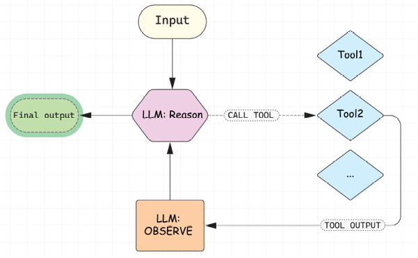
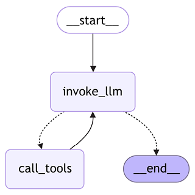

# Building Intelligent Agents

As generative AI adoption grows, we start using LLMs for more open and complex tasks that require knowledge about fresh events or interaction with the world. This is what is generally called agentic applications. We'll define what an agent is later in this chapter, but you've likely seen the phrase circulating in the media: _2025 is the year of agentic AI_. For example, in a recently introduced RE-Bench benchmark that consists of complex open-ended tasks, AI agents outperform humans in some settings (for example, with a thinking budget of 30 minutes) or on some specific class of tasks (like writing Triton kernels).

To understand how these agentic capabilities are built in practice, we'll start by discussing tool calling with LLMs and how it is implemented on LangChain. We'll look in detail at the ReACT pattern, and how LLMs can use tools to interact with the external environment and improve their performance on specific tasks. Then, we'll touch on how tools are defined in LangChain, and which pre-built tools are available. We'll also talk about developing your own custom tools, handling errors, and using advanced tool-calling capabilities. As a practical example, we'll look at how to generate structured outputs with LLM using tools versus utilizing built-in capabilities offered by model providers.

Finally, we'll talk about what agents are and look into more advanced patterns of building agents with LangGraph before we then develop our first ReACT agent with LangGraph—a research agent that follows a plan-and-solve design pattern and uses tools such as web search, _arXiv_, and _Wikipedia_.

In a nutshell, the following topics will be covered in this chapter:

- What is a tool?
- Defining built-in LangChain tools and custom tools
- Advanced tool-calling capabilities
- Incorporating tools into workflows
- What are agents?

<div class="note">
You can find the code for this chapter in the `chapter5/` directory of the book's GitHub repository. Please visit [https://github.com/benman1/generative_ai_with_langchain/tree/second_edition](https://github.com/benman1/generative_ai_with_langchain/tree/second_edition) for the latest updates.

See [Chapter 2](Chapter_2.xhtml#_idTextAnchor025) for setup instructions. If you have any questions or encounter issues while running the code, please create an issue on GitHub or join the discussion on Discord at [https://packt.link/lang](https://packt.link/lang).

</div>

Let's begin with tools. Rather than diving straight into defining what an agent is, it's more helpful to first explore how enhancing LLMs with tools actually works in practice. By walking through this step by step, you'll see how these integrations unlock new capabilities. So, what exactly are tools, and how do they extend what LLMs can do?

## What is a tool?

LLMs are trained on vast general corpus data (like web data and books), which gives them broad knowledge but limits their effectiveness in tasks that require domain-specific or up-to-date knowledge. However, because LLMs are good at reasoning, they can interact with the external environment through tools—APIs or interfaces that allow the model to interact with the external world. These tools enable LLMs to perform specific tasks and receive feedback from the external world.

When using tools, LLMs perform three specific generation tasks:

1. Choose a tool to use by generating special tokens and the name of the tool.
2. Generate a payload to be sent to the tool.
3. Generate a response to a user based on the initial question and a history of interactions with tools (for this specific run).

Now it's time to figure out how LLMs invoke tools and how we can make LLMs tool-aware. Consider a somewhat artificial but illustrative question: _What is the square root of the current US president's age multiplied by 132_? This question presents two specific challenges:

- It references current information (as of March 2025) that likely falls outside the model's training data.
- It requires a precise mathematical calculation that LLMs might not be able to answer correctly just by autoregressive token generation.

Rather than forcing an LLM to generate an answer solely based on its internal knowledge, we'll give an LLM access to two tools: a search engine and a calculator. We expect the model to determine which tools it needs (if any) and how to use them.

For clarity, let's start with a simpler question and mock our tools by creating dummy functions that always give the same response. Later in this chapter, we'll implement fully functional tools and invoke them:

```python
question = "how old is the US president?"
raw_prompt_template = (
  "You have access to search engine that provides you an "
  "information about fresh events and news given the query. "
  "Given the question, decide whether you need an additional "
  "information from the search engine (reply with 'SEARCH: "
  "<generated query>' or you know enough to answer the user "
  "then reply with 'RESPONSE <final response>').\n"
  "Now, act to answer a user question:\n{QUESTION}"
)
prompt_template = PromptTemplate.from_template(raw_prompt_template)
result = (prompt_template | llm).invoke(question)
print(result,response)
```

```
>> SEARCH: current age of US president
```

Let's make sure that when the LLM has enough internal knowledge, it replies directly to the user:

```python
question1 = "What is the capital of Germany?"
result = (prompt_template | llm).invoke(question1)
print(result,response)
```

```
>> RESPONSE: Berlin
```

Finally, let's give the model output of a tool by incorporating it into a prompt:

```python
query = "age of current US president"
search_result = (
   "Donald Trump ' Age 78 years June 14, 1946\n"
   "Donald Trump 45th and 47th U.S. President Donald John Trump is an American "
   "politician, media personality, and businessman who has served as the 47th "
   "president of the United States since January 20, 2025. A member of the "
   "Republican Party, he previously served as the 45th president from 2017 to 2021. Wikipedia"
)
raw_prompt_template = (
 "You have access to search engine that provides you an "
 "information about fresh events and news given the query. "
 "Given the question, decide whether you need an additional "
 "information from the search engine (reply with 'SEARCH: "
 "<generated query>' or you know enough to answer the user "
 "then reply with 'RESPONSE <final response>').\n"
 "Today is {date}."
 "Now, act to answer a user question and "
 "take into account your previous actions:\n"
 "HUMAN: {question}\n"
 "AI: SEARCH: {query}\n"
 "RESPONSE FROM SEARCH: {search_result}\n"
)
prompt_template = PromptTemplate.from_template(raw_prompt_template)
result = (prompt_template | llm).invoke(
  {"question": question, "query": query, "search_result": search_result,
   "date": "Feb 2025"})
print(result.content)
```

```
>>  RESPONSE: The current US President, Donald Trump, is 78 years old.
```

As a last observation, if the search result is not successful, the LLM will try to refine the query:

```python
query = "current US president"
search_result = (
   "Donald Trump 45th and 47th U.S."
)
result = (prompt_template | llm).invoke(
  {"question": question, "query": query,
   "search_result": search_result, "date": "Feb 2025"})
print(result.content)
```

```
>>  SEARCH: Donald Trump age
```

With that, we have demonstrated how tool calling works. Please note that we've provided prompt examples for demonstration purposes only. Another foundational LLM might require some prompt engineering, and our prompts are just an illustration. And good news: using tools is easier than it seems from these examples!

As you can note, we described everything in our prompt, including a tool description and a tool-calling format. These days, most LLMs provide a better API for tool calling since modern LLMs are post-trained on datasets that help them excel in such tasks. The LLMs' creators know how these datasets were constructed. That's why, typically, you don't incorporate a tool description yourself in the prompt; you just provide both a prompt and a tool description as separate arguments, and they are combined into a single prompt on the provider's side. Some smaller open-source LLMs expect tool descriptions to be part of the raw prompt, but they would expect a well-defined format.

LangChain makes it easy to develop pipelines where an LLM invokes different tools and provides access to many helpful built-in tools. Let's look at how tool handling works with LangChain.

## Tools in LangChain

With most modern LLMs, to use tools, you can provide a list of tool descriptions as a separate argument. As always in LangChain, each particular integration implementation maps the interface to the provider's API. For tools, this happens through LangChain's `tools` argument to the `invoke` method (and some other useful methods such as `bind_tools` and others, as we will learn in this chapter).

When defining a tool, we need to specify its schema in OpenAPI format. We provide a _title_ and a _description_ of the tool and also specify its parameters (each parameter has a _type_, _title_, and _description_). We can inherit such a schema from various formats, which LangChain translates into OpenAPI format. As we go through the next few sections, we'll illustrate how we can do this from functions, docstrings, Pydantic definitions, or by inheriting from a `BaseTool` class and providing descriptions directly. For an LLM, a tool is anything that has an OpenAPI specification—in other words, it can be called by some external mechanism.

The LLM itself doesn't bother about this mechanism, it only produces instructions for when and how to call a tool. For LangChain, a tool is also something that can be called (and we will see later that tools are inherited from `Runnables`) when we execute our program.

The wording that you use in the _title_ and _description_ fields is extremely important, and you can treat it as a part of the prompt engineering exercise. Better wording helps LLMs make better decisions on when and how to call a specific tool. Please note that for more complex tools, writing a schema like this can become tedious, and we'll see a simpler way to define tools later in this chapter:

```python
search_tool = {
   "title": "google_search",
    "description": "Returns about fresh events and news from Google Search engine based on a query",
   "type": "object",
   "properties": {
       "query": {
           "description": "Search query to be sent to the search engine",
           "title": "search_query",
           "type": "string"},
   },
   "required": ["query"]
}
result = llm.invoke(question, tools=[search_tool])
```

If we inspect the `result.content` field, it would be empty. That's because the LLM has decided to call a tool, and the output message has a hint for that. What happens under the hood is that LangChain maps a specific output format of the model provider into a unified tool-calling format:

```python
print(result.tool_calls)
```

```
>> [{'name': 'google_search', 'args': {'query': 'age of Donald Trump'}, 'id': '6ab0de4b-f350-4743-a4c1-d6f6fcce9d34', 'type': 'tool_call'}]
```

Keep in mind that some model providers might return non-empty content even in the case of tool calling (for example, there might be reasoning traces on why the model decided to call a tool). You need to look at the model provider specification to understand how to treat such cases.

As we can see, an LLM returned an array of tool-calling dictionaries—each of them contains a unique identifier, the name of the tool to be called, and a dictionary with arguments to be provided to this tool. Let's move to the next step and invoke the model again:

```python
from langchain_core.messages import SystemMessage, HumanMessage, ToolMessage
tool_result = ToolMessage(content="Donald Trump ' Age 78 years June 14, 1946\n", tool_call_id=step1.tool_calls[0]["id"])
step2 = llm.invoke([
   HumanMessage(content=question), step1, tool_result], tools=[search_tool])
assert len(step2.tool_calls) == 0
print(step2.content)
```

```
>> Donald Trump is 78 years old.
```

`ToolMessage` is a special message on LangChain that allows you to feed the output of a tool execution back to the model. The `content` field of such a message contains the tool's output, and a special field `tool_call_id` maps it to the specific tool calling that was generated by the model. Now, we can send the whole sequence (consisting of the initial output, the step with tool calling, and the output) back to the model as a list of messages.

It might be odd to always pass a list of tools to the LLM (since, typically, such a list is fixed for a given workflow). For that reason, LangChain `Runnables` offer a `bind` method that memorizes arguments and adds them to every further invocation. Take a look at the following code:

```python
llm_with_tools = llm.bind(tools=[search_tool])
llm_with_tools.invoke(question)
```

When we call `llm.bind(tools=[search_tool])`, LangChain creates a new object (assigned here to `llm_with_tools`) that automatically includes `[search_tool]` in every subsequent call to a copy of the initial `llm `one. Essentially, you no longer need to pass the tools argument with each `invoke` method. So, calling the preceding code is the same as doing:

```python
llm.invoke(question, tools=[search_tool)
```

This is because bind has "memorized" your tools list for all future invocations. It's mainly a convenience feature—ideal if you want a fixed set of tools for repeated calls rather than specifying them every time. Now let's see how we can utilize tool calling even more, and improve LLM reasoning!

## ReACT

As you have probably thought already, LLMs can call multiple tools before generating the final reply to the user (and the next tool to be called or a payload sent to this tool might depend on the outcome from the previous tool calls). This was proposed by a ReACT approach introduced in 2022 by researchers from Princeton University and Google Research: _Reasoning and ACT_ ([https://arxiv.org/abs/2210.03629](https://arxiv.org/abs/2210.03629)). The idea is simple—we should give the LLM access to tools as a way to interact with an external environment, and let the LLM run in a loop:

- **Reason**: Generate a text output with observations about the current situation and a plan to solve the task.
- **Act**: Take an action based on the reasoning above (interact with the environment by calling a tool, or respond to the user).

It has been demonstrated that ReACT can help reduce hallucination rates compared to CoT prompting, which we discussed in [Chapter 3](Chapter_3.xhtml#_idTextAnchor049).



Let's build a ReACT application ourselves. First, let's create mocked search and calculator tools:

```python
import math
def mocked_google_search(query: str) -> str:
 print(f"CALLED GOOGLE_SEARCH with query={query}")
 return "Donald Trump is a president of USA and he's 78 years old"
def mocked_calculator(expression: str) -> float:
 print(f"CALLED CALCULATOR with expression={expression}")
 if "sqrt" in expression:
   return math.sqrt(78*132)
 return 78*132
```

In the next section, we'll see how we can build actual tools. For now, let's define a schema for the calculator tool and make the LLM aware of both tools it can use. We'll also use building blocks that we're already familiar with—`ChatPromptTemplate` and `MessagesPlaceholder`—to prepend a predetermined system message when we call our graph:

```python
from langchain.prompts import ChatPromptTemplate, MessagesPlaceholder
calculator_tool = {
  "title": "calculator",
   "description": "Computes mathematical expressions",
  "type": "object",
  "properties": {
      "expression": {
          "description": "A mathematical expression to be evaluated by a calculator",
          "title": "expression",
          "type": "string"},
  },
  "required": ["expression"]
}
prompt = ChatPromptTemplate.from_messages([
   ("system", "Always use a calculator for mathematical computations, and use Google Search for information about fresh events and news."),
   MessagesPlaceholder(variable_name="messages"),
])
llm_with_tools = llm.bind(tools=[search_tool, calculator_tool]).bind(prompt=prompt)
```

Now that we have an LLM that can call tools, let's create the nodes we need. We need one function that calls an LLM, another function that invokes tools and returns tool-calling results (by appending `ToolMessages` to the list of messages in the state), and a function that will determine whether the orchestrator should continue calling tools or whether it can return the result to the user:

```python
from typing import TypedDict
from langgraph.graph import MessagesState, StateGraph, START, END
def invoke_llm(state: MessagesState):
   return {"messages": [llm_with_tools.invoke(state["messages"])]}
def call_tools(state: MessagesState):
   last_message = state["messages"][-1]
   tool_calls = last_message.tool_calls
   new_messages = []
   for tool_call in tool_calls:
     if tool_call["name"] == "google_search":
       tool_result = mocked_google_search(**tool_call["args"])
       new_messages.append(ToolMessage(content=tool_result, tool_call_id=tool_call["id"]))
     elif tool_call["name"] == "calculator":
       tool_result = mocked_calculator(**tool_call["args"])
       new_messages.append(ToolMessage(content=tool_result, tool_call_id=tool_call["id"]))
     else:
       raise ValueError(f"Tool {tool_call['name']} is not defined!")
   return {"messages": new_messages}
def should_run_tools(state: MessagesState):
   last_message = state["messages"][-1]
   if last_message.tool_calls:
     return "call_tools"
   return END
```

Now let's bring everything together in a LangGraph workflow:

```python
builder = StateGraph(MessagesState)
builder.add_node("invoke_llm", invoke_llm)
builder.add_node("call_tools", call_tools)
builder.add_edge(START, "invoke_llm")
builder.add_conditional_edges("invoke_llm", should_run_tools)
builder.add_edge("call_tools", "invoke_llm")
graph = builder.compile()
question = "What is a square root of the current US president's age multiplied by 132?"
result = graph.invoke({"messages": [HumanMessage(content=question)]})
print(result["messages"][-1].content)
```

```
>> CALLED GOOGLE_SEARCH with query=age of Donald Trump
CALLED CALCULATOR with expression=78 * 132
CALLED CALCULATOR with expression=sqrt(10296)
The square root of 78 multiplied by 132 (which is 10296) is approximately 101.47.
```

This demonstrates how the LLM made several calls to handle a complex question—first, to `Google Search` and then two calls to `Calculator`—and each time, it used the previously received information to adjust its actions. This is the ReACT pattern in action.

With that, we've learned how the ReACT pattern works in detail by building it ourselves. The good news is that LangGraph offers a pre-built implementation of a ReACT pattern, so you don't need to implement it yourself:

```python
from langgraph.prebuilt import create_react_agent
agent = create_react_agent(
  llm=llm,
  tools=[search_tool, calculator_tool],
  prompt=system_prompt)
```

In [Chapter 6](Chapter_6.xhtml#_idTextAnchor132), we'll see some additional adjustments you can use with the `create_react_agent` function.

# Defining tools

So far, we have defined tools as OpenAPI schemas. But to run the workflow end to end, LangGraph should be able to call tools itself during the execution. Hence, in this section, let's discuss how we define tools as Python functions or callables.

A LangChain tool has three essential components:

- `Name`: A unique identifier for the tool
- `Description`: Text that helps the LLM understand when and how to use the tool
- `Payload schema`: A structured definition of the inputs the tool accepts

It allows an LLM to decide when and how to call a tool. Another important distinction of a LangChain tool is that it can be executed by an orchestrator, such as LangGraph. The base interface for a tool is `BaseTool`, which inherits from a `RunnableSerializable` itself. That means it can be invoked or batched as any `Runnable`, or serialized or deserialized as any `Serializable`.

## Built-in LangChain tools

LangChain has many tools already available across various categories. Since tools are often provided by third-party vendors, some tools require paid API keys, some of them are completely free, and some of them have a free tier. Some tools are grouped together in toolkits—collections of tools that are supposed to be used together when working on a specific task. Let's see some examples of using tools.

Tools give an LLM access to search engines, such as Bing, DuckDuckGo, Google, and Tavily. Let's take a look at `DuckDuckGoSearchRun` as this search engine doesn't require additional registration and an API key.

Please see [Chapter 2](Chapter_2.xhtml#_idTextAnchor025) for setup instructions. If you have any questions or encounter issues while running the code, please create an issue on GitHub or join the discussion on Discord at [https://packt.link/lang](https://packt.link/lang).

As with any tool, this tool has a name, description, and schema for input arguments:

```python
from langchain_community.tools import DuckDuckGoSearchRun
search = DuckDuckGoSearchRun()
print(f"Tool's name = {search.name}")
print(f"Tool's name = {search.description}")
print(f"Tool's arg schema = f{search.args_schema}")
```

```
>> Tool's name = fduckduckgo_search
Tool's name = fA wrapper around DuckDuckGo Search. Useful for when you need to answer questions about current events. Input should be a search query.
Tool's arg schema = class 'langchain_community.tools.ddg_search.tool.DDGInput'
```

The argument schema, `arg_schema`, is a Pydantic model and we'll see why it's useful later in this chapter. We can explore its fields either programmatically or by going to the documentation page—it expects only one input field, a query:

```python
from langchain_community.tools.ddg_search.tool import DDGInput
print(DDGInput.__fields__)
```

```
>> {'query': FieldInfo(annotation=str, required=True, description='search query to look up')}
```

Now we can invoke this tool and get a string output back (results from the search engine):

```python
query = "What is the weather in Munich like tomorrow?"
search_input = DDGInput(query=query)
result = search.invoke(search_input.dict())
print(result)
```

We can also invoke the LLM with tools, and let's make sure that the LLM invokes the search tool and does not answer directly:

```python
result = llm.invoke(query, tools=[search])
print(result.tool_calls[0])
```

```
>> {'name': 'duckduckgo_search', 'args': {'query': 'weather in Munich tomorrow'}, 'id': '222dc19c-956f-4264-bf0f-632655a6717d', 'type': 'tool_call'}
```

Our tool is now a callable that LangGraph can call programmatically. Let's put everything together and create our first agent. When we stream our graph, we get updates to the state. In our case, these are only messages:

```python
from langgraph.prebuilt import create_react_agent
agent = create_react_agent(model=llm, tools=[search])
```



That's exactly what we saw earlier as well—an LLM is calling tools until it decides to stop and return the answer to the user. Let's test it out!

When we stream LangGraph, we get new events that are updates to the graph's state. We're interested in the `message` field of the state. Let's print out the new messages added:

```python
for event in agent.stream({"messages": [("user", query)]}):
 update = event.get("agent", event.get("tools", {}))
 for message in update.get("messages", []):
    message.pretty_print()
```

```
>> ================================ Ai Message ==================================
Tool Calls:
  duckduckgo_search (a01a4012-bfc0-4eae-9c81-f11fd3ecb52c)
 Call ID: a01a4012-bfc0-4eae-9c81-f11fd3ecb52c
  Args:
    query: weather in Munich tomorrow
================================= Tool Message =================================
Name: duckduckgo_search
The temperature in Munich tomorrow in the early morning is 4 ° C… <TRUNCATED>
================================== Ai Message ==================================
The weather in Munich tomorrow will be 5°C with a 0% chance of rain in the morning.  The wind will blow at 11 km/h.  Later in the day, the high will be 53°F (approximately 12°C).  It will be clear in the early morning.
```

Our agent is represented by a list of messages since this is the input and output that the LLM expects. We'll see that pattern again when we dive deeper into agentic architectures and discuss it in the next chapter. For now, let's briefly mention other types of tools that are already available on LangChain:

- **Tools that enhance the LLM's knowledge besides using a search engine**:
  - Academic research: arXiv and PubMed
  - Knowledge bases: Wikipedia and Wikidata
  - Financial data: Alpha Vantage, Polygon, and Yahoo Finance
  - Weather: OpenWeatherMap
  - Computation: Wolfram Alpha
- **Tools that enhance your productivity**: You can interact with Gmail, Slack, Office 365, Google Calendar, Jira, Github, etc. For example, `GmailToolkit` gives you access to `GmailCreateDraft`, `GmailSendMessage`, `GmailSearch`, `GmailGetMessage`, and `GmailGetThread` tools that allow you to search, retrieve, create, and send messages with your Gmail account. As you can see, not only can you give the LLM additional context about the user but, with some of these tools, LLMs can take actions that actually influence the outside environment, such as creating a pull request on GitHub or sending a message on Slack!
- **Tools that give an LLM access to a code interpreter**: These tools give LLMs access to a code interpreter by remotely launching an isolated container and giving LLMs access to this container. These tools require an API key from a vendor providing the sandboxes. LLMs are especially good at coding, and it's a widely used pattern to ask an LLM to solve some complex task by writing code that solves it instead of asking it to generate tokens that represent the solution of the task. Of course, you should execute code generated by LLMs with caution, and that's why isolated sandboxes play a huge role. Some examples are:
  - Code execution: Python REPL and Bash
  - Cloud services: AWS Lambda
  - API tools: GraphQL and Requests
  - File operations: File System
- **Tools that give an LLM access to databases by writing and executing SQL code**: For example, `SQLDatabase` includes tools to get information about the database and its objects and execute SQL queries. You can also access Google Drive with `GoogleDriveLoader` or perform operations with usual file system tools from a `FileManagementToolkit`.
- **Other tools**: These comprise tools that integrate third-party systems and allow the LLM to gather additional information or act. There are also tools that can integrate data retrieval from Google Maps, NASA, and other platforms and organizations.
- **Tools for using other AI systems or automation**:
  - Image generation: DALL-E and Imagen
  - Speech synthesis: Google Cloud TTS and Eleven Labs
  - Model access: Hugging Face Hub
  - Workflow automation: Zapier and IFTTT

Any external system with an API can be wrapped as a tool if it enhances an LLM like this:

- Provides relevant domain knowledge to the user or the workflow
- Allows an LLM to take actions on the user's behalf

When integrating such tools with LangChain, consider these key aspects:

- **Authentication**: Secure access to the external system
- **Payload schema**: Define proper data structures for input/output
- **Error handling**: Plan for failures and edge cases
- **Safety considerations**: For example, when developing a SQL-to-text agent, restrict access to read-only operations to prevent unintended modifications

Therefore, an important toolkit is the `RequestsToolkit`, which allows one to easily wrap any HTTP API:

```python
from langchain_community.agent_toolkits.openapi.toolkit import RequestsToolkit
from langchain_community.utilities.requests import TextRequestsWrapper
toolkit = RequestsToolkit(
   requests_wrapper=TextRequestsWrapper(headers={}),
   allow_dangerous_requests=True,
)
for tool in toolkit.get_tools():
 print(tool.name)
```

```
>> requests_get
requests_post
requests_patch
requests_put
requests_delete
```

Let's take a free open-source currency API ([https://frankfurter.dev/](https://frankfurter.dev/)). It's a random free API we took from the Internet for illustrative purposes only, just to show you how you can wrap any existing API as a tool. First, we need to put together an API spec based on the OpenAPI format. We truncated the spec but you can find the full version on our GitHub:

```python
api_spec = """
openapi: 3.0.0
info:
 title: Frankfurter Currency Exchange API
 version: v1
 description: API for retrieving currency exchange rates. Pay attention to the base currency and change it if needed.
servers:
 - url: https://api.frankfurter.dev/v1
paths:
 /v1/latest:
   get:
     summary: Get the latest exchange rates.
     parameters:
       - in: query
         name: symbols
         schema:
           type: string
         description: Comma-separated list of currency symbols to retrieve rates for. Example: CHF,GBP
       - in: query
         name: base
         schema:
           type: string
         description: The base currency for the exchange rates. If not provided, EUR is used as a base currency. Example: USD
   /v1/{date}:
   ...
"""
```

Now let's build and run our ReACT agent; we'll see that the LLM can query the third-party API and provide fresh answers on currency exchange rates:

```python
system_message = (
 "You're given the API spec:\n{api_spec}\n"
 "Use the API to answer users' queries if possible. "
)
agent = create_react_agent(llm, toolkit.get_tools(), state_modifier=system_message.format(api_spec=api_spec))
query = "What is the swiss franc to US dollar exchange rate?"
events = agent.stream(
   {"messages": [("user", query)]},
   stream_mode="values",
)
for event in events:
   event["messages"][-1].pretty_print()
```

```
>> ============================== Human Message =================================
What is the swiss franc to US dollar exchange rate?
================================== Ai Message ==================================
Tool Calls:
  requests_get (541a9197-888d-4ffe-a354-c726804ad7ff)
 Call ID: 541a9197-888d-4ffe-a354-c726804ad7ff
  Args:
    url: https://api.frankfurter.dev/v1/latest?symbols=CHF&base=USD
================================= Tool Message =================================
Name: requests_get
{"amount":1.0,"base":"USD","date":"2025-01-31","rates":{"CHF":0.90917}}
================================== Ai Message ==================================
The Swiss franc to US dollar exchange rate is 0.90917.
```

Observe that, this time, we use a `stream_mode="values"` option, and in this option, each time, we get a full current state from the graph.

<div class="note">
There are over 50 tools already available. You can find a full list on the documentation page: [https://python.langchain.com/docs/integrations/tools/](https://python.langchain.com/docs/integrations/tools/). 
</div>

## Custom tools

We looked at the variety of built-in tools offered by LangGraph. Now it's time to discuss how you can create your own custom tools, besides the example we looked at when we wrapped the third-party API with the `RequestsToolkit` by providing an API spec. Let's get down to it!

### Wrapping a Python function as a tool

Any `Python` function (or callable) can be wrapped as a tool. As we remember, a tool on LangChain should have a name, a description, and an argument schema. Let's build our own calculator based on the Python `numexr` library—a fast numerical expression evaluator based on NumPy ([https://github.com/pydata/numexpr](https://github.com/pydata/numexpr)). We're going to use a special `@tool` decorator that will wrap our function as a tool:

```python
import math
from langchain_core.tools import tool
import numexpr as ne
@tool
def calculator(expression: str) -> str:
   """Calculates a single mathematical expression, incl. complex numbers.

    Always add * to operations, examples:
      73i -> 73*i
      7pi**2 -> 7*pi**2
   """
   math_constants = {"pi": math.pi, "i": 1j, "e": math.exp}
   result = ne.evaluate(expression.strip(), local_dict=math_constants)
   return str(result)
```

Let's explore the calculator object we have! Notice that LangChain auto-inherited the name, the description, and args schema from the docstring and type hints. Please note that we used a few-shot technique (discussed in [Chapter 3](Chapter_3.xhtml#_idTextAnchor049)) to teach LLMs how to prepare the payload for our tool by adding two examples in the docstring:

```python
from langchain_core.tools import BaseTool
assert isinstance(calculator, BaseTool)
print(f"Tool schema: {calculator.args_schema.model_json_schema()}")
```

```
>> Tool schema: {'description': 'Calculates a single mathematical expression, incl. complex numbers.\n\nAlways add * to operations, examples:\n  73i -> 73*i\n  7pi**2 -> 7*pi**2', 'properties': {'expression': {'title': 'Expression', 'type': 'string'}}, 'required': ['expression'], 'title': 'calculator', 'type': 'object'}
```

Let's try out our new tool to evaluate an expression with complex numbers, which extend real numbers with a special imaginary unit `i` that has a property `i**2=-1`:

```python
query = "How much is 2+3i squared?"
agent = create_react_agent(llm, [calculator])
for event in agent.stream({"messages": [("user", query)]}, stream_mode="values"):
   event["messages"][-1].pretty_print()
```

```
>> ===============================Human Message =================================
How much is 2+3i squared?
================================== Ai Message ==================================
Tool Calls:
  calculator (9b06de35-a31c-41f3-a702-6e20698bf21b)
 Call ID: 9b06de35-a31c-41f3-a702-6e20698bf21b
  Args:
    expression: (2+3*i)**2
================================= Tool Message =================================
Name: calculator
(-5+12j)
================================== Ai Message ==================================
(2+3i)² = -5+12i.
```

With just a few lines of code, we've successfully extended our LLM's capabilities to work with complex numbers. Now we can put together the example we started with:

```python
question = "What is a square root of the current US president's age multiplied by 132?"
system_hint = "Think step-by-step. Always use search to get the fresh information about events or public facts that can change over time."
agent = create_react_agent(
   llm, [calculator, search],
   state_modifier=system_hint)
for event in agent.stream({"messages": [("user", question)]}, stream_mode="values"):
   event["messages"][-1].pretty_print()
print(event["messages"][-1].content)
```

```
>> The square root of Donald Trump's age multiplied by 132 is approximately 101.47.
```

We haven't provided the full output here in the book (you can find it on our GitHub), but if you run this snippet, you should see that the LLM was able to query tools step by step:

1. It called the search engine with the query `"current US president"`.
2. Then, it again called the search engine with the query `"donald trump age"`.
3. As the last step, the LLM called the calculator tool with the expression `"sqrt(78*132)"`.
4. Finally, it returned the correct answer to the user.

At every step, the LLM reasoned based on the previously collected information and then acted with an appropriate tool—that's the essence of the ReACT approach.

### Creating a tool from a Runnable

Sometimes, LangChain might not be able to derive a passing description or args schema from a function, or we might be using a complex callable that is difficult to wrap with a decorator. For example, we can use another LangChain chain or LangGraph graph as a tool. We can create a tool from any `Runnable` by explicitly specifying all needed descriptions. Let's create a calculator tool from a function in an alternative fashion, and we will tune the retry behavior (in our case, we're going to retry three times and add an exponential backoff between consecutive attempts):

<div class="note">
Please note that we use the same function as above but we removed the `@tool` decorator.
</div>

```python
from langchain_core.runnables import RunnableLambda, RunnableConfig
from langchain_core.tools import tool, convert_runnable_to_tool
def calculator(expression: str) -> str:
   math_constants = {"pi": math.pi, "i": 1j, "e": math.exp}
   result = ne.evaluate(expression.strip(), local_dict=math_constants)
   return str(result)
calculator_with_retry = RunnableLambda(calculator).with_retry(
   wait_exponential_jitter=True,
   stop_after_attempt=3,
)
calculator_tool = convert_runnable_to_tool(
   calculator_with_retry,
   name="calculator",
   description=(
       "Calculates a single mathematical expression, incl. complex numbers."
       "'\nAlways add * to operations, examples:\n73i -> 73*i\n"
       "7pi**2 -> 7*pi**2"
   ),
   arg_types={"expression": "str"},
)
```

Observe that we defined our function in a similar way to how we define LangGraph nodes—it takes a state (which now is a Pydantic model) and a config. Then, we wrapped this function as `RunnableLambda` and added retries. It might be useful if we want to keep our Python function as a function without wrapping it with a decorator, or if we want to wrap an external API (hence, description and arguments schema can't be auto-inherited from the docstrings). We can use any Runnable (for example, a chain or a graph) to create a tool, and that allows us to build multi-agent systems since now one LLM-based workflow can invoke another LLM-based one. Let's convert our Runnable to a tool:

```python
calculator_tool = convert_runnable_to_tool(
   calculator_with_retry,
   name="calculator",
   description=(
       "Calculates a single mathematical expression, incl. complex numbers."
       "'\nAlways add * to operations, examples:\n73i -> 73*i\n"
       "7pi**2 -> 7*pi**2"
   ),
   arg_types={"expression": "str"},
)
```

Let's test our new `calculator` function with the LLM:

```python
llm.invoke("How much is (2+3i)**2", tools=[calculator_tool]).tool_calls[0]
```

```
>> {'name': 'calculator',
 'args': {'__arg1': '(2+3*i)**2'},
 'id': '46c7e71c-4092-4299-8749-1b24a010d6d6',
 'type': 'tool_call'}
```

As you can note, LangChain didn't inherit the `args` schema fully; that's why it created artificial names for arguments like `__arg1`. Let's change our tool to accept a Pydantic model instead, in a similar fashion to how we define LangGraph nodes:

```python
from pydantic import BaseModel, Field
from langchain_core.runnables import RunnableConfig
class CalculatorArgs(BaseModel):
   expression: str = Field(description="Mathematical expression to be evaluated")
def calculator(state: CalculatorArgs, config: RunnableConfig) -> str:
   expression = state["expression"]
   math_constants = config["configurable"].get("math_constants", {})
   result = ne.evaluate(expression.strip(), local_dict=math_constants)
   return str(result)
```

Now the full schema is a proper one:

```python
assert isinstance(calculator_tool, BaseTool)
print(f"Tool name: {calculator_tool.name}")
print(f"Tool description: {calculator_tool.description}")
print(f"Args schema: {calculator_tool.args_schema.model_json_schema()}")
```

```
>> Tool name: calculator
Tool description: Calculates a single mathematical expression, incl. complex numbers.'
Always add * to operations, examples:
73i -> 73*i
7pi**2 -> 7*pi**2
Args schema: {'properties': {'expression': {'title': 'Expression', 'type': 'string'}}, 'required': ['expression'], 'title': 'calculator', 'type': 'object'}
```

Let's test it together with an LLM:

```python
tool_call = llm.invoke("How much is (2+3i)**2", tools=[calculator_tool]).tool_calls[0]
print(tool_call)
```

```
>> {'name': 'calculator', 'args': {'expression': '(2+3*i)**2'}, 'id': 'f8be9cbc-4bdc-4107-8cfb-fd84f5030299', 'type': 'tool_call'}
```

We can call our calculator tool and pass it to the LangGraph configuration in runtime:

```python
math_constants = {"pi": math.pi, "i": 1j, "e": math.exp}
config = {"configurable": {"math_constants": math_constants}}
calculator_tool.invoke(tool_call["args"], config=config)
```

```
>> (-5+12j)
```

With that, we have learned how we can easily convert any Runnable to a tool by providing additional details to LangChain to ensure an LLM can correctly handle this tool.
