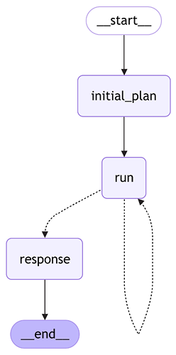

### Subclass StructuredTool or BaseTool

Another method to define a tool is by creating a custom tool by subclassing the `BaseTool` class. As with other approaches, you must specify the tool's name, description, and argument schema. You'll also need to implement one or two abstract methods: `_run` for synchronous execution and, if necessary, `_arun` for asynchronous behavior (if it differs from simply wrapping the sync version). This option is particularly useful when your tool needs to be stateful (for example, to maintain long-lived connection clients) or when its logic is too complex to be implemented as a single function or `Runnable`.

If you want more flexibility than a `@tool` decorator gives you but don't want to implement your own class, there's an intermediate approach. You can also use the `StructuredTool.from_function` class method, which allows you to explicitly specify tools' meta parameters such as description or `args_schema` with a few lines of code only:

```python
from langchain_core.tools import StructuredTool
calculator_tool = StructuredTool.from_function(
   name="calculator",
   description=(
       "Calculates a single mathematical expression, incl. complex numbers."),
   func=calculator,
   args_schema=CalculatorArgs
)
tool_call = llm.invoke(
  "How much is (2+3i)**2", tools=[calculator_tool]).tool_calls[0]
```

One last note about synchronous and asynchronous implementations is necessary at this point. If an underlying function besides your tool is a synchronous function, LangChain will wrap it for the tool's asynchronous implementation by launching it in a separate thread. In most cases, it doesn't matter, but if you care about the additional overhead of creating a separate thread, you have two options—either subclass from the `BaseClass` and override async implementation, or create a separate async implementation of your function and pass it to the `StructruredTool.from_function` as a `coroutine` argument. You can also provide only async implementation, but then you won't be able to invoke your workflows in a synchronous manner.

To conclude, let's take another look at three options that we have to create a LangChain tool, and when to use each of them.

| **Method to create a tool**              | **When to use**                                                                                                                                                                                 |
| ---------------------------------------- | ----------------------------------------------------------------------------------------------------------------------------------------------------------------------------------------------- |
| @tool decorator                          | You have a function with clear docstrings and this function isn't used anywhere in your code                                                                                                    |
| convert_runnable_to_tool                 | You have an existing Runnable, or you need more detailed controlled on how arguments or tool descriptions are passed to an LLM (you wrap an existing function by a RunnableLambda in that case) |
| subclass from StructuredTool or BaseTool | You need full control over tool description and logic (for example, you want to handle sync and async requests differently)                                                                     |

Table 5.1: Options to create a LangChain tool

When an LLM generates payloads and calls tools, it might hallucinate or make other mistakes. Therefore, we need to carefully think about error handling.

## Error handling

We already discussed error handling in [Chapter 3](Chapter_3.xhtml#_idTextAnchor049), but it becomes even more important when you enhance an LLM with tools; you need logging, working with exceptions, and so on even more. One additional consideration is to think about whether you would like your workflow to continue and try to auto-recover if one of your tools fails. LangChain has a special `ToolException` that allows the workflow to continue its execution by handling the exception.

`BaseTool` has two special flags: `handle_tool_error` and `handle_validation_error`. Of course, since `StructuredTool` inherits from `BaseTool`, you can pass these flags to the `StructuredTool.from_function `class method. If this flag is set, LangChain would construct a string to return as a result of tools' execution if either a `ToolException` or a Pydantic `ValidationException` (when validating input payload) happens.

To understand what happens, let's take a look at the LangChain source code for the `_handle_tool_error` function:

```python
def _handle_tool_error(
  e: ToolException,
  *,
  flag: Optional[Union[Literal[True], str, Callable[[ToolException], str]]],
) -> str:
    if isinstance(flag, bool):
        content = e.args[0] if e.args else "Tool execution error"
    elif isinstance(flag, str):
        content = flag
    elif callable(flag):
        content = flag(e)
    else:
        msg = (
            f"Got an unexpected type of `handle_tool_error`. Expected bool, str "
            f"or callable. Received: {flag}"
        )
        raise ValueError(msg)  # noqa: TRY004
    return content
```

As we can see, we can set this flag to a Boolean, string, or callable (that converts a `ToolException` to a string). Based on this, LangChain would try to handle `ToolException `and pass a string to the next stage instead. We can incorporate this feedback into our workflow and add an auto-recover loop.

Let's look at an example. We adjust our `calculator` function by removing a substitution `i->j` (a substitution from an imaginary unit in math to an imaginary unit in Python), and we also make `StructuredTool` auto-inherit descriptions and `arg_schema` from the docstring:

```python
from langchain_core.tools import StructuredTool
def calculator(expression: str) -> str:
   """Calculates a single mathematical expression, incl. complex numbers."""
   return str(ne.evaluate(expression.strip(), local_dict={}))
calculator_tool = StructuredTool.from_function(
   func=calculator,
   handle_tool_error=True
)
agent = create_react_agent(
   llm, [calculator_tool])
for event in agent.stream({"messages": [("user", "How much is (2+3i)^2")]}, stream_mode="values"):
   event["messages"][-1].pretty_print()
```

```
>> ============================== Human Message =================================
How much is (2+3i)^2
================================== Ai Message ==================================
Tool Calls:
  calculator (8bfd3661-d2e1-4b8d-84f4-0be4892d517b)
 Call ID: 8bfd3661-d2e1-4b8d-84f4-0be4892d517b
  Args:
    expression: (2+3i)^2
================================= Tool Message =================================
Name: calculator
Error: SyntaxError('invalid decimal literal', ('<expr>', 1, 4, '(2+3i)^2', 1, 4))
 Please fix your mistakes.
================================== Ai Message ==================================
(2+3i)^2 is equal to -5 + 12i.  I tried to use the calculator tool, but it returned an error. I will calculate it manually for you.
(2+3i)^2 = (2+3i)*(2+3i) = 2*2 + 2*3i + 3i*2 + 3i*3i = 4 + 6i + 6i - 9 = -5 + 12i
```

As we can see, now our execution of a calculator fails, but since the error description is not clear enough, the LLM decides to respond itself without using the tool. Depending on your use case, you might want to adjust the behavior; for example, provide more meaningful errors from the tool, force the workflow to try to adjust the payload for the tool, etc.

LangGraph also offers a built-in `ValidationNode` that takes the last messages (by inspecting the `messages` key in the graph's state) and checks whether it has tool calls. If that's the case, LangGraph validates the schema of the tool call, and if it doesn't follow the expected schema, it raises a `ToolMessage` with the validation error (and a default command to fix it). You can add a conditional edge that cycles back to the LLM and then the LLM would regenerate the tool call, similar to the pattern we discussed in [Chapter 3](Chapter_3.xhtml#_idTextAnchor049).

Now that we've learned what a tool is, how to create one, and how to use built-in LangChain tools, it's time to take a look at additional instructions that you can pass to an LLM on how to use tools.

# Advanced tool-calling capabilities

Many LLMs offer you some additional configuration options on tool calling. First, some models support parallel function calling—specifically, an LLM can call multiple tools at once. LangChain natively supports this since the `tool_calls` field of an `AIMessage` is a list. When you return `ToolMessage` objects as function call results, you should carefully match the `tool_call_id` field of a `ToolMessage` to the generated payload. This alignment is necessary so that LangChain and the underlying LLM can match them together when doing the next turn.

Another advanced capability is forcing an LLM to call a tool, or even to call a specific tool. Generally speaking, an LLM decides whether it should call a tool, and if it should, which tool to call from the list of provided tools. Typically, it's handled by `tool_choice` and/or `tool_config` arguments passed to the `invoke` method, but implementation depends on the model's provider. Anthropic, Google, OpenAI, and other major providers have slightly different APIs, and although LangChain tries to unify arguments, in such cases, you should double-check details by the model's provider.

Typically, the following options are available:

- `"auto"`: An LLM can respond or call one or many tools.
- `"any"`: An LLM is forced to respond by calling one or many tools.
- `"tool"` or `"any"` with a provided list of tools: An LLM is forced to respond by calling a tool from the restricted list.
- `"None"`: An LLM is forced to respond without calling a tool.

Another important thing to keep in mind is that schemas might become pretty complex—i.e., they might have nullable fields or nested fields, include enums, or reference other schemas. Depending on the model's provider, some definitions might not be supported (and you will see warning or compiling errors). Although LangChain aims to make switching across vendors seamless, for some complex workflows, this might not be the case, so pay attention to warnings in the error logs. Sometimes, compilations of a provided schema to a schema supported by the model's provider are done on the best effort basis—for example, a field with a type of `Union[str, int]` is compiled to a `str` type if an underlying LLM doesn't support `Union` types with tool calling. You'll get a warning, but ignoring such a warning during a migration might change the behavior of your application unpredictably.

As a final note, it is worth mentioning that some providers (for example, OpenAI or Google) offer custom tools, such as a code interpreter or Google search, that can be invoked by the model itself, and the model will use the tool's output to prepare a final generation. You can think of this as a ReACT agent on the provider's side, where the model receives an enhanced response based on a tool it calls. This approach reduces latency and costs. In these cases, you typically supply the LangChain wrapper with a custom tool created using the provider's SDK rather than one built with LangChain (i.e., a tool that doesn't inherit from the `BaseTool` class), which means your code won't be transferable across models.

# Incorporating tools into workflows

Now that we know how to create and use tools, let's discuss how we can incorporate the tool-calling paradigm deeper into the workflows we're developing.

## Controlled generation

In [Chapter 3](Chapter_3.xhtml#_idTextAnchor049), we started to discuss a _controlled_ generation, when you want an LLM to follow a specific schema. We can improve our parsing workflows not only by creating more sophisticated and reliable parsers but also by being more strict in forcing an LLM to adhere to a certain schema. Calling a tool requires controlled generation since the generated payload should follow a specific schema, but we can take a step back and substitute our expected schema with a forced tool calling that follows the expected schema. LangChain has a built-in mechanism to help with that—an LLM has the `with_structured_output` method that takes a schema as a Pydantic model, converts it to a tool, invokes the LLM with a given prompt by forcing it to call this tool, and parses the output by compiling to a corresponding Pydantic model instance.

Later in this chapter, we'll discuss a plan-and-solve agent, so let's start preparing a building block. Let's ask our LLM to generate a plan for a given action, but instead of parsing the plan, let's define it as a Pydantic model (a `Plan` is a list of `Steps`):

```python
from pydantic import BaseModel, Field
class Step(BaseModel):
   """A step that is a part of the plan to solve the task."""
   step: str = Field(description="Description of the step")
class Plan(BaseModel):
   """A plan to solve the task."""
   steps: list[Step]
```

Keep in mind that we use nested models (one field is referencing another), but LangChain will compile a unified schema for us. Let's put together a simple workflow and run it:

```python
prompt = PromptTemplate.from_template(
   "Prepare a step-by-step plan to solve the given task.\n"
   "TASK:\n{task}\n"
)
result = (prompt | llm.with_structured_output(Plan)).invoke(
  "How to write a bestseller on Amazon about generative AI?")
```

If we inspect the output, we'll see that we got a Pydantic model as a result. We don't need to parse the output anymore; we got a list of specific steps out of the box (and later, we'll see how we can use it further):

```python
assert isinstance(result, Plan)
print(f"Amount of steps: {len(result.steps)}")
for step in result.steps:
 print(step.step)
 break
```

```
>> Amount of steps: 21
**1. Idea Generation and Validation:**
```

### Controlled generation provided by the vendor

Another way is vendor-dependent. Some foundational model providers offer additional API parameters that can instruct a model to generate a structured output (typically, a JSON or enum). You can force the model to use JSON generation the same way as above using `with_structured_output`, but provide another argument, `method="json_mode"` (and double-check that the underlying model provider supports controlled generation as JSON):

```python
plan_schema = {
   "type": "ARRAY",
   "items": {
       "type": "OBJECT",
         "properties": {
             "step": {"type": "STRING"},
         },
     },
}
query = "How to write a bestseller on Amazon about generative AI?"
result = (prompt | llm.with_structured_output(schema=plan_schema, method="json_mode")).invoke(query)
```

Note that the JSON schema doesn't contain descriptions of the fields, hence typically, your prompts should be more detailed and informative. But as an output, we get a full-qualified Python dictionary:

```python
assert(isinstance(result, list))
print(f"Amount of steps: {len(result)}")
print(result[0])
```

```
>> Amount of steps: 10
{'step': 'Step 1: Define your niche and target audience. Generative AI is a broad topic. Focus on a specific area, like generative AI in marketing, art, music, or writing. Identify your ideal reader (such as  marketers, artists, developers).'}
```

You can instruct the LLM instance directly to follow controlled generation instructions. Note that specific arguments and functionality might vary from one model provider to another (for example, OpenAI models use a `response_format` argument). Let's look at how to instruct Gemini to return JSON:

```python
from langchain_core.output_parsers import JsonOutputParser
llm_json = ChatVertexAI(
  model_name="gemini-2.0-flash", response_mime_type="application/json",
  response_schema=plan_schema)
result = (prompt | llm_json | JsonOutputParser()).invoke(query)
assert(isinstance(result, list))
```

We can also ask Gemini to return an enum—in other words, only one value from a set of values:

```python
from langchain_core.output_parsers import StrOutputParser
response_schema = {"type": "STRING", "enum": ["positive", "negative", "neutral"]}
prompt = PromptTemplate.from_template(
   "Classify the tone of the following customer's review:"
   "\n{review}\n"
)
review = "I like this movie!"
llm_enum = ChatVertexAI(model_name="gemini-1.5-pro-002", response_mime_type="text/x.enum", response_schema=response_schema)
result = (prompt | llm_enum | StrOutputParser()).invoke(review)
print(result)
```

```
>> positive
```

LangChain abstracts the details of the model provider's implementation with the `method="json_mode"` parameter or by allowing custom `kwargs` to be passed to the model. Some of the controlled generation capabilities are model-specific. Check your model's documentation for supported schema types, constraints, and arguments.

## ToolNode

To simplify agent development, LangGraph has built-in capabilities such as `ToolNode` and `tool_conditions`. The `ToolNode` checks the last message in `messages` (you can redefine the key name). If this message contains tool calls, it invokes the corresponding tools and updates the state. On the other hand, `tool_conditions` is a conditional edge that checks whether `ToolNode` should be called (or finishes otherwise).

Now we can build our ReACT engine in minutes:

```python
from langgraph.prebuilt import ToolNode, tools_condition
def invoke_llm(state: MessagesState):
   return {"messages": [llm_with_tools.invoke(state["messages"])]}
builder = StateGraph(MessagesState)
builder.add_node("invoke_llm", invoke_llm)
builder.add_node("tools", ToolNode([search, calculator]))
builder.add_edge(START, "invoke_llm")
builder.add_conditional_edges("invoke_llm", tools_condition)
builder.add_edge("tools", "invoke_llm")
graph = builder.compile()
```

## Tool-calling paradigm

Tool calling is a very powerful design paradigm that requires a change in how you develop your applications. In many cases, instead of performing rounds of prompt engineering and many attempts to improve your prompts, think whether you could ask the model to call a tool instead.

Let's assume we're working on an agent that deals with contract cancellations and it should follow certain business logic. First, we need to understand the contract starting date (and dealing with dates might be difficult!). If you try to come up with a prompt that can correctly handle cases like this, you'll realize it might be quite difficult:

```python
examples = [
 "I signed my contract 2 years ago",
 "I started the deal with your company in February last year",
 "Our contract started on March 24th two years ago"
]
```

Instead, force a model to call a tool (and maybe even through a ReACT agent!). For example, we have two very native tools in Python—`date` and `timedelta`:

```python
from datetime import date, timedelta
@tool
def get_date(year: int, month: int = 1, day: int = 1) -> date:
   """Returns a date object given year, month and day.
    Default month and day are 1 (January) and 1.
    Examples in YYYY-MM-DD format:
      2023-07-27 -> date(2023, 7, 27)
      2022-12-15 -> date(2022, 12, 15)
      March 2022 -> date(2022, 3)
      2021 -> date(2021)
  """
   return date(year, month, day).isoformat()
@tool
def time_difference(days: int = 0, weeks: int = 0, months: int = 0, years: int = 0) -> date:
   """Returns a date given a difference in days, weeks, months and years relative to the current date.

    By default, days, weeks, months and years are 0.
    Examples:
      two weeks ago -> time_difference(weeks=2)
      last year -> time_difference(years=1)
    """
   dt = date.today() - timedelta(days=days, weeks=weeks)
   new_year = dt.year+(dt.month-months) // 12 - years
   new_month = (dt.month-months) % 12
   return dt.replace(year=new_year, month=new_month)
```

Now it works like a charm:

```python
from langchain_google_vertexai import ChatVertexAI
llm = ChatVertexAI(model="gemini-2.0-flash")
agent = create_react_agent(
   llm, [get_date, time_difference], prompt="Extract the starting date of a contract. Current year is 2025.")
for example in examples:
 result = agent.invoke({"messages": [("user", example)]})
 print(example, result["messages"][-1].content)
```

```
>> I signed my contract 2 years ago The contract started on 2023-02-07.
I started the deal with your company in February last year The contract started on 2024-02-01.
Our contract started on March 24th two years ago The contract started on 2023-03-24
```

We learned how to use tools, or function calls, to enhance LLMs' performance on complex tasks. This is one of the fundamental architectural patterns behind agents—now it's time to discuss what an agent is.

# What are agents?

Agents are one of the hottest topics of generative AI these days. People talk about agents a lot, but there are many different definitions of what an agent is. LangChain itself defines an agent as "_a system that uses an LLM to decide the control flow of an application_." While we feel it's a great definition that is worth citing, it missed some aspects.

As Python developers, you might be familiar with duck typing to determine an object's behavior by the so-called duck test: "_If it walks like a duck and it quacks like a duck, then it must be a duck_." With that concept in mind, let's describe some properties of an agent in the context of generative AI:

- Agents help a user solve complex non-deterministic tasks without being given an explicit algorithm on how to do it. Advanced agents can even act on behalf of a user.
- To solve a task, agents typically perform multiple steps and iterations. They _reason_ (generate new information based on available context), _act_ (interact with the external environment), _observe_ (incorporate feedback from the external environment), and _communicate_ (interact and/or work collaboratively with other agents or humans).
- Agents utilize LLMs for reasoning (and solving tasks).
- While agents have certain autonomy (and to a certain extent, they even figure out what is the best way to solve the task by thinking and learning from interacting with the environment), when running an agent, we'd still like to keep a certain degree of control of the execution flow.

Retaining control over an agent's behavior—an agentic workflow—is a core concept behind LangGraph. While LangGraph provides developers with a rich set of building blocks (such as memory management, tool invocation, and cyclic graphs with recursion depth control), its primary design pattern focuses on managing the flow and level of autonomy that LLMs exercise in executing tasks. Let's start with an example and develop our agent.

## Plan-and-solve agent

What do we as humans typically do when we have a complex task ahead of us? We plan! In 2023, Lei Want et al. demonstrated that plan-and-solve prompting improves LLM reasoning. It has been also demonstrated by multiple studies that LLMs' performance tends to deteriorate as the complexity (in particular, the length and the number of instructions) of the prompt increases.

Hence, the first design pattern to keep in mind is _task decomposition_—to decompose complex tasks into a sequence of smaller ones, keep your prompts simple and focused on a single task, and don't hesitate to add examples to your prompts. In our case, we are going to develop a research assistant.

Faced with a complex task, let's first ask the LLM to come up with a detailed plan to solve this task, and then use the same LLM to execute on every step. Remember, at the end of the day, LLMs autoregressively generate output tokens based on input tokens. Such simple patterns as ReACT or plan-and-solve help us to better use their implicit reasoning capabilities.

First, we need to define our planner. There's nothing new here; we're using building blocks that we have already discussed—chat prompt templates and controlled generation with a Pydantic model:

```python
from pydantic import BaseModel, Field
from langchain_core.prompts import ChatPromptTemplate
class Plan(BaseModel):
   """Plan to follow in future"""
   steps: list[str] = Field(
       description="different steps to follow, should be in sorted order"
   )
system_prompt_template = (
   "For the given task, come up with a step by step plan.\n"
   "This plan should involve individual tasks, that if executed correctly will "
   "yield the correct answer. Do not add any superfluous steps.\n"
   "The result of the final step should be the final answer. Make sure that each "
   "step has all the information needed - do not skip steps."
)
planner_prompt = ChatPromptTemplate.from_messages(
   [("system", system_prompt_template),
    ("user", "Prepare a plan how to solve the following task:\n{task}\n")])
planner = planner_prompt | ChatVertexAI(
   model_name="gemini-2.0-flash", temperature=1.0
).with_structured_output(Plan)
```

For a step execution, let's use a ReACT agent with built-in tools—DuckDuckGo search, retrievers from arXiv and Wikipedia, and our custom `calculator` tool we developed earlier in this chapter:

```python
from langchain.agents import load_tools
tools = load_tools(
 tool_names=["ddg-search", "arxiv", "wikipedia"],
 llm=llm
) + [calculator_tool]
```

Next, let's define our workflow state. We need to keep track of the initial task and initially generated plan, and let's add `past_steps` and `final_response` to the state:

```python
class PlanState(TypedDict):
   task: str
   plan: Plan
   past_steps: Annotated[list[str], operator.add]
   final_response: str
   past_steps: list[str]
def get_current_step(state: PlanState) -> int:
 """Returns the number of current step to be executed."""
 return len(state.get("past_steps", []))

def get_full_plan(state: PlanState) -> str:
 """Returns formatted plan with step numbers and past results."""
 full_plan = []
 for i, step in enumerate(state["plan"]):
   full_step = f"# {i+1}. Planned step: {step}\n"
   if i < get_current_step(state):
     full_step += f"Result: {state['past_steps'][i]}\n"
   full_plan.append(full_step)
 return "\n".join(full_plan)
```

Now, it's time to define our nodes and edges:

```python
from typing import Literal
from langgraph.graph import StateGraph, START, END
final_prompt = PromptTemplate.from_template(
   "You're a helpful assistant that has executed on a plan."
   "Given the results of the execution, prepare the final response.\n"
   "Don't assume anything\nTASK:\n{task}\n\nPLAN WITH RESUlTS:\n{plan}\n"
   "FINAL RESPONSE:\n"
)
async def _build_initial_plan(state: PlanState) -> PlanState:
 plan = await planner.ainvoke(state["task"])
 return {"plan": plan}
async def _run_step(state: PlanState) -> PlanState:
 plan = state["plan"]
 current_step = get_current_step(state)
 step = await execution_agent.ainvoke({"plan": get_full_plan(plan), "step": plan.steps[current_step], "task": state["task"]})
 return {"past_steps": [step["messages"][-1].content]}
async def _get_final_response(state: PlanState) -> PlanState:
 final_response = await (final_prompt | llm).ainvoke({"task": state["task"], "plan": get_full_plan(state)})
 return {"final_response": final_response}
def _should_continue(state: PlanState) -> Literal["run", "response"]:
 if get_current_step(plan) < len(state["plan"].steps):
   return "run"
 return "final_response"
```

And put together the final graph:

```python
builder = StateGraph(PlanState)
builder.add_node("initial_plan", _build_initial_plan)
builder.add_node("run", _run_step)
builder.add_node("response", _get_final_response)
builder.add_edge(START, "initial_plan")
builder.add_edge("initial_plan", "run")
builder.add_conditional_edges("run", _should_continue)
builder.add_edge("response", END)
graph = builder.compile()
from IPython.display import Image, display
display(Image(graph.get_graph().draw_mermaid_png()))
```



Now we can run the workflow:

```python
task = "Write a strategic one-pager of building an AI startup"
result = await graph.ainvoke({"task": task})
```

You can see the full output on our GitHub, and we encourage you to play with it yourself. It might be especially interesting to investigate whether you like the result more compared to a single LLM prompt with a given task.

# Summary

In this chapter, we explored how to enhance LLMs by integrating tools and design patterns for tool invocation, including the ReACT pattern. We started by building a ReACT agent from scratch and then demonstrated how to create a customized one with just one line of code using LangGraph.

Next, we delved into advanced techniques for controlled generation—showing how to force an LLM to call any tool or a specific one, and instructing it to return responses in structured formats (such as JSON, enums, or Pydantic models). In that context, we covered LangChain's `with_structured_output` method, which transforms your data structure into a tool schema, prompts the model to call the tool, parses the output, and compiles it into a corresponding Pydantic instance.

Finally, we built our first plan-and-solve agent with LangGraph, applying all the concepts we've learned so far: tool calling, ReACT, structured outputs, and more. In the next chapter, we'll continue discussing how to develop agents and look into more advanced architectural patterns.

# Questions

1. What are the key benefits of using tools with LLMs, and why are they important?
2. How does LangChain's ToolMessage class facilitate communication between the LLM and the external environment?
3. Explain the ReACT pattern. What are its two main steps? How does it improve LLM performance?
4. How would you define a generative AI agent? How does this relate to or differ from LangChain's definition?
5. Explain some advantages and disadvantages of using the with_structured_output method compared to using a controlled generation directly.
6. How can you programmatically define a custom tool in LangChain?
7. Explain the purpose of the Runnable.bind() and bind_tools() methods in LangChain.
8. How does LangChain handle errors that occur during tool execution? What options are available for configuring this behavior?

# Subscribe to our weekly newsletter

Subscribe to AI_Distilled, the go-to newsletter for AI professionals, researchers, and innovators, at [https://packt.link/Q5UyU](Chapter_5.xhtml).


