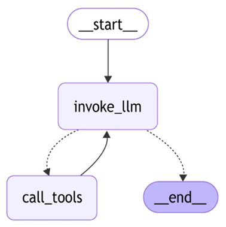
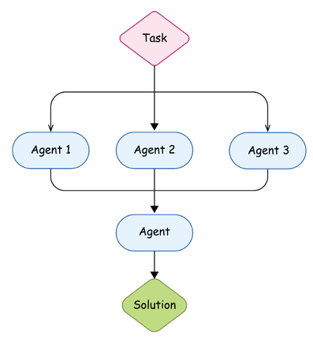
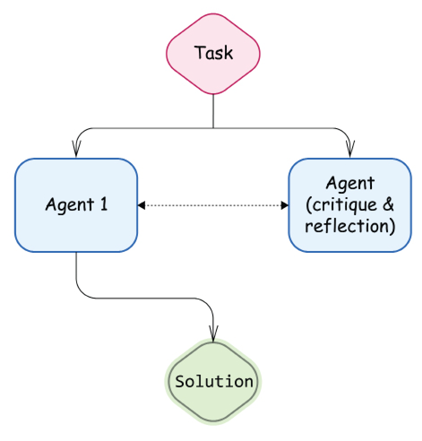
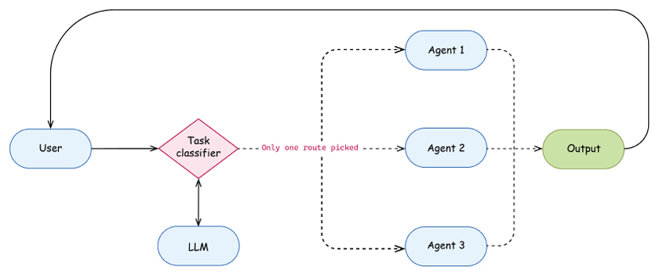
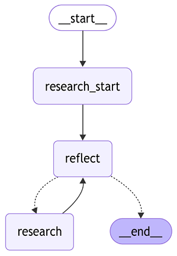
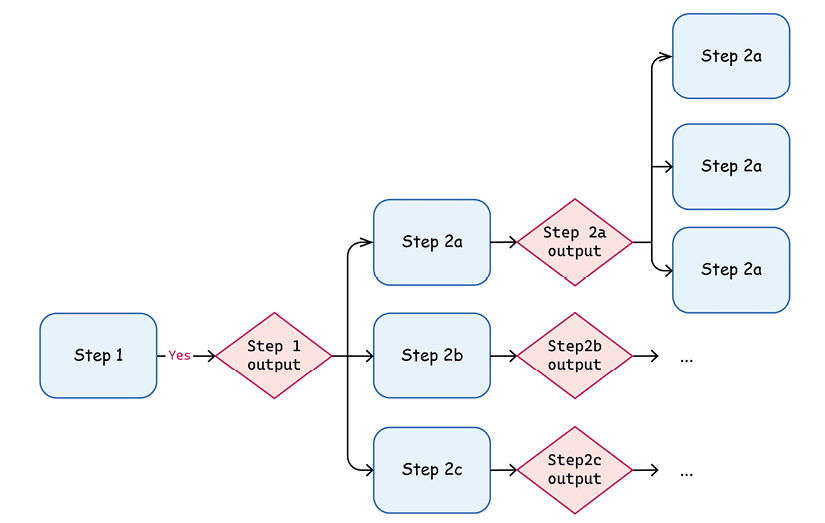
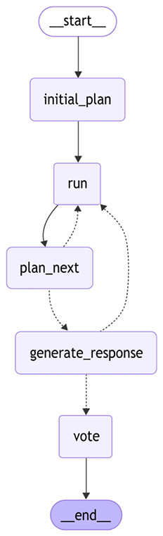
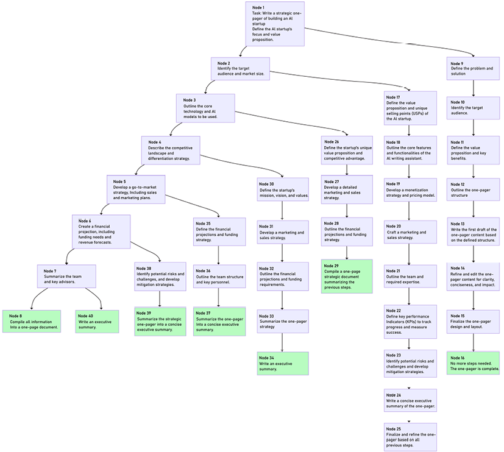

# Aplikasi Lanjutan dan Sistem Multi-Agen

Di bab sebelumnya, kita mendefinisikan apa itu agen. Tetapi bagaimana kita merancang dan membangun agen yang berkinerja tinggi? Tidak seperti teknik rekayasa prompt yang telah kita eksplorasi sebelumnya, mengembangkan agen yang efektif melibatkan beberapa pola desain berbeda yang harus dikenal setiap pengembang. Dalam bab ini, kita akan membahas pola arsitektur kunci di balik AI agen. Kita akan melihat arsitektur multi-agen dan cara mengorganisasi komunikasi antar agen. Kita akan mengembangkan agen lanjutan dengan refleksi diri yang menggunakan alat untuk menjawab pertanyaan ujian kompleks. Kita akan mempelajari API tambahan LangChain dan LangGraph yang berguna saat mengimplementasikan arsitektur agen, seperti detail tentang streaming LangGraph dan cara mengimplementasikan handoff sebagai bagian dari alur kontrol lanjutan.

Kemudian, kita akan menyentuh secara singkat platform LangGraph dan membahas bagaimana mengembangkan sistem adaptif, dengan memasukkan manusia dalam lingkaran, dan blok bangunan bawaan apa yang ditawarkan LangGraph untuk ini. Kita juga akan melihat pola **Tree-of-Thoughts** (**ToT**) dan mengembangkan agen ToT sendiri, membahas cara lebih lanjut untuk meningkatkannya dengan mengimplementasikan mekanisme pemangkasan lanjutan. Akhirnya, kita akan mempelajari mekanisme memori jangka panjang lanjutan di LangChain dan LangGraph, seperti cache dan penyimpanan.

Secara keseluruhan, kita akan menyentuh topik berikut dalam bab ini:

- Arsitektur agen
- Arsitektur multi-agen
- Membangun sistem adaptif
- Menjelajahi jalur penalaran
- Memori agen

## Arsitektur agen

Seperti yang kita pelajari di [Bab 5](Chapter_5.xhtml#_idTextAnchor111), agen membantu manusia menyelesaikan tugas. Membangun agen melibatkan menyeimbangkan dua elemen. Di satu sisi, ini sangat mirip dengan pengembangan aplikasi dalam arti Anda menggabungkan API (termasuk memanggil model dasar) dengan kualitas siap produksi. Di sisi lain, Anda membantu LLM berpikir dan menyelesaikan tugas.

Seperti yang kita diskusikan di [Bab 5](Chapter_5.xhtml#_idTextAnchor111), agen tidak memiliki algoritma spesifik untuk diikuti. Kami memberikan LLM kendali parsial atas alur eksekusi, tetapi untuk membimbingnya, kami menggunakan berbagai trik yang membantu kami sebagai manusia untuk bernalar, menyelesaikan tugas, dan berpikir jernih. Kita tidak boleh berasumsi bahwa LLM dapat secara ajaib mengetahui segalanya sendiri; pada tahap ini, kita harus membimbingnya dengan membuat alur kerja penalaran. Mari kita ingat agen ReACT yang kita pelajari di [Bab 5](Chapter_5.xhtml#_idTextAnchor111), contoh pola pemanggilan alat:



Gambar 6.1: Alur kerja REACT bawaan di LangGraph

Mari kita lihat beberapa pola desain yang relatif sederhana yang membantu membangun agen berkinerja baik. Anda akan melihat pola ini dalam berbagai kombinasi di berbagai domain dan arsitektur agen:

- **Pemanggilan alat**: LLM dilatih untuk melakukan generasi terkendali melalui pemanggilan alat. Oleh karena itu, bungkus masalah Anda sebagai masalah pemanggilan alat bila sesuai alih-alih membuat prompt kompleks. Ingatlah bahwa alat harus memiliki deskripsi dan nama properti yang jelas, dan bereksperimen dengan mereka adalah bagian dari latihan rekayasa prompt. Kami membahas pola ini di [Bab 5](Chapter_5.xhtml#_idTextAnchor111).
- **Dekomposisi tugas**: Jaga prompt Anda relatif sederhana. Berikan instruksi spesifik dengan contoh few-shot dan pisahkan tugas kompleks menjadi langkah-langkah yang lebih kecil. Anda dapat memberi LLM kendali parsial atas proses dekomposisi dan perencanaan tugas, mengelola alur oleh pengatur eksternal. Kami menggunakan pola ini di [Bab 5](Chapter_5.xhtml#_idTextAnchor111) ketika kami membangun agen rencana-dan-selesaikan.
- **Kerja sama dan keragaman**: Keluaran akhir pada tugas kompleks dapat ditingkatkan jika Anda memperkenalkan kerja sama antara beberapa instance agen yang diaktifkan LLM. Berkomunikasi, berdebat, dan berbagi perspektif berbeda membantu, dan Anda juga dapat mengambil manfaat dari berbagai keterampilan dengan menginisiasi agen Anda dengan prompt sistem yang berbeda, set alat yang tersedia, dll. Bahasa alami adalah cara asli bagi agen seperti itu untuk berkomunikasi karena LLM dilatih pada tugas bahasa alami.
- **Refleksi dan adaptasi**: Menambahkan loop implisit refleksi umumnya meningkatkan kualitas penalaran ujung-ke-ujung pada tugas kompleks. LLM mendapatkan umpan balik dari lingkungan eksternal dengan memanggil alat (dan panggilan ini mungkin gagal atau menghasilkan hasil yang tidak terduga), tetapi pada saat yang sama, LLM dapat terus beriterasi dan memulihkan diri dari kesalahannya. Sebagai berlebihan, ingat bahwa kita sering menggunakan LLM yang sama sebagai hakim, jadi menambahkan loop ketika kita meminta LLM untuk mengevaluasi penalarannya sendiri dan menemukan kesalahan sering membantunya pulih. Kita akan belajar cara membangun sistem adaptif nanti di bab ini.
- **Model bersifat nondeterministik dan dapat menghasilkan banyak kandidat**: Jangan fokus pada satu keluaran; jelajahi jalur penalaran berbeda dengan memperluas dimensi opsi potensial untuk dicoba ketika LLM berinteraksi dengan lingkungan eksternal saat mencari solusi. Kami akan menyelidiki pola ini lebih detail di bagian bawah ketika kita membahas contoh ToT dan **Language Agent Tree Search** (**LATS**).
- **Pembingkaian masalah berbasis kode**: Menulis kode sangat alami untuk LLM, jadi coba bingkai masalah sebagai masalah penulisan kode jika memungkinkan. Ini mungkin menjadi cara yang sangat kuat untuk menyelesaikan tugas, terutama jika Anda membungkusnya dengan sandbox eksekusi kode, loop untuk perbaikan berdasarkan keluaran, akses ke berbagai pustaka kuat untuk analisis data atau visualisasi, dan langkah generasi setelahnya. Kita akan membahas lebih detail di [Bab 7](Chapter_7.xhtml#_idTextAnchor156).

Dua komentar penting: pertama, kembangkan agen Anda selaras dengan praktik pengembangan perangkat lunak terbaik, dan buat mereka gesit, modular, dan mudah dikonfigurasi. Itu akan memungkinkan Anda untuk menyatukan banyak agen khusus, dan memberi pengguna kesempatan untuk dengan mudah menyesuaikan setiap agen berdasarkan tugas spesifik mereka.

Kedua, kami ingin menekankan (sekali lagi!) pentingnya evaluasi dan eksperimen. Kami akan berbicara tentang evaluasi lebih detail di [Bab 9](Chapter_9.xhtml#_idTextAnchor186). Tetapi penting untuk diingat bahwa tidak ada jalan yang jelas menuju kesuksesan. Pola berbeda bekerja lebih baik pada jenis tugas yang berbeda. Cobalah hal-hal, bereksperimen, iterasi, dan jangan lupa untuk mengevaluasi hasil pekerjaan Anda. Data, seperti tugas dan keluaran yang diharapkan, dan simulator, cara aman bagi LLM untuk berinteraksi dengan alat, adalah kunci untuk membangun agen yang sangat kompleks dan efektif.

Sekarang setelah kita membuat peta mental berbagai pola desain, kita akan melihat lebih dalam prinsip-prinsip ini dengan membahas berbagai arsitektur agen dan melihat contoh. Kita akan mulai dengan meningkatkan arsitektur RAG yang kita diskusikan di [Bab 4](Chapter_4.xhtml#_idTextAnchor068) dengan pendekatan agen.

### RAG agen

LLM memungkinkan pengembangan agen cerdas yang mampu menangani tugas kompleks, non-repetitif yang menentang deskripsi sebagai alur kerja deterministik. Dengan membagi penalaran menjadi langkah-langkah dengan cara berbeda dan mengaturnya dengan cara yang relatif sederhana, agen dapat menunjukkan tingkat penyelesaian tugas yang jauh lebih tinggi pada tugas terbuka kompleks.

Pendekatan berbasis agen ini dapat diterapkan di banyak domain, termasuk sistem RAG, yang kita diskusikan di [Bab 4](Chapter_4.xhtml#_idTextAnchor068). Sebagai pengingat, apa sebenarnya _RAG agen_? Ingat, pola klasik untuk sistem RAG adalah mengambil potongan yang diberikan kueri, menggabungkannya ke dalam konteks, dan meminta LLM untuk menghasilkan jawaban yang diberikan prompt sistem, konteks gabungan, dan pertanyaan.

Kita dapat meningkatkan setiap langkah ini menggunakan prinsip yang dibahas di atas (dekomposisi, pemanggilan alat, dan adaptasi):

- **Pengambilan dinamis** menyerahkan generasi kueri pengambilan ke LLM. Ia dapat memutuskan sendiri apakah akan menggunakan penyematan jarang, metode hibrida, pencarian kata kunci, atau pencarian web. Anda dapat membungkus pengambilan sebagai alat dan mengaturnya sebagai grafik LangGraph.
- **Ekspansi kueri** memberikan tugas kepada LLM untuk menghasilkan banyak kueri berdasarkan yang awal, dan kemudian Anda menggabungkan keluaran pencarian berdasarkan fusi timbal balik atau teknik lain.
- **Dekomposisi penalaran pada potongan yang diambil** memungkinkan Anda meminta LLM untuk mengevaluasi setiap potongan individu yang diberikan pertanyaan (dan menyaringnya jika tidak relevan) untuk mengkompensasi ketidakakuratan pengambilan. Atau Anda dapat meminta LLM untuk meringkas setiap potongan dengan hanya menyimpan informasi yang diberikan untuk pertanyaan input. Bagaimanapun, alih-alih melempar sepotong besar konteks di depan LLM, Anda melakukan banyak langkah penalaran yang lebih kecil secara paralel terlebih dahulu. Ini tidak hanya dapat meningkatkan kualitas RAG itu sendiri tetapi juga meningkatkan jumlah potongan yang awalnya diambil (dengan menurunkan ambang relevansi) atau memperluas setiap potongan individu dengan tetangganya. Dengan kata lain, Anda dapat mengatasi beberapa tantangan pengambilan dengan penalaran LLM. Ini mungkin meningkatkan kinerja keseluruhan aplikasi Anda, tetapi tentu saja, ini memiliki implikasi latensi dan biaya potensial.
- **Langkah refleksi dan iterasi** memberikan tugas kepada LLM untuk secara dinamis beriterasi pada pengambilan dan ekspansi kueri dengan mengevaluasi keluaran setelah setiap iterasi. Anda juga dapat menggunakan alat grounding dan atribusi tambahan sebagai langkah terpisah dalam alur kerja Anda dan, berdasarkan itu, bernalar apakah Anda perlu terus mengerjakan jawaban atau jawaban dapat dikembalikan kepada pengguna.

Berdasarkan definisi kami dari bab sebelumnya, RAG menjadi RAG agen ketika Anda memiliki kendali parsial bersama dengan LLM atas alur eksekusi. Misalnya, jika LLM memutuskan cara mengambil, merefleksikan potongan yang diambil, dan beradaptasi berdasarkan versi pertama jawaban, itu menjadi RAG agen. Dari perspektif kami, pada titik ini, mulai masuk akal untuk bermigrasi ke LangGraph karena dirancang khusus untuk membangun aplikasi seperti itu, tetapi tentu saja, Anda dapat tetap dengan LangChain atau kerangka kerja lain yang Anda sukai (bandingkan bagaimana kami mengimplementasikan ringkasan video map-reduce dengan LangChain dan LangGraph secara terpisah di _Bab 3_).

## Arsitektur multi-agen

Di [Bab 5](Chapter_5.xhtml#_idTextAnchor111), kita belajar bahwa menguraikan tugas kompleks menjadi subtugas yang lebih sederhana biasanya meningkatkan kinerja LLM. Kami membangun agen rencana-dan-selesaikan yang melangkah lebih jauh daripada CoT dan mendorong LLM untuk menghasilkan rencana dan mengikutinya. Sampai batas tertentu, arsitektur ini adalah multi-agen karena agen penelitian (yang bertanggung jawab untuk menghasilkan dan mengikuti rencana) memanggil agen lain yang berfokus pada jenis tugas yang berbeda – menyelesaikan tugas yang sangat spesifik dengan alat yang disediakan. Alur kerja multi-agen mengatur banyak agen, memungkinkan mereka saling meningkatkan dan pada saat yang sama menjaga agen tetap modular (yang membuatnya lebih mudah untuk diuji dan digunakan kembali).

Kita akan melihat beberapa arsitektur agen inti di sisa bab ini, dan memperkenalkan beberapa antarmuka LangGraph penting (seperti detail streaming dan handoff) yang berguna untuk mengembangkan agen. Jika Anda tertarik, Anda dapat menemukan lebih banyak contoh dan tutorial di halaman dokumentasi LangChain di https://langchain-ai.github.io/langgraph/tutorials/#agent-architectures. Kami akan mulai dengan membahas pentingnya spesialisasi dalam sistem multi-agen, termasuk apa mekanisme konsensus dan mekanisme konsensus yang berbeda.

### Peran dan spesialisasi agen

Saat mengerjakan tugas kompleks, kita sebagai manusia tahu bahwa biasanya bermanfaat untuk memiliki tim dengan keterampilan dan latar belakang yang beragam. Ada banyak bukti dari penelitian dan eksperimen yang menunjukkan bahwa ini juga berlaku untuk agen AI generatif. Faktanya, mengembangkan agen khusus menawarkan beberapa keuntungan untuk sistem AI kompleks.

Pertama, spesialisasi meningkatkan kinerja pada tugas tertentu. Ini memungkinkan Anda untuk:

- Pilih set alat optimal untuk setiap jenis tugas.
- Buat prompt dan alur kerja yang disesuaikan.
- Sempurnakan hiperparameter seperti suhu untuk konteks spesifik.

Kedua, agen khusus membantu mengelola kompleksitas. LLM saat ini kesulitan ketika menangani terlalu banyak alat sekaligus. Sebagai praktik terbaik, batasi setiap agen hingga 5-15 alat berbeda, daripada membebani satu agen dengan semua alat yang tersedia. Bagaimana mengelompokkan alat masih merupakan pertanyaan terbuka; biasanya, mengelompokkannya ke dalam toolkit untuk membuat agen khusus yang koheren membantu.


Gambar 6.2: Pola supervisor

Selain menjadi _khusus_, jaga agen Anda _modular_. Menjadi lebih mudah untuk memelihara dan meningkatkan agen seperti itu. Juga, dengan bekerja pada kasus penggunaan asisten perusahaan, Anda akhirnya akan memiliki banyak agen berbeda yang tersedia untuk pengguna dan pengembang dalam organisasi Anda yang dapat disatukan. Oleh karena itu, ingatlah bahwa Anda harus membuat agen khusus seperti itu dapat dikonfigurasi.

LangGraph memungkinkan Anda dengan mudah menyusun grafik dengan memasukkannya sebagai subgrafik dalam grafik yang lebih besar. Ada dua cara untuk melakukan ini:

- Kompilasi agen sebagai grafik dan berikan sebagai callable saat mendefinisikan simpul agen lain:
  ```python
  builder.add_node("pay", payments_agent)
  ```
- Bungkus pemanggilan agen anak dengan fungsi Python dan gunakan dalam definisi simpul induk:
  ```python
  def _run_payment(state):
    result = payments_agent.invoke({"client_id"; state["client_id"]})
    return {"payment status": ...}
  ...
  builder.add_node("pay", _run_payment)
  ```

Perhatikan, bahwa agen Anda mungkin memiliki skema berbeda (karena mereka melakukan tugas berbeda). Dalam kasus pertama, agen induk akan meneruskan kunci yang sama dalam skema dengan agen anak saat memanggilnya. Sebaliknya, ketika agen anak selesai, itu akan memperbarui status induk dan mengirim kembali nilai yang sesuai dengan kunci yang cocok di kedua skema. Pada saat yang sama, opsi kedua memberi Anda kendali penuh atas bagaimana Anda membangun status yang diteruskan ke agen anak, dan bagaimana status agen induk harus diperbarui sebagai hasilnya. Untuk informasi lebih lanjut, lihat dokumentasi di https://langchain-ai.github.io/langgraph/how-tos/subgraph/.

### Mekanisme konsensus

Kita juga dapat membiarkan banyak agen mengerjakan tugas yang sama secara paralel. Agen ini mungkin memiliki "kepribadian" yang berbeda (diperkenalkan oleh prompt sistem mereka; misalnya, beberapa mungkin lebih ingin tahu dan eksploratif, dan yang lain mungkin lebih ketat dan sangat berbasis) atau bahkan arsitektur yang bervariasi. Masing-masing bekerja secara independen untuk mendapatkan solusi untuk masalah, dan kemudian Anda menggunakan mekanisme konsensus untuk memilih solusi terbaik dari beberapa draf.



Gambar 6.3: Eksekusi paralel tugas dengan langkah konsensus akhir

Kami melihat contoh implementasi mekanisme konsensus berdasarkan pemungutan suara mayoritas di [Bab 3](Chapter_3.xhtml#_idTextAnchor049). Anda dapat membungkusnya sebagai simpul LangGraph terpisah, dan ada cara alternatif untuk mencapai konsensus di banyak agen:

- Biarkan setiap agen melihat solusi lain dan memberi skor masing-masing pada skala 0 hingga 1, dan kemudian ambil solusi dengan skor maksimum.
- Gunakan mekanisme pemungutan suara alternatif.
- Gunakan pemungutan suara mayoritas. Ini biasanya bekerja untuk klasifikasi atau tugas serupa, tetapi mungkin sulit untuk mengimplementasikan pemungutan suara mayoritas jika Anda memiliki keluaran teks bebas. Ini adalah mekanisme tercepat dan termurah (dalam hal konsumsi token) karena Anda tidak perlu menjalankan prompt tambahan apa pun.
- Gunakan oracle eksternal jika ada. Misalnya, saat menyelesaikan persamaan matematika, Anda dapat dengan mudah memverifikasi apakah solusinya layak. Biaya komputasi tergantung pada masalah tetapi biasanya rendah.
- Gunakan LLM lain (mungkin lebih kuat) sebagai hakim untuk memilih solusi terbaik. Anda dapat meminta LLM untuk memberikan skor untuk setiap solusi, atau Anda dapat memberikan tugas klasifikasi multi-kelas dengan menyajikan semuanya dan memintanya untuk memilih yang terbaik.
- Kembangkan agen lain yang unggul dalam tugas memilih solusi terbaik untuk tugas umum dari sekumpulan solusi.

Perlu disebutkan bahwa mekanisme konsensus memiliki implikasi latensi dan biaya tertentu, tetapi biasanya mereka diabaikan relatif terhadap biaya menyelesaikan tugas itu sendiri. Jika Anda memberikan tugas yang sama kepada N agen, konsumsi token Anda meningkat N kali, dan mekanisme konsensus menambahkan overhead yang relatif kecil di atas perbedaan itu.

Anda juga dapat mengimplementasikan mekanisme konsensus Anda sendiri. Saat Anda melakukan ini, pertimbangkan hal berikut:

- Gunakan prompt few-shot saat menggunakan LLM sebagai hakim.
- Tambahkan contoh yang menunjukkan cara memberi skor pada pasangan input-output yang berbeda.
- Pertimbangkan untuk menyertakan rubrik penilaian untuk berbagai jenis respons.
- Uji mekanisme pada keluaran yang beragam untuk memastikan konsistensi.

Satu catatan penting tentang paralelisasi – ketika Anda membiarkan LangGraph menjalankan simpul secara paralel, pembaruan diterapkan ke status utama dalam urutan yang sama seperti Anda menambahkan simpul ke grafik Anda.

### Protokol komunikasi

Opsi arsitektur ketiga adalah membiarkan agen berkomunikasi dan bekerja sama dalam suatu tugas. Misalnya, agen mungkin mendapat manfaat dari berbagai kepribadian yang dikonfigurasi melalui prompt sistem. Dekomposisi tugas kompleks menjadi subtugas yang lebih kecil juga membantu Anda mempertahankan kendali atas aplikasi Anda dan bagaimana agen Anda berkomunikasi.



Gambar 6.4: Pola refleksi

Agen dapat bekerja sama dalam suatu tugas dengan memberikan kritik dan refleksi. Ada banyak pola refleksi mulai dari refleksi diri, ketika agen menganalisis langkah-langkahnya sendiri dan mengidentifikasi area untuk perbaikan (tetapi seperti disebutkan di atas, Anda mungkin menginisiasi agen yang merefleksikan dengan prompt sistem yang sedikit berbeda); refleksi silang, ketika Anda menggunakan agen lain (misalnya, menggunakan model dasar lain); atau bahkan refleksi, yang mencakup **Human-in-the-Loop** (**HIL**) pada titik pemeriksaan kritis (kita akan lihat di bagian berikutnya cara membangun sistem adaptif semacam ini).

Anda dapat menjaga satu agen sebagai supervisor, mengizinkan agen untuk berkomunikasi dalam jaringan (memungkinkan mereka memutuskan agen mana yang akan mengirim pesan atau tugas), memperkenalkan hierarki tertentu, atau mengembangkan alur yang lebih kompleks (untuk inspirasi, lihat beberapa diagram di halaman dokumentasi LangGraph di https://langchain-ai.github.io/langgraph/concepts/multi_agent/).

Merancang alur kerja multi-agen masih merupakan area penelitian dan eksperimen terbuka, dan Anda perlu menjawab banyak pertanyaan:

- Apa dan berapa banyak agen yang harus kita sertakan dalam sistem kita?
- Peran apa yang harus kita berikan kepada agen ini?
- Alat apa yang harus diakses setiap agen?
- Bagaimana seharusnya agen berinteraksi satu sama lain dan melalui mekanisme apa?
- Bagian spesifik apa dari alur kerja yang harus kita otomatisasi?
- Bagaimana kita mengevaluasi otomatisasi kita dan bagaimana kita dapat mengumpulkan data untuk evaluasi ini? Selain itu, apa kriteria kesuksesan kita?

Sekarang setelah kita memeriksa beberapa pertimbangan inti dan pertanyaan terbuka tentang komunikasi multi-agen, mari kita jelajahi dua mekanisme praktis untuk menyusun dan memfasilitasi interaksi agen: _perutean semantik_, yang mengarahkan tugas secara cerdas berdasarkan kontennya, dan _mengorganisasi interaksi_, merinci format dan struktur spesifik yang dapat digunakan agen untuk bertukar informasi secara efektif.

#### Perute semantik

Di antara banyak cara berbeda untuk mengatur komunikasi antar agen dalam pengaturan multi-agen sejati, yang penting adalah perute semantik. Bayangkan mengembangkan asisten perusahaan. Biasanya menjadi semakin kompleks karena mulai menangani berbagai jenis pertanyaan – pertanyaan umum (memerlukan data publik dan pengetahuan umum), pertanyaan tentang perusahaan (memerlukan akses ke sumber data khusus perusahaan), dan pertanyaan spesifik untuk pengguna (memerlukan akses ke data yang disediakan oleh pengguna itu sendiri). Mempertahankan aplikasi seperti itu sebagai agen tunggal menjadi sangat sulit dengan cepat. Sekali lagi, kita dapat menerapkan pola desain kita – dekomposisi dan kolaborasi!

Bayangkan kita telah mengimplementasikan tiga jenis agen – satu menjawab pertanyaan umum berdasarkan data publik, yang lain berdasarkan dataset perusahaan dan mengetahui tentang spesifik perusahaan, dan yang ketiga khusus bekerja dengan sumber kecil dokumen yang disediakan pengguna. Spesialisasi seperti itu membantu kita menggunakan pola seperti prompt few-shot dan generasi terkendali. Sekarang kita dapat menambahkan perute semantik – lapisan pertama yang meminta LLM untuk mengklasifikasikan pertanyaan dan merutekannya ke agen yang sesuai berdasarkan hasil klasifikasi. Setiap agen (atau beberapa dari mereka) bahkan mungkin menggunakan pendekatan konsistensi-diri, seperti yang kita pelajari di [Bab 3](Chapter_3.xhtml#_idTextAnchor049), untuk meningkatkan akurasi klasifikasi LLM.



Gambar 6.5: Pola perute semantik

Perlu disebutkan bahwa suatu tugas mungkin termasuk dalam dua atau lebih kategori – misalnya, saya dapat bertanya, "_Apa itu X dan bagaimana saya bisa melakukan Y?_" Ini mungkin bukan kasus penggunaan yang umum dalam pengaturan asisten, dan Anda dapat memutuskan apa yang harus dilakukan dalam kasus itu. Pertama-tama, Anda mungkin hanya mendidik pengguna dengan membalas dengan penjelasan bahwa mereka harus memberikan tugas aplikasi Anda dengan satu masalah per giliran. Terkadang pengembang cenderung terlalu fokus mencoba menyelesaikan segalanya secara terprogram. Tetapi beberapa fitur produk relatif mudah diselesaikan melalui UI, dan pengguna (terutama dalam pengaturan perusahaan) siap memberikan masukan mereka. Mungkin, alih-alih menyelesaikan masalah klasifikasi pada prompt, cukup tambahkan kotak centang sederhana di UI, atau biarkan sistem memeriksa ulang jika tingkat kepercayaan rendah.

Anda juga dapat menggunakan pemanggilan alat atau teknik generasi terkendali lain yang telah kita pelajari untuk mengekstrak kedua tujuan dan merutekan eksekusi ke dua agen khusus dengan tugas berbeda.

Aspek penting lain dari perutean semantik adalah bahwa kinerja aplikasi Anda sangat bergantung pada akurasi klasifikasi. Anda dapat menggunakan semua teknik yang telah kita diskusikan dalam buku untuk meningkatkannya – prompt few-shot (termasuk dinamis), menggabungkan umpan balik pengguna, pengambilan sampel, dan lainnya.

#### Mengorganisasi interaksi

Ada dua cara untuk mengatur komunikasi dalam sistem multi-agen:

- Agen berkomunikasi melalui struktur spesifik yang memaksa mereka untuk menempatkan pemikiran dan jejak penalaran mereka dalam bentuk tertentu, seperti yang kita lihat dalam contoh _rencana-dan-selesaikan_ di bab sebelumnya. Kami melihat bagaimana simpul perencanaan kami berkomunikasi dengan agen ReACT melalui model Pydantic dengan rencana terstruktur (yang, pada gilirannya, adalah hasil generasi terkendali LLM).
- Di sisi lain, LLM dilatih untuk mengambil bahasa alami sebagai input dan menghasilkan keluaran dalam format yang sama. Oleh karena itu, ini adalah cara yang sangat alami bagi mereka untuk berkomunikasi melalui pesan, dan Anda dapat mengimplementasikan mekanisme komunikasi dengan menerapkan pesan dari agen yang berbeda ke daftar pesan bersama!.

Saat berkomunikasi dengan pesan, Anda dapat berbagi semua pesan melalui yang disebut _scratchpad_ – daftar pesan bersama. Dalam kasus itu, konteks Anda dapat tumbuh relatif cepat dan Anda mungkin perlu menggunakan beberapa mekanisme untuk memangkas memori obrolan (seperti menyiapkan ringkasan berjalan) yang kita diskusikan di [Bab 3](Chapter_3.xhtml#_idTextAnchor049). Tetapi sebagai saran umum, jika Anda perlu menyaring atau memprioritaskan pesan dalam riwayat komunikasi antara banyak agen, gunakan pendekatan pertama dan biarkan mereka berkomunikasi melalui keluaran terkendali. Itu akan memberi Anda lebih banyak kendali atas status alur kerja Anda pada titik waktu tertentu. Juga, Anda mungkin berakhir dengan situasi di mana Anda memiliki urutan pesan yang rumit, misalnya, _[SystemMessage, HumanMessage, AIMessage, ToolMessage, AIMessage, AIMessage, SystemMessage, …]_. Tergantung pada model dasar yang Anda gunakan, periksa ulang bahwa penyedia model mendukung urutan seperti itu, karena sebelumnya, banyak penyedia hanya mendukung urutan yang relatif sederhana – SystemMessage diikuti oleh HumanMessage dan AIMessage bergantian (mungkin dengan ToolMessage sebagai gantinya jika pemanggilan alat diputuskan).

Alternatif lain adalah hanya berbagi hasil akhir setiap eksekusi. Ini menjaga daftar pesan relatif pendek.

Sekarang saatnya melihat contoh praktis. Mari kita kembangkan agen penelitian yang menggunakan alat untuk menjawab pertanyaan pilihan ganda kompleks berdasarkan dataset MMLU publik (kita akan menggunakan pertanyaan geografi sekolah menengah). Pertama, kita perlu mengambil dataset dari Hugging Face:

```python
from datasets import load_dataset
ds = load_dataset("cais/mmlu", "high_school_geography")
ds_dict = ds["test"].take(2).to_dict()
print(ds_dict["question"][0])
```

```
>> The main factor preventing subsistence economies from advancing economically is the lack of
```

Ini adalah pilihan jawaban kami:

```python
print(ds_dict["choices"][0])
```

```
>> ['a currency.', 'a well-connected transportation infrastructure.', 'government activity.', 'a banking service.']
```

Mari kita mulai dengan agen ReACT, tetapi mari kita menyimpang dari prompt sistem default dan tulis prompt kami sendiri. Mari kita fokuskan agen ini pada menjadi kreatif dan bekerja pada solusi berbasis bukti (harap dicatat bahwa kami menggunakan elemen prompt CoT, yang kita diskusikan di [Bab 3](Chapter_3.xhtml#_idTextAnchor049)):

```python
from langchain.agents import load_tools
from langgraph.prebuilt import create_react_agent
from langchain_google_vertexai import ChatVertexAI
llm = ChatVertexAI(model="gemini-2.0-flash-lite", temperature=1.0)
research_tools = load_tools(
  tool_names=["ddg-search", "arxiv", "wikipedia"],
  llm=llm)
system_prompt = (
   "You're a hard-working, curious and creative student. "
   "You're preparing an answer to an exam quesion. "
   "Work hard, think step by step."
   "Always provide an argumentation for your answer. "
   "Do not assume anything, use available tools to search "
   "for evidence and supporting statements."
)
```

Sekarang, mari kita buat agen itu sendiri. Karena kami memiliki prompt kustom untuk agen, kami memerlukan template prompt yang menyertakan pesan sistem, template yang memformat pesan pengguna pertama berdasarkan pertanyaan dan jawaban yang disediakan, dan placeholder untuk pesan lebih lanjut yang akan ditambahkan ke status grafik. Kami juga mendefinisikan ulang status default agen dengan mewarisi dari `AgentState` dan menambahkan kunci tambahan ke dalamnya:

```python
from langchain_core.prompts import ChatPromptTemplate, PromptTemplate
from langgraph.graph import MessagesState
from langgraph.prebuilt.chat_agent_executor import AgentState
raw_prompt_template = (
   "Answer the following multiple-choice question. "
   "\nQUESTION:\n{question}\n\nANSWER OPTIONS:\n{option}\n"
)
prompt = ChatPromptTemplate.from_messages(
   [("system", system_prompt),
    ("user", raw_prompt_template),
    ("placeholder", "{messages}")
    ]
)
class MyAgentState(AgentState):
 question: str
 options: str
research_agent = create_react_agent(
  model=llm_small, tools=research_tools, state_schema=MyAgentState,
  prompt=prompt)
```

Kami bisa berhenti di sini, tetapi mari kita lanjutkan. Kami menggunakan agen penelitian khusus berdasarkan pola ReACT (dan kami sedikit menyesuaikan konfigurasi defaultnya). Sekarang mari tambahkan langkah refleksi ke dalamnya, dan gunakan profil peran lain untuk agen yang akan mengkritik pekerjaan "siswa" kami dengan dapat ditindaklanjuti:

```python
reflection_prompt = (
   "You are a university professor and you're supervising a student who is "
   "working on multiple-choice exam question. "
   "nQUESTION: {question}.\nANSWER OPTIONS:\n{options}\n."
   "STUDENT'S ANSWER:\n{answer}\n"
   "Reflect on the answer and provide a feedback whether the answer "
   "is right or wrong. If you think the final answer is correct, reply with "
   "the final answer. Only provide critique if you think the answer might "
   "be incorrect or there are reasoning flaws. Do not assume anything, "
   "evaluate only the reasoning the student provided and whether there is "
   "enough evidence for their answer."
)
class Response(BaseModel):
   """A final response to the user."""
   answer: Optional[str] = Field(
       description="The final answer. It should be empty if critique has been provided.",
       default=None,
   )
   critique: Optional[str] = Field(
       description="A critique of the initial answer. If you think it might be incorrect, provide an actionable feedback",
       default=None,
   )
reflection_chain = PromptTemplate.from_template(reflection_prompt) | llm.with_structured_output(Response)
```

Sekarang kita memerlukan agen penelitian lain yang mengambil tidak hanya pertanyaan dan pilihan jawaban tetapi juga jawaban sebelumnya dan umpan balik. Agen penelitian diberikan tugas untuk menggunakan alat untuk meningkatkan jawaban dan mengatasi kritik. Kami membuat contoh yang disederhanakan dan ilustratif. Anda selalu dapat meningkatkannya dengan menambahkan penanganan kesalahan, validasi Pydantic (misalnya, memeriksa bahwa jawaban atau kritik disediakan), atau menangani umpan balik yang bertentangan atau ambigu (misalnya, struktur prompt yang membantu agen memprioritaskan poin umpan balik ketika ada banyak kritik).

Perhatikan bahwa kami menggunakan LLM yang kurang mampu untuk agen ReACT kami, hanya untuk menunjukkan kekuatan pendekatan refleksi (jika tidak, grafik mungkin selesai dalam satu iterasi karena agen akan mengetahui jawaban yang benar dengan upaya pertama):

```python
raw_prompt_template_with_critique = (
   "You tried to answer the exam question and you get feedback from your "
   "professor. Work on improving your answer and incorporating the feedback. "
   "\nQUESTION:\n{question}\n\nANSWER OPTIONS:\n{options}\n\n"
   "INITIAL ANSWER:\n{answer}\n\nFEEDBACK:\n{feedback}"
)
prompt = ChatPromptTemplate.from_messages(
   [("system", system_prompt),
    ("user", raw_prompt_template_with_critique),
    ("placeholder", "{messages}")
    ]
)
class ReflectionState(ResearchState):
 answer: str
 feedback: str
research_agent_with_critique = create_react_agent(model=llm_small, tools=research_tools, state_schema=ReflectionState, prompt=prompt)
```

Saat mendefinisikan status grafik kita, kita perlu melacak pertanyaan dan pilihan jawaban, jawaban saat ini, dan kritik. Juga perhatikan bahwa kita melacak jumlah interaksi antara _siswa_ dan _profesor_ (untuk menghindari siklus tak terbatas di antara mereka) dan kita menggunakan reducer kustom untuk itu (yang meringkas langkah lama dan baru pada setiap run). Mari kita definisikan status penuh, simpul, dan tepi bersyarat:

```python
from typing import Annotated, Literal, TypedDict
from langchain_core.runnables.config import RunnableConfig
from operator import add
from langgraph.graph import StateGraph, START, END
class ReflectionAgentState(TypedDict):
   question: str
   options: str
   answer: str
   steps: Annotated[int, add]
   response: Response
def _should_end(state: ReflectionAgentState, config: RunnableConfig) -> Literal["research", END]:
   max_reasoning_steps = config["configurable"].get("max_reasoning_steps", 10)
   if state.get("response") and state["response"].answer:
       return END
   if state.get("steps", 1) > max_reasoning_steps:
       return END
   return "research"
reflection_chain = PromptTemplate.from_template(reflection_prompt) | llm.with_structured_output(Response)
def _reflection_step(state):
   result = reflection_chain.invoke(state)
   return {"response": result, "steps": 1}
def _research_start(state):
 state = research_agent.invoke(state)
 return {"answer": answer["messages"][-1].content}
def _research(state):
 agent_state = {
     "answer": state["answer"],
     "question": state["question"],
     "options": state["options"],
     "feedback": state["response"].critique
 }
 answer = research_agent_with_critique.invoke(agent_state)
 return {"answer": answer["messages"][-1].content}
```

Mari kita satukan semuanya dan buat grafik kami:

```python
builder = StateGraph(ReflectionAgentState)
builder.add_node("research_start", _research_start)
builder.add_node("research", _research)
builder.add_node("reflect", _reflection_step)
builder.add_edge(START, "research_start")
builder.add_edge("research_start", "reflect")
builder.add_edge("research", "reflect")
builder.add_conditional_edges("reflect", _should_end)
graph = builder.compile()
display(Image(graph.get_graph().draw_mermaid_png()))
```



Gambar 6.6: Agen penelitian dengan refleksi

Mari kita jalankan dan periksa apa yang terjadi:

```python
question = ds_dict["question"][0]
options = "\n".join(
  [f"{i}. {a}" for i, a in enumerate(ds_dict["choices"][0])])
async for _, event in graph.astream({"question": question, "options": options}, stream_mode=["updates"]):
 print(event)
```

Kami telah menghilangkan keluaran lengkap di sini (Anda dipersilakan mengambil kode dari repositori GitHub kami dan bereksperimen sendiri), tetapi jawaban pertama salah:

```
Based on the DuckDuckGo search results, none of the provided statements are entirely true.  The searches reveal that while there has been significant progress in women's labor force participation globally,  it hasn't reached a point where most women work in agriculture, nor has there been a worldwide decline in participation.  Furthermore, the information about working hours suggests that it's not universally true that women work longer hours than men in most regions. Therefore, there is no correct answer among the options provided.
```

Setelah lima iterasi, LLM yang lebih lemah dapat mengetahui jawaban yang benar (ingat bahwa "profesor" hanya mengevaluasi penalaran itu sendiri dan tidak menggunakan alat eksternal atau pengetahuannya sendiri). Perhatikan bahwa, secara teknis, kami mengimplementasikan refleksi silang dan bukan refleksi diri (karena kami menggunakan LLM berbeda untuk refleksi daripada yang kami gunakan untuk penalaran). Berikut contoh umpan balik yang diberikan selama putaran pertama:

```
The student's reasoning relies on outside search results which are not provided, making it difficult to assess the accuracy of their claims. The student states that none of the answers are entirely true, but multiple-choice questions often have one best answer even if it requires nuance. To properly evaluate the answer, the search results need to be provided, and each option should be evaluated against those results to identify the most accurate choice, rather than dismissing them all. It is possible one of the options is more correct than the others, even if not perfectly true. Without the search results, it's impossible to determine if the student's conclusion that no answer is correct is valid. Additionally, the student should explicitly state what the search results were.
```

Selanjutnya, mari kita bahas gaya komunikasi alternatif untuk pengaturan multi-agen, melalui daftar pesan bersama. Tetapi sebelum itu, kita harus membahas mekanisme handoff LangGraph dan menyelami beberapa detail streaming dengan LangGraph.

### Streaming LangGraph

Streaming LangGraph terkadang bisa menjadi sumber kebingungan. Setiap grafik tidak hanya memiliki metode `stream` dan `astream` asinkron yang sesuai, tetapi juga `astream_events`. Mari selami perbedaannya.

Metode `Stream` memungkinkan Anda mengalirkan perubahan ke status grafik setelah setiap super-langkah. Ingat, kita membahas apa itu super-langkah di [Bab 3](Chapter_3.xhtml#_idTextAnchor049), tetapi untuk singkatnya, itu adalah satu iterasi atas grafik di mana simpul paralel termasuk dalam satu super-langkah sementara simpul sekuensial termasuk dalam super-langkah berbeda. Jika Anda memerlukan perilaku streaming yang sebenarnya (seperti dalam chatbot, sehingga pengguna merasa seperti sesuatu sedang terjadi dan model benar-benar berpikir), Anda harus menggunakan `astream` dengan mode `messages`.

Anda memiliki lima mode dengan metode `stream/astream` (tentu saja, Anda dapat menggabungkan banyak mode):

| Mode     | Deskripsi                                                                                                                       | Keluaran                                                                                   |
| -------- | ------------------------------------------------------------------------------------------------------------------------------- | ------------------------------------------------------------------------------------------ |
| updates  | Hanya mengalirkan pembaruan ke grafik yang dihasilkan oleh simpul                                                               | Kamus di mana setiap nama simpul memetakan ke pembaruan status yang sesuai)                |
| values   | Mengalirkan status penuh grafik setelah setiap super-langkah                                                                    | Kamus dengan status penuh grafik                                                           |
| debug    | Mencoba mengalirkan sebanyak mungkin informasi dalam mode debug                                                                 | Kamus dengan stempel waktu, tipe tugas, dan semua informasi yang sesuai untuk setiap acara |
| custom   | Mengalirkan acara yang dipancarkan oleh simpul menggunakan StreamWriter                                                         | Kamus yang ditulis dari simpul ke penulis kustom                                           |
| messages | Mengalirkan acara penuh (misalnya, ToolMessages) atau potongannya dalam simpul streaming jika memungkinkan (misalnya, Pesan AI) | Tuple dengan token atau segmen pesan dan kamus berisi metadata dari simpul                 |

Tabel 6.1: Mode streaming berbeda untuk LangGraph

Mari kita lihat contoh. Jika kita mengambil agen ReACT yang kita gunakan di bagian atas dan streaming dengan mode `values`, kita akan mendapatkan status penuh dikembalikan setelah setiap super-langkah (Anda dapat melihat bahwa jumlah total pesan selalu meningkat):

```python
async for _, event in research_agent.astream({"question": question, "options": options}, stream_mode=["values"]):
 print(len(event["messages"]))
```

```
>> 0
1
3
4
```

Jika kita beralih ke mode `update`, kita akan mendapatkan kamus di mana kuncinya adalah nama simpul (ingat bahwa simpul paralel dapat dipanggil dalam satu super-langkah) dan pembaruan status yang sesuai yang dikirim oleh simpul ini:

```python
async for _, event in research_agent.astream({"question": question, "options": options}, stream_mode=["updates"]):
 node = list(event.keys())[0]
 print(node, len(event[node].get("messages", [])))
```

```
>> agent 1
tools 2
agent 1
```

LangGraph `stream` selalu memancarkan tuple di mana nilai pertama adalah mode streaming (karena Anda dapat meneruskan banyak mode dengan menambahkannya ke daftar).

Kemudian Anda perlu metode `astream_events` yang mengalirkan kembali acara yang terjadi di dalam simpul – bukan hanya token yang dihasilkan oleh LLM tetapi acara apa pun yang tersedia untuk panggilan balik:

```python
seen_events = set([])
async for event in research_agent.astream_events({"question": question, "options": options}, version="v1"):
 if event["event"] not in seen_events:
   seen_events.add(event["event"])
print(seen_events)
```

```
>> {'on_chat_model_end', 'on_chat_model_stream', 'on_chain_end', 'on_prompt_end', 'on_tool_start', 'on_chain_stream', 'on_chain_start', 'on_prompt_start', 'on_chat_model_start', 'on_tool_end'}
```

Anda dapat menemukan daftar lengkap acara di https://python.langchain.com/docs/concepts/callbacks/#callback-events.

### Handoff

Sejauh ini, kita telah belajar bahwa simpul di LangGraph melakukan sebagian pekerjaan dan mengirim pembaruan ke status bersama, dan tepi mengontrol alur – ia memutuskan simpul mana yang akan dipanggil berikutnya (secara deterministik atau berdasarkan status saat ini). Saat mengimplementasikan arsitektur multi-agen, simpul Anda tidak hanya dapat berupa fungsi tetapi agen lain, atau subgrafik (dengan status mereka sendiri). Anda mungkin perlu menggabungkan pembaruan status dan kontrol alur.

LangGraph memungkinkan Anda melakukan itu dengan `Command` – Anda dapat memperbarui status grafik Anda dan pada saat yang sama memanggil agen lain dengan meneruskan status kustom ke dalamnya. Ini disebut _handoff_ – karena agen menyerahkan kendali ke yang lain. Anda perlu meneruskan `update` – kamus dengan pembaruan status saat ini yang akan dikirim ke grafik Anda – dan `goto` – nama (atau daftar nama) dari simpul untuk menyerahkan kendali:

```python
from langgraph.types import Command
def _make_payment(state):
  ...
  if ...:
  return Command(
     update={"payment_id": payment_id},
     goto="refresh_balance"
  )
  ...
```

Tujuan agen dapat berupa simpul dari grafik saat ini atau induk (`Command.PARENT`). Dengan kata lain, Anda dapat mengubah alur kontrol hanya dalam grafik saat ini, atau Anda dapat meneruskannya kembali ke alur kerja yang memulai yang ini (misalnya, Anda tidak dapat meneruskan kendali ke alur kerja acak apa pun berdasarkan ID). Anda juga dapat memanggil `Command` dari alat, atau membungkus `Command` sebagai alat, dan kemudian LLM dapat memutuskan untuk menyerahkan kendali ke agen tertentu. Di [Bab 3](Chapter_3.xhtml#_idTextAnchor049), kita membahas pola map-reduce dan kelas `Send`, yang memungkinkan kita memanggil simpul dalam grafik dengan meneruskan status input tertentu ke dalamnya. Kita dapat menggunakan `Command` bersama dengan `Send` (dalam contoh ini, agen tujuan milik grafik induk):

```python
from langgraph.types import Send
def _make_payment(state):
  ...
  if ...:
  return Command(
     update={"payment_id": payment_id},
     goto=[Send("refresh_balance", {"payment_id": payment_id}, ...],
     graph=Command.PARENT
  )
  ...
```

#### Komunikasi melalui daftar pesan bersama

Beberapa bab sebelumnya, kita membahas bagaimana dua agen dapat berkomunikasi melalui keluaran terkendali (dengan mengirimkan instance Pydantic khusus satu sama lain). Sekarang mari kita kembali ke topik komunikasi dan ilustrasikan bagaimana agen dapat berkomunikasi dengan pesan LangChain asli. Mari kita ambil agen penelitian dengan refleksi silang dan membuatnya bekerja dengan daftar pesan bersama. Pertama, agen penelitian itu sendiri terlihat lebih sederhana – ia memiliki status default karena mendapatkan pertanyaan pengguna sebagai HumanMessage:

```python
system_prompt = (
   "You're a hard-working, curious and creative student. "
   "You're working on exam quesion. Think step by step."
   "Always provide an argumentation for your answer. "
   "Do not assume anything, use available tools to search "
   "for evidence and supporting statements."
)
research_agent = create_react_agent(
  model=llm_small, tools=research_tools, prompt=system_prompt)
```

Kami juga perlu sedikit memodifikasi prompt refleksi:

```python
reflection_prompt = (
   "You are a university professor and you're supervising a student who is "
   "working on multiple-choice exam question. Given the dialogue above, "
   "reflect on the answer provided and give a feedback "
   " if needed. If you think the final answer is correct, reply with "
   "an empty message. Only provide critique if you think the last answer "
   "might be incorrect or there are reasoning flaws. Do not assume anything, "
   "evaluate only the reasoning the student provided and whether there is "
   "enough evidence for their answer."
)
```

Simpul itu sendiri juga terlihat lebih sederhana, tetapi kami menambahkan `Command` setelah simpul refleksi karena kami memutuskan apa yang akan dipanggil berikutnya dengan simpul itu sendiri. Juga, kami tidak membungkus agen penelitian ReACT sebagai simpul lagi:

```python
from langgraph.types import Command
question_template = PromptTemplate.from_template(
   "QUESTION:\n{question}\n\nANSWER OPTIONS:\n{options}\n\n"
)
def _ask_question(state):
 return {"messages": [("human", question_template.invoke(state).text)]}
def _give_feedback(state, config: RunnableConfig):
 messages = event["messages"] + [("human", reflection_prompt)]
 max_messages = config["configurable"].get("max_messages", 20)
 if len(messages) > max_messages:
   return Command(update={}, goto=END)
 result = llm.invoke(messages)
 if result.content:
   return Command(
     update={"messages": [("assistant", result.content)]},
     goto="research"
 )
 return Command(update={}, goto=END)
```

Grafik itu sendiri juga terlihat sangat sederhana:

```python
class ReflectionAgentState(MessagesState):
 question: str
 options: str
builder = StateGraph(ReflectionAgentState)
builder.add_node("ask_question", _ask_question)
builder.add_node("research", research_agent)
builder.add_node("reflect", _give_feedback)
builder.add_edge(START, "ask_question")
builder.add_edge("ask_question", "research")
builder.add_edge("research", "reflect")
graph = builder.compile()
```

Jika kita menjalankannya, kita akan melihat bahwa pada setiap tahap, grafik beroperasi pada daftar pesan yang sama (dan berkembang).

### Platform LangGraph

LangGraph dan LangChain, seperti yang Anda ketahui, adalah kerangka kerja sumber terbuka, tetapi LangChain sebagai perusahaan menawarkan platform LangGraph – solusi komersial yang membantu Anda mengembangkan, mengelola, dan menyebarkan aplikasi agen. Salah satu komponen platform LangGraph adalah LangGraph Studio – IDE yang membantu Anda memvisualisasikan dan men-debug agen Anda – dan lainnya adalah LangGraph Server.

Anda dapat membaca lebih lanjut tentang platform LangGraph di situs web resmi (https://langchain-ai.github.io/langgraph/concepts/#langgraph-platform), tetapi mari kita bahas beberapa konsep kunci untuk pemahaman yang lebih baik tentang apa artinya mengembangkan agen.

Setelah Anda mengembangkan agen, Anda dapat membungkusnya sebagai API HTTP (menggunakan Flask, FastAPI, atau kerangka kerja web lainnya). Platform LangGraph menawarkan Anda cara asli untuk menyebarkan agen, dan membungkusnya dengan API terunifikasi (yang membuatnya lebih mudah bagi aplikasi Anda untuk menggunakan agen ini). Ketika Anda telah membangun agen Anda sebagai objek grafik LangGraph, Anda menyebarkan _asisten_ – penyebaran spesifik yang mencakup instance grafik Anda digabungkan bersama dengan konfigurasi. Anda dapat dengan mudah membuat versi dan mengonfigurasi asisten di UI, tetapi penting untuk menjaga parameter dapat dikonfigurasi (dan meneruskannya sebagai `RunnableConfig` ke simpul dan alat Anda).

Konsep penting lainnya adalah _thread_. Jangan bingung, thread LangGraph adalah konsep yang berbeda dari thread Python (dan ketika Anda meneruskan `thread_id` di `RunnableConfig` Anda, Anda meneruskan ID thread LangGraph). Ketika Anda memikirkan thread LangGraph, pikirkan tentang percakapan atau thread Reddit. Sebuah thread mewakili sesi antara asisten Anda (grafik dengan konfigurasi spesifik) dan pengguna. Anda dapat menambahkan persistensi per-thread menggunakan mekanisme checkpointing yang kita diskusikan di [Bab 3](Chapter_3.xhtml#_idTextAnchor049).

_Run_ adalah pemanggilan asisten. Dalam banyak kasus, run dieksekusi pada thread (untuk persistensi). LangGraph Server juga memungkinkan Anda menjadwalkan run tanpa status – mereka tidak ditugaskan ke thread mana pun, dan karena itu, riwayat interaksi tidak bertahan. LangGraph Server memungkinkan Anda menjadwalkan run berjalan lama, run terjadwal (alias cron), dll., dan juga menawarkan mekanisme kaya untuk webhook yang terpasang ke run dan polling hasil kembali ke pengguna.

Kami tidak akan membahas API LangGraph Server dalam buku ini. Silakan lihat dokumentasi sebagai gantinya.

## Membangun sistem adaptif

Adaptabilitas adalah atribut hebat dari agen. Mereka harus beradaptasi dengan umpan balik eksternal dan pengguna dan memperbaiki tindakan mereka sesuai dengan itu. Seperti yang kita diskusikan di [Bab 5](Chapter_5.xhtml#_idTextAnchor111), agen AI generatif adaptif melalui:

- **Interaksi alat**: Mereka menggabungkan umpan balik dari panggilan alat sebelumnya dan keluaran mereka (dengan menyertakan `ToolMessages` yang mewakili hasil pemanggilan alat) saat merencanakan langkah-langkah berikutnya (seperti agen ReACT kami menyesuaikan berdasarkan hasil pencarian).
- **Refleksi eksplisit**: Mereka dapat diinstruksikan untuk menganalisis hasil saat ini dan dengan sengaja menyesuaikan perilaku mereka.
- **Umpan balik manusia**: Mereka dapat menggabungkan masukan pengguna pada titik keputusan kritis.

### Penyesuaian perilaku dinamis

Kami melihat cara menambahkan langkah refleksi ke agen rencana-dan-selesaikan kami. Diberikan rencana awal, dan keluaran dari langkah-langkah yang dilakukan sejauh ini, kami akan meminta LLM untuk merefleksikan rencana dan menyesuaikannya. Sekali lagi, kami terus mengulangi ide kunci – refleksi seperti itu mungkin tidak terjadi secara alami; Anda mungkin menambahkannya sebagai tugas terpisah (dekomposisi), dan Anda mempertahankan kendali parsial atas alur eksekusi dengan merancang komponen generiknya.

### Human-in-the-loop

Selain itu, saat mengembangkan agen dengan lintasan penalaran kompleks, mungkin bermanfaat untuk memasukkan umpan balik manusia pada titik tertentu. Agen dapat meminta manusia untuk menyetujui atau menolak tindakan tertentu (misalnya, ketika memanggil alat yang tidak dapat diubah, seperti alat yang melakukan pembayaran), memberikan konteks tambahan kepada agen, atau memberikan masukan spesifik dengan memodifikasi status grafik.

Bayangkan kami mengembangkan agen yang mencari lowongan pekerjaan, menghasilkan aplikasi, dan mengirimkan aplikasi ini. Kami mungkin ingin meminta pengguna sebelum mengirimkan aplikasi, atau logikanya mungkin lebih kompleks – agen mungkin mengumpulkan data tentang pengguna, dan untuk beberapa lowongan pekerjaan, mungkin kehilangan konteks relevan tentang pengalaman kerja sebelumnya. Itu harus bertanya kepada pengguna dan mempertahankan pengetahuan ini dalam memori jangka panjang untuk adaptasi jangka panjang yang lebih baik.

LangGraph memiliki fungsi `interrupt` khusus untuk mengimplementasikan interaksi tipe **HIL**. Anda harus menyertakan fungsi ini di simpul, dan dengan eksekusi pertama, itu akan melempar pengecualian `GraphInterrupt` (nilainya akan disajikan kepada pengguna). Untuk melanjutkan eksekusi grafik, klien harus menggunakan kelas `Command`, yang kita bahas sebelumnya di bab ini. LangGraph akan mulai dari simpul yang sama, mengeksekusinya ulang, dan mengembalikan nilai yang sesuai sebagai hasil dari simpul yang memanggil fungsi `interrupt` (jika ada banyak `interrupt` di simpul Anda, LangGraph akan menjaga urutan). Anda juga dapat menggunakan `Command` untuk merutekan ke simpul berbeda berdasarkan masukan pengguna. Tentu saja, Anda dapat menggunakan `interrupt` hanya ketika pengecek disediakan ke grafik karena statusnya harus bertahan.

Mari kita buat grafik yang sangat sederhana dengan hanya simpul yang meminta pengguna untuk alamat rumah mereka:

```python
from langgraph.types import interrupt, Command
class State(MessagesState):
   home_address: Optional[str]
def _human_input(state: State):
   address = interrupt("What is your address?")
   return {"home_address": address}
builder = StateGraph(State)
builder.add_node("human_input", _human_input)
builder.add_edge(START, "human_input")
checkpointer = MemorySaver()
graph = builder.compile(checkpointer=checkpointer)
config = {"configurable": {"thread_id": "1"}}
for chunk in graph.stream({"messages": [("human", "What is weather today?")]}, config):
   print(chunk)
```

```
>> {'__interrupt__': (Interrupt(value='What is your address?', resumable=True, ns=['human_input:b7e8a744-b404-0a60-7967-ddb8d30b11e3'], when='during'),)}
```

Grafik mengembalikan kami status `__interrupt__` khusus dan berhenti. Sekarang aplikasi kami (klien) harus menanyakan pengguna pertanyaan ini, dan kemudian kami dapat melanjutkan. Harap dicatat bahwa kami memberikan `thread_id` yang sama untuk memulihkan dari checkpoint:

```python
for chunk in graph.stream(Command(resume="Munich"), config):
   print(chunk)
```

```
>> {'human_input': {'home_address': 'Munich'}}
```

Perhatikan bahwa grafik terus mengeksekusi simpul human_input, tetapi kali ini fungsi `interrupt` mengembalikan hasilnya, dan status grafik diperbarui.

Sejauh ini, kami telah membahas beberapa pola arsitektur tentang cara mengembangkan agen. Sekarang mari kita lihat yang menarik lain yang memungkinkan LLM menjalankan banyak simulasi saat mereka mencari solusi.

## Menjelajahi jalur penalaran

Di [Bab 3](Chapter_3.xhtml#_idTextAnchor049), kita membahas prompt CoT. Tetapi dengan prompt CoT, LLM membuat jalur penalaran dalam satu giliran. Bagaimana jika kita menggabungkan pola dekomposisi dan pola adaptasi dengan membagi penalaran ini menjadi potongan-potongan?

### Tree of Thoughts

Peneliti dari Google DeepMind dan Princeton University memperkenalkan teknik **ToT** pada Desember 2023. Mereka menggeneralisasi pola CoT dan menggunakan pikiran sebagai langkah perantara dalam proses eksplorasi menuju solusi global.

Mari kita kembali ke agen rencana-dan-selesaikan yang kami bangun di bab sebelumnya. Mari kita gunakan sifat nondeterministik LLM untuk meningkatkannya. Kita dapat menghasilkan banyak kandidat untuk tindakan berikutnya dalam rencana pada setiap langkah (kita mungkin perlu meningkatkan suhu LLM yang mendasarinya). Itu akan membantu agen menjadi lebih adaptif karena rencana berikutnya yang dihasilkan akan mempertimbangkan keluaran dari langkah sebelumnya.

Sekarang kita dapat membangun pohon berbagai opsi dan menjelajahi pohon ini dengan metode pencarian-dalam atau pencarian-lebar. Pada akhirnya, kita akan mendapatkan banyak solusi, dan kita akan menggunakan beberapa mekanisme konsensus yang dibahas di atas untuk memilih yang terbaik (misalnya, LLM-sebagai-hakim).



Gambar 6.7: Eksplorasi jalur solusi dengan ToT

Harap dicatat bahwa penyedia model harus mendukung generasi banyak kandidat dalam respons (tidak semua penyedia mendukung fitur ini).

Kami ingin menyoroti (dan kami tidak lelah melakukan ini berulang kali dalam bab ini) bahwa tidak ada yang sepenuhnya baru dalam pola ToT. Anda mengambil apa algoritma dan pola yang telah digunakan di area lain, dan Anda menggunakannya untuk membangun agen yang mampu.

Sekarang saatnya melakukan beberapa pengkodean. Kami akan mengambil komponen yang sama dari agen rencana-dan-selesaikan yang kami kembangkan di [Bab 5](Chapter_5.xhtml#_idTextAnchor111) – perencana yang membuat rencana awal dan `execution_agent`, yang merupakan agen penelitian dengan akses ke alat dan bekerja pada langkah spesifik dalam rencana. Kami dapat membuat agen eksekusi kami lebih sederhana karena kami tidak memerlukan status kustom:

```python
execution_agent = prompt_template | create_react_agent(model=llm, tools=tools)
```

Kami juga memerlukan komponen _replanner_, yang akan menangani penyesuaian rencana berdasarkan pengamatan sebelumnya dan menghasilkan banyak kandidat untuk tindakan berikutnya:

```python
from langchain_core.prompts import ChatPromptTemplate
class ReplanStep(BaseModel):
   """Replanned next step in the plan."""
   steps: list[str] = Field(
       description="different options of the proposed next step"
   )
llm_replanner = llm.with_structured_output(ReplanStep)
replanner_prompt_template = (
   "Suggest next action in the plan. Do not add any superfluous steps.\n"
   "If you think no actions are needed, just return an empty list of steps. "
   "TASK: {task}\n PREVIOUS STEPS WITH OUTPUTS: {current_plan}"
)
replanner_prompt = ChatPromptTemplate.from_messages(
   [("system", "You're a helpful assistant. You goal is to help with planning actions to solve the task. Do not solve the task itself."),
    ("user", replanner_prompt_template)
   ]
)
replanner = replanner_prompt | llm_replanner
```

Komponen `replanner` ini sangat penting untuk pendekatan ToT kami. Ini mengambil status rencana saat ini dan menghasilkan banyak langkah berikutnya yang potensial, mendorong eksplorasi jalur solusi yang berbeda daripada mengikuti urutan linier tunggal.

Untuk melacak jalur eksplorasi kami, kami memerlukan struktur data pohon. Kelas `TreeNode` di bawah ini membantu kami mempertahankannya:

```python
class TreeNode:
 def __init__(
      self,
      node_id: int,
      step: str,
      step_output: Optional[str] = None,
      parent: Optional["TreeNode"] = None,
  ):
       self.node_id = node_id
       self.step = step
       self.step_output = step_output
       self.parent = parent
       self.children = []
       self.final_response = None
 def __repr__(self):
   parent_id = self.parent.node_id if self.parent else "None"
   return f"Node_id: {self.node_id}, parent: {parent_id}, {len(self.children)} children."
 def get_full_plan(self) -> str:
   """Returns formatted plan with step numbers and past results."""
   steps = []
   node = self
   while node.parent:
     steps.append((node.step, node.step_output))
     node = node.parent
   full_plan = []
   for i, (step, result) in enumerate(steps[::-1]):
     if result:
       full_plan.append(f"# {i+1}. Planned step: {step}\nResult: {result}\n")
   return "\n".join(full_plan)
```

Setiap `TreeNode` melacak identitasnya, langkah saat ini, keluaran, hubungan induk, dan anak. Kami juga membuat metode untuk mendapatkan rencana penuh yang diformat (kami akan menggantinya di tempat template prompt), dan hanya untuk membuat debugging lebih nyaman, kami mengganti metode `__repr__` yang mengembalikan deskripsi node yang dapat dibaca.

Sekarang kita perlu mengimplementasikan logika inti agen kita. Kami akan menjelajahi pohon tindakan kami dalam mode pencarian-dalam. Di sinilah kekuatan nyata dari pola ToT mulai berperan:

```python
async def _run_node(state: PlanState, config: RunnableConfig):
 node = state.get("next_node")
 visited_ids = state.get("visited_ids", set())
 queue = state["queue"]
 if node is None:
   while queue and not node:
     node = state["queue"].popleft()
     if node.node_id in visited_ids:
       node = None
   if not node:
     return Command(goto="vote", update={})
 step = await execution_agent.ainvoke({
     "previous_steps": node.get_full_plan(),
     "step": node.step,
     "task": state["task"]})
 node.step_output = step["messages"][-1].content
 visited_ids.add(node.node_id)
 return {"current_node": node, "queue": queue, "visited_ids": visited_ids, "next_node": None}
async def _plan_next(state: PlanState, config: RunnableConfig) -> PlanState:
 max_candidates = config["configurable"].get("max_candidates", 1)
 node = state["current_node"]
 next_step = await replanner.ainvoke({"task": state["task"], "current_plan": node.get_full_plan()})
 if not next_step.steps:
   return {"is_current_node_final": True}
 max_id = state["max_id"]
 for step in next_step.steps[:max_candidates]:
   child = TreeNode(node_id=max_id+1, step=step, parent=node)
   max_id += 1
   node.children.append(child)
   state["queue"].append(child)
 return {"is_current_node_final": False, "next_node": child, "max_id": max_id}
async def _get_final_response(state: PlanState) -> PlanState:
 node = state["current_node"]
 final_response = await responder.ainvoke({"task": state["task"], "plan": node.get_full_plan()})
 node.final_response = final_response
 return {"paths_explored": 1, "candidates": [final_response]}
```

Fungsi `_run_node` mengeksekusi langkah saat ini, sementara `_plan_next` menghasilkan langkah kandidat baru dan menambahkannya ke antrean eksplorasi kami. Ketika kami mencapai simpul akhir (satu di mana tidak ada langkah lebih lanjut yang diperlukan), `_get_final_response` menghasilkan solusi akhir dengan memilih yang terbaik dari banyak kandidat (berasal dari jalur solusi berbeda yang dieksplorasi). Oleh karena itu, dalam status agen kami, kami harus melacak simpul akar, simpul berikutnya, antrean simpul yang akan dieksplorasi, dan simpul yang telah kami eksplorasi:

```python
import operator
from collections import deque
from typing import Annotated
class PlanState(TypedDict):
   task: str
   root: TreeNode
   queue: deque[TreeNode]
   current_node: TreeNode
   next_node: TreeNode
   is_current_node_final: bool
   paths_explored: Annotated[int, operator.add]
   visited_ids: set[int]
   max_id: int
   candidates: Annotated[list[str], operator.add]
   best_candidate: str
```

Struktur status ini melacak semua yang kami butuhkan: tugas asli, struktur pohon kami, antrean eksplorasi, metadata jalur, dan solusi kandidat. Perhatikan tipe `Annotated` khusus yang menggunakan reducer kustom (seperti `operator.add`) untuk menangani penggabungan nilai status dengan benar.

Satu hal penting yang harus diingat adalah bahwa LangGraph tidak mengizinkan Anda memodifikasi `state` secara langsung. Dengan kata lain, jika kami mengeksekusi sesuatu seperti berikut dalam simpul, itu tidak akan berpengaruh pada antrean aktual dalam status agen:

```python
def my_node(state):
  queue = state["queue"]
  node = queue.pop()
  ...
  queue.append(another_node)
  return {"key": "value"}
```

Jika kami ingin memodifikasi antrean yang dimiliki oleh status itu sendiri, kami harus menggunakan reducer kustom (seperti yang kita diskusikan di [Bab 3](Chapter_3.xhtml#_idTextAnchor049)) atau mengembalikan objek antrean untuk diganti (karena di balik layar, LangGraph selalu membuat salinan dalam dari status sebelum meneruskannya ke simpul).

Kami perlu mendefinisikan langkah akhir sekarang – mekanisme konsensus untuk memilih jawaban akhir berdasarkan banyak kandidat yang dihasilkan:

```python
prompt_voting = PromptTemplate.from_template(
   "Pick the best solution for a given task. "
   "\nTASK:{task}\n\nSOLUTIONS:\n{candidates}\n"
)
def _vote_for_the_best_option(state):
 candidates = state.get("candidates", [])
 if not candidates:
   return {"best_response": None}
 all_candidates = []
 for i, candidate in enumerate(candidates):
   all_candidates.append(f"OPTION {i+1}: {candidate}")
 response_schema = {
     "type": "STRING",
     "enum": [str(i+1) for i in range(len(all_candidates))]}
 llm_enum = ChatVertexAI(
     model_name="gemini-2.0-flash-001", response_mime_type="text/x.enum",
     response_schema=response_schema)
 result = (prompt_voting | llm_enum | StrOutputParser()).invoke(
     {"candidates": "\n".join(all_candidates), "task": state["task"]}
 )
 return {"best_candidate": candidates[int(result)-1]}
```

Mekanisme pemungutan suara ini menyajikan semua solusi kandidat kepada model dan memintanya untuk memilih yang terbaik, memanfaatkan kemampuan model untuk mengevaluasi dan membandingkan opsi.

Sekarang mari tambahkan simpul dan tepi yang tersisa dari agen. Kami memerlukan dua simpul – yang membuat rencana awal dan yang lain yang mengevaluasi keluaran akhir. Seiring dengan ini, kami mendefinisikan dua tepi yang sesuai yang mengevaluasi apakah agen harus melanjutkan eksplorasinya dan apakah siap untuk memberikan respons akhir kepada pengguna:

```python
from typing import Literal
from langgraph.graph import StateGraph, START, END
from langchain_core.runnables import RunnableConfig
from langchain_core.output_parsers import StrOutputParser
from langgraph.types import Command
final_prompt = PromptTemplate.from_template(
   "You're a helpful assistant that has executed on a plan."
   "Given the results of the execution, prepare the final response.\n"
   "Don't assume anything\nTASK:\n{task}\n\nPLAN WITH RESUlTS:\n{plan}\n"
   "FINAL RESPONSE:\n"
)
responder = final_prompt | llm | StrOutputParser()
async def _build_initial_plan(state: PlanState) -> PlanState:
 plan = await planner.ainvoke(state["task"])
 queue = deque()
 root = TreeNode(step=plan.steps[0], node_id=1)
 queue.append(root)
 current_root = root
 for i, step in enumerate(plan.steps[1:]):
   child = TreeNode(node_id=i+2, step=step, parent=current_root)
   current_root.children.append(child)
   queue.append(child)
   current_root = child
 return {"root": root, "queue": queue, "max_id": i+2}
async def _get_final_response(state: PlanState) -> PlanState:
 node = state["current_node"]
 final_response = await responder.ainvoke({"task": state["task"], "plan": node.get_full_plan()})
 node.final_response = final_response
 return {"paths_explored": 1, "candidates": [final_response]}
def _should_create_final_response(state: PlanState) -> Literal["run", "generate_response"]:
 return "generate_response" if state["is_current_node_final"] else "run"
def _should_continue(state: PlanState, config: RunnableConfig) -> Literal["run", "vote"]:
 max_paths = config["configurable"].get("max_paths", 30)
 if state.get("paths_explored", 1) > max_paths:
   return "vote"
 if state["queue"] or state.get("next_node"):
   return "run"
 return "vote"
```

Fungsi-fungsi ini melengkapi implementasi kami dengan mendefinisikan pembuatan rencana awal, generasi respons akhir, dan logika kontrol alur. Fungsi `_should_create_final_response` dan `_should_continue` menentukan kapan harus menghasilkan respons akhir dan kapan harus melanjutkan eksplorasi. Dengan semua komponen di tempat, kami membangun grafik status akhir:

```python
builder = StateGraph(PlanState)
builder.add_node("initial_plan", _build_initial_plan)
builder.add_node("run", _run_node)
builder.add_node("plan_next", _plan_next)
builder.add_node("generate_response", _get_final_response)
builder.add_node("vote", _vote_for_the_best_option)
builder.add_edge(START, "initial_plan")
builder.add_edge("initial_plan", "run")
builder.add_edge("run", "plan_next")
builder.add_conditional_edges("plan_next", _should_create_final_response)
builder.add_conditional_edges("generate_response", _should_continue)
builder.add_edge("vote", END)
graph = builder.compile()
from IPython.display import Image, display
display(Image(graph.get_graph().draw_mermaid_png()))
```

Ini menciptakan agen kami yang selesai dengan alur eksekusi lengkap. Grafik dimulai dengan perencanaan awal, melanjutkan melalui langkah eksekusi dan perencanaan ulang, menghasilkan respons untuk jalur yang diselesaikan, dan akhirnya memilih solusi terbaik melalui pemungutan suara. Kami dapat memvisualisasikan alur menggunakan generator diagram Mermaid, memberi kami gambaran yang jelas tentang proses pengambilan keputusan agen kami:



Gambar 6.8: Agen LATS

Kami dapat mengontrol jumlah maksimum super-langkah, jumlah maksimum jalur dalam pohon yang akan dieksplorasi (khususnya, jumlah maksimum kandidat untuk solusi akhir yang akan dihasilkan), dan jumlah kandidat per langkah. Berpotensi, kami dapat memperluas konfigurasi kami dan mengontrol kedalaman maksimum pohon. Mari jalankan grafik kami:

```python
task = "Write a strategic one-pager of building an AI startup"
result = await graph.ainvoke({"task": task}, config={"recursion_limit": 10000, "configurable": {"max_paths": 10}})
print(len(result["candidates"]))
print(result["best_candidate"])
```

Kami juga dapat memvisualisasikan pohon yang dieksplorasi:



Gambar 6.9: Contoh pohon eksekusi yang dieksplorasi

Kami membatasi jumlah kandidat, tetapi kami berpotensi meningkatkannya dan menambahkan logika pemangkasan tambahan (yang akan memangkas daun yang tidak menjanjikan). Kami dapat menggunakan pendekatan LLM-sebagai-hakim yang sama, atau menggunakan heuristik lain untuk pemangkasan. Kami juga dapat menjelajahi strategi pemangkasan yang lebih canggih; kami akan berbicara tentang salah satunya di bagian berikutnya.

### Memangkas ToT dengan MCTS

Beberapa dari Anda mungkin ingat AlphaGo – program komputer pertama yang mengalahkan manusia dalam permainan Go. Google DeepMind mengembangkannya kembali pada tahun 2015, dan menggunakan **Monte Carlo Tree Search** (**MCTS**) sebagai algoritma pengambilan keputusan inti. Berikut adalah ide sederhana tentang cara kerjanya. Sebelum melakukan langkah berikutnya dalam permainan, algoritma membangun pohon keputusan dengan langkah-langkah masa depan yang potensial, dengan simpul mewakili langkah Anda dan respons potensial lawan Anda (pohon ini berkembang dengan cepat, seperti yang dapat Anda bayangkan). Untuk menjaga pohon agar tidak berkembang terlalu cepat, mereka menggunakan MCTS untuk mencari hanya melalui jalur yang paling menjanjikan yang mengarah ke keadaan yang lebih baik dalam permainan.

Sekarang, kembali ke pola ToT yang kita pelajari di bab sebelumnya. Pikirkan fakta bahwa dimensi ToT yang kami bangun di bagian sebelumnya mungkin berkembang sangat cepat. Jika, pada setiap langkah, kami menghasilkan 3 kandidat dan hanya ada 5 langkah dalam alur kerja, kami akan berakhir dengan 3^5=243 langkah untuk dievaluasi. Itu memerlukan banyak biaya dan waktu. Kami dapat memangkas dimensi dengan cara berbeda, misalnya, dengan menggunakan MCTS. Ini mencakup komponen seleksi dan simulasi:

- **Seleksi** membantu Anda memilih simpul berikutnya saat menganalisis pohon. Anda melakukannya dengan menyeimbangkan eksplorasi dan eksploitasi (Anda memperkirakan simpul yang paling menjanjikan tetapi menambahkan beberapa keacakan dalam proses ini).
- Setelah Anda **memperluas** pohon dengan menambahkan anak baru ke dalamnya, jika itu bukan simpul terminal, Anda perlu mensimulasikan konsekuensinya. Ini mungkin dilakukan hanya dengan bermain secara acak semua langkah berikutnya sampai akhir, atau menggunakan pendekatan simulasi yang lebih canggih. Setelah mengevaluasi anak, Anda mempropagasikan hasilnya ke semua simpul induk dengan menyesuaikan skor probabilitas mereka untuk putaran seleksi berikutnya.

Kami tidak bermaksud untuk masuk ke detail dan mengajari Anda MCTS. Kami hanya ingin menunjukkan bagaimana Anda menerapkan algoritma yang sudah ada ke alur kerja agen untuk meningkatkan kinerjanya. Salah satu contohnya adalah pendekatan **LATS** yang disarankan oleh Andy Zhou dan rekan-rekan pada Juni 2024 dalam makalah mereka _Language Agent Tree Search Unifies Reasoning, Acting, and Planning in Language Models_. Tanpa masuk terlalu detail (Anda dipersilakan melihat makalah asli atau tutorial yang sesuai), penulis menambahkan MCTS di atas ToT, dan mereka menunjukkan peningkatan kinerja pada tugas kompleks dengan mendapatkan peringkat 1 pada benchmark HumanEval.

Ide kuncinya adalah bahwa alih-alih menjelajahi seluruh pohon, mereka menggunakan LLM untuk mengevaluasi kualitas solusi yang Anda dapatkan pada setiap langkah (dengan melihat urutan semua langkah pada langkah penalaran spesifik ini dan keluaran yang telah Anda dapatkan sejauh ini).

Sekarang, setelah kita membahas beberapa arsitektur yang lebih canggih yang memungkinkan kita membangun agen yang lebih baik, ada satu komponen terakhir untuk disentuh secara singkat – memori. Membantu agen untuk mempertahankan dan mengambil informasi relevan dari interaksi jangka panjang membantu kita mengembangkan agen yang lebih canggih dan membantu.

## Memori agen

Kami membahas mekanisme memori di [Bab 3](Chapter_3.xhtml#_idTextAnchor049). Untuk rekap, LangGraph memiliki gagasan memori jangka pendek melalui mekanisme `Checkpointer`, yang menyimpan checkpoint ke penyimpanan persisten. Ini adalah persistensi per-thread yang disebut (ingat, kami diskusikan sebelumnya dalam bab ini bahwa gagasan thread di LangGraph mirip dengan percakapan). Dengan kata lain, agen mengingat interaksi kami dalam sesi tertentu, tetapi memulai dari awal setiap kali.

Seperti yang dapat Anda bayangkan, untuk agen kompleks, mekanisme memori ini mungkin tidak efisien karena dua alasan. Pertama, Anda mungkin kehilangan informasi penting tentang pengguna. Kedua, selama fase eksplorasi saat mencari solusi, agen mungkin mempelajari sesuatu yang penting tentang lingkungan yang dilupakan setiap kali – dan itu tidak terlihat efisien. Itulah mengapa ada konsep **memori jangka panjang**, yang membantu agen mengakumulasi pengetahuan dan mendapatkan dari pengalaman historis, dan memungkinkan peningkatan berkelanjutan dalam jangka panjang.

Bagaimana merancang dan menggunakan memori jangka panjang dalam praktik masih merupakan pertanyaan terbuka. Pertama, Anda perlu mengekstrak informasi berguna (ingat juga persyaratan privasi; lebih lanjut tentang itu di [Bab 9](Chapter_9.xhtml#_idTextAnchor186)) yang ingin Anda simpan selama runtime dan kemudian Anda perlu mengekstraknya selama eksekusi berikutnya. Ekstraksi dekat dengan masalah pengambilan yang kita diskusikan saat berbicara tentang RAG karena kita perlu mengekstrak hanya pengetahuan yang relevan dengan konteks yang diberikan. Komponen terakhir adalah kompaksi memori – Anda mungkin ingin secara berkala merefleksikan diri tentang apa yang telah Anda pelajari, mengoptimalkannya, dan melupakan fakta yang tidak relevan.

Ini adalah pertimbangan kunci untuk diperhatikan, tetapi kami belum melihat implementasi praktis yang hebat dari memori jangka panjang untuk alur kerja agen. Dalam praktik, saat ini orang biasanya menggunakan dua komponen – **cache** bawaan (mekanisme untuk menyimpan respons LLM), **store** bawaan (penyimpanan key-value persisten), dan cache atau basis data kustom. Gunakan opsi kustom ketika:

- Anda memerlukan fleksibilitas tambahan untuk bagaimana Anda mengatur memori – misalnya, Anda ingin melacak semua status memori.
- Anda memerlukan pola akses baca atau tulis lanjutan saat bekerja dengan memori ini.
- Anda perlu menjaga memori terdistribusi dan di beberapa pekerja, dan Anda ingin menggunakan basis data selain PostgreSQL.

### Cache

Caching memungkinkan Anda menyimpan dan mengambil nilai kunci. Bayangkan Anda mengerjakan aplikasi bantuan tanya jawab perusahaan, dan di UI, Anda menanyakan pengguna apakah mereka menyukai jawabannya. Jika jawabannya positif, atau jika Anda memiliki kumpulan data kurasi pasangan pertanyaan-jawaban untuk topik paling penting, Anda dapat menyimpannya dalam cache. Ketika pertanyaan yang sama (atau serupa) ditanyakan nanti, sistem dapat dengan cepat mengembalikan respons yang di-cache alih-alih meregenerasinya dari awal.

LangChain memungkinkan Anda mengatur cache global untuk respons LLM dengan cara berikut (setelah Anda menginisialisasi cache, respons LLM akan ditambahkan ke cache, seperti yang akan kita lihat di bawah):

```python
from langchain_core.caches import InMemoryCache
from langchain_core.globals import set_llm_cache
cache = InMemoryCache()
set_llm_cache(cache)
llm = ChatVertexAI(model="gemini-2.0-flash-001", temperature=0.5)
llm.invoke("What is the capital of UK?")
```

Caching dengan LangChain bekerja sebagai berikut: Implementasi vendor masing-masing dari `ChatModel` mewarisi dari kelas dasar, dan kelas dasar pertama kali mencoba mencari nilai dalam cache selama generasi. cache adalah variabel global yang dapat kita harapkan (tentu saja, hanya setelah diinisialisasi). Ini menyimpan respons berdasarkan kunci yang terdiri dari representasi string dari prompt dan representasi string dari instance LLM (diproduksi oleh metode `llm._get_llm_string`).

Ini berarti parameter generasi LLM (seperti `stop_words` atau `temperature`) disertakan dalam kunci cache:

```python
import langchain
print(langchain.llm_cache._cache)
```

LangChain mendukung cache dalam memori dan SQLite langsung dari kotak (mereka membentuk bagian dari `langchain_core.caches`), dan ada juga banyak integrasi vendor – tersedia melalui subpaket `langchain_community.cache` di https://python.langchain.com/api_reference/community/cache.html atau melalui integrasi vendor spesifik (misalnya, `langchain-mongodb` menawarkan integrasi cache untuk MongoDB: https://langchain-mongodb.readthedocs.io/en/latest/langchain_mongodb/api_docs.html).

Kami merekomendasikan memperkenalkan simpul LangGraph terpisah yang mengakses cache aktual (berdasarkan Redis atau basis data lain), karena memungkinkan Anda mengontrol apakah Anda ingin mencari pertanyaan serupa menggunakan mekanisme penyematan yang kita diskusikan di [Bab 4](Chapter_4.xhtml#_idTextAnchor068) ketika kita berbicara tentang RAG.

### Store

Seperti yang telah kita pelajari sebelumnya, mekanisme `Checkpointer` memungkinkan Anda meningkatkan alur kerja Anda dengan memori persisten tingkat thread; dengan tingkat thread, kami maksud persistensi tingkat percakapan. Setiap percakapan dapat dimulai di mana berhenti, dan alur kerja mengeksekusi konteks yang sebelumnya dikumpulkan.

`BaseStore` adalah sistem penyimpanan key-value persisten yang mengatur nilai Anda berdasarkan namespace (tuple hierarkis dari jalur string, mirip dengan folder. Ini mendukung operasi standar seperti operasi `put`, `delete` dan `get`, serta metode `search` yang mengimplementasikan kemampuan pencarian semantik berbeda (biasanya, berdasarkan mekanisme penyematan) dan memperhitungkan sifat hierarkis namespace.

Mari kita inisialisasi store dan tambahkan beberapa nilai ke dalamnya:

```python
from langgraph.store.memory import InMemoryStore
in_memory_store = InMemoryStore()
in_memory_store.put(namespace=("users", "user1"), key="fact1", value={"message1": "My name is John."})
in_memory_store.put(namespace=("users", "user1", "conv1"), key="address", value={"message": "I live in Berlin."})
```

Kami dapat dengan mudah mengkueri nilainya:

```python
in_memory_store.get(namespace=("users", "user1", "conv1"), key="address")
```

```
>>  Item(namespace=['users', 'user1'], key='fact1', value={'message1': 'My name is John.'}, created_at='2025-03-18T14:25:23.305405+00:00', updated_at='2025-03-18T14:25:23.305408+00:00')
```

Jika kita mengkuerinya dengan jalur namespace parsial, kita tidak akan mendapatkan hasil apa pun (kita perlu namespace yang cocok penuh). Berikut akan mengembalikan tanpa hasil:

```python
in_memory_store.get(namespace=("users", "user1"), key="conv1")
```

Di sisi lain, saat menggunakan `search`, kita dapat menggunakan jalur namespace parsial:

```python
print(len(in_memory_store.search(("users", "user1", "conv1"), query="name")))
print(len(in_memory_store.search(("users", "user1"), query="name")))
```

```
>> 1
2
```

Seperti yang Anda lihat, kami dapat mengambil semua fakta relevan yang disimpan dalam memori dengan menggunakan pencarian parsial.

LangGraph memiliki implementasi `InMemoryStore` dan `PostgresStore` bawaan. Mekanisme memori agen masih berkembang. Anda dapat membangun implementasi Anda sendiri dari komponen yang tersedia, tetapi kita harus melihat banyak kemajuan dalam beberapa tahun atau bahkan bulan mendatang.

## Ringkasan

Dalam bab ini, kami menyelam jauh ke dalam aplikasi lanjutan LLM dan pola arsitektur yang memungkinkannya, memanfaatkan LangChain dan LangGraph. Kunci pengambilannya adalah bahwa membangun sistem AI yang kompleks secara efektif melampaui sekadar memprompt LLM; itu membutuhkan desain arsitektur yang cermat dari alur kerja itu sendiri, penggunaan alat, dan memberi LLM kendali parsial atas alur kerja. Kami juga membahas pola desain AI agen yang berbeda dan cara mengembangkan agen yang memanfaatkan kemampuan pemanggilan alat LLM untuk menyelesaikan tugas kompleks.

Kami mengeksplorasi bagaimana streaming LangGraph bekerja dan bagaimana mengontrol informasi apa yang dialirkan kembali selama eksekusi. Kami membahas perbedaan antara pembaruan status streaming dan token jawaban streaming parsial, belajar tentang antarmuka Command sebagai cara untuk menyerahkan eksekusi ke simpul tertentu di dalam atau di luar alur kerja LangGraph saat ini, melihat platform LangGraph dan kemampuan utamanya, dan membahas cara mengimplementasikan HIL dengan LangGraph. Kami membahas bagaimana thread di LangGraph berbeda dari definisi Pythonic tradisional (thread agak mirip dengan instance percakapan), dan kami belajar cara menambahkan memori ke alur kerja kami per-thread dan dengan persistensi antar-thread. Akhirnya, kami belajar bagaimana memperluas melampaui aplikasi LLM dasar dan membangun sistem yang kuat, adaptif, dan cerdas dengan memanfaatkan kemampuan lanjutan LangChain dan LangGraph.

Di bab berikutnya, kita akan melihat bagaimana AI generatif mengubah industri rekayasa perangkat lunak dengan membantu dalam pengembangan kode dan analisis data.

## Pertanyaan

1. Sebutkan setidaknya tiga pola desain yang harus dipertimbangkan saat membangun agen AI generatif.
2. Jelaskan konsep "pengambilan dinamis" dalam konteks RAG agen.
3. Bagaimana kerja sama antar agen dapat meningkatkan keluaran tugas kompleks? Bagaimana Anda dapat meningkatkan keragaman agen yang bekerja sama, dan dampak apa pada kinerja yang mungkin dimilikinya?
4. Jelaskan contoh mencapai konsensus di seluruh keluaran banyak agen.
5. Apa dua cara utama untuk mengatur komunikasi dalam sistem multi-agen dengan LangGraph?
6. Jelaskan perbedaan antara stream, astream, dan astream_events di LangGraph.
7. Apa itu perintah di LangGraph, dan bagaimana hubungannya dengan handoff?
8. Jelaskan konsep thread di platform LangGraph. Bagaimana perbedaannya dengan thread Pythonic?
9. Jelaskan ide inti di balik teknik Tree of Thoughts (ToT). Bagaimana ToT terkait dengan pola dekomposisi?
10. Jelaskan perbedaan antara memori jangka pendek dan jangka panjang dalam konteks sistem agen.

## Berlangganan buletin mingguan kami

Berlangganan AI_Distilled, buletin untuk profesional, peneliti, dan inovator AI, di https://packt.link/Q5UyU.


