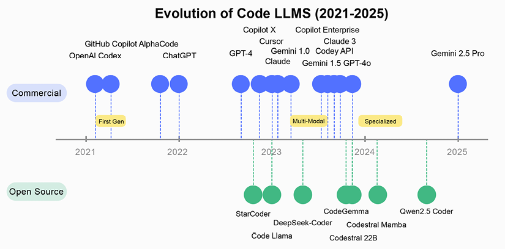
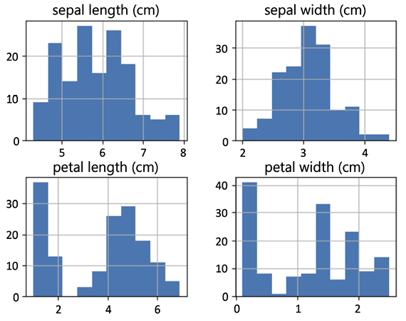

# Agen Pengembangan Perangkat Lunak dan Analisis Data

Bab ini mengeksplorasi bagaimana bahasa alami—bahasa Inggris sehari-hari atau bahasa apa pun yang Anda sukai untuk berinteraksi dengan LLM—telah muncul sebagai antarmuka yang kuat untuk pemrograman, pergeseran paradigma yang, jika diambil secara ekstrem, disebut _vibe coding_. Alih-alih mempelajari bahasa pemrograman atau kerangka kerja baru, pengembang sekarang dapat mengartikulasikan niat mereka dalam bahasa alami, membiarkan LLM canggih dan kerangka kerja seperti LangChain menerjemahkan ide-ide ini menjadi kode yang kuat dan siap produksi. Selain itu, sementara bahasa pemrograman tradisional tetap penting untuk sistem produksi, LLM menciptakan alur kerja baru yang melengkapi praktik yang ada dan berpotensi meningkatkan aksesibilitas. Evolusi ini mewakili pergeseran signifikan dari upaya sebelumnya dalam pembuatan kode dan otomatisasi.

Kita akan secara khusus membahas tempat LLM dalam pengembangan perangkat lunak dan keadaan seni performa, model, dan aplikasi. Kita akan melihat bagaimana menggunakan rantai dan agen LLM untuk membantu dalam pembuatan kode dan analisis data, pelatihan model ML, dan ekstraksi prediksi. Kita akan membahas penulisan kode dengan LLM, memberikan contoh dengan model berbeda baik di layanan AI generatif Google, Hugging Face, atau Anthropic. Setelah ini, kita akan beralih ke pendekatan yang lebih canggih dengan agen dan RAG untuk dokumentasi atau repositori kode.

Kita juga akan menerapkan agen LLM untuk ilmu data: pertama kita akan melatih model pada kumpulan data, lalu kita akan menganalisis dan memvisualisasikan kumpulan data. Apakah Anda seorang pengembang, ilmuwan data, atau pengambil keputusan teknis, bab ini akan melengkapi Anda dengan pemahaman yang jelas tentang bagaimana LLM membentuk ulang pengembangan perangkat lunak dan analisis data sambil mempertahankan peran penting bahasa pemrograman konvensional.

Topik berikut akan dibahas dalam bab ini:

- LLM dalam pengembangan perangkat lunak
- Menulis kode dengan LLM
- Menerapkan agen LLM untuk ilmu data

## LLM dalam pengembangan perangkat lunak

Hubungan antara bahasa alami dan pemrograman sedang mengalami transformasi signifikan. Bahasa pemrograman tradisional tetap penting dalam pengembangan perangkat lunak—C++ dan Rust untuk aplikasi yang kritis terhadap performa, Java dan C# untuk sistem perusahaan, dan Python untuk pengembangan cepat, analisis data, dan alur kerja ML. Namun, bahasa alami, khususnya bahasa Inggris, sekarang berfungsi sebagai antarmuka yang kuat untuk menyederhanakan tugas pengembangan perangkat lunak dan ilmu data, melengkapi daripada menggantikan alat pemrograman khusus ini.

Asisten AI canggih memungkinkan Anda membangun perangkat lunak hanya dengan tetap "dalam vibe" dari apa yang Anda inginkan, tanpa pernah menulis atau bahkan membayangkan satu baris kode pun. Gaya pengembangan ini, yang dikenal sebagai vibe coding, dipopulerkan oleh Andrej Karpathy di awal 2025. Alih-alih merumuskan tugas dalam istilah pemrograman atau bergulat dengan sintaks, Anda menjelaskan perilaku yang diinginkan, alur pengguna, atau hasil dalam percakapan biasa. Model kemudian mengatur struktur data, logika, dan integrasi di balik layar. Dengan vibe coding, Anda tidak melakukan debug—Anda melakukan re‑vibe. Artinya, Anda berulang dengan menyatakan ulang atau menyempurnakan persyaratan dalam bahasa alami, dan membiarkan asisten membentuk ulang sistem. Hasilnya adalah alur kerja desain‑pertama yang murni dan intuitif yang sepenuhnya mengabstraksikan semua detail pengkodean.

Alat seperti Cursor, Windsurf (sebelumnya Codeium), OpenHands, dan Amazon Q Developer telah muncul untuk mendukung pendekatan pengembangan ini, masing‑masing menawarkan kemampuan berbeda untuk pengkodean berbantuan AI. Dalam praktiknya, antarmuka ini mendemokratisasi pembuatan perangkat lunak sekaligus membebaskan insinyur berpengalaman dari tugas berulang. Namun, menyeimbangkan kecepatan dengan kualitas kode dan keamanan tetap kritis, terutama untuk sistem produksi.

Lanskap pengembangan perangkat lunak telah lama berupaya membuat pemrograman lebih mudah diakses melalui berbagai lapisan abstraksi. Upaya awal mencakup bahasa generasi keempat yang bertujuan menyederhanakan sintaks, memungkinkan pengembang mengekspresikan logika dengan lebih sedikit baris kode. Evolusi ini berlanjut dengan platform low‑code modern, yang memperkenalkan pemrograman visual dengan komponen pra‑bangun untuk mendemokratisasi pengembangan aplikasi di luar ahli pengkodean tradisional. Evolusi terbaru dan mungkin paling transformatif menampilkan pemrograman bahasa alami melalui LLM, yang menafsirkan niat manusia yang diungkapkan dalam bahasa biasa dan menerjemahkannya menjadi kode fungsional.

Yang membuat evolusi saat ini sangat berbeda adalah perbedaan mendasarnya dari pendekatan sebelumnya. Alih‑alih menciptakan bahasa buatan baru untuk dipelajari manusia, kita mengadaptasi alat cerdas untuk memahami komunikasi alami manusia, secara signifikan menurunkan hambatan masuk. Tidak seperti platform low‑code tradisional yang sering menghasilkan implementasi berpemilik, pemrograman bahasa alami menghasilkan kode standar tanpa kunci‑vendor, mempertahankan kebebasan pengembang dan kompatibilitas dengan ekosistem yang ada. Mungkin yang paling penting, pendekatan ini menawarkan fleksibilitas yang belum pernah ada sebelumnya di seluruh spektrum, dari tugas sederhana hingga aplikasi kompleks, melayani pemula yang mencari solusi cepat dan pengembang berpengalaman yang ingin mempercepat alur kerja mereka.

### Masa depan pengembangan

Analis di International Data Corporation (IDC) memproyeksikan bahwa, pada tahun 2028, bahasa alami akan digunakan untuk menciptakan 70% solusi digital baru (IDC FutureScape, _Worldwide Developer and DevOps 2025 Predictions_). Namun, ini tidak berarti pemrograman tradisional akan hilang; melainkan, ia berevolusi menjadi sistem dua tingkat di mana bahasa alami berfungsi sebagai antarmuka tingkat tinggi sementara bahasa pemrograman tradisional menangani detail implementasi yang presisi.

Namun, evolusi ini tidak menandakan akhir bagi bahasa pemrograman tradisional. Sementara bahasa alami dapat menyederhanakan fase desain dan mempercepat prototipe, presisi dan determinisme bahasa seperti Python tetap penting untuk membangun sistem yang andal dan siap produksi. Dengan kata lain, alih‑alih menggantikan kode sepenuhnya, bahasa Inggris (atau Mandarin, atau bahasa alami mana pun yang paling sesuai dengan proses kognitif kita) melengkapinya—bertindak sebagai lapisan tingkat tinggi yang menjembatani niat manusia dengan logika yang dapat dieksekusi.

Bagi pengembang perangkat lunak, ilmuwan data, dan pengambil keputusan teknis, pergeseran ini berarti menerima alur kerja hibrida di mana arahan bahasa alami, didukung oleh LLM dan kerangka kerja seperti LangChain, berdampingan dengan kode konvensional. Pendekatan terintegrasi ini membuka jalan bagi inovasi yang lebih cepat, solusi perangkat lunak yang dipersonalisasi, dan, pada akhirnya, proses pengembangan yang lebih mudah diakses.

### Pertimbangan implementasi

Untuk lingkungan produksi, evolusi saat ini termanifestasi dalam beberapa cara yang mengubah cara tim pengembangan beroperasi. Antarmuka bahasa alami memungkinkan prototipe yang lebih cepat dan mengurangi waktu yang dihabiskan untuk kode boilerplate, sementara pemrograman tradisional tetap penting untuk pengoptimalan dan implementasi fitur kompleks. Namun, penelitian independen terbaru menunjukkan keterbatasan signifikan dalam kemampuan pengkodean AI saat ini.

Studi patokan _SWE‑Lancer_ OpenAI 2025 menemukan bahwa bahkan model yang berkinerja teratas hanya menyelesaikan 26,2% tugas teknik individual yang diambil dari proyek lepas dunia nyata. Penelitian mengidentifikasi tantangan spesifik termasuk pemecahan masalah permukaan, pemahaman konteks terbatas di banyak file, pengujian yang tidak memadai, dan penanganan kasus tepi yang buruk.

Terlepas dari keterbatasan ini, banyak organisasi melaporkan peningkatan produktivitas saat menggunakan asisten pengkodean AI dengan cara yang ditargetkan. Pendekatan yang paling efektif tampaknya adalah kolaborasi—menggunakan AI untuk mempercepat tugas rutin sementara menerapkan keahlian manusia di area di mana AI masih kesulitan, seperti keputusan arsitektur, pengujian komprehensif, dan pemahaman persyaratan bisnis dalam konteks. Seiring teknologi matang, integrasi yang berhasil antara bahasa alami dan pemrograman tradisional kemungkinan akan bergantung pada mendefinisikan dengan jelas di mana masing‑masing unggul daripada mengasumsikan AI dapat menangani tantangan rekayasa perangkat lunak yang kompleks secara mandiri.

Pemeliharaan kode telah berkembang melalui pendekatan berbantuan AI di mana pengembang menggunakan bahasa alami untuk memahami dan memodifikasi basis kode. Sementara GitHub melaporkan pengguna Copilot menyelesaikan tugas pengkodean spesifik 55% lebih cepat dalam eksperimen terkontrol, studi lapangan independen menunjukkan peningkatan produktivitas yang lebih sederhana berkisar antara 4–22%, tergantung pada konteks dan pendekatan pengukuran. Demikian pula, Salesforce melaporkan alat CodeGenie internal mereka berkontribusi pada peningkatan produktivitas, termasuk mengotomatiskan aspek tinjauan kode dan pemindaian keamanan. Di luar peningkatan kecepatan mentah, penelitian secara konsisten menunjukkan asisten pengkodean AI mengurangi beban kognitif pengembang dan meningkatkan kepuasan, terutama untuk tugas berulang. Namun, studi juga menyoroti keterbatasan penting: kode yang dihasilkan sering kali membutuhkan verifikasi dan pengerjaan ulang manusia yang signifikan, dengan beberapa penelitian independen melaporkan tingkat bug yang lebih tinggi dalam kode berbantuan AI. Bukti menunjukkan alat‑alat ini adalah asisten berharga yang menyederhanakan alur kerja pengembangan sementara masih membutuhkan keahlian manusia untuk jaminan kualitas dan keamanan.

Bidang debug kode telah ditingkatkan karena kueri bahasa alami membantu pengembang mengidentifikasi dan menyelesaikan masalah lebih cepat dengan menjelaskan pesan kesalahan, menyarankan perbaikan potensial, dan memberikan konteks untuk perilaku tak terduga. Penerapan "AXA Secure GPT" oleh AXA, yang dilatih pada kebijakan internal dan repositori kode, telah secara signifikan mengurangi waktu penyelesaian tugas rutin, memungkinkan tim pengembangan fokus pada pekerjaan yang lebih strategis (AXA, _AXA offers secure Generative AI to employees_).

Ketika memahami sistem kompleks, pengembang dapat menggunakan LLM untuk menghasilkan penjelasan dan visualisasi arsitektur rumit, basis kode warisan, atau dependensi pihak ketiga, mempercepat onboarding dan pemahaman sistem. Misalnya, diagram lanskap sistem Salesforce menunjukkan bagaimana platform terintegrasi LLM mereka terhubung di berbagai layanan, meskipun laporan pendapatan terbaru menunjukkan inisiatif AI ini belum secara signifikan mempengaruhi hasil keuangan mereka.

Arsitektur sistem itu sendiri berevolusi karena aplikasi semakin perlu dirancang dengan mempertimbangkan antarmuka bahasa alami, baik untuk pengembangan maupun interaksi pengguna potensial. BMW melaporkan menerapkan platform yang menggunakan AI generatif untuk menghasilkan wawasan waktu‑nyata melalui antarmuka obrolan, mengurangi waktu dari ingest data ke rekomendasi yang dapat ditindaklanjuti dari hari menjadi menit. Namun, transformasi arsitektural ini mencerminkan pola industri yang lebih luas di mana firma konsultan telah menjadi penerima manfaat finansial utama dari booming AI generatif. Analisis industri terbaru menunjukkan bahwa raksasa konsultan seperti Accenture menghasilkan lebih banyak pendapatan dari layanan AI generatif ($3,6 miliar dalam pemesanan tahunan) daripada kebanyakan startup AI generatif digabungkan, menimbulkan pertanyaan penting tentang pengiriman nilai dan efektivitas implementasi yang harus dipertimbangkan organisasi ketika merencanakan strategi arsitektur AI mereka.

Bagi pengembang perangkat lunak, ilmuwan data, dan pengambil keputusan, integrasi ini berarti iterasi lebih cepat, biaya lebih rendah, dan transisi yang lebih mulus dari ide ke penyebaran. Sementara LLM membantu menghasilkan kode boilerplate dan mengotomatiskan tugas rutin, pengawasan manusia tetap kritis untuk arsitektur sistem, keamanan, dan performa. Seperti yang ditunjukkan studi kasus, perusahaan yang mengintegrasikan antarmuka bahasa alami ke dalam pipa pengembangan dan operasional sudah menyadari nilai bisnis yang nyata sambil mempertahankan bimbingan manusia yang diperlukan.

### Evolusi LLM kode

Pengembangan LLM khusus kode telah mengikuti lintasan cepat sejak awal, berkembang melalui tiga fase berbeda yang telah mengubah praktik pengembangan perangkat lunak. Fase _Dasar_ pertama (2021 hingga awal 2022) memperkenalkan model pembuatan kode pertama yang layak yang membuktikan konsep tersebut layak. Ini diikuti oleh fase _Ekspansi_ (akhir 2022 hingga awal 2023), yang membawa peningkatan signifikan dalam kemampuan penalaran dan pemahaman kontekstual. Baru‑baru ini, fase _Diversifikasi_ (pertengahan 2023 hingga 2024) telah melihat munculnya penawaran komersial canggih dan alternatif open‑source yang semakin mampu.

Evolusi ini telah dicirikan oleh jalur pengembangan paralel di ekosistem berpemilik dan open‑source. Awalnya, model komersial mendominasi lanskap, tetapi alternatif open‑source telah mendapatkan momentum substansial lebih baru ini. Sepanjang perkembangan ini, beberapa pencapaian kunci telah menandai pergeseran transformatif dalam kemampuan, membuka kemungkinan baru untuk pengembangan berbantuan AI di berbagai bahasa pemrograman dan tugas. Konteks sejarah evolusi ini memberikan wawasan penting untuk memahami pendekatan implementasi dengan LangChain.



_Gambar 7.1_ mengilustrasikan perkembangan model bahasa khusus kode di seluruh ekosistem komersial (jalur atas) dan open‑source (jalur bawah). Pencapaian kunci disorot, menunjukkan transisi dari model bukti‑konsep awal ke solusi yang semakin khusus. Rentang waktu mencakup dari model komersial awal seperti Codex hingga kemajuan terbaru seperti Gemini 2.5 Pro Google (Maret 2025) dan model kode khusus seperti seri Codestral Mistral AI.

Dalam beberapa tahun terakhir, kita telah menyaksikan ledakan LLM yang disesuaikan secara khusus untuk pengkodean—umumnya dikenal sebagai LLM kode. Model‑model ini berkembang cepat, masing‑masing dengan kekuatan dan keterbatasannya sendiri, dan membentuk ulang lanskap pengembangan perangkat lunak. Mereka menawarkan janji untuk mempercepat alur kerja pengembangan di berbagai spektrum tugas rekayasa perangkat lunak:

- **Pembuatan kode:** Mengubah persyaratan bahasa alami menjadi cuplikan kode atau fungsi lengkap. Misalnya, pengembang dapat menghasilkan kode boilerplate atau modul utuh berdasarkan spesifikasi proyek.
- **Pembuatan tes:** Membuat tes unit dari deskripsi perilaku yang diharapkan untuk meningkatkan keandalan kode.
- **Dokumentasi kode:** Secara otomatis menghasilkan docstring, komentar, dan dokumentasi teknis dari kode atau spesifikasi yang ada. Ini secara signifikan mengurangi beban dokumentasi yang sering diabaikan dalam lingkungan pengembangan yang cepat.
- **Penyuntingan dan refaktor kode:** Secara otomatis menyarankan perbaikan, memperbaiki bug, dan menyusun ulang kode untuk kemudahan pemeliharaan.
- **Terjemahan kode:** Mengonversi kode antara bahasa pemrograman atau kerangka kerja yang berbeda.
- **Debug dan perbaikan program otomatis:** Mengidentifikasi bug dalam basis kode besar dan menghasilkan patch untuk menyelesaikan masalah. Misalnya, alat seperti SWE‑agent, AutoCodeRover, dan RepoUnderstander menyempurnakan kode secara iteratif dengan menavigasi repositori, menganalisis pohon sintaks abstrak, dan menerapkan perubahan yang ditargetkan.

Lanskap LLM khusus kode telah tumbuh semakin beragam dan kompleks. Evolusi ini menimbulkan pertanyaan kritis bagi pengembang yang menerapkan model ini di lingkungan produksi: Model mana yang paling cocok untuk tugas pemrograman spesifik? Bagaimana perbandingan model berbeda dalam hal kualitas kode, akurasi, dan kemampuan penalaran? Apa pertukaran antara opsi open‑source dan komersial? Di sinilah patokan menjadi alat penting untuk evaluasi dan seleksi.

### Patokan untuk LLM kode

Patokan objektif menyediakan metode terstandar untuk membandingkan performa model di berbagai tugas pengkodean, bahasa, dan tingkat kompleksitas. Mereka membantu mengukur kemampuan yang sebaliknya akan tetap menjadi kesan subjektif, memungkinkan keputusan implementasi berbasis data.

Khusus untuk pengembang LangChain, memahami hasil patokan menawarkan beberapa keunggulan:

- **Seleksi model yang terinformasi:** Memilih model optimal untuk kasus penggunaan spesifik berdasarkan metrik performa yang dapat diukur daripada klaim pemasaran atau pengujian yang tidak lengkap
- **Peralatan yang sesuai:** Merancang pipa LangChain yang menggabungkan keseimbangan yang tepat antara kemampuan model dan teknik augmentasi berdasarkan kekuatan dan keterbatasan model yang diketahui
- **Analisis biaya‑manfaat:** Mengevaluasi apakah model komersial premium membenarkan pengeluaran mereka dibandingkan alternatif gratis atau yang di‑host‑sendiri untuk aplikasi tertentu
- **Ekspektasi performa:** Menetapkan ekspektasi realistis tentang apa yang dapat dicapai model berbeda ketika diintegrasikan ke dalam sistem yang lebih besar

LLM pembuat kode menunjukkan kemampuan yang bervariasi di seluruh patokan yang mapan, dengan karakteristik performa yang secara langsung mempengaruhi efektivitasnya dalam implementasi LangChain. Evaluasi terbaru dari model terkemuka, termasuk GPT‑4o OpenAI (2024), Claude 3.5 Sonnet Anthropic (2025), dan model open‑source seperti Llama 3, menunjukkan kemajuan signifikan dalam patokan standar. Misalnya, o1 OpenAI mencapai 92,4% pass@1 pada HumanEval (_A Survey On Large Language Models For Code Generation_, 2025), sementara Claude 3 Opus mencapai 84,9% pada patokan yang sama (_The Claude 3 Model Family: Opus, Sonnet, Haiku_, 2024). Namun, metrik performa mengungkap perbedaan penting antara lingkungan patokan terkontrol dan persyaratan kompleks aplikasi LangChain produksi.

Patokan standar memberikan wawasan berguna tetapi terbatas tentang kemampuan model untuk implementasi LangChain:

- **HumanEval:** Patokan ini mengevaluasi kebenaran fungsional melalui 164 masalah pemrograman Python. HumanEval terutama menguji pembuatan tingkat fungsi yang terisolasi daripada sistem multi‑komponen kompleks yang khas dalam aplikasi LangChain.
- **MBPP (Mostly Basic Programming Problems):** Ini berisi sekitar 974 tugas Python tingkat pemula. Masalah‑masalah ini kekurangan dependensi dan kompleksitas kontekstual yang ditemukan di lingkungan produksi.
- **ClassEval:** Patokan yang lebih baru ini menguji pembuatan kode tingkat kelas, mengatasi beberapa keterbatasan pengujian tingkat fungsi. Penelitian terbaru oleh Liu et al. (_Evaluating Large Language Models in Class‑Level Code Generation_, 2024) menunjukkan degradasi performa 15–30% dibandingkan dengan tugas tingkat fungsi, menyoroti tantangan dalam mempertahankan dependensi kontekstual di seluruh metode—pertimbangan kritis untuk komponen LangChain yang mengelola status.
- **SWE‑bench:** Lebih mewakili pengembangan dunia nyata, patokan ini mengevaluasi model pada tugas perbaikan bug dari repositori GitHub aktual. Bahkan model berkinerja teratas hanya mencapai tingkat keberhasilan 40–65%, seperti yang ditemukan oleh Jimenez et al. (_SWE‑bench: Can Language Models Resolve Real‑World GitHub Issues?_, 2023), menunjukkan kesenjangan signifikan antara patokan sintetis dan tantangan pengkodean otentik.

### Pendekatan rekayasa perangkat lunak berbasis LLM

Saat menerapkan LLM pembuat kode dalam kerangka kerja LangChain, beberapa tantangan kunci muncul.

Masalah tingkat repositori yang membutuhkan pemahaman banyak file, dependensi, dan konteks menimbulkan tantangan signifikan. Penelitian menggunakan patokan ClassEval (Xueying Du dan rekan, _Evaluating Large Language Models in Class‑Level Code Generation_, 2024) menunjukkan bahwa LLM menemukan pembuatan kode tingkat kelas "secara signifikan lebih menantang daripada menghasilkan fungsi mandiri," dengan performa secara konsisten lebih rendah ketika mengelola dependensi antara metode dibandingkan dengan patokan tingkat fungsi seperti HumanEval.

LLM dapat dimanfaatkan untuk memahami konteks kode tingkat repositori meskipun ada tantangan yang melekat. Implementasi berikut menunjukkan pendekatan praktis untuk menganalisis basis kode Python multi‑file dengan LangChain, memuat file repositori sebagai konteks untuk model pertimbangkan saat mengimplementasikan fitur baru. Pola ini membantu mengatasi keterbatasan konteks dengan secara langsung menyediakan struktur repositori ke LLM:

```python
from langchain_openai import ChatOpenAI
from langchain.prompts import ChatPromptTemplate
from langchain_community.document_loaders import GitLoader
# Memuat konteks repositori
repo_loader = GitLoader( clone_url="https://github.com/contoh/repo.git", branch="main", file_filter=lambda file_path: file_path.endswith(".py") ) documents = repo_loader.load()

# Membuat prompt yang sadar konteks
system_template = """Anda adalah pengembang Python ahli. Analisis file repositori berikut dan implementasikan fitur yang diminta. Struktur repositori: {repo_context}"""
human_template = """Implementasikan fungsi yang: {feature_request}"""
prompt = ChatPromptTemplate.from_messages([ ("system", system_template), ("human", human_template) ])

# Membuat model dengan jendela konteks yang diperluas
model = ChatOpenAI(model="gpt-4o", temperature=0.2)
```

Implementasi ini menggunakan GPT‑4o untuk menghasilkan kode sambil mempertimbangkan konteks seluruh repositori dengan menarik file Python relevan untuk memahami dependensi. Pendekatan ini mengatasi keterbatasan konteks tetapi membutuhkan strategi pembagian dokumen dan pengambilan yang hati‑hati untuk basis kode besar.

Kode yang dihasilkan sering kali tampak benar secara dangkal tetapi mengandung bug halus atau kerentanan keamanan yang lolos dari deteksi awal. Studi Uplevel Data Labs (_Can GenAI Actually Improve Developer Productivity?_) yang menganalisis hampir 800 pengembang menemukan "tingkat bug yang secara signifikan lebih tinggi" dalam kode yang dihasilkan oleh pengembang dengan akses ke asisten pengkodean AI dibandingkan dengan yang tanpa. Ini didukung lebih lanjut oleh analisis komprehensif BlueOptima pada 2024 terhadap lebih dari 218.000 pengembang (_Debunking GitHub's Claims: A Data‑Driven Critique of Their Copilot Study_), yang mengungkapkan bahwa 88% profesional perlu mengerjakan ulang secara substansial kode yang dihasilkan AI sebelum siap produksi, sering kali karena "pola pengkodean yang menyimpang" yang tidak segera terlihat.

Peneliti keamanan telah mengidentifikasi risiko persisten di mana model AI secara tidak sengaja memperkenalkan cacat keamanan dengan mereplikasi pola tidak aman dari data pelatihan mereka, dengan kerentanan ini sering lolos deteksi selama pemeriksaan sintaks dan kompilasi awal (_Evaluating Large Language Models through Role‑Guide and Self‑Reflection: A Comparative Study_, 2024, dan _HalluLens: LLM Hallucination Benchmark_, 2024). Temuan ini menekankan pentingnya tinjauan dan pengujian manusia yang menyeluruh terhadap kode yang dihasilkan AI sebelum penyebaran produksi.

Contoh berikut menunjukkan bagaimana membuat rantai validasi khusus yang secara sistematis menganalisis kode yang dihasilkan untuk masalah umum, berfungsi sebagai garis pertahanan pertama terhadap bug dan kerentanan halus:

````python
from langchain.prompts import PromptTemplate
validation_template = """Analisis kode Python berikut untuk:
1. Kerentanan keamanan potensial
2. Kesalahan logika
3. Masalah performa
4. Penanganan kasus tepi

Kode untuk dianalisis:
```python
{generated_code}
Berikan analisis detail dengan masalah spesifik dan perbaikan yang direkomendasikan."""
````

validation_prompt = PromptTemplate( input_variables=["generated_code"], template=validation_template )
validation_chain = validation_prompt | llm

Pendekatan validasi ini menciptakan langkah tinjauan kode berbasis LLM khusus dalam alur kerja, berfokus pada aspek keamanan dan kualitas kritis.

Kebanyakan implementasi yang berhasil menggabungkan umpan balik eksekusi, memungkinkan model meningkatkan output mereka secara iteratif berdasarkan kesalahan kompiler dan perilaku runtime. Penelitian tentang sistem Teks‑ke‑SQL oleh Boyan Li dan rekan (_The Dawn of Natural Language to SQL: Are We Fully Ready?_, 2024) menunjukkan bahwa menggabungkan mekanisme umpan balik secara signifikan meningkatkan akurasi pembuatan kueri, dengan sistem yang menggunakan hasil eksekusi untuk menyempurnakan output mereka dan secara konsisten mengungguli yang tanpa kemampuan tersebut.

Saat menyebarkan LLM pembuat kode dalam aplikasi LangChain produksi, beberapa faktor memerlukan perhatian:

- **Pertukaran seleksi model:** Sementara model berpemilik seperti GPT‑4 dan Claude menunjukkan performa superior pada patokan kode, alternatif open‑source seperti Llama 3 (70,3% pada HumanEval) menawarkan keunggulan dalam biaya, latensi, dan privasi data. Pilihan yang sesuai tergantung pada persyaratan spesifik mengenai akurasi, kendala penyebaran, dan pertimbangan anggaran.
- **Manajemen jendela konteks:** Penanganan efektif jendela konteks terbatas tetap sangat penting. Teknik terbaru seperti pembagian rekursif dan ringkasan hierarkis (Li et al., 2024) dapat meningkatkan performa hingga 25% pada tugas basis kode besar.
- **Integrasi kerangka kerja** memperluas kemampuan LLM dasar dengan memanfaatkan alat khusus seperti LangChain untuk manajemen alur kerja. Organisasi yang menerapkan pola ini menetapkan kebijakan keamanan kustom yang disesuaikan dengan persyaratan domain mereka dan membangun loop umpan balik yang memungkinkan peningkatan berkelanjutan dari output model. Pendekatan integrasi ini memungkinkan tim mendapatkan manfaat dari kemajuan model fondasi sambil mempertahankan kendali atas spesifik penyebaran.
- **Kolaborasi Manusia‑AI** menetapkan pembagian tanggung jawab yang jelas antara pengembang dan sistem AI. Pola ini mempertahankan pengawasan manusia untuk semua keputusan kritis sementara mendelegasikan tugas rutin ke asisten AI. Komponen penting adalah dokumentasi sistematis dan penangkapan pengetahuan, memastikan solusi yang dihasilkan AI tetap dapat dipahami dan dapat dipelihara oleh seluruh tim pengembangan. Perusahaan yang berhasil menerapkan pola ini melaporkan peningkatan produktivitas dan peningkatan transfer pengetahuan di antara anggota tim.

### Keamanan dan mitigasi risiko

Saat membangun aplikasi bertenaga LLM dengan LangChain, mengimplementasikan tindakan keamanan yang kuat dan strategi mitigasi risiko menjadi penting. Bagian ini berfokus pada pendekatan praktis untuk mengatasi kerentanan keamanan, mencegah halusinasi, dan memastikan kualitas kode melalui implementasi khusus LangChain.

Kerentanan keamanan dalam kode yang dihasilkan LLM menimbulkan risiko signifikan, terutama ketika berurusan dengan input pengguna, interaksi database, atau integrasi API. LangChain memungkinkan pengembang membuat proses validasi sistematis untuk mengidentifikasi dan mengurangi risiko ini. Rantai validasi berikut dapat diintegrasikan ke dalam alur kerja LangChain apa pun yang melibatkan pembuatan kode, memberikan analisis keamanan terstruktur sebelum penyebaran:

```python
from typing import List
from langchain_core.output_parsers import PydanticOutputParser
from langchain_core.prompts import PromptTemplate
from langchain_openai import ChatOpenAI
from pydantic import BaseModel, Field
# Mendefinisikan model Pydantic untuk output terstruktur
class SecurityAnalysis(BaseModel):
    """Hasil analisis keamanan untuk kode yang dihasilkan."""
    vulnerabilities: List[str] = Field(description="Daftar kerentanan keamanan yang teridentifikasi")
   mitigation_suggestions: List[str] = Field(description="Saran perbaikan untuk setiap kerentanan")
    risk_level: str = Field(description="Penilaian risiko keseluruhan: Rendah, Sedang, Tinggi, Kritis")

# Menginisialisasi pengurai output dengan model Pydantic
parser = PydanticOutputParser(pydantic_object=SecurityAnalysis)

# Membuat templat prompt dengan instruksi format dari pengurai
security_prompt = PromptTemplate.from_template(
    template="""Analisis kode berikut untuk kerentanan keamanan: {code}
Pertimbangkan:

Kerentanan injeksi SQL
Risiko cross‑site scripting (XSS)
Referensi objek langsung yang tidak aman
Kelemahan autentikasi dan otorisasi
Paparan data sensitif
Validasi input yang hilang
Peluang injeksi perintah
Penggunaan dependensi yang tidak aman
{format_instructions}""",
  input_variables=["code"],
    partial_variables={"format_instructions": parser.get_format_instructions()}
)

# Menginisialisasi model bahasa
llm = ChatOpenAI(model="gpt‑4", temperature=0)

# Menyusun rantai menggunakan LCEL
security_chain = security_prompt | llm | parser
```

Pengurai output Pydantic memastikan bahwa hasil terstruktur dengan benar dan dapat diproses secara terprogram untuk penjagaan gerbang otomatis. Kode yang dihasilkan LLM tidak boleh dieksekusi langsung di lingkungan produksi tanpa validasi. LangChain menyediakan alat untuk membuat lingkungan eksekusi aman untuk menguji kode yang dihasilkan.

Untuk memastikan keamanan saat membangun aplikasi LangChain yang menangani kode, pendekatan berlapis sangat penting, menggabungkan validasi berbasis LLM dengan alat keamanan tradisional untuk pertahanan yang kuat. Strukturkan temuan keamanan menggunakan model Pydantic dan pengurai output LangChain untuk output yang konsisten dan dapat ditindaklanjuti. Selalu isolasi eksekusi kode yang dihasilkan LLM di lingkungan sandbox dengan batas sumber daya ketat, jangan pernah menjalankannya langsung di produksi. Kelola dependensi secara eksplisit dengan memverifikasi impor terhadap paket yang tersedia untuk menghindari halusinasi. Tingkatkan terus pembuatan kode melalui loop umpan balik yang menggabungkan hasil eksekusi dan temuan validasi. Pertahankan pencatatan komprehensif dari semua langkah pembuatan kode, temuan keamanan, dan modifikasi untuk audit. Patuhi prinsip hak istimewa minimal dengan menghasilkan kode yang mengikuti praktik terbaik keamanan seperti izin minimal dan validasi input yang tepat. Akhirnya, manfaatkan kontrol versi untuk menyimpan kode yang dihasilkan dan implementasikan tinjauan manusia untuk komponen kritis.

### Kerangka validasi untuk kode yang dihasilkan LLM

Organisasi harus mengimplementasikan proses validasi terstruktur untuk kode dan analisis yang dihasilkan LLM sebelum pindah ke produksi. Kerangka berikut memberikan panduan praktis untuk tim yang mengadopsi LLM dalam alur kerja ilmu data mereka:

- **Validasi fungsional** membentuk fondasi dari setiap proses penilaian. Mulailah dengan mengeksekusi kode yang dihasilkan dengan data uji perwakilan dan verifikasi dengan hati‑hati bahwa output sesuai dengan hasil yang diharapkan. Pastikan semua dependensi diimpor dengan benar dan kompatibel dengan lingkungan produksi Anda—LLM terkadang merujuk pustaka yang kedaluwarsa atau tidak kompatibel. Yang paling penting, konfirmasi bahwa kode benar‑benar memenuhi persyaratan bisnis asli, karena LLM terkadang menghasilkan kode yang terlihat mengesankan tetapi melewatkan tujuan bisnis inti.
- **Penilaian performa** membutuhkan melihat melampaui fungsionalitas belaka. Patokan waktu eksekusi kode yang dihasilkan LLM terhadap solusi yang ada untuk mengidentifikasi ketidakefisienan potensial. Pengujian dengan kumpulan data yang semakin besar sering mengungkap batasan penskalaan yang tidak terlihat dengan data sampel. Profil penggunaan memori secara sistematis, karena LLM mungkin tidak mengoptimalkan untuk kendala sumber daya kecuali diinstruksikan secara eksplisit. Data performa ini memberikan informasi penting untuk keputusan penyebaran dan mengidentifikasi peluang untuk pengoptimalan.
- **Pemeriksaan keamanan** tidak boleh diabaikan saat bekerja dengan kode yang dihasilkan. Pindai untuk fungsi tidak aman, kerentanan injeksi potensial, dan panggilan API yang tidak aman—masalah yang mungkin diperkenalkan LLM meskipun pelatihan mereka dalam praktik pengkodean yang aman. Verifikasi penanganan yang tepat dari kredensial autentikasi dan data sensitif, terutama ketika model telah diinstruksikan untuk menyertakan akses API. Periksa dengan hati‑hati untuk rahasia yang dikodekan keras atau paparan data yang tidak disengaja yang dapat menciptakan kerentanan keamanan di produksi.
- **Pengujian ketangguhan** memperluas validasi melampaui skenario jalur bahagia. Uji dengan kasus tepi dan input tak terduga yang mengungkap bagaimana kode menangani kondisi ekstrem. Verifikasi bahwa mekanisme penanganan kesalahan komprehensif dan memberikan umpan balik yang bermakna daripada kegagalan yang samar. Evaluasi ketahanan kode terhadap data yang rusak atau hilang, karena lingkungan produksi jarang memberikan kondisi data murni yang diasumsikan dalam pengembangan.
- **Verifikasi logika bisnis** berfokus pada persyaratan spesifik domain yang mungkin tidak sepenuhnya dipahami LLM. Konfirmasi bahwa kendala khusus industri dan aturan bisnis diimplementasikan dengan benar, terutama persyaratan peraturan yang bervariasi menurut sektor. Verifikasi perhitungan dan transformasi terhadap perhitungan manual untuk proses kritis, karena perbedaan matematika halus dapat secara signifikan mempengaruhi hasil bisnis. Pastikan semua persyaratan peraturan atau kebijakan yang relevan dengan industri Anda ditangani dengan benar—langkah penting ketika LLM mungkin kekurangan pengetahuan kepatuhan spesifik domain.
- **Dokumentasi dan kemampuan penjelasan** menyelesaikan proses validasi dengan memastikan penggunaan berkelanjutan dari kode yang dihasilkan. Baik meminta LLM untuk memberikan atau secara terpisah menghasilkan komentar inline yang menjelaskan bagian kompleks dan pilihan algoritmik. Dokumentasikan asumsi apa pun yang dibuat oleh model yang mungkin mempengaruhi pemeliharaan atau peningkatan di masa depan. Buat laporan validasi yang menghubungkan fungsionalitas kode langsung ke persyaratan bisnis, memberikan ketertelusuran yang mendukung pemangku kepentingan teknis dan bisnis.

Kerangka validasi ini harus diintegrasikan ke dalam alur kerja pengembangan, dengan otomatisasi yang sesuai dimasukkan jika memungkinkan untuk mengurangi upaya manual. Organisasi yang memulai adopsi LLM harus memulai dengan kasus penggunaan yang didefinisikan dengan jelas yang selaras dengan tujuan bisnis, mengimplementasikan proses validasi ini secara sistematis, berinvestasi dalam pelatihan staf komprehensif tentang kemampuan dan keterbatasan LLM, dan menetapkan kerangka tata kelola yang jelas yang berkembang dengan teknologi.

### Integrasi LangChain

Seperti yang kita ketahui, LangChain memungkinkan pembuatan agen AI yang serbaguna dan kuat. Misalnya, agen terintegrasi LangChain dapat dengan aman mengeksekusi kode menggunakan penerjemah khusus, berinteraksi dengan database SQL untuk pengambilan data dinamis, dan melakukan analisis keuangan waktu‑nyata, sambil mempertahankan standar kualitas dan keamanan yang ketat.

Integrasi berkisar dari eksekusi kode dan kueri database hingga analisis keuangan dan manajemen repositori. Perangkat alat yang luas ini memfasilitasi pembuatan aplikasi yang terintegrasi dalam dengan data dan sistem dunia nyata, memastikan solusi AI yang kuat dan praktis. Berikut adalah beberapa contoh integrasi:

- **Eksekusi kode dan isolasi:** Alat seperti Python REPL, sesi dinamis Azure Container Apps, Penerjemah Kode Riza, dan Penerjemah Kode Bearly menyediakan berbagai lingkungan untuk mengeksekusi kode dengan aman. Mereka memungkinkan LLM untuk mendelegasikan perhitungan kompleks atau tugas pemrosesan data ke penerjemah kode khusus, sehingga meningkatkan akurasi dan keandalan sambil mempertahankan keamanan.
- **Penanganan database dan data:** Integrasi untuk alat Cassandra, SQL, dan Spark SQL memungkinkan agen berinteraksi langsung dengan berbagai jenis database. Sementara itu, integrasi Alat JSON dan pandas DataFrame memfasilitasi penanganan data terstruktur yang efisien. Kemampuan ini penting untuk aplikasi yang membutuhkan pengambilan data, transformasi, dan analisis dinamis.
- **Data dan analisis keuangan:** Dengan Data FMP, Google Finance, dan Alat FinancialDatasets, pengembang dapat membangun agen AI yang mampu melakukan analisis keuangan dan penelitian pasar yang canggih. Dappier lebih memperluas ini dengan menghubungkan agen ke aliran data waktu‑nyata yang dikurasi.
- **Integrasi repositori dan kontrol versi:** Alat GitHub dan GitLab memungkinkan agen berinteraksi dengan repositori kode, menyederhanakan tugas seperti manajemen masalah, tinjauan kode, dan proses penyebaran—aset penting bagi pengembang yang bekerja di lingkungan DevOps modern.
- **Input pengguna dan visualisasi:** Google Trends dan Alat PowerBI menyoroti fokus ekosistem pada membawa data eksternal (seperti tren pasar) dan kemudian memvisualisasikannya secara efektif. Integrasi "manusia sebagai alat" adalah pengingat bahwa, kadang‑kadang, penilaian manusia tetap sangat diperlukan, terutama dalam skenario yang ambigu.

Setelah mengeksplorasi kerangka teoretis dan manfaat potensial dari pengembangan perangkat lunak berbantuan LLM, mari sekarang beralih ke implementasi praktis. Di bagian berikutnya, kita akan mendemonstrasikan bagaimana menghasilkan kode perangkat lunak fungsional dengan LLM dan mengeksekusinya langsung dari dalam kerangka kerja LangChain. Pendekatan langsung ini akan mengilustrasikan konsep yang telah kita diskusikan dan memberikan Anda contoh yang dapat ditindaklanjuti yang dapat Anda adaptasi untuk proyek Anda sendiri.

## Menulis kode dengan LLM

Di bagian ini, kami mendemonstrasikan pembuatan kode menggunakan berbagai model yang terintegrasi dengan LangChain. Kami telah memilih model berbeda untuk menampilkan:

- Integrasi beragam LangChain dengan alat AI
- Model dengan lisensi dan ketersediaan berbeda
- Opsi untuk penyebaran lokal, termasuk model yang lebih kecil

Contoh‑contoh ini mengilustrasikan fleksibilitas LangChain dalam bekerja dengan berbagai model pembuatan kode, dari layanan berbasis cloud hingga alternatif open‑source. Pendekatan ini memungkinkan Anda memahami berbagai opsi yang tersedia dan memilih solusi yang paling sesuai untuk kebutuhan dan kendala spesifik Anda.

> Harap pastikan Anda telah menginstal semua dependensi yang diperlukan untuk buku ini, seperti yang dijelaskan di [_Bab 2_](Chapter_2.xhtml#_idTextAnchor025). Jika tidak, Anda mungkin mengalami masalah.
>
> Mengingat kecepatan bidang ini dan pengembangan pustaka LangChain, kami berusaha menjaga repositori GitHub tetap mutakhir. Silakan lihat [https://github.com/benman1/generative_ai_with_langchain](https://github.com/benman1/generative_ai_with_langchain).
>
> Untuk pertanyaan apa pun atau jika Anda mengalami kesulitan menjalankan kode, harap buat masalah di GitHub atau bergabunglah dengan diskusi di Discord: [https://packt.link/lang](https://packt.link/lang).

### AI generatif Google

Platform AI generatif Google menawarkan berbagai model yang dirancang untuk mengikuti instruksi, konversi, dan bantuan/pembuatan kode. Model‑model ini juga memiliki batas input/output dan data pelatihan yang berbeda dan sering diperbarui. Mari kita lihat apakah model Gemini Pro dapat menyelesaikan **FizzBuzz**, pertanyaan wawancara umum untuk posisi pengembang perangkat lunak tingkat pemula.

Untuk menguji kemampuan pembuatan kode model, kami akan menggunakan LangChain untuk berinteraksi dengan Gemini Pro dan memberikan pernyataan masalah FizzBuzz:

```python
from langchain_google_genai import ChatGoogleGenerativeAI
question = """

Diberikan integer n, kembalikan larik string answer (diindeks‑1) di mana:
answer[i] == "FizzBuzz" jika i habis dibagi 3 dan 5.
answer[i] == "Fizz" jika i habis dibagi 3.
answer[i] == "Buzz" jika i habis dibagi 5.
answer[i] == i (sebagai string) jika tidak ada kondisi di atas yang benar.
"""

llm = ChatGoogleGenerativeAI(model="gemini‑1.5‑pro")
print(llm.invoke(question).content)
```

Gemini Pro segera mengembalikan solusi Python yang bersih dan benar yang menangani semua persyaratan FizzBuzz dengan benar:

```python
    answer = []

    for i in range(1, n+1):
        if i % 3 == 0 and i % 5 == 0:
            answer.append("FizzBuzz")
        elif i % 3 == 0:
            answer.append("Fizz")
        elif i % 5 == 0:
            answer.append("Buzz")
        else:
            answer.append(str(i))

    return answer
```

Model menghasilkan solusi efisien dan terstruktur dengan baik yang mengimplementasikan logika untuk masalah FizzBuzz tanpa kesalahan atau kompleksitas yang tidak perlu. Apakah Anda akan mempekerjakan Gemini Pro untuk tim Anda?

### Hugging Face

Hugging Face menjadi tuan rumah banyak model open‑source, banyak yang telah dilatih pada kode, beberapa dapat dicoba di playground, di mana Anda dapat meminta mereka untuk menyelesaikan (untuk model lama) atau menulis kode (model yang disetel instruksi). Dengan LangChain, Anda dapat mengunduh model ini dan menjalankannya secara lokal, atau mengaksesnya melalui API Hugging Face. Mari coba opsi lokal terlebih dahulu dengan contoh perhitungan bilangan prima:

```python
from langchain.llms import HuggingFacePipeline
from transformers import AutoModelForCausalLM, AutoTokenizer, pipeline

# Pilih model yang lebih mutakhir
checkpoint = "google/codegemma‑2b"

# Muat model dan tokenizer
model = AutoModelForCausalLM.from_pretrained(checkpoint)
tokenizer = AutoTokenizer.from_pretrained(checkpoint)

# Buat pipeline pembuatan teks
pipe = pipeline(
    task="text‑generation",
    model=model,
    tokenizer=tokenizer,
    max_new_tokens=500
)

# Integrasikan pipeline dengan LangChain
llm = HuggingFacePipeline(pipeline=pipe)

# Tentukan teks input
text = """

def calculate_primes(n):
    """Buat daftar bilangan bulat berurutan dari 2 hingga N.
    Contoh:
    >>> calculate_primes(20)
    Output: [2, 3, 5, 7, 11, 13, 17, 19]
    """
"""

# Gunakan LLM LangChain untuk menghasilkan teks
output = llm(text)
print(output)
```

Saat dieksekusi, CodeGemma menyelesaikan fungsi dengan mengimplementasikan algoritma Saringan Eratosthenes, metode klasik untuk menemukan bilangan prima secara efisien. Model dengan benar menafsirkan docstring, memahami bahwa fungsi harus mengembalikan semua bilangan prima hingga n daripada hanya memeriksa apakah suatu bilangan prima. Kode yang dihasilkan menunjukkan bagaimana model kode khusus dapat menghasilkan implementasi yang berfungsi dari spesifikasi minimal.

> Harap diperhatikan bahwa pengunduhan dan pemuatan model dapat memakan waktu beberapa menit.

Jika Anda mendapatkan kesalahan mengatakan "`cannot access a gated repo`" saat mencoba menggunakan URL dengan LangChain, itu berarti Anda mencoba mengakses repositori pribadi di Hugging Face yang memerlukan autentikasi dengan token akses pribadi untuk melihat atau menggunakan model; Anda perlu membuat token akses Hugging Face dan menetapkannya sebagai variabel lingkungan bernama `"HF_TOKEN"` untuk mengakses repositori berpagar. Anda dapat mendapatkan token di situs web Hugging Face di [https://huggingface.co/docs/api‑inference/quicktour#get‑your‑api‑token](https://huggingface.co/docs/api‑inference/quicktour#get‑your‑api‑token).

Saat kode kita dari contoh sebelumnya berhasil dieksekusi dengan CodeGemma, itu menghasilkan implementasi lengkap untuk fungsi kalkulator bilangan prima. Outputnya terlihat seperti ini:

```python
def calculate_primes(n):
    """Buat daftar bilangan bulat berurutan dari 2 hingga N.
    Contoh:
    >>> calculate_primes(20)
    Output: [2, 3, 5, 7, 11, 13, 17, 19]
    """
    primes = []
    for i in range(2, n + 1):
        if is_prime(i):
            primes.append(i)
    return primes

def is_prime(n):
    """Kembalikan True jika n prima."""
    if n < 2:
        return False
    for i in range(2, int(n ** 0.5) + 1):
        if n % i == 0:
            return False
    return True

def main():
    """Dapatkan input pengguna dan cetak daftar bilangan prima."""
    n = int(input("Masukkan angka: "))
    primes = calculate_primes(n)
    print(primes)

if __name__ == "__main__":
    main()
<|file_separator|>
```

Perhatikan bagaimana model tidak hanya mengimplementasikan fungsi `calculate_primes()` yang diminta tetapi juga membuat fungsi pembantu, `is_prime()`, yang menggunakan algoritma lebih efisien memeriksa pembagian hanya hingga akar kuadrat dari angka. Model bahkan menambahkan fungsi `main()` lengkap dengan penanganan input pengguna, menunjukkan pemahamannya tentang pola pemrograman Python.

Alih‑alih mengunduh dan menjalankan model secara lokal, yang membutuhkan sumber daya komputasi signifikan, kita juga dapat menjalankan model langsung di infrastruktur Hugging Face menggunakan Inference API mereka. Pendekatan ini lebih sederhana untuk disiapkan dan tidak memerlukan perangkat keras yang kuat. Berikut cara mengimplementasikan contoh yang sama menggunakan layanan yang di‑host Hugging Face:

```python
from langchain.llms import HuggingFaceHub

# Pilih model ringan yang bagus untuk pembuatan kode
repo_id = "bigcode/starcoder"

# Inisialisasi LLM HuggingFaceHub
llm = HuggingFaceHub(
    repo_id=repo_id,
    task="text‑generation",
    model_kwargs={
        "temperature": 0.5,
        "max_length": 1000
    }
)

# Gunakan LLM LangChain untuk menghasilkan teks
output = llm.invoke(text)
print(output)
```

Saat dieksekusi, kode ini terhubung ke server Hugging Face untuk menjalankan model StarCoder, model pembuatan kode khusus yang dilatih pada korpus besar kode sumber. Output yang diharapkan akan mirip dengan contoh sebelumnya—implementasi lengkap kalkulator bilangan prima—tetapi mungkin dengan pendekatan algoritmik berbeda karena kita menggunakan model yang berbeda. Pendekatan yang di‑host ini mengorbankan beberapa fleksibilitas dan kontrol untuk kenyamanan dan pengurangan persyaratan sumber daya lokal, menjadikannya ideal untuk prototipe cepat atau saat bekerja pada perangkat keras dengan kemampuan terbatas.

### Anthropic

Model seri Claude Anthropic telah sangat baik dalam tugas terkait pengkodean. Mari kita lihat bagaimana Claude menangani tugas pengkodean:

```python
from langchain_anthropic import ChatAnthropic
from langchain_core.prompts.prompt import PromptTemplate

template = """Pertanyaan: {question}

Mari berpikir langkah demi langkah.
Jawaban:

"""

prompt = PromptTemplate(template=template, input_variables=["question"])
llm = ChatAnthropic(model='claude‑3‑opus‑20240229')
llm_chain = prompt | llm
print(llm_chain.invoke(text))
```

Kami mendapatkan algoritma dan penjelasan yang sangat detail:

````python
Untuk menghitung bilangan prima hingga angka tertentu N, kita dapat mengikuti algoritma Saringan Eratosthenes. Berikut pendekatan langkah demi langkah untuk menyelesaikan masalah:

```python
def calculate_primes(n):
    """Buat daftar bilangan bulat berurutan dari 2 hingga N."""
    # Buat daftar bilangan bulat berurutan dari 2 hingga N
    numbers = list(range(2, n + 1))
    # Inisialisasi daftar kosong untuk menyimpan bilangan prima
    primes = []
    while numbers:
        # Ambil angka pertama sebagai prima
        prime = numbers[0]
        primes.append(prime)
        # Hapus semua kelipatan dari bilangan prima dari daftar
        numbers = [num for num in numbers if num % prime != 0]
    return primes
````

Penjelasan langkah demi langkah:
Kami membuat daftar bernama `numbers` yang berisi bilangan bulat berurutan dari 2 hingga N menggunakan fungsi `range()`.
Kami menginisialisasi daftar kosong bernama `primes` untuk menyimpan bilangan prima yang akan kami hitung.
Kami memulai loop yang berlanjut selama ada angka di daftar `numbers`.
Di dalam loop, kami mengambil angka pertama dari daftar `numbers` dan menganggapnya sebagai bilangan prima. Kami menambahkan bilangan prima ini ke daftar `primes`.
Kami menghapus semua kelipatan bilangan prima dari daftar `numbers` menggunakan pemahaman daftar. Pemahaman daftar membuat daftar baru yang hanya berisi angka yang tidak habis dibagi oleh bilangan prima saat ini.
Kami ulangi langkah 4 dan 5 hingga daftar `numbers` menjadi kosong. Ini memastikan bahwa kami telah mempertimbangkan semua angka hingga N dan mengidentifikasi bilangan prima di antara mereka.
Akhirnya, kami mengembalikan daftar `primes`, yang berisi semua bilangan prima hingga N.

````

Mari kita uji fungsi dengan contoh yang diberikan:

```python
print(calculate_primes(20))
````

```
Output:

[2, 3, 5, 7, 11, 13, 17, 19]
```

Fungsi dengan benar mengembalikan daftar bilangan prima hingga 20. Implementasi ini mengikuti algoritma Saringan Eratosthenes lagi.

### Pendekatan agentik

Kami juga dapat membuat agen LLM yang dapat mengeksekusi kode Python untuk memecahkan masalah:

```python
from langchain_openai import ChatOpenAI
from langchain.agents import load_tools, initialize_agent, AgentType
from langchain_experimental.tools import PythonREPLTool

tools = [PythonREPLTool()]   # Memberi agen kemampuan menjalankan kode Python
llm = ChatOpenAI()

# Siapkan agen dengan alat dan model yang diperlukan
agent = initialize_agent(
    tools,
    llm,  # Model bahasa untuk menggerakkan agen
    agent=AgentType.ZERO_SHOT_REACT_DESCRIPTION,
    verbose=True  # Menunjukkan proses pemikiran agen
)  # Agen membuat keputusan tanpa contoh

result = agent("Apa bilangan prima hingga 20?")
print(result)
```

Agen akan:

1. Menentukan bahwa ia perlu menulis kode Python.
2. Menggunakan `PythonREPLTool` untuk mengeksekusi kode.
3. Mengembalikan hasil.

Saat dijalankan, itu akan menunjukkan langkah penalarannya dan eksekusi kode sebelum memberikan jawaban akhir. Kita seharusnya melihat output seperti ini:

```
> Memasuki rantai AgentExecutor baru...
Saya dapat menulis skrip Python untuk menemukan bilangan prima hingga 20.
Aksi: Python_REPL
Input Aksi: def is_prime(n):
    if n <= 1:
        return False
    for i in range(2, int(n**0.5) + 1):
        if n % i == 0:
            return False
    return True
primes = [num for num in range(2, 21) if is_prime(num)]
print(primes)
Pengamatan: [2, 3, 5, 7, 11, 13, 17, 19]
Sekarang saya tahu jawaban akhir
Jawaban Akhir: [2, 3, 5, 7, 11, 13, 17, 19]
> Rantai selesai.
{'input': 'Apa bilangan prima hingga 20?', 'output': '[2, 3, 5, 7, 11, 13, 17, 19]'}
```

### RAG dokumentasi

Yang juga cukup menarik adalah penggunaan dokumen untuk membantu menulis kode atau untuk bertanya tentang dokumentasi. Berikut contoh memuat semua halaman dokumentasi dari situs web LangChain menggunakan `DocusaurusLoader`:

```python
from langchain_community.document_loaders import DocusaurusLoader
import nest_asyncio
nest_asyncio.apply()

# Muat semua halaman dari dokumentasi LangChain
loader = DocusaurusLoader("https://python.langchain.com")
documents[0]

nest_asyncio.apply() mengaktifkan operasi async di notebook Jupyter. Pemuat mendapatkan semua halaman.
```

`DocusaurusLoader` secara otomatis mengikis dan mengekstrak konten dari situs web dokumentasi LangChain. Pemuat ini khusus dirancang untuk menavigasi situs berbasis Docusaurus dan mengekstrak konten yang diformat dengan benar. Sementara itu, fungsi `nest_asyncio.apply()` diperlukan untuk lingkungan Jupyter Notebook, yang memiliki batasan dengan loop event asyncio. Baris ini memungkinkan kami menjalankan kode asinkron dalam sel notebook, yang diperlukan untuk banyak operasi pengikisan web. Setelah eksekusi, variabel dokumen berisi semua halaman dokumentasi, masing‑masing direpresentasikan sebagai objek `Document` dengan properti seperti `page_content` dan metadata. Kami kemudian dapat menyiapkan embeddings dengan caching:

```python
from langchain.embeddings import CacheBackedEmbeddings
from langchain_openai import OpenAIEmbeddings
from langchain.storage import LocalFileStore

# Cache embeddings secara lokal untuk menghindari panggilan API berulang
store = LocalFileStore("./cache/")
underlying_embeddings = OpenAIEmbeddings(model="text‑embedding‑3‑large")
embeddings = CacheBackedEmbeddings.from_bytes_store(
    underlying_embeddings, store, namespace=underlying_embeddings.model
)
```

Sebelum kami dapat memasukkan model kami ke dalam toko vektor, kami perlu membaginya, seperti dibahas di [_Bab 4_](Chapter_4.xhtml#_idTextAnchor068):

```python
from langchain_text_splitters import RecursiveCharacterTextSplitter

text_splitter = RecursiveCharacterTextSplitter(
    chunk_size=1000,
    chunk_overlap=20,
    length_function=len,
    is_separator_regex=False,
)

splits = text_splitter.split_documents(documents)
```

Sekarang kami akan membuat toko vektor dari pembagian dokumen:

```python
from langchain_chroma import Chroma

# Simpan embeddings dokumen untuk pengambilan efisien
vectorstore = Chroma.from_documents(documents=splits, embedding=embeddings)
```

Kami juga perlu menginisialisasi model LLM atau chat:

```python
from langchain_google_vertexai import VertexAI
llm = VertexAI(model_name="gemini‑pro")
```

Kemudian, kami menyiapkan komponen RAG:

```python
from langchain import hub
retriever = vectorstore.as_retriever()

# Gunakan templat prompt RAG yang dibuat komunitas
prompt = hub.pull("rlm/rag‑prompt")
```

Akhirnya, kami akan membangun rantai RAG:

```python
from langchain_core.runnables import RunnablePassthrough
def format_docs(docs):
    return "\n\n".join(doc.page_content for doc in docs)

# Rantai menggabungkan pengambilan konteks, prompting, dan pembuatan respons
rag_chain = (
    {"context": retriever | format_docs, "question": RunnablePassthrough()}
    | prompt
    | llm
    | StrOutputParser()
)
```

Mari kueri rantainya:

```python
response = rag_chain.invoke("Apa itu Dekomposisi Tugas?")
```

Setiap komponen membangun yang sebelumnya, menciptakan sistem RAG lengkap yang dapat menjawab pertanyaan menggunakan dokumentasi LangChain.

### RAG repositori

Satu aplikasi kuat dari sistem RAG adalah menganalisis repositori kode untuk memungkinkan kueri bahasa alami tentang basis kode. Teknik ini memungkinkan pengembang dengan cepat memahami kode asing atau menemukan contoh implementasi relevan. Mari bangun sistem RAG yang berfokus kode dengan mengindeks repositori GitHub.

Pertama, kami akan mengklon repositori dan menyiapkan lingkungan kami:

```python
import os
from git import Repo
from langchain_community.document_loaders.generic import GenericLoader
from langchain_community.document_loaders.parsers import LanguageParser
from langchain_text_splitters import Language, RecursiveCharacterTextSplitter

# Klon repositori buku dari GitHub
repo_path = os.path.expanduser("~/Downloads/generative_ai_with_langchain")  # direktori ini seharusnya belum ada!
repo = Repo.clone_from("https://github.com/benman1/generative_ai_with_langchain", to_path=repo_path)
```

Setelah mengklon repositori, kami perlu mengurai file Python menggunakan pemuat khusus LangChain yang memahami struktur kode. LanguageParser membantu mempertahankan semantik kode selama pemrosesan:

```python
loader = GenericLoader.from_filesystem(
    repo_path,
    glob="**/*",
    suffixes=[".py"],
    parser=LanguageParser(language=Language.PYTHON, parser_threshold=500),
)
documents = loader.load()

python_splitter = RecursiveCharacterTextSplitter.from_language(
    language=Language.PYTHON, chunk_size=50, chunk_overlap=0
)

# Bagikan Dokumen menjadi potongan untuk embedding dan penyimpanan vektor
texts = python_splitter.split_documents(documents)
```

Kode ini melakukan tiga operasi kunci: mengklon repositori GitHub buku kami, memuat semua file Python menggunakan penguraian sadar‑bahasa, dan membagi kode menjadi potongan lebih kecil yang bermakna secara semantik. Pembagi khusus‑bahasa memastikan kami mempertahankan definisi fungsi dan kelas jika memungkinkan, membuat pengambilan kami lebih efektif.

Sekarang kami akan membuat sistem RAG kami dengan meng‑embed potongan kode ini dan menyiapkan rantai pengambilan:

```python
# Buat toko vektor dan pengambil
db = Chroma.from_documents(texts, OpenAIEmbeddings())
retriever = db.as_retriever(
    search_type="mmr",  # Relevansi Marjinal Maksimal untuk hasil beragam
    search_kwargs={"k": 8}  # Kembalikan 8 potongan paling relevan
)

# Siapkan rantai T&J
prompt = ChatPromptTemplate.from_messages([
    ("system", "Jawab berdasarkan konteks:\n\n{context}"),
    ("placeholder", "{chat_history}"),
    ("user", "{input}"),
])

# Buat komponen rantai
document_chain = create_stuff_documents_chain(ChatOpenAI(), prompt)
qa = create_retrieval_chain(retriever, document_chain)
```

Di sini, kami telah membangun pipa RAG lengkap kami: kami menyimpan embeddings kode dalam database vektor Chroma, mengonfigurasi pengambil untuk menggunakan relevansi marjinal maksimal (yang membantu memberikan hasil beragam), dan membuat rantai T&J yang menggabungkan kode yang diambil dengan templat prompt kami sebelum mengirimkannya ke LLM.

Mari kita uji sistem RAG sadar‑kode kami dengan pertanyaan tentang contoh pengembangan perangkat lunak:

```python
pertanyaan = "Apa contoh dalam kode terkait pengembangan perangkat lunak?"
hasil = qa.invoke({"input": pertanyaan})
print(hasil["answer"])
Berikut adalah beberapa contoh kode terkait pengembangan perangkat lunak dalam konteks yang diberikan:
1. Perencana dan pelaksana tugas untuk pengembangan perangkat lunak: Ini menunjukkan bahwa kode menyertakan fungsionalitas untuk merencanakan dan mengeksekusi tugas terkait pengembangan perangkat lunak.
2. debug kode Anda: Ini menyarankan bahwa ada rekomendasi untuk mendebug kode jika terjadi kesalahan selama pengembangan perangkat lunak.
Contoh‑contoh ini memberikan wawasan tentang proses pengembangan perangkat lunak yang dijelaskan dalam konteks.
```

Respons agak terbatas, kemungkinan karena ukuran potongan kecil kami (50 karakter) mungkin telah memecah contoh kode. Sementara sistem dengan benar mengidentifikasi penyebutan perencanaan tugas dan debug, itu tidak memberikan contoh kode atau konteks detail. Di lingkungan produksi, Anda mungkin ingin menambah ukuran potongan atau mengimplementasikan pembagian hierarkis untuk mempertahankan lebih banyak konteks. Selain itu, menggunakan model embedding khusus‑kode dapat lebih meningkatkan relevansi hasil yang diambil.

Di bagian selanjutnya, kami akan mengeksplorasi bagaimana agen AI generatif dapat mengotomatiskan dan meningkatkan alur kerja ilmu data. Agen LangChain dapat menulis dan mengeksekusi kode, menganalisis kumpulan data, dan bahkan membangun dan melatih model ML dengan bimbingan manusia minimal. Kami akan mendemonstrasikan dua aplikasi kuat: melatih model jaringan saraf dan menganalisis kumpulan data terstruktur.

## Menerapkan agen LLM untuk ilmu data

Integrasi LLM ke dalam alur kerja ilmu data mewakili evolusi yang signifikan, meski bernuansa, dalam bagaimana tugas analitis didekati. Sementara metode ilmu data tradisional tetap penting untuk analisis numerik kompleks, LLM menawarkan kemampuan pelengkap yang terutama meningkatkan aksesibilitas dan membantu aspek spesifik dari alur kerja.

Penelitian independen mengungkap realitas yang lebih terukur daripada klaim vendor tertentu. Menurut beberapa studi, LLM menunjukkan efektivitas variabel di berbagai tugas ilmu data, dengan performa sering menurun seiring meningkatnya kompleksitas. Sebuah studi yang diterbitkan di PLOS One menemukan bahwa "keterjalan kode yang dihasilkan menurun secara signifikan seiring peningkatan kompleksitas tugas analisis data," menyoroti keterbatasan model saat ini ketika menangani tantangan analitis yang canggih.

LLM menunjukkan perbedaan mendasar dalam fokus data mereka dibandingkan dengan metode tradisional. Sementara teknik statistik tradisional unggul dalam memproses data terstruktur, tabular melalui hubungan matematis yang terdefinisi dengan baik, LLM menunjukkan kemampuan superior dengan teks tidak terstruktur. Mereka dapat menghasilkan kode untuk tugas ilmu data umum, khususnya operasi boilerplate yang melibatkan manipulasi data, visualisasi, dan analisis statistik rutin. Penelitian tentang GitHub Copilot dan alat serupa menunjukkan bahwa asisten ini dapat mempercepat pengembangan secara bermakna, meskipun peningkatan produktivitas yang diamati dalam studi independen (biasanya 7–22%) lebih sederhana daripada yang diklaim beberapa vendor. Analisis BlueOptima terhadap lebih dari 218.000 pengembang menemukan peningkatan produktivitas lebih dekat ke 4% daripada 55% yang diklaim dalam eksperimen terkontrol.

Kemampuan Teks‑ke‑SQL mewakili salah satu aplikasi paling menjanjikan, berpotensi mendemokratisasi akses data dengan memungkinkan pengguna non‑teknis meng‑kueri database dalam bahasa alami. Namun, performa sering turun pada patokan BIRD yang lebih realistis dibandingkan dengan Spider, dan akurasi tetap menjadi perhatian utama, dengan performa bervariasi secara signifikan berdasarkan kompleksitas kueri, skema database, dan patokan yang digunakan.

LLM juga unggul dalam menerjemahkan temuan teknis ke dalam narasi yang dapat diakses untuk audiens non‑teknis, berfungsi sebagai jembatan komunikasi dalam organisasi berbasis data. Sementara sistem seperti InsightLens menunjukkan kemampuan organisasi wawasan otomatis, teknologi ini menunjukkan kekuatan dan keterbatasan yang jelas saat menghasilkan berbagai jenis konten. Kontras ini sangat mencolok dengan data sintetis: LLM secara efektif membuat sampel teks kualitatif tetapi kesulitan dengan kumpulan data numerik terstruktur yang memerlukan hubungan statistik kompleks. Batas performa ini selaras dengan kemampuan pemrosesan teks inti mereka dan menyoroti di mana metode statistik tradisional tetap superior. Sebuah studi yang diterbitkan di JAMIA (_Evaluating Large Language Models for Health‑Related Text Classification Tasks with Public Social Media Data_, 2024) menemukan bahwa "LLM (khususnya GPT‑4, tetapi bukan GPT‑3.5) [efektif] untuk augmentasi data dalam tugas klasifikasi teks kesehatan media sosial tetapi tidak efektif jika digunakan sendiri untuk membubuhi data pelatihan untuk model yang diawasi."

Bukti menunjuk ke masa depan di mana LLM dan alat analisis data tradisional hidup berdampingan dan saling melengkapi. Implementasi paling efektif kemungkinan akan menjadi sistem hibrid yang memanfaatkan:

- LLM untuk interaksi bahasa alami, bantuan kode, pemrosesan teks, dan eksplorasi awal
- Teknik statistik dan ML tradisional untuk analisis ketat data terstruktur dan tugas prediksi berisiko tinggi

Transformasi yang dibawa oleh LLM memungkinkan pemangku kepentingan teknis dan non‑teknis berinteraksi dengan data secara efektif. Nilai utamanya terletak pada pengurangan beban kognitif yang terkait dengan tugas pengkodean berulang, memungkinkan ilmuwan data mempertahankan alur dan fokus pada tantangan analitis tingkat lebih tinggi. Namun, validasi ketat tetap penting—studi independen secara konsisten mengidentifikasi kekhawatiran mengenai kualitas kode, keamanan, dan kemudahan pemeliharaan. Pertimbangan ini sangat penting dalam dua alur kerja kunci yang telah direvolusi LangChain: melatih model ML dan menganalisis kumpulan data.

Saat melatih model ML, LLM sekarang dapat menghasilkan data pelatihan sintetis, membantu dalam rekayasa fitur, dan secara otomatis menyetel hiperparameter—secara dramatis mengurangi hambatan keahlian untuk pengembangan model. Selain itu, untuk analisis data, LLM berfungsi sebagai antarmuka cerdas yang menerjemahkan pertanyaan bahasa alami menjadi kode, visualisasi, dan wawasan, memungkinkan pakar domain mengekstrak nilai dari data tanpa pengetahuan pemrograman mendalam. Bagian‑bagian berikut mengeksplorasi kedua area ini dengan LangChain.

### Melatih model ML

Seperti yang Anda ketahui sekarang, agen LangChain dapat menulis dan mengeksekusi kode Python untuk tugas ilmu data, termasuk membangun dan melatih model ML. Kemampuan ini sangat berharga ketika Anda perlu melakukan analisis data kompleks, membuat visualisasi, atau mengimplementasikan algoritma kustom secara cepat tanpa beralih konteks.

Di bagian ini, kami akan mengeksplorasi cara membuat dan menggunakan agen yang mampu‑Python melalui dua langkah utama: menyiapkan lingkungan agen Python dan mengonfigurasi agen dengan model dan alat yang tepat; dan mengimplementasikan jaringan saraf dari nol, memandu agen untuk membuat model kerja yang lengkap.

#### Menyiapkan agen yang mampu‑Python

Mari mulai dengan membuat agen yang mampu‑Python menggunakan alat eksperimental LangChain:

```python
from langchain_experimental.agents.agent_toolkits.python.base import create_python_agent
from langchain_experimental.tools.python.tool import PythonREPLTool
from langchain_anthropic import ChatAnthropic
from langchain.agents.agent_types import AgentType

agent_executor = create_python_agent(
    llm=ChatAnthropic(model='claude‑3‑opus‑20240229'),
    tool=PythonREPLTool(),
    verbose=True,
    agent_type=AgentType.ZERO_SHOT_REACT_DESCRIPTION,
)
```

Kode ini membuat agen Python dengan model Claude 3 Opus, yang menawarkan kemampuan penalaran kuat untuk tugas pemrograman kompleks. `PythonREPLTool` menyediakan lingkungan eksekusi Python untuk agen, memungkinkannya menulis dan menjalankan kode, melihat output, dan berulang berdasarkan hasil. Mengatur `verbose=True` memungkinkan kita mengamati proses berpikir agen, yang berharga untuk memahami pendekatannya dan debug.

> **Peringatan keamanan**
>
> PythonREPLTool mengeksekusi kode Python arbitrer dengan izin yang sama seperti aplikasi Anda. Meskipun sangat baik untuk pengembangan dan demonstrasi, ini menimbulkan risiko keamanan signifikan di lingkungan produksi. Untuk penyebaran produksi, pertimbangkan:
>
> - Menggunakan lingkungan eksekusi terbatas seperti RestrictedPython atau kontainer Docker
> - Mengimplementasikan alat kustom dengan batas izin eksplisit
> - Menjalankan agen di layanan terisolasi terpisah dengan izin terbatas
> - Menambahkan langkah validasi dan sanitasi sebelum mengeksekusi kode yang dihasilkan

`AgentExecutor`, di sisi lain, adalah komponen LangChain yang mengatur loop eksekusi untuk agen. Ia mengelola proses pengambilan keputusan agen, menangani interaksi dengan alat, menegakkan batas iterasi, dan memproses output akhir agen. Anggap itu sebagai lingkungan runtime di mana agen beroperasi.

#### Meminta agen membangun jaringan saraf

Sekarang setelah kami menyiapkan agen Python kami, mari uji kemampuannya dengan tugas ML praktis. Kami akan menantang agen untuk mengimplementasikan jaringan saraf sederhana yang mempelajari hubungan linear dasar. Contoh ini menunjukkan bagaimana agen dapat menangani tugas pengembangan ML ujung‑ke‑ujung dari pembuatan data hingga pelatihan dan evaluasi model.

Kode berikut menginstruksikan agen kami untuk membuat jaringan saraf satu‑neuron di PyTorch, melatihnya pada data sintetis yang mewakili fungsi `y=2x`, dan membuat prediksi:

```python
hasil = agent_executor.run(
    """Pahami, tulis jaringan saraf satu neuron di PyTorch.
Ambil data sintetis untuk y=2x. Latih selama 1000 epoch dan cetak setiap 100 epoch.
Kembalikan prediksi untuk x = 5"""
)
print(hasil)
```

Prompt singkat ini menginstruksikan agen untuk mengimplementasikan pipa jaringan saraf lengkap: menghasilkan kode PyTorch untuk model satu‑neuron, membuat data pelatihan sintetis yang mengikuti `y=2x`, melatih model selama 1.000 epoch dengan laporan kemajuan berkala, dan, akhirnya, membuat prediksi untuk nilai input baru `x=5`.

#### Eksekusi agen dan hasil

Saat kami menjalankan kode ini, agen mulai bernalar melalui masalah dan mengeksekusi kode Python. Berikut output verbose yang disingkat yang menunjukkan proses berpikir dan eksekusi agen:

```
> Memasuki rantai AgentExecutor baru...
Berikut adalah jaringan saraf satu neuron di PyTorch yang dilatih pada data sintetis untuk y=2x, mencetak loss setiap 100 epoch, dan mengembalikan prediksi untuk x=5:
Aksi: Python_REPL
Input Aksi:
import torch
import torch.nn as nn
# Buat data sintetis
X = torch.tensor([[1.0], [2.0], [3.0], [4.0]])
y = torch.tensor([[2.0], [4.0], [6.0], [8.0]])

# Definisikan model
[...] # Kode untuk membuat model dihilangkan untuk singkatnya
Pengamatan:
Epoch [100/1000], Loss: 0.0529
[...] # Kemajuan pelatihan untuk epoch 200‑900 dihilangkan untuk singkatnya
Epoch [1000/1000], Loss: 0.0004
Prediksi untuk x=5: 9.9659
Untuk meringkas:
- Saya membuat model jaringan saraf satu neuron di PyTorch menggunakan nn.Linear(1, 1)
- Saya menghasilkan data sintetis di mana y=2x untuk pelatihan
- Saya mendefinisikan fungsi loss MSE dan optimizer SGD
- Saya melatih model selama 1000 epoch, mencetak loss setiap 100 epoch
- Setelah pelatihan, saya membuat prediksi untuk x=5
Prediksi akhir untuk x=5 adalah 9.9659, yang sangat dekat dengan nilai yang diharapkan 10 (karena y=2x).
Jadi kesimpulannya, saya mampu melatih model PyTorch satu neuron sederhana untuk mencocokkan data sintetis y=2x dengan baik dan membuat prediksi akurat untuk input baru x=5.
Jawaban Akhir: Model PyTorch satu neuron yang dilatih memprediksi nilai 9.9659 untuk x=5.
> Rantai selesai.
Output akhir mengonfirmasi bahwa agen kami berhasil membangun dan melatih model yang mempelajari hubungan y=2x. Prediksi untuk x=5 kira‑kira 9,97, yang sangat dekat dengan nilai yang diharapkan 10.
```

Hasil menunjukkan bahwa agen kami berhasil membangun dan melatih jaringan saraf. Prediksi untuk x=5 kira‑kira 9,97, sangat dekat dengan nilai yang diharapkan 10 (karena 2×5=10). Akurasi ini mengonfirmasi bahwa model efektif mempelajari hubungan linear yang mendasar dari data sintetis kami.

> Jika agen Anda menghasilkan hasil yang tidak memuaskan, pertimbangkan meningkatkan spesifisitas dalam prompt Anda (misalnya, tentukan learning rate atau arsitektur model), meminta langkah validasi seperti memplot kurva loss, menurunkan suhu LLM untuk hasil yang lebih deterministik, atau memecah tugas kompleks menjadi prompt berurutan.

Contoh ini menunjukkan bagaimana agen LangChain dapat berhasil mengimplementasikan alur kerja ML dengan intervensi manusia minimal. Agen menunjukkan kemampuan kuat dalam memahami tugas yang diminta, menghasilkan kode PyTorch yang benar tanpa contoh referensi, membuat data sintetis yang sesuai, mengonfigurasi dan melatih jaringan saraf, dan mengevaluasi hasil terhadap hasil yang diharapkan.

Dalam skenario dunia nyata, Anda dapat memperluas pendekatan ini ke tugas ML yang lebih kompleks seperti masalah klasifikasi, peramalan deret waktu, atau bahkan arsitektur model kustom. Selanjutnya, kami akan mengeksplorasi bagaimana agen dapat membantu dengan tugas analisis data dan visualisasi yang dibangun di atas kemampuan ML mendasar ini.

### Menganalisis kumpulan data

Selanjutnya, kami akan mendemonstrasikan bagaimana agen LangChain dapat menganalisis kumpulan data terstruktur dengan memeriksa kumpulan data `Iris` yang terkenal. Kumpulan data `Iris`, dibuat oleh ahli statistik Inggris Ronald Fisher, berisi pengukuran panjang sepal, lebar sepal, panjang petal, dan lebar petal untuk tiga spesies bunga iris. Ini biasa digunakan dalam pembelajaran mesin untuk tugas klasifikasi.

#### Membuat agen pandas DataFrame

Analisis data adalah aplikasi sempurna untuk agen LLM. Mari jelajahi cara membuat agen khusus yang bekerja dengan pandas DataFrames, memungkinkan interaksi bahasa alami dengan data tabular.

Pertama, kami akan memuat kumpulan data Iris klasik dan menyimpannya sebagai file CSV untuk agen kami kerjakan:

```python
from sklearn.datasets import load_iris
df = load_iris(as_frame=True)["data"]
df.to_csv("iris.csv", index=False)
```

Sekarang kami akan membuat agen khusus untuk bekerja dengan pandas DataFrames:

```python
from langchain_experimental.agents.agent_toolkits.pandas.base import
create_pandas_dataframe_agent
from langchain import PromptTemplate

PROMPT = (
    "Jika Anda tidak tahu jawabannya, katakan Anda tidak tahu.\n"
    "Pikirkan langkah demi langkah.\n"
    "\n"
    "Di bawah ini adalah kueri.\n"
    "Kueri: {query}\n"
)

prompt = PromptTemplate(template=PROMPT, input_variables=["query"])
llm = OpenAI()

agent = create_pandas_dataframe_agent(
    llm, df, verbose=True, allow_dangerous_code=True
)
```

> **Peringatan keamanan**
>
> Kami telah menggunakan `allow_dangerous_code=True`, yang mengizinkan agen mengeksekusi kode Python apa pun di mesin Anda. Ini berpotensi berbahaya jika agen menghasilkan kode berbahaya. Hanya gunakan opsi ini di lingkungan pengembangan dengan sumber data tepercaya, dan jangan pernah dalam skenario produksi tanpa sandboxing yang tepat.

Contoh di atas bekerja baik dengan kumpulan data kecil seperti Iris (150 baris), tetapi analisis data dunia nyata sering kali melibatkan kumpulan data yang jauh lebih besar yang melebihi jendela konteks LLM. Saat mengimplementasikan agen DataFrame di lingkungan produksi, beberapa strategi dapat membantu mengatasi batasan ini.

Teknik ringkasan data dan prapemrosesan membentuk garis pertahanan pertama Anda. Sebelum mengirim data ke agen Anda, pertimbangkan untuk mengekstrak informasi statistik kunci seperti bentuk, nama kolom, tipe data, dan statistik ringkasan (rata‑rata, median, maks, dll.). Menyertakan sampel perwakilan—mungkin beberapa baris pertama dan terakhir atau sampel acak kecil—memberikan konteks tanpa membanjiri batas token LLM. Pendekatan prapemrosesan ini mempertahankan informasi kritis sambil secara dramatis mengurangi ukuran input.

Untuk kumpulan data yang terlalu besar untuk jendela konteks tunggal, strategi pembagian menawarkan solusi efektif. Anda dapat memproses data dalam segmen yang dapat dikelola, menjalankan agen Anda di setiap potongan secara terpisah, dan kemudian menggabungkan hasilnya. Logika agregasi akan tergantung pada tugas analisis spesifik—misalnya, menemukan maksimum global di seluruh hasil tingkat potongan untuk kueri optimasi atau menggabungkan analisis parsial untuk tugas yang lebih kompleks. Pendekatan ini mengorbankan beberapa konteks global untuk kemampuan menangani kumpulan data dengan ukuran apa pun.

Prapemrosesan spesifik‑kueri mengadaptasi pendekatan Anda berdasarkan sifat pertanyaan. Kueri statistik sering dapat dipra‑agregasi sebelum dikirim ke agen. Untuk pertanyaan korelasi, menghitung dan menyediakan matriks korelasi di muka membantu LLM fokus pada interpretasi daripada komputasi. Untuk pertanyaan eksplorasi, menyediakan metadata kumpulan data dan sampel mungkin cukup. Prapemrosesan yang ditargetkan ini menggunakan jendela konteks secara efisien dengan menyertakan hanya informasi relevan untuk setiap jenis kueri spesifik.

#### Bertanya tentang kumpulan data

Sekarang setelah kami menyiapkan agen analisis data kami, mari jelajahi kemampuannya dengan menanyakan pertanyaan yang semakin kompleks tentang kumpulan data kami. Agen yang dirancang dengan baik harus mampu menangani berbagai jenis tugas analitis, dari eksplorasi dasar hingga perhitungan statistik dan visualisasi. Contoh berikut menunjukkan bagaimana agen kami dapat bekerja dengan kumpulan data Iris klasik, yang berisi pengukuran karakteristik bunga.

Kami akan menguji agen kami dengan tiga jenis kueri yang mewakili alur kerja analisis data umum: memahami struktur data, melakukan perhitungan statistik, dan membuat visualisasi. Contoh‑contoh ini menunjukkan kemampuan agen untuk bernalar melalui masalah, mengeksekusi kode yang sesuai, dan memberikan jawaban yang berguna.

Pertama, mari ajukan pertanyaan eksplorasi mendasar untuk memahami data apa yang kami kerjakan:

```python
agent.run(prompt.format(query="Tentang apa kumpulan data ini?"))
```

Agen mengeksekusi permintaan ini dengan memeriksa struktur kumpulan data:

```
Output:
> Memasuki rantai AgentExecutor baru...
Pikiran: Saya perlu memahami struktur dan isi kumpulan data.
Aksi: python_repl_ast
Input Aksi: print(df.head())
   sepal length (cm)  sepal width (cm)  petal length (cm)  petal width (cm)
0                5.1               3.5                1.4               0.2
1                4.9               3.0                1.4               0.2
2                4.7               3.2                1.3               0.2
3                4.6               3.1                1.5               0.2
4                5.0               3.6                1.4               0.2
 Kumpulan data ini berisi empat fitur (panjang sepal, lebar sepal, panjang petal, dan lebar petal) dan 150 entri.
Jawaban Akhir: Berdasarkan pengamatan, kumpulan data ini kemungkinan tentang pengukuran karakteristik bunga.
> Rantai selesai.
'Berdasarkan pengamatan, kumpulan data ini kemungkinan tentang pengukuran karakteristik bunga.'
```

Kueri awal ini menunjukkan bagaimana agen dapat melakukan eksplorasi data dasar dengan memeriksa struktur dan beberapa baris pertama kumpulan data. Perhatikan bagaimana ia dengan benar mengidentifikasi bahwa data berisi pengukuran bunga, bahkan tanpa label spesies eksplisit dalam pratinjau. Selanjutnya, mari tantang agen kami dengan pertanyaan yang lebih analitis yang memerlukan komputasi:

```python
agent.run(prompt.format(query="Baris mana yang memiliki perbedaan terbesar antara panjang petal dan lebar petal?"))
```

Agen menangani ini dengan membuat kolom terhitung baru dan menemukan nilai maksimumnya:

```
> Memasuki rantai AgentExecutor baru...
Pikiran: Pertama, kita perlu menemukan perbedaan antara panjang petal dan lebar petal untuk setiap baris. Kemudian, kita perlu menemukan baris dengan perbedaan maksimum.
Aksi: python_repl_ast
Input Aksi: df['petal_diff'] = df['petal length (cm)'] - df['petal width (cm)']
              df['petal_diff'].max()
Pengamatan: 4.7
Aksi: python_repl_ast
Input Aksi: df['petal_diff'].idxmax()
Pengamatan: 122
Jawaban Akhir: Baris 122 memiliki perbedaan terbesar antara panjang petal dan lebar petal.
> Rantai selesai.
'Baris 122 memiliki perbedaan terbesar antara panjang petal dan lebar petal.'
```

Contoh ini menunjukkan bagaimana agen kami dapat melakukan analisis yang lebih kompleks dengan:

- Membuat metrik turunan (perbedaan antara dua kolom)
- Menemukan nilai maksimum dari metrik ini
- Mengidentifikasi baris mana yang berisi nilai ini

Akhirnya, mari lihat bagaimana agen kami menangani permintaan untuk visualisasi data:

```python
agent.run(prompt.format(query="Tunjukkan distribusi untuk setiap kolom secara visual!"))
```

Untuk kueri visualisasi ini, agen menghasilkan kode untuk membuat plot yang sesuai untuk setiap kolom pengukuran. Agen memutuskan untuk menggunakan histogram untuk menunjukkan distribusi setiap fitur dalam kumpulan data, memberikan wawasan visual yang melengkapi analisis numerik dari kueri sebelumnya. Ini menunjukkan bagaimana agen kami dapat menghasilkan kode untuk membuat visualisasi data informatif yang membantu memahami karakteristik kumpulan data.

Ketiga contoh ini menunjukkan keserbagunaan agen analisis data kami dalam menangani berbagai jenis tugas analitis. Dengan secara progresif meningkatkan kompleksitas kueri kami—dari eksplorasi dasar hingga analisis statistik dan visualisasi—kita dapat melihat bagaimana agen menggunakan alat‑alatnya secara efektif untuk memberikan wawasan bermakna tentang data.

> Saat merancang agen analisis data Anda sendiri, pertimbangkan untuk memberi mereka berbagai alat analisis yang mencakup spektrum penuh alur kerja ilmu data: eksplorasi, prapemrosesan, analisis, visualisasi, dan interpretasi.



Di repositori, Anda dapat melihat UI yang membungkus agen ilmu data.

Agen ilmu data mewakili aplikasi kuat dari kemampuan LangChain. Agen‑agen ini dapat:

- Menghasilkan dan mengeksekusi kode Python untuk analisis data dan pembelajaran mesin
- Membangun dan melatih model berdasarkan instruksi bahasa alami sederhana
- Menjawab pertanyaan kompleks tentang kumpulan data melalui analisis dan visualisasi
- Mengotomatiskan tugas ilmu data berulang

Sementara agen‑agen ini belum siap menggantikan ilmuwan data manusia, mereka dapat secara signifikan mempercepat alur kerja dengan menangani tugas rutin dan memberikan wawasan cepat dari data.

Mari kita akhiri bab ini!

## Ringkasan

Bab ini telah menguji bagaimana LLM membentuk ulang praktik pengembangan perangkat lunak dan analisis data melalui antarmuka bahasa alami. Kami melacak evolusi dari model pembuatan kode awal hingga sistem canggih saat ini, menganalisis patokan yang mengungkapkan kemampuan dan keterbatasan. Penelitian independen menunjukkan bahwa sementara peningkatan produktivitas 55% dalam pengaturan terkontrol tidak sepenuhnya diterjemahkan ke lingkungan produksi, peningkatan bermakna 4‑22% masih direalisasikan, terutama ketika keahlian manusia memandu implementasi LLM.

Demonstrasi praktis kami mengilustrasikan berbagai pendekatan integrasi LLM melalui LangChain. Kami menggunakan beberapa model untuk menghasilkan solusi kode, membangun sistem RAG untuk meningkatkan LLM dengan pengetahuan dokumentasi dan repositori, dan menciptakan agen yang mampu melatih jaringan saraf dan menganalisis kumpulan data dengan intervensi manusia minimal. Sepanjang implementasi ini, kami melihat pertimbangan keamanan kritis, memberikan kerangka validasi dan strategi mitigasi risiko yang penting untuk penyebaran produksi.

Setelah mengeksplorasi kemampuan dan strategi integrasi untuk LLM dalam alur kerja perangkat lunak dan data, kami sekarang beralih perhatian ke memastikan solusi ini bekerja andal di produksi. Di [_Bab 8_](Chapter_8.xhtml#_idTextAnchor157), kami akan mendalami metodologi evaluasi dan pengujian yang membantu memvalidasi kode yang dihasilkan AI dan melindungi performa sistem, mempersiapkan panggung untuk membangun aplikasi yang benar‑benar siap produksi.

## Pertanyaan

1. Apa itu vibe coding, dan bagaimana ia mengubah pendekatan tradisional untuk menulis dan memelihara kode?
2. Perbedaan kunci apa yang ada antara platform low‑code tradisional dan pendekatan pengembangan berbasis LLM?
3. Bagaimana temuan penelitian independen tentang peningkatan produktivitas dari asisten pengkodean AI berbeda dari klaim vendor, dan faktor apa yang mungkin menjelaskan perbedaan ini?
4. Metrik patokan spesifik apa yang menunjukkan bahwa LLM lebih kesulitan dengan pembuatan kode tingkat kelas dibandingkan dengan tugas tingkat fungsi, dan mengapa perbedaan ini penting untuk implementasi praktis?
5. Jelaskan kerangka validasi yang disajikan dalam bab untuk kode yang dihasilkan LLM. Apa enam area penilaian kunci, dan mengapa masing‑masing penting untuk sistem produksi?
6. Menggunakan contoh RAG repositori dari bab, jelaskan bagaimana Anda akan memodifikasi implementasi untuk lebih menangani basis kode besar dengan ribuan file.
7. Pola apa yang muncul dalam contoh analisis kumpulan data yang menunjukkan bagaimana LLM berperformasi dalam tugas analisis data terstruktur versus pemrosesan teks tidak terstruktur?
8. Bagaimana pendekatan agentik terhadap ilmu data, seperti yang didemonstrasikan dalam contoh pelatihan jaringan saraf, berbeda dari alur kerja pemrograman tradisional? Keuntungan dan keterbatasan apa yang diungkapkan pendekatan ini?
9. Bagaimana integrasi LLM di LangChain memungkinkan pengembangan perangkat lunak dan analisis data yang lebih efektif?
10. Faktor kritis apa yang harus dipertimbangkan organisasi saat mengimplementasikan alat pengembangan atau analisis berbasis LLM?
