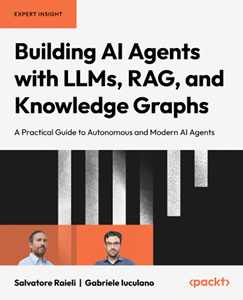
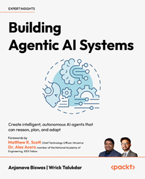

{width=370 height=95}

[www.packtpub.com](https://www.packtpub.com)

Subscribe to our online digital library for full access to over 7,000 books and videos, as well as industry leading tools to help you plan your personal development and advance your career. For more information, please visit our website.

# Why subscribe?

- Spend less time learning and more time coding with practical eBooks and Videos from over 4,000 industry professionals
- Improve your learning with Skill Plans built especially for you
- Get a free eBook or video every month
- Fully searchable for easy access to vital information
- Copy and paste, print, and bookmark content

At [www.packtpub.com](https://www.packtpub.com), you can also read a collection of free technical articles, sign up for a range of free newsletters, and receive exclusive discounts and offers on Packt books and eBooks.

# Other Books You May Enjoy

If you enjoyed this book, you may be interested in these other books by Packt:

[{width=243 height=300}](https://www.packtpub.com/en-us/product/building-ai-agents-with-llms-rag-and-knowledge-graphs-9781835080382)

**Building AI Agents with LLMs, RAG, and Knowledge Graphs**

Salvatore Raieli, Gabriele Iuculano

ISBN: 978-1-83508-706-0

- Design RAG pipelines to connect LLMs with external data.
- Build and query knowledge graphs for structured context and factual grounding.
- Develop AI agents that plan, reason, and use tools to complete tasks.
- Integrate LLMs with external APIs and databases to incorporate live data.
- Apply techniques to minimize hallucinations and ensure accurate outputs.
- Orchestrate multiple agents to solve complex, multi-step problems.
- Optimize prompts, memory, and context handling for long-running tasks.
- Deploy and monitor AI agents in production environments.

[{width=243 height=300}](https://www.packtpub.com/en-us/product/building-agentic-ai-systems-9781801079273)

**Building Agentic AI Systems**

Anjanava Biswas, Wrick Talukdar

ISBN: 978-1-80323-875-3

- Master the core principles of GenAI and agentic systems
- Understand how AI agents operate, reason, and adapt in dynamic environments
- Enable AI agents to analyze their own actions and improvise
- Implement systems where AI agents can leverage external tools and plan complex tasks
- Apply methods to enhance transparency, accountability, and reliability in AI
- Explore real-world implementations of AI agents across industries

# Packt is searching for authors like you

If you're interested in becoming an author for Packt, please visit [authors.packtpub.com](https://authors.packtpub.com) and apply today. We have worked with thousands of developers and tech professionals, just like you, to help them share their insight with the global tech community. You can make a general application, apply for a specific hot topic that we are recruiting an author for, or submit your own idea.

# Share your thoughts

Now you've finished _Generative AI with LangChain_, Second Edition, we'd love to hear your thoughts! If you purchased the book from Amazon, please [click here to go straight to the Amazon review page](https://packt.link/r/1837022011) for this book and share your feedback or leave a review on the site that you purchased it from.

Your review is important to us and the tech community and will help us make sure we're delivering excellent quality content.
